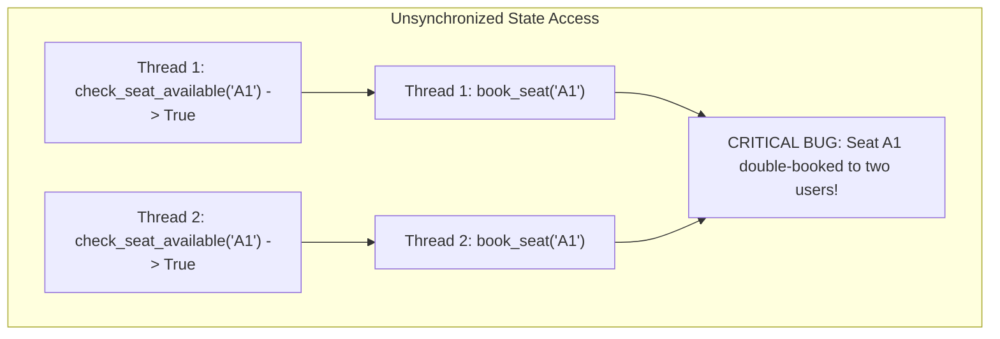
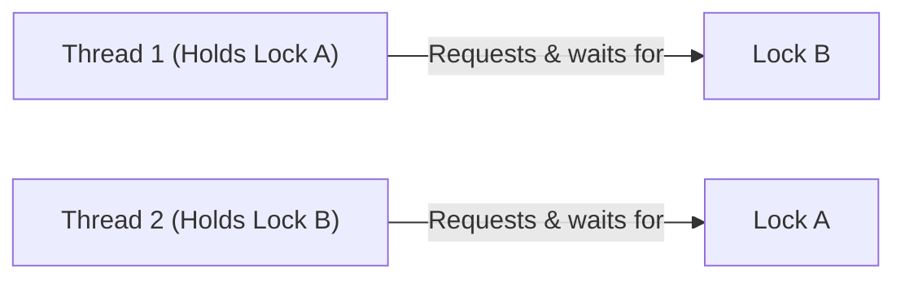

# LLD Chapter 4: Concurrency Patterns, Thread-Safety & Locking in System Design

> **Core Learning Objective:** Master concurrency management in Low-Level Design interviews. Learn how to write thread-safe systems, implement a Readers-Writer lock from scratch, prevent deadlocks, and use double-checked locking in Python.

---

## 1. Why Concurrency Matters in LLD Interviews

In real-world Product-Based Company interviews, **anyone can write an object-oriented class diagram**. The true differentiator between a junior engineer and a Senior/Staff Engineer is **demonstrating thread-safety and concurrency controls**:
* What happens when 1,000 concurrent threads attempt to reserve the same movie seat simultaneously?
* How do you prevent double-charging or race conditions in an inventory system?
* How do you allow high-speed concurrent reads without blocking while ensuring atomic writes?



---

## 2. The Readers-Writer Lock (RWLock) Pattern

In systems like Bookings, Catalogs, or Config stores, 99% of operations are **Reads**, and only 1% are **Writes**.
Using a simple `threading.Lock` forces all readers to wait in a single-file line, destroying throughput.
A **Readers-Writer Lock (Shared-Exclusive Lock)** allows:
* **Multiple concurrent Readers** simultaneously.
* **Only ONE Writer** at a time (mutually exclusive with all readers and writers).

### Complete Thread-Safe RWLock Implementation in Python
```python
import threading

class ReadWriteLock:
    """
    Reader-Writer Lock giving equal priority to readers and writers.
    Allows multiple concurrent readers, but only 1 exclusive writer.
    """
    def __init__(self):
        self._lock = threading.Lock()
        self._readers_ok = threading.Condition(self._lock)
        self._writers_ok = threading.Condition(self._lock)
        
        self._readers_count = 0
        self._writer_active = False
        self._writers_waiting = 0

    # --- Reader Context Manager ---
    class _ReaderContext:
        def __init__(self, rw_lock: "ReadWriteLock"):
            self.rw = rw_lock
        def __enter__(self):
            with self.rw._lock:
                while self.rw._writer_active or self.rw._writers_waiting > 0:
                    self.rw._readers_ok.wait()
                self.rw._readers_count += 1
            return self
        def __exit__(self, exc_type, exc_val, exc_tb):
            with self.rw._lock:
                self.rw._readers_count -= 1
                if self.rw._readers_count == 0:
                    self.rw._writers_ok.notify()

    # --- Writer Context Manager ---
    class _WriterContext:
        def __init__(self, rw_lock: "ReadWriteLock"):
            self.rw = rw_lock
        def __enter__(self):
            with self.rw._lock:
                self.rw._writers_waiting += 1
                while self.rw._writer_active or self.rw._readers_count > 0:
                    self.rw._writers_ok.wait()
                self.rw._writers_waiting -= 1
                self.rw._writer_active = True
            return self
        def __exit__(self, exc_type, exc_val, exc_tb):
            with self.rw._lock:
                self.rw._writer_active = False
                if self.rw._writers_waiting > 0:
                    self.rw._writers_ok.notify()
                else:
                    self.rw._readers_ok.notify_all()

    def reader(self):
        return self._ReaderContext(self)

    def writer(self):
        return self._WriterContext(self)
```

---

## 3. Deadlocks & The 4 Coffman Conditions

A **deadlock** is a state where a set of threads are permanently blocked because each holds a lock the other requires.



### The 4 Coffman Conditions for Deadlock:
1. **Mutual Exclusion:** Resources cannot be shared; locks must be exclusive.
2. **Hold and Wait:** A thread holds at least one lock while waiting to acquire another.
3. **No Preemption:** Locks cannot be forcibly confiscated from a thread.
4. **Circular Wait:** Thread 1 waits on Thread 2, which waits on Thread 1.

### How to Eliminate Deadlocks: Global Lock Ordering
The most reliable way to break the Circular Wait condition is **Global Strict Lock Ordering**:
Whenever a thread needs to acquire multiple locks, it **must always acquire them in deterministic alphabetical or ID order**:

```python
def transfer_funds(account_a, account_b, amount: float):
    # Sort accounts by unique ID to enforce identical lock acquisition order across all threads!
    first_lock = account_a if account_a.id < account_b.id else account_b
    second_lock = account_b if account_a.id < account_b.id else account_a

    with first_lock.lock:
        with second_lock.lock:
            account_a.balance -= amount
            account_b.balance += amount
```
*Regardless of whether Thread 1 transfers $A \rightarrow B$ and Thread 2 transfers $B \rightarrow A$, both threads attempt to acquire `min(A.id, B.id)` first! Circular wait is mathematically impossible.*

---

## 4. Double-Checked Locking in Python

Used to initialize expensive singleton resources without paying synchronization lock overhead on every subsequent read access:

```python
import threading

class HeavyResourcePool:
    _instance = None
    _lock = threading.Lock()

    @classmethod
    def get_instance(cls):
        # Check 1 (Unsynchronized fast path: 99.9% of calls return here instantly!)
        if cls._instance is None:
            with cls._lock:
                # Check 2 (Synchronized check to prevent duplicate initialization by race threads)
                if cls._instance is None:
                    print("Allocating heavy resource pool singleton...")
                    cls._instance = cls()
        return cls._instance
```


## 5. Check-Then-Act: The Race You Will Be Asked to Fix

The most common concurrency bug in a design interview is a check followed by an action with a gap between them. A barrier forces the bad interleaving every time, so the bug is reproducible:

```python
import threading

balance = {"v": 100}
barrier = threading.Barrier(2)

def withdraw_unsafe(amount):
    if balance["v"] >= amount:          # check
        barrier.wait(timeout=5)         # both threads pass the check before either acts
        balance["v"] -= amount          # act

ts = [threading.Thread(target=withdraw_unsafe, args=(80,)) for _ in range(2)]
for t in ts: t.start()
for t in ts: t.join()
assert balance["v"] == -60              # overdrawn: both withdrawals "succeeded"

balance["v"] = 100
lock = threading.Lock()
results = []

def withdraw_safe(amount):
    with lock:                          # check and act are one atomic step
        if balance["v"] >= amount:
            balance["v"] -= amount
            results.append(True)
        else:
            results.append(False)

ts = [threading.Thread(target=withdraw_safe, args=(80,)) for _ in range(2)]
for t in ts: t.start()
for t in ts: t.join()
assert balance["v"] == 20 and sorted(results) == [False, True]
```

The same shape appears as "check seat available, then book", "check stock, then deduct" and "`if key not in cache`, then compute and store". The fix is always one of three moves: hold a lock across both steps, use one atomic operation (`dict.setdefault`, `queue.Queue.put`, a database `UPDATE ... WHERE balance >= :amount`), or make the operation idempotent.

## 6. Producer-Consumer with a Bounded Queue

```python
import queue
import threading

q = queue.Queue(maxsize=5)               # the bound is the backpressure: put() blocks when full
DONE = object()                          # sentinel that tells a consumer to stop
consumed = []
lock = threading.Lock()

def producer(start):
    for i in range(start, start + 20):
        q.put(i)

def consumer():
    while True:
        item = q.get()
        if item is DONE:
            q.task_done()
            return
        with lock:
            consumed.append(item)
        q.task_done()

producers = [threading.Thread(target=producer, args=(s,)) for s in (0, 100)]
consumers = [threading.Thread(target=consumer) for _ in range(3)]
for t in producers + consumers: t.start()
for t in producers: t.join()
for _ in consumers: q.put(DONE)          # one sentinel per consumer
for t in consumers: t.join()
assert sorted(consumed) == list(range(20)) + list(range(100, 120))
```

Points to say aloud: the queue does its own locking, the bound prevents unbounded memory growth, and **one sentinel per consumer** is the clean shutdown. This is the skeleton behind the logging framework, the job scheduler and the message broker case studies.

## 7. Choosing a Concurrency Tool

| Workload | Tool | Why |
| :--- | :--- | :--- |
| Many waiting I/O calls (HTTP, DB) | `asyncio` or a thread pool | Waiting releases the GIL or yields; the CPU is idle anyway |
| CPU-bound pure Python | `multiprocessing` or `ProcessPoolExecutor` | The GIL prevents threads from running Python bytecode in parallel (on free-threaded builds this changes) |
| Shared mutable state, few writers | `threading.Lock` or `RLock` | Smallest correct tool |
| Many readers, rare writers | A readers-writer lock (section 2) | Readers do not block each other |
| Hand work between threads | `queue.Queue` | Built-in locking and backpressure |
| Wait for an event once | `threading.Event` | No polling |
| Limit concurrent access to a resource | `threading.Semaphore` | Counted permits (connection pool) |

### Lock hygiene checklist

1. Hold locks for as short a time as possible and never across network or disk I/O.
2. Acquire multiple locks in one global order (the sorted seat ids in the booking system).
3. Prefer `with lock:` so an exception cannot leave a lock held.
4. Never call unknown code (callbacks, observers) while holding a lock: it can re-enter and deadlock, as the job scheduler case study shows.
5. Make shared state immutable where you can; an immutable object needs no lock.

---

## Further Reading

- [threading module](https://docs.python.org/3/library/threading.html)
- [queue module](https://docs.python.org/3/library/queue.html)
- [Wikipedia: Deadlock](https://en.wikipedia.org/wiki/Deadlock_(computer_science))


---

## Check Yourself

Answer in your head or on paper first, then open each answer.

<details>
<summary><strong>1.</strong> Why is `count += 1` not thread-safe?</summary>

It is read-modify-write across several bytecodes; two threads can read the same value and one update is lost. Use a lock or atomic structure.

</details>

<details>
<summary><strong>2.</strong> What are the four conditions for deadlock?</summary>

Mutual exclusion, hold-and-wait, no preemption, circular wait. Break one (usually enforce a global lock order).

</details>

<details>
<summary><strong>3.</strong> Why prefer a concurrent queue between producers and consumers?</summary>

It decouples rates, gives backpressure (bounded queue) and keeps shared-state locking in one tested place.

</details>

<details>
<summary><strong>4.</strong> When use a read-write lock?</summary>

When reads vastly outnumber writes and readers can proceed concurrently.

</details>
