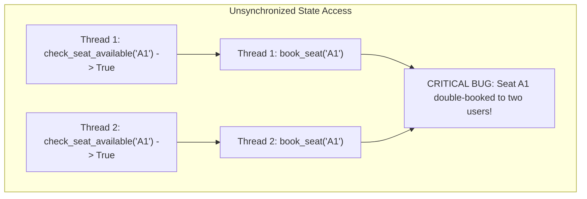
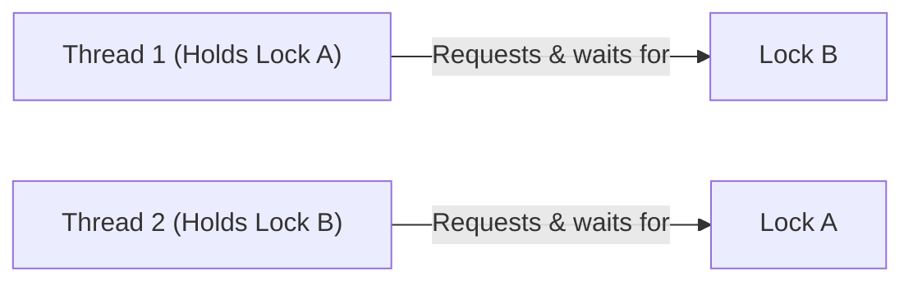

# LLD Chapter 4: Concurrency Patterns, Thread-Safety & Locking in System Design

> **Core Learning Objective:** Master concurrency management in Low-Level Design interviews. Learn how to write thread-safe systems, implement a Readers-Writer lock from scratch, prevent deadlocks, and use double-checked locking in Python.

---

## 1. Why Concurrency Matters in LLD Interviews

In real-world Product-Based Company interviews, **anyone can write an object-oriented class diagram**. The true differentiator between a junior engineer and a Senior/Staff Engineer is **demonstrating thread-safety and concurrency controls**:
* What happens when 1,000 concurrent threads attempt to reserve the same movie seat simultaneously?
* How do you prevent double-charging or race conditions in an inventory system?
* How do you allow high-speed concurrent reads without blocking while ensuring atomic writes?



---

## 2. The Readers-Writer Lock (RWLock) Pattern

In systems like Bookings, Catalogs, or Config stores, 99% of operations are **Reads**, and only 1% are **Writes**.
Using a simple `threading.Lock` forces all readers to wait in a single-file line, destroying throughput.
A **Readers-Writer Lock (Shared-Exclusive Lock)** allows:
* **Multiple concurrent Readers** simultaneously.
* **Only ONE Writer** at a time (mutually exclusive with all readers and writers).

### Complete Thread-Safe RWLock Implementation in Python
```python
import threading

class ReadWriteLock:
    """
    Reader-Writer Lock giving equal priority to readers and writers.
    Allows multiple concurrent readers, but only 1 exclusive writer.
    """
    def __init__(self):
        self._lock = threading.Lock()
        self._readers_ok = threading.Condition(self._lock)
        self._writers_ok = threading.Condition(self._lock)
        
        self._readers_count = 0
        self._writer_active = False
        self._writers_waiting = 0

    # --- Reader Context Manager ---
    class _ReaderContext:
        def __init__(self, rw_lock: "ReadWriteLock"):
            self.rw = rw_lock
        def __enter__(self):
            with self.rw._lock:
                while self.rw._writer_active or self.rw._writers_waiting > 0:
                    self.rw._readers_ok.wait()
                self.rw._readers_count += 1
            return self
        def __exit__(self, exc_type, exc_val, exc_tb):
            with self.rw._lock:
                self.rw._readers_count -= 1
                if self.rw._readers_count == 0:
                    self.rw._writers_ok.notify()

    # --- Writer Context Manager ---
    class _WriterContext:
        def __init__(self, rw_lock: "ReadWriteLock"):
            self.rw = rw_lock
        def __enter__(self):
            with self.rw._lock:
                self.rw._writers_waiting += 1
                while self.rw._writer_active or self.rw._readers_count > 0:
                    self.rw._writers_ok.wait()
                self.rw._writers_waiting -= 1
                self.rw._writer_active = True
            return self
        def __exit__(self, exc_type, exc_val, exc_tb):
            with self.rw._lock:
                self.rw._writer_active = False
                if self.rw._writers_waiting > 0:
                    self.rw._writers_ok.notify()
                else:
                    self.rw._readers_ok.notify_all()

    def reader(self):
        return self._ReaderContext(self)

    def writer(self):
        return self._WriterContext(self)
```

---

## 3. Deadlocks & The 4 Coffman Conditions

A **deadlock** is a state where a set of threads are permanently blocked because each holds a lock the other requires.



### The 4 Coffman Conditions for Deadlock:
1. **Mutual Exclusion:** Resources cannot be shared; locks must be exclusive.
2. **Hold and Wait:** A thread holds at least one lock while waiting to acquire another.
3. **No Preemption:** Locks cannot be forcibly confiscated from a thread.
4. **Circular Wait:** Thread 1 waits on Thread 2, which waits on Thread 1.

### How to Eliminate Deadlocks: Global Lock Ordering
The most reliable way to break the Circular Wait condition is **Global Strict Lock Ordering**:
Whenever a thread needs to acquire multiple locks, it **must always acquire them in deterministic alphabetical or ID order**:

```python
def transfer_funds(account_a, account_b, amount: float):
    # Sort accounts by unique ID to enforce identical lock acquisition order across all threads!
    first_lock = account_a if account_a.id < account_b.id else account_b
    second_lock = account_b if account_a.id < account_b.id else account_a

    with first_lock.lock:
        with second_lock.lock:
            account_a.balance -= amount
            account_b.balance += amount
```
*Regardless of whether Thread 1 transfers $A \rightarrow B$ and Thread 2 transfers $B \rightarrow A$, both threads attempt to acquire `min(A.id, B.id)` first! Circular wait is mathematically impossible.*

---

## 4. Double-Checked Locking in Python

Used to initialize expensive singleton resources without paying synchronization lock overhead on every subsequent read access:

```python
import threading

class HeavyResourcePool:
    _instance = None
    _lock = threading.Lock()

    @classmethod
    def get_instance(cls):
        # Check 1 (Unsynchronized fast path: 99.9% of calls return here instantly!)
        if cls._instance is None:
            with cls._lock:
                # Check 2 (Synchronized check to prevent duplicate initialization by race threads)
                if cls._instance is None:
                    print("Allocating heavy resource pool singleton...")
                    cls._instance = cls()
        return cls._instance
```
