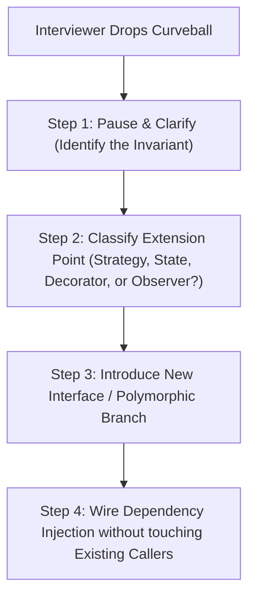
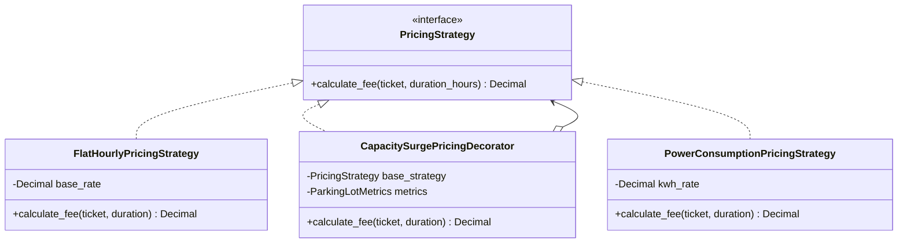
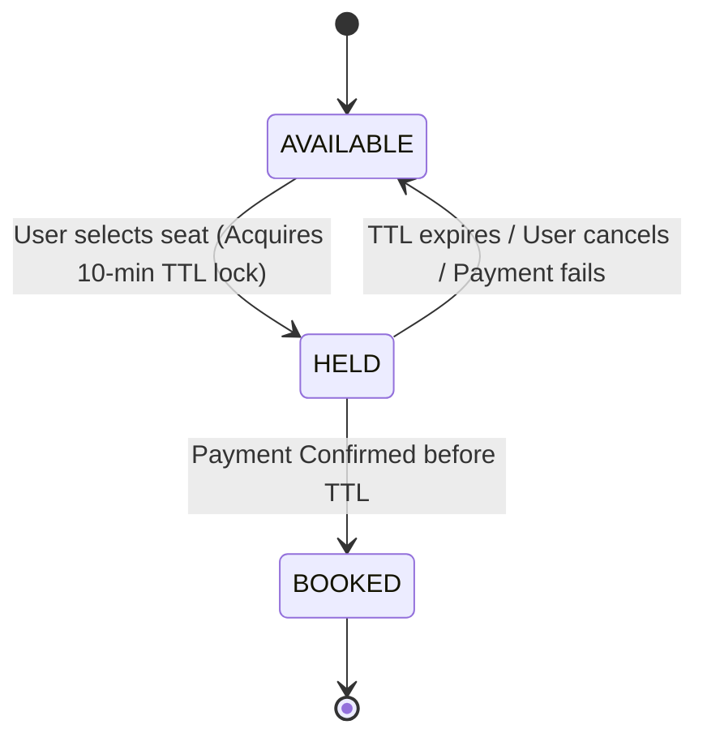

# Chapter 05: Mid-Interview Curveball & Requirement Evolution Mastery

> **The 25-Minute Trap**
> In FAANG/top-tier LLD rounds, the interviewer rarely lets you finish your initial clean design unchallenged. Around the 25-minute mark, just as your class diagrams look tidy and your interfaces are written, the interviewer will lean back and say:
> 
> *"What if demand suddenly surges during rainstorms and we need dynamic surge pricing?"* or 
> *"What if seats need a 10-minute temporary lock that automatically expires and releases inventory if payment fails?"*
> 
> If you freeze, rewrite your entire class model, or patch the code with dirty `if-else` flags, you fail the test. The curveball is not meant to see if you can code faster—it is a deliberate stress test to see if your architecture was truly extensible (Open/Closed Principle).

---

## 1. The 4-Step Curveball Response Framework

When a curveball strikes, never touch your keyboard immediately. Follow this 4-step protocol:



1. **Step 1: Clarify Invariants & Scope**
   * *Verbalize:* "Great requirement. Let me clarify: is this a global rule change, or must the system support both legacy behavior and the new behavior concurrently based on configuration?"
2. **Step 2: Isolate the Volatility**
   * Ask yourself: Is what changed an **algorithm** (Strategy), a **lifecycle phase** (State), a **notification reaction** (Observer), or an **additive feature** (Decorator)?
3. **Step 3: Modify Interfaces, Don't Hack Concrete Classes**
   * Never add boolean flags (`is_surge_pricing_enabled=True`). Instead, extract the existing behavior into a default implementation of an abstract strategy.
4. **Step 4: Prove Zero Regression**
   * Show that existing unit tests continue to pass without modification.

---

## 2. Curveball 1: Parking Lot -> Dynamic Surge Pricing & EV Charging Queues

### The Scenario
You designed a standard Parking Lot with Hourly billing (`Compact`, `Large`, `Handicapped`). 
*Interviewer:* *"Our parking lot is now at an airport. When capacity exceeds 80%, rates double. Furthermore, Tesla drivers can request EV fast charging, which charges per kWh instead of per hour and needs its own queue."*



### The Code Transformation

```python
from abc import ABC, abstractmethod
from decimal import Decimal
from dataclasses import dataclass
from typing import Protocol

@dataclass
class ParkingTicket:
    ticket_id: str
    vehicle_type: str
    kwh_consumed: Decimal = Decimal("0.0")

class PricingStrategy(ABC):
    @abstractmethod
    def calculate_fee(self, ticket: ParkingTicket, duration_hours: Decimal) -> Decimal:
        pass

class StandardHourlyPricing(PricingStrategy):
    def __init__(self, hourly_rate: Decimal):
        self.hourly_rate = hourly_rate

    def calculate_fee(self, ticket: ParkingTicket, duration_hours: Decimal) -> Decimal:
        return self.hourly_rate * duration_hours

# THE CURVEBALL SOLUTION: Decorator Pattern for Surge Pricing!
class SurgePricingDecorator(PricingStrategy):
    def __init__(self, base_strategy: PricingStrategy, occupancy_provider):
        self.base_strategy = base_strategy
        self.occupancy_provider = occupancy_provider

    def calculate_fee(self, ticket: ParkingTicket, duration_hours: Decimal) -> Decimal:
        base_fee = self.base_strategy.calculate_fee(ticket, duration_hours)
        occupancy_ratio = self.occupancy_provider.get_occupancy_ratio()
        
        if occupancy_ratio > Decimal("0.80"):
            # Apply 2x surge multiplier seamlessly!
            return base_fee * Decimal("2.0")
        return base_fee

# EV Charging Strategy plugged directly into the same hierarchy
class EVChargingPricing(PricingStrategy):
    def __init__(self, kwh_rate: Decimal, idle_hourly_rate: Decimal):
        self.kwh_rate = kwh_rate
        self.idle_hourly_rate = idle_hourly_rate

    def calculate_fee(self, ticket: ParkingTicket, duration_hours: Decimal) -> Decimal:
        power_cost = ticket.kwh_consumed * self.kwh_rate
        space_cost = duration_hours * self.idle_hourly_rate
        return power_cost + space_cost
```

---

## 3. Curveball 2: Movie Booking -> 10-Minute Temporary Seat Hold with Expiry

### The Scenario
You designed a Movie Booking system where seats are reserved and paid immediately.
*Interviewer:* *"Users are colliding on seat selection. When a user selects a seat, hold it for 10 minutes. If they don't complete payment within 10 minutes, release it automatically so other users can see it."*



### The Architectural Evolution: State Pattern with Ephemeral Leases

```python
import time
from enum import Enum
from dataclasses import dataclass
from typing import Optional

class SeatStatus(str, Enum):
    AVAILABLE = "AVAILABLE"
    HELD = "HELD"
    BOOKED = "BOOKED"

@dataclass
class SeatHoldLease:
    user_id: str
    expires_at_timestamp: float

    def is_expired(self) -> bool:
        return time.time() > self.expires_at_timestamp

class Seat:
    def __init__(self, seat_id: str):
        self.seat_id = seat_id
        self._status = SeatStatus.AVAILABLE
        self._current_lease: Optional[SeatHoldLease] = None

    def hold(self, user_id: str, hold_duration_seconds: float = 600.0) -> bool:
        """
        Attempts to acquire a temporary lease on the seat.
        Lazy eviction cleans up expired holds automatically!
        """
        now = time.time()
        # Self-healing lazy evaluation: if hold expired, revert to available!
        if self._status == SeatStatus.HELD and self._current_lease.is_expired():
            self._status = SeatStatus.AVAILABLE
            self._current_lease = None

        if self._status == SeatStatus.AVAILABLE:
            self._status = SeatStatus.HELD
            self._current_lease = SeatHoldLease(
                user_id=user_id,
                expires_at_timestamp=now + hold_duration_seconds
            )
            return True
        return False

    def confirm_booking(self, user_id: str) -> bool:
        if self._status == SeatStatus.HELD and self._current_lease:
            if self._current_lease.user_id == user_id and not self._current_lease.is_expired():
                self._status = SeatStatus.BOOKED
                self._current_lease = None
                return True
        return False

    def release_hold(self, user_id: str) -> bool:
        if self._status == SeatStatus.HELD and self._current_lease and self._current_lease.user_id == user_id:
            self._status = SeatStatus.AVAILABLE
            self._current_lease = None
            return True
        return False
```

---

## 4. Curveball 3: Elevator System -> Firefighter Emergency Mode

### The Scenario
You designed an elevator dispatch algorithm (SCAN / LOOK).
*Interviewer:* *"A fire alarm sounds. We need all elevators to immediately cancel all passenger calls, disable hall buttons, drop to Floor 1 at maximum speed, open doors, and lock until a firefighter key turns."*

### The Architectural Evolution: State Pattern with Priority Interrupt

```python
from abc import ABC, abstractmethod

class ElevatorState(ABC):
    @abstractmethod
    def handle_floor_request(self, elevator, target_floor: int): ...
    @abstractmethod
    def handle_fire_alarm(self, elevator): ...
    @abstractmethod
    def step_simulation(self, elevator): ...

class NormalOperatingState(ElevatorState):
    def handle_floor_request(self, elevator, target_floor: int):
        elevator.add_destination(target_floor)

    def handle_fire_alarm(self, elevator):
        print("ALERT: Fire alarm activated! Aborting normal operations.")
        elevator.clear_all_requests()
        # Transition immediately to Emergency Evacuation State
        elevator.transition_to(EmergencyEvacuationState())

    def step_simulation(self, elevator):
        elevator.move_towards_next_destination()

class EmergencyEvacuationState(ElevatorState):
    def handle_floor_request(self, elevator, target_floor: int):
        # Strictly ignore user requests during emergency
        print(f"REJECTED: Elevator is in Emergency Evacuation Mode.")

    def handle_fire_alarm(self, elevator):
        pass # Already in emergency

    def step_simulation(self, elevator):
        if elevator.current_floor > 1:
            elevator.current_floor -= 1
            print(f"Descending rapidly to Ground Floor: now at {elevator.current_floor}")
        elif elevator.current_floor == 1:
            elevator.open_doors()
            print("Evacuation complete. Doors opened at Ground Floor. Locked.")
            elevator.transition_to(FirefighterLockdownState())

class FirefighterLockdownState(ElevatorState):
    def handle_floor_request(self, elevator, target_floor: int):
        pass # Only firefighter key can reset
    def handle_fire_alarm(self, elevator):
        pass
    def step_simulation(self, elevator):
        pass
```

---

## 5. Summary Matrix: How to Defeat Any Curveball

| Curveball Signal | What Changed? | Architectural Tool |
| :--- | :--- | :--- |
| *"Calculate charges differently for X"* | Algorithm / Computation | **Strategy Pattern** or **Decorator Pattern** |
| *"When X happens, suddenly notify Y and Z"* | Reaction / Side-Effect | **Observer Pattern** (Publish/Subscribe) |
| *"System behaves completely differently in mode X"* | Internal State / Lifecycle | **State Pattern** |
| *"Add audit logging / rate limiting to existing API"* | Cross-cutting concern | **Proxy** or **Decorator Pattern** |
| *"Support a new third-party vendor with weird API"* | Protocol / Schema mismatch | **Adapter Pattern** |
