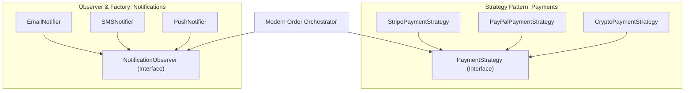

# Chapter 06: Legacy Spaghetti to Clean Design Patterns Refactoring

> **The Reality of Brownfield Architecture**
> Many senior LLD interviews no longer ask you to design a Parking Lot from scratch. Instead, the interviewer presents a 400-line monolithic "God Class" that currently handles an e-commerce checkout flow and says:
> 
> *"Our company grew 10x. This class has become impossible to maintain. Every new feature breaks something else. Refactor this code into an extensible, enterprise-grade architecture using appropriate design patterns."*
> 
> This chapter walks through the surgical decomposition of a messy real-world monolith into clean, testable Design Patterns.

---

## 1. The Monolithic God-Class

Here is the unrefactored codebase. Note how it violates every single SOLID principle:
1. **Single Responsibility Violation:** It calculates prices, processes credit cards, sends emails, sends SMS, and updates database tables.
2. **Open/Closed Violation:** Adding Apple Pay requires modifying 4 different `if-elif` blocks inside the class.
3. **Dependency Inversion Violation:** It directly instantiates concrete third-party SDK clients (`StripeClient()`, `TwilioClient()`).

```python
# monolithic_checkout.py
import time

class MonolithicOrderService:
    def checkout(self, customer_id: str, items: list, payment_type: str, payment_details: dict, notify_channel: str):
        print(f"[LOG] Processing checkout for user: {customer_id}")

        # 1. Price calculation with hardcoded discount rules
        subtotal = 0
        for item in items:
            price = item["price"] * item["qty"]
            # Hardcoded holiday discount
            if item.get("category") == "ELECTRONICS" and item["qty"] > 2:
                price *= 0.90
            subtotal += price

        # Hardcoded shipping logic
        shipping = 15.0 if subtotal < 100.0 else 0.0
        tax = subtotal * 0.08
        total = subtotal + shipping + tax

        # 2. Payment processing spaghetti
        payment_success = False
        transaction_id = None
        if payment_type == "STRIPE":
            print("Connecting to Stripe API with secret key...")
            # Direct hardcoded SDK call
            if payment_details.get("card_number", "").startswith("4"):
                payment_success = True
                transaction_id = f"stripe_tx_{int(time.time())}"
            else:
                raise ValueError("Declined by Stripe: Invalid Visa card")
        elif payment_type == "PAYPAL":
            print("Redirecting to PayPal OAuth sandbox...")
            if "@" in payment_details.get("paypal_email", ""):
                payment_success = True
                transaction_id = f"pp_tx_{int(time.time())}"
            else:
                raise ValueError("Invalid PayPal account")
        elif payment_type == "BITCOIN":
            print("Querying mempool for wallet address...")
            payment_success = True
            transaction_id = f"btc_tx_{int(time.time())}"
        else:
            raise ValueError(f"Unsupported payment gateway: {payment_type}")

        # 3. Notification dispatch spaghetti
        if payment_success:
            message = f"Order confirmed! ID: {transaction_id}. Total: ${total:.2f}"
            if notify_channel == "EMAIL":
                print(f"Sending SMTP email to user {customer_id}: {message}")
            elif notify_channel == "SMS":
                print(f"Sending SMS via Twilio to user {customer_id}: {message}")
            elif notify_channel == "PUSH":
                print(f"Sending APNS Apple Push Notification to user {customer_id}: {message}")

        return {"status": "SUCCESS", "tx_id": transaction_id, "amount": total}
```

---

## 2. The Refactoring Blueprint: Applying Design Patterns



We map each code smell to its standard architectural remedy:
*   **The Payment `if-elif` chain** $\rightarrow$ **Strategy Pattern**: Encapsulate each payment gateway behind a uniform `PaymentStrategy` interface.
*   **The Notification dispatch** $\rightarrow$ **Observer Pattern**: When an order succeeds, publish an `OrderPaidEvent`. Listeners handle SMS, Email, and Push asynchronously without the checkout service caring.
*   **The Pricing & Discounts calculation** $\rightarrow$ **Chain of Responsibility / Decorator Pattern**: Separate pricing adjustments into composable rules.

---

## 3. The Clean Refactored Architecture

```python
# modern_checkout_architecture.py
from abc import ABC, abstractmethod
from dataclasses import dataclass
from typing import List, Protocol
import time

# ==========================================
# 1. Domain Entities
# ==========================================
@dataclass(frozen=True)
class CartItem:
    sku: str
    price: float
    qty: int
    category: str

@dataclass(frozen=True)
class OrderPaymentReceipt:
    transaction_id: str
    amount_charged: float
    provider_name: str

# ==========================================
# 2. Strategy Pattern: Pluggable Payments
# ==========================================
class PaymentStrategy(ABC):
    @abstractmethod
    def pay(self, amount: float, details: dict) -> OrderPaymentReceipt:
        pass

class StripePaymentStrategy(PaymentStrategy):
    def pay(self, amount: float, details: dict) -> OrderPaymentReceipt:
        card = details.get("card_number", "")
        if not card.startswith("4"):
            raise ValueError("Stripe declined: Card must start with 4")
        return OrderPaymentReceipt(
            transaction_id=f"stripe_{int(time.time())}",
            amount_charged=amount,
            provider_name="Stripe"
        )

class PayPalPaymentStrategy(PaymentStrategy):
    def pay(self, amount: float, details: dict) -> OrderPaymentReceipt:
        email = details.get("paypal_email", "")
        if "@" not in email:
            raise ValueError("PayPal declined: Invalid email")
        return OrderPaymentReceipt(
            transaction_id=f"pp_{int(time.time())}",
            amount_charged=amount,
            provider_name="PayPal"
        )

# Factory for Payment Strategies
class PaymentStrategyFactory:
    _registry = {
        "STRIPE": StripePaymentStrategy,
        "PAYPAL": PayPalPaymentStrategy
    }

    @classmethod
    def get_strategy(cls, payment_type: str) -> PaymentStrategy:
        strategy_class = cls._registry.get(payment_type.upper())
        if not strategy_class:
            raise ValueError(f"Unsupported payment gateway: {payment_type}")
        return strategy_class()

# ==========================================
# 3. Observer Pattern: Decoupled Notifications
# ==========================================
class OrderEventListener(Protocol):
    def on_order_completed(self, customer_id: str, receipt: OrderPaymentReceipt) -> None:
        ...

class EmailNotifier:
    def on_order_completed(self, customer_id: str, receipt: OrderPaymentReceipt) -> None:
        print(f"[EMAIL SERVICE] Sent receipt ${receipt.amount_charged:.2f} to user {customer_id}")

class SMSNotifier:
    def on_order_completed(self, customer_id: str, receipt: OrderPaymentReceipt) -> None:
        print(f"[SMS SERVICE] Sent SMS confirmation {receipt.transaction_id} to user {customer_id}")

# ==========================================
# 4. Modern Order Orchestration Service
# ==========================================
class ModernCheckoutService:
    def __init__(self, listeners: List[OrderEventListener] = None):
        self.listeners = listeners or []

    def calculate_total(self, items: List[CartItem]) -> float:
        subtotal = sum(i.price * i.qty for i in items)
        shipping = 15.0 if subtotal < 100.0 else 0.0
        tax = subtotal * 0.08
        return subtotal + shipping + tax

    def checkout(
        self,
        customer_id: str,
        items: List[CartItem],
        payment_strategy: PaymentStrategy,
        payment_details: dict
    ) -> OrderPaymentReceipt:
        # Step 1: Calculate total
        total = self.calculate_total(items)

        # Step 2: Delegate payment execution to strategy (No if-elif!)
        receipt = payment_strategy.pay(total, payment_details)

        # Step 3: Publish event to all registered observers
        for listener in self.listeners:
            try:
                listener.on_order_completed(customer_id, receipt)
            except Exception as e:
                print(f"[WARN] Failed to dispatch listener notification: {e}")

        return receipt
```

---

## 4. Verification and Extensibility Proof

Notice how easily we can now add a new payment provider (e.g., Apple Pay) or a new event hook (e.g., Data Warehouse Kafka Publisher) **without changing a single line of `ModernCheckoutService`**:

```python
# Extending without touching existing code (Open/Closed Principle)
class ApplePayStrategy(PaymentStrategy):
    def pay(self, amount: float, details: dict) -> OrderPaymentReceipt:
        return OrderPaymentReceipt(
            transaction_id="apple_pay_888",
            amount_charged=amount,
            provider_name="ApplePay"
        )

# Adding analytics telemetry listener
class AnalyticsEventPublisher:
    def on_order_completed(self, customer_id: str, receipt: OrderPaymentReceipt) -> None:
        print(f"[DATADOG / SEGMENT] Tracked conversion of ${receipt.amount_charged} via {receipt.provider_name}")

if __name__ == "__main__":
    service = ModernCheckoutService(listeners=[EmailNotifier(), AnalyticsEventPublisher()])
    cart = [CartItem(sku="SKU-1", price=50.0, qty=2, category="BOOKS")]
    
    # Seamless execution
    receipt = service.checkout("cust_99", cart, ApplePayStrategy(), {})
    print(f"Order completed successfully! Tx: {receipt.transaction_id}")
```
