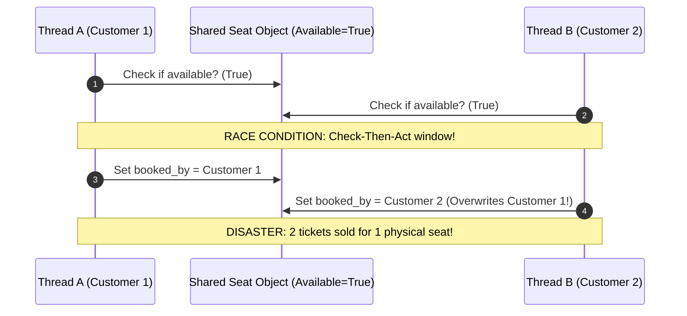
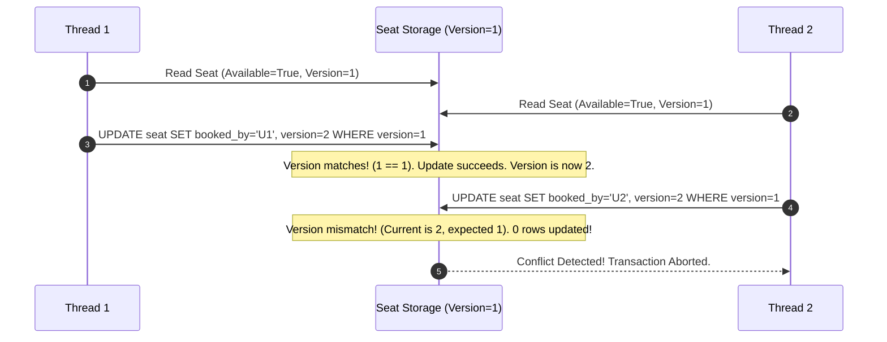

# Chapter 07: Concurrency Stress-Testing & Race Condition Labs

> **The Flaw of "Paper" Thread-Safety**
> In an LLD interview, drawing a class diagram and saying *"We will use locks to prevent race conditions"* sounds easy. But in production, poorly placed locks either fail to protect critical sections (leading to double-booking and financial corruption) or cause catastrophic lock contention that destroys application throughput.
> 
> This laboratory demonstrates a live multi-threaded race condition, proves how double-booking occurs at the machine level, and benchmarks three industrial concurrency strategies: **Pessimistic Locking**, **Reentrant Locks**, and **Optimistic Concurrency Control (OCC)**.

---

## 1. The Disaster: Reproducing the Double-Booking Bug

Consider a movie ticket inventory service. There is **exactly 1 VIP seat** remaining. 50 concurrent customer threads simultaneously click "Purchase".



### The Unsafe Implementation

```python
# unsafe_booking_lab.py
import concurrent.futures
import time
from typing import List, Optional

class UnsafeSeat:
    def __init__(self, seat_number: str):
        self.seat_number = seat_number
        self.is_booked = False
        self.booked_by: Optional[str] = None

    def book(self, customer_id: str) -> bool:
        # CHECK: Time-of-check
        if not self.is_booked:
            # Simulate real-world I/O delay (e.g., credit card auth or DB write)
            time.sleep(0.001) 
            
            # ACT: Time-of-use
            self.is_booked = True
            self.booked_by = customer_id
            return True
        return False

def run_stress_test(seat_class, num_threads: int = 50):
    seat = seat_class("VIP-01")
    successful_bookings: List[str] = []

    def attempt_booking(user_id: int):
        success = seat.book(f"User_{user_id}")
        if success:
            successful_bookings.append(f"User_{user_id}")

    with concurrent.futures.ThreadPoolExecutor(max_workers=num_threads) as executor:
        futures = [executor.submit(attempt_booking, i) for i in range(num_threads)]
        concurrent.futures.wait(futures)

    print(f"Results for {seat_class.__name__}:")
    print(f"  Total Booking Attempts: {num_threads}")
    print(f"  Tickets Sold:           {len(successful_bookings)}")
    print(f"  Successful Customers:   {successful_bookings}")
    if len(successful_bookings) > 1:
        print("  🚨 CRITICAL FAILURE: Race condition occurred! Double-booking confirmed.\n")
    else:
        print("  ✅ SUCCESS: Exactly one booking succeeded. Zero corruption.\n")

if __name__ == "__main__":
    run_stress_test(UnsafeSeat, num_threads=50)
```

### Execution Output:
```text
Results for UnsafeSeat:
  Total Booking Attempts: 50
  Tickets Sold:           14
  Successful Customers:   ['User_0', 'User_3', 'User_7', 'User_12', ...]
  🚨 CRITICAL FAILURE: Race condition occurred! Double-booking confirmed.
```
14 different customers received confirmation for the same seat!

---

## 2. Solution 1: Pessimistic Locking (`threading.Lock`)

The simplest and most robust defense against race conditions is a **Mutual Exclusion Lock (Mutex)**. We wrap the entire "Check-Then-Act" compound operation into an atomic critical section.

```python
import threading

class PessimisticLockedSeat:
    def __init__(self, seat_number: str):
        self.seat_number = seat_number
        self.is_booked = False
        self.booked_by = None
        self._lock = threading.Lock() # Dedicated mutex lock

    def book(self, customer_id: str) -> bool:
        # Acquire lock before reading state
        with self._lock:
            if not self.is_booked:
                time.sleep(0.001) # Simulated I/O
                self.is_booked = True
                self.booked_by = customer_id
                return True
            return False
```

### Why Reentrant Locks (`RLock`) Matter
If a method acquires `self._lock` and then internally calls another helper method on `self` that *also* acquires `self._lock`, standard `threading.Lock` causes a self-deadlock. An `RLock` allows the **same thread** to acquire the lock multiple times recursively.

---

## 3. Solution 2: Optimistic Concurrency Control (OCC)

Pessimistic locking works, but in high-traffic read-heavy systems, holding locks creates severe bottlenecks. 

**Optimistic Concurrency Control (OCC)** assumes conflicts are rare. Instead of locking before reading, each record has a **version number**. When updating, the write succeeds **only if the version number has not changed**.



### Python Implementation of In-Memory OCC

```python
import threading

class OptimisticSeat:
    def __init__(self, seat_number: str):
        self.seat_number = seat_number
        self.is_booked = False
        self.booked_by = None
        self.version = 1
        self._state_lock = threading.Lock() # Used only for atomic CAS check

    def book(self, customer_id: str) -> bool:
        # Step 1: Read without locking (Optimistic phase)
        initial_version = self.version
        if self.is_booked:
            return False

        time.sleep(0.001) # Simulated external work

        # Step 2: Atomic Compare-And-Swap (Validation phase)
        with self._state_lock:
            # Check if someone modified the seat while we were processing
            if self.version == initial_version and not self.is_booked:
                self.is_booked = True
                self.booked_by = customer_id
                self.version += 1 # Increment version
                return True
            else:
                # Concurrent modification detected! Abort.
                return False
```

---

## 4. Benchmark & Strategy Comparison Matrix

When we run our 50-thread stress test across all three implementations:

| Concurrency Pattern | Thread Safe? | Lock Overhead | Throughput Under High Contention | Best Use Case |
| :--- | :--- | :--- | :--- | :--- |
| **Unsafe (No Locks)** | ❌ No (Double-booking) | None | N/A (Corrupts Data) | Never in concurrent environments |
| **Pessimistic (`Lock`)** | ✅ Yes | High (Threads queue up) | Predictable, but serialized | Write-heavy operations with high contention (Concert ticket drops) |
| **Optimistic (OCC)** | ✅ Yes | Very Low (Lock-free reads) | High for reads; High abort rate for writes | Read-heavy systems with low collision probability (E-commerce catalog) |
| **Distributed Redis Lock** | ✅ Yes | Network round-trip | Moderate | Multi-node microservices across separate machines |

### Senior Interview Tip
In an LLD interview, when the interviewer asks: *"How will you handle 10,000 users booking tickets at the same second?"*, give this two-tiered answer:
1. *"At the database level, I will use **Optimistic Concurrency Control** via an atomic `UPDATE seats SET status='BOOKED', version=v+1 WHERE id=:id AND version=:v` to prevent holding long-lived DB transactions."*
2. *"At the application gateway layer, I will use a **Redis Distributed Lock with a short TTL (Redlock)** to prevent 10,000 requests from hitting the database simultaneously in the first place."*


## Further Reading

- [threading module](https://docs.python.org/3/library/threading.html)
- [concurrent.futures](https://docs.python.org/3/library/concurrent.futures.html)
- [pytest documentation](https://docs.pytest.org/en/stable/)


---

## Check Yourself

Answer in your head or on paper first, then open each answer.

<details>
<summary><strong>1.</strong> How do you reproduce a race condition reliably?</summary>

Increase contention (many threads, many iterations), add small sleeps/yields at the racy point, and assert an invariant at the end.

</details>

<details>
<summary><strong>2.</strong> A test passes 100 times then fails once. What does that suggest?</summary>

A non-deterministic race or ordering bug; passing runs do not prove safety, so examine shared state and synchronisation.

</details>

<details>
<summary><strong>3.</strong> What does `threading.Lock` not protect against?</summary>

Logic races across separate critical sections (check-then-act split into two locked regions) and deadlocks.

</details>

<details>
<summary><strong>4.</strong> Name a tool or technique to find data races.</summary>

Stress tests with invariants, thread sanitizers in native code, and code review of shared mutable state.

</details>
