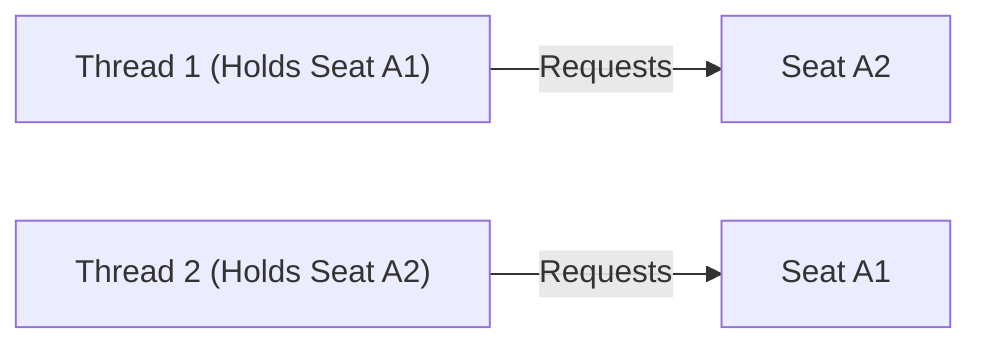

# LLD Chapter 12: Scenario-Based LLD Interview Questions & Senior Staff Grills

> **Core Learning Objective:** Master the tough architectural cross-examinations asked by LLD interviewers at Google, Uber, Amazon, and Meta. Learn how to justify pattern choices, resolve deadlocks, defend concurrency decisions, and demonstrate clean refactoring.

---

## 1. Architectural Defense Questions

### Question 1: "Why did you use the Strategy Pattern instead of the State Pattern?"
**The Strong Hire Answer:**
* **Intent Difference:**  
  * The **Strategy Pattern** is used when the **client wants to choose an interchangeable algorithm from the outside** (e.g., choosing Credit Card vs. UPI at checkout, or Lowest Floor First vs. Nearest to Entrance for parking). The object does not change its behavior automatically—the caller explicitly passes the strategy.
  * The **State Pattern** is used when the **object automatically changes its internal behavior as its internal state transitions** across its lifecycle (e.g., a Vending Machine transitioning from `Idle` to `HasMoney` to `Dispensing`, or a Movie Seat transitioning from `Available` to `Locked` to `Booked`). The client does not manually switch states; the context transitions itself.

---

### Question 2: "In your Movie Booking system, two users attempt to book seats A1 and A2 in reverse order simultaneously. How do you prevent a distributed deadlock?"
**The Scenario:**
* Thread 1: User 1 locks Seat A1, then requests Seat A2.
* Thread 2: User 2 locks Seat A2, then requests Seat A1.
* Result: Classic circular wait deadlock! Both threads wait forever.



**The Solution (Strict Global Lock Ordering):**
> *"To eliminate deadlocks, we must break Coffman's Circular Wait condition. Regardless of the order in which the user requested the seats `[A2, A1]`, our service **sorts the seat IDs lexicographically** before acquiring locks. Both Thread 1 and Thread 2 will always attempt to acquire `Seat A1` first, and only then acquire `Seat A2`. One thread will acquire A1; the other will wait without holding A2, eliminating deadlock."*

```python
# Production Implementation: Enforce strict lock acquisition order
def lock_seats_deadlock_free(seat_ids: list[str], seat_pool: dict):
    # Sort IDs to guarantee global acquisition ordering across all threads
    sorted_ids = sorted(seat_ids)
    acquired = []
    try:
        for sid in sorted_ids:
            seat = seat_pool[sid]
            seat.lock.acquire()
            acquired.append(seat.lock)
        # Perform atomic reservation logic...
    finally:
        for lock in reversed(acquired):
            lock.release()
```

---

### Question 3: "How would you add Undo / Redo functionality to this system?"
**The Interviewer Asks:**  
> *"We want users to be able to undo and redo their actions in the editor or reservation tool. Which pattern do you introduce and why?"*

**The Strong Hire Answer:**
* Introduce the **Command Pattern** paired with the **Memento Pattern**:
  * Each user action is encapsulated into a `Command` object with both `execute()` and `undo()` methods.
  * An `Invoker` maintains two stacks: `undo_stack` and `redo_stack`.
  * If the action mutates internal object state that cannot easily be reversed algebraically, the `Memento` pattern captures a snapshot of the object's internal state before the command executes.

---

### Question 4: "How do you test this system in isolation without spinning up real databases or payment gateways?"
**The Strong Hire Answer:**
* Emphasize **Dependency Inversion (DIP)**:
  * Classes must depend on abstract **Protocols** or interfaces (`PaymentGateway`, `SeatRepository`), not concrete classes (`StripeGateway`, `PostgresDB`).
  * In unit tests, inject an in-memory **Mock Repository** (`MockPaymentGateway` returning `True/False`) directly into the constructor.
  * This allows running 1,000 test cases in 50 milliseconds in CI/CD without external network dependencies.
