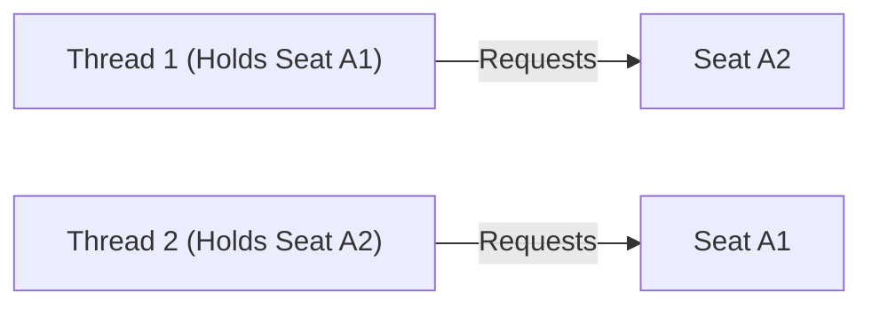

# LLD Chapter 12: Scenario-Based LLD Interview Questions & Senior Staff Grills

> **Core Learning Objective:** Master the tough architectural cross-examinations asked by LLD interviewers at Google, Uber, Amazon, and Meta. Learn how to justify pattern choices, resolve deadlocks, defend concurrency decisions, and demonstrate clean refactoring.

---

## 1. Architectural Defense Questions

### Question 1: "Why did you use the Strategy Pattern instead of the State Pattern?"
**The Strong Hire Answer:**
* **Intent Difference:**  
  * The **Strategy Pattern** is used when the **client wants to choose an interchangeable algorithm from the outside** (e.g., choosing Credit Card vs. UPI at checkout, or Lowest Floor First vs. Nearest to Entrance for parking). The object does not change its behavior automatically—the caller explicitly passes the strategy.
  * The **State Pattern** is used when the **object automatically changes its internal behavior as its internal state transitions** across its lifecycle (e.g., a Vending Machine transitioning from `Idle` to `HasMoney` to `Dispensing`, or a Movie Seat transitioning from `Available` to `Locked` to `Booked`). The client does not manually switch states; the context transitions itself.

---

### Question 2: "In your Movie Booking system, two users attempt to book seats A1 and A2 in reverse order simultaneously. How do you prevent a distributed deadlock?"
**The Scenario:**
* Thread 1: User 1 locks Seat A1, then requests Seat A2.
* Thread 2: User 2 locks Seat A2, then requests Seat A1.
* Result: Classic circular wait deadlock! Both threads wait forever.



**The Solution (Strict Global Lock Ordering):**
> *"To eliminate deadlocks, we must break Coffman's Circular Wait condition. Regardless of the order in which the user requested the seats `[A2, A1]`, our service **sorts the seat IDs lexicographically** before acquiring locks. Both Thread 1 and Thread 2 will always attempt to acquire `Seat A1` first, and only then acquire `Seat A2`. One thread will acquire A1; the other will wait without holding A2, eliminating deadlock."*

```python
# Production Implementation: Enforce strict lock acquisition order
def lock_seats_deadlock_free(seat_ids: list[str], seat_pool: dict):
    # Sort IDs to guarantee global acquisition ordering across all threads
    sorted_ids = sorted(seat_ids)
    acquired = []
    try:
        for sid in sorted_ids:
            seat = seat_pool[sid]
            seat.lock.acquire()
            acquired.append(seat.lock)
        # Perform atomic reservation logic...
    finally:
        for lock in reversed(acquired):
            lock.release()
```

---

### Question 3: "How would you add Undo / Redo functionality to this system?"
**The Interviewer Asks:**  
> *"We want users to be able to undo and redo their actions in the editor or reservation tool. Which pattern do you introduce and why?"*

**The Strong Hire Answer:**
* Introduce the **Command Pattern** paired with the **Memento Pattern**:
  * Each user action is encapsulated into a `Command` object with both `execute()` and `undo()` methods.
  * An `Invoker` maintains two stacks: `undo_stack` and `redo_stack`.
  * If the action mutates internal object state that cannot easily be reversed algebraically, the `Memento` pattern captures a snapshot of the object's internal state before the command executes.

---

### Question 4: "How do you test this system in isolation without spinning up real databases or payment gateways?"
**The Strong Hire Answer:**
* Emphasize **Dependency Inversion (DIP)**:
  * Classes must depend on abstract **Protocols** or interfaces (`PaymentGateway`, `SeatRepository`), not concrete classes (`StripeGateway`, `PostgresDB`).
  * In unit tests, inject an in-memory **Mock Repository** (`MockPaymentGateway` returning `True/False`) directly into the constructor.
  * This allows running 1,000 test cases in 50 milliseconds in CI/CD without external network dependencies.


## 2. Failure, Extension and Test Questions

### Question 5: "Your payment call succeeds but the process crashes before the seat is marked booked. What now?"

This is the **dual write** problem: two systems change and no transaction spans both. State the options in order of preference:

1. **Idempotency key:** send the booking id with the charge; on restart, retry the whole confirm step and the gateway returns the first result instead of charging twice.
2. **Record intent first:** write `PAYMENT_PENDING` to durable storage before calling the gateway; a recovery job finds pending bookings and asks the gateway what happened.
3. **Outbox or saga:** write the booking change and an event to the same database transaction; a relay publishes the event, and a compensating action refunds when the booking cannot complete.

Say plainly that "make it atomic" is not available across a network, and name the compromise you chose.

### Question 6: "A teammate adds a new vehicle type and has to edit six `if/elif` blocks. How do you fix the design?"

The design violates the Open/Closed Principle: adding a case should not edit existing code. Move the varying rule behind a lookup keyed by the type, so a new type is one new entry:

```python
from dataclasses import dataclass

@dataclass(frozen=True)
class Rate:
    per_day: int
    deposit: int

RATES = {"economy": Rate(45, 100), "suv": Rate(85, 200)}

def quote(vehicle_type: str, days: int) -> int:
    rate = RATES[vehicle_type]                   # unknown type raises KeyError: fail loudly
    return rate.per_day * days + rate.deposit

assert quote("economy", 3) == 235
RATES["van"] = Rate(120, 300)                    # extension without touching quote()
assert quote("van", 2) == 540
```

When the rule is behaviour rather than data, register a strategy object in the same kind of table. Mention the trade-off: a registry is easy to extend but spreads the rules across files, so keep one place that lists them.

### Question 7: "How would you make your in-memory rate limiter work across ten servers?"

Local counters give each server its own limit, so the real limit is ten times higher. Options: a central store with an atomic script (Redis), sticky routing by client key so each client always hits the same server, or a hybrid where servers keep a local allowance and refill it from the central store in batches. State what you give up with each: the central store adds latency and a dependency, sticky routing breaks when a server dies, the hybrid allows a bounded overshoot.

### Question 8: "What do you write first when asked to design a system in 45 minutes?"

A defensible order: requirements and non-goals (5 minutes), entities and relationships (5), the main interface and the one hard algorithm or concurrency point (15), code or pseudo-code for that part (15), then edge cases and extensions (5). Interviewers score clarifying questions, a design that survives the follow-up requirement, correct handling of the hard part, and visible testing thought, more than the number of patterns used.

## 3. What Interviewers Actually Score

| Dimension | Strong signal | Weak signal |
| :--- | :--- | :--- |
| Requirements | Asks about scale, concurrency, failure before drawing | Starts coding at once |
| Modelling | Small classes with one reason to change | One class that does everything, or a class per noun with no behaviour |
| Patterns | Names the force, then the pattern, and says when not to use it | Pattern name-dropping |
| Concurrency | Finds the check-then-act and lock-ordering hazards unprompted | Adds locks everywhere or nowhere |
| Extensibility | Handles the curveball by adding code, not editing | Rewrites the design |
| Testing | Injects clocks, randomness and I/O so tests are deterministic | "I would test it manually" |

---

## Further Reading

- [Refactoring Guru: pattern catalog](https://refactoring.guru/design-patterns/catalog)
- [UML diagrams reference](https://www.uml-diagrams.org/)
- [Wikipedia: SOLID](https://en.wikipedia.org/wiki/SOLID)


---

## Check Yourself

Answer in your head or on paper first, then open each answer.

<details>
<summary><strong>1.</strong> How do you handle 'design a parking lot' in the first 5 minutes?</summary>

Clarify vehicle types, floors, pricing, entry/exit, concurrency; then list entities (Lot, Floor, Spot, Vehicle, Ticket, PricingStrategy).

</details>

<details>
<summary><strong>2.</strong> What do interviewers want to see in the extensibility discussion?</summary>

A named seam (interface) and a concrete example of adding a new variant without modifying existing code.

</details>

<details>
<summary><strong>3.</strong> How do you address concurrency in a booking system?</summary>

Make allocation atomic (lock or conditional update) and state the invariant: a resource is assigned at most once.

</details>

<details>
<summary><strong>4.</strong> What is a strong closing statement?</summary>

Summarise key decisions, trade-offs accepted, and what you would add with more time (persistence, metrics, failure handling).

</details>
