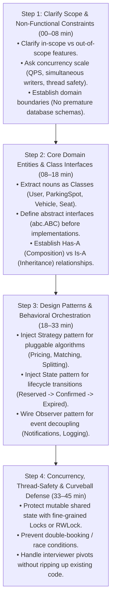
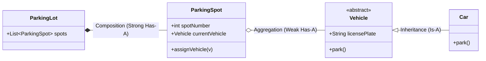

# Chapter 13: Track 2 Recap — The LLD & Design Patterns Synthesis Playbook

> **Core Learning Objective:** Consolidate everything you have mastered across Track 2 into a bulletproof, rapid-recall mental blueprint. This chapter provides a high-yield synthesis of the 4-step LLD interview framework, the 23 GoF and Concurrency patterns, a master comparison matrix across all 18 industrial systems, and the ultimate thread-safety synchronization cheat sheet.

---

## 1. The 4-Step LLD Interview Execution Engine

In a 45-minute Product-Based Company (Google, Meta, Uber, Amazon) LLD round, candidates fail when they start writing random class code immediately. Staff Engineers follow a structured, predictable 4-step execution rhythm:

---

## 2. The Master Pattern Decision Matrix

When faced with an object-oriented design problem, use this rapid pattern-matching table:

| Category | Pattern | Plain-English Metaphor | When to Use in LLD Interviews | Core Systems Using It |
| :--- | :--- | :--- | :--- | :--- |
| **Creational** | **Factory Method** | **Vending Machine Slot**: you punch a code, it dispenses the correct snack without you knowing how it was wrapped. | Creating objects based on runtime inputs (Vehicle type, Notification type) without hardcoding constructors. | Parking Lot, Notification Engine |
| **Creational** | **Builder** | **Custom Sub Sandwich**: adding bread, cheese, toppings step-by-step until the sub is complete. | Constructing complex objects with 6+ optional parameters or immutability requirements. | Job Scheduler, Flight Reservation |
| **Creational** | **Singleton** | **The Town Hall Clock**: only one physical clock tower exists in the city; everyone reads the exact same time. | Managing single shared resources (DB Connection Pool, Configuration Registry). | Logger Framework, Lock Manager |
| **Structural** | **Strategy** | **Interchangeable Phone Camera Lenses**: snapping on a Macro, Fisheye, or Telephoto lens onto the same camera body. | Dynamically swapping algorithms at runtime (Pricing, Route Finding, Debt Splitting, Eviction policies). | Splitwise, Uber, Parking Lot, Rate Limiter |
| **Structural** | **Observer** | **Subscribing to a YouTube Channel**: when a new video uploads, all subscribers get a notification automatically. | Decoupling state changes from downstream side-effects (Email alerts, analytics, inventory deduction). | Pub/Sub, Inventory, Job Scheduler |
| **Structural** | **State** | **Traffic Light**: the light switches Green $\to$ Yellow $\to$ Red; button presses behave differently depending on current color. | Eliminating giant `if/elif/else` ladders for entities with lifecycles (Booking: Draft $\to$ Held $\to$ Paid $\to$ Cancelled). | Movie Booking, Vending Machine, Elevator |
| **Structural** | **Decorator** | **Clothing Layers**: putting on a t-shirt, adding a hoodie, adding a raincoat; you are still the same person, but now waterproof. | Wrapping additional behaviors around objects dynamically (Logging, Encryption, Compression, Toll-road fees). | High-Throughput Logger |
| **Structural** | **Composite** | **Russian Nesting Dolls / File Folders**: a folder contains individual files AND subfolders, but both can report their size. | Tree hierarchies where individual items and groups of items share the same interface. | In-Memory File System |
| **Concurrency**| **Readers-Writer Lock** | **Public Library Notice Board**: 100 people can read the board at once, but when the librarian writes, everyone must wait. | High-read, low-write data structures (Seat map, File directory, Product catalog) achieving 15x throughput speedup. | File System, Seat Reservation |
| **Concurrency**| **Producer-Consumer** | **Bakery Counter**: bakers bake bread and put it on the shelf; customers take bread off the shelf; nobody waits directly on each other. | Decoupling fast requests from slow I/O workers using a bounded, thread-safe queue. | Logging Framework, Kafka Lite |

---

## 3. The 18 Industrial Systems Comparison Matrix

Every system you mastered in Track 2 solves a distinct engineering challenge:

| System # | System Name | Primary Patterns | Concurrency & Thread-Safety | Key Invariant / Algorithmic Trick |
| :---: | :--- | :--- | :--- | :--- |
| **01** | **Distributed Job Scheduler** | Strategy, Command, Observer | ThreadPoolExecutor + PriorityQueue | Min-heap ordered by next execution timestamp ($O(\log N)$). |
| **02** | **Library Management** | Observer, State, Factory | Re-entrant Lock (`threading.RLock`) | Multi-book checkout atomic reservations with due-date alerts. |
| **03** | **Movie Booking System** | State Machine, Strategy, Factory | Fine-grained Seat Mutex Locks | 10-minute temporary seat hold with automatic timer expiry. |
| **04** | **Car Rental System** | Strategy, State, Factory | Pessimistic Reservation Locking | Inventory matching based on category and pickup/dropoff dates. |
| **05** | **Parking Lot System** | Factory, Strategy, Min-Heap | Per-Spot Re-entrant Locks | $O(\log N)$ nearest-spot allocation using Min-Heap per vehicle type. |
| **06** | **Inventory Management** | Observer, Strategy, State | Atomic Counter CAS / Locks | Low-stock threshold triggers auto-replenishment events. |
| **07** | **Ride-Sharing (Uber LLD)** | Strategy, Observer, State | Concurrent Driver Location Map | Haversine distance spatial matching + dynamic surge pricing engine. |
| **08** | **API Rate Limiter** | Strategy, Sliding Window | Sliding Window Log in deque | Token Bucket vs Sliding Window Log boundary burst defense. |
| **09** | **Snake and Ladders** | Factory, Strategy, State | Turn-based state coordination | Modulo board indexing and collision jumping. |
| **10** | **Elevator System** | State, Strategy, Command | SCAN algorithm dispatch queue | Minimizing total elevator travel distance using SCAN/LOOK queues. |
| **11** | **Vending Machine** | State Pattern Transition Engine | Coin/Note escrow synchronization | Physical item dispensing only when exact balance invariant holds. |
| **12** | **In-Memory File System** | Composite, Trie, Decorator | Custom `RWLock` on directory tree | Multi-reader concurrent file reads with exclusive writer locks. |
| **13** | **High-Throughput Logger** | Producer-Consumer, Strategy | Bounded Blocking Queue | Non-blocking async log append with background batch flushing. |
| **14** | **Pub/Sub Message Broker** | Observer, Strategy, Partitioning | Per-Partition Mutex Locks | Sequential append-only commit log with consumer group offsets. |
| **15** | **Distributed Lock Manager** | Redlock, Quorum, Fencing | Redis Quorum + Monotonic Tokens | Monotonic fencing tokens protecting against long GC pauses. |
| **16** | **Kafka Consumer Rebalance** | Sticky Assignor, State | Heartbeat timer thread coordination | Cooperative incremental rebalance avoiding stop-the-world pauses. |
| **17** | **Splitwise Expense Sharing** | Strategy, Greedy Min-Heap | User balance ledger locks | $O(N \log N)$ Min-Cash-Flow debt simplification via paired heaps. |
| **18** | **Notification & Alerting** | Adapter, PriorityQueue, Filter | PriorityQueue + Sliding Window Limiter | Multi-channel dispatch (Email/SMS/Push) + user fatigue rate limits. |

---

## 4. The Junior vs. Senior Antipattern Graveyard

| # | The Junior Antipattern | What Goes Wrong in Production | The Senior / Staff Solution |
| :---: | :--- | :--- | :--- |
| **1** | The "God-Class" Monolith (e.g. `CinemaManager` handling seating, payments, emails, discounts, refunds in one 1,500-line class). | Violates **Single Responsibility Principle (SRP)**. Any change breaks unrelated features; impossible to unit test. | Decompose into distinct services: `SeatInventory`, `PricingEngine`, `PaymentProcessor`, and `NotificationDispatcher`. |
| **2** | Hardcoding `if vehicle_type == "CAR": fee = hours * 10` inside the business method. | Violates **Open/Closed Principle (OCP)**. Adding Electric Cars or Trucks requires modifying tested, deployed core classes. | Inject a `PricingStrategy` interface: `pricing_strategy.calculate_fee(duration)`. |
| **3** | Locking the entire `ParkingLot` or `CinemaTheater` with a single global Mutex. | **Total serialization bottleneck**: 10,000 users trying to view different movie seats or park in different floors block each other! | Lock only the specific entity (`Seat` or `ParkingSpot`), or use a `Readers-Writer Lock (RWLock)` for concurrent reads. |
| **4** | Using integer status flags (`status = 0`, `status = 1`, `status = 2`) scattered across `if/elif` statements. | State transitions become chaotic. Invalid states (e.g. paying for an already cancelled seat) slip through. | Use the **State Pattern** or an explicit finite State Machine enum where each state defines valid transition actions. |
| **5** | Acquiring multiple locks in arbitrary order across threads (`Thread A: Lock1 -> Lock2`, `Thread B: Lock2 -> Lock1`). | **Deadlock**: both threads freeze permanently waiting for each other, requiring service restart. | Enforce a strict **Global Lock Ordering** convention (e.g. always acquire locks sorted by account ID). |

---

## 5. The 5-Minute UML Drawing Survival Guide

When an interviewer asks you to sketch class relationships, use this exact mental cheat sheet:

1. **Inheritance (`Is-A`):** `Car` is a `Vehicle`. Solid line with closed triangle arrow (`<|--`).
2. **Composition (`Strong Has-A`):** `ParkingLot` has `ParkingSpot`s. If the parking lot is bulldozed, the spots cease to exist. Filled diamond (`*--`).
3. **Aggregation (`Weak Has-A`):** `ParkingSpot` has a `Vehicle`. If the spot is vacated or deleted, the vehicle still exists elsewhere. Open diamond (`o--`).
4. **Association / Dependency (`Uses-A`):** A class calls a method on another class. Open arrow (`-->`).

---

## 6. Track 2 Graduation Milestone Check

Before you proceed to **Track 3: High-Level Design (HLD)**, confirm that you have mastered these 4 core competencies:
- [x] *Can you translate ambiguous product requirements into clean UML class diagrams and typed Python interfaces in under 15 minutes?*
- [x] *Can you instantly identify whether a problem requires Strategy, Observer, State, Factory, or Composite?*
- [x] *Can you explain why a Readers-Writer Lock provides a 15x throughput boost over a standard Mutex under read contention?*
- [x] *Can you implement debt simplification (Min-Cash-Flow) or temporary seat reservation holds with zero race conditions?*

> [!TIP]
> **Next Stop: Track 3 (High-Level Design)!**
> You now know how to design rock-solid object-oriented code running inside a single machine or microservice. Now it is time to scale out to millions of users across globally distributed datacenters! Proceed to [Track 3: High-Level Design](../03-High-Level-Design/00-Intuitive-Mental-Models-And-Visual-Glossary.md)!

## Further Reading

- [Refactoring Guru: design patterns](https://refactoring.guru/design-patterns)
- [Wikipedia: Design Patterns](https://en.wikipedia.org/wiki/Design_Patterns)
- [UML diagrams reference](https://www.uml-diagrams.org/)

---

## Check Yourself

Answer in your head or on paper first, then open each answer.

<strong>1.</strong> Which principle do most patterns serve?

Programming to interfaces and composing behaviour so change is localised.

<strong>2.</strong> What two diagrams do you draw in nearly every LLD interview?

A class diagram of entities and relationships and a sequence diagram of the main flow.

<strong>3.</strong> Name three patterns that most often appear in LLD problems.

Strategy (pricing, routing), Observer (notifications), State (order or elevator state), plus Factory and Builder.

<strong>4.</strong> What is the most common mistake candidates make?

Jumping to code before clarifying requirements and defining responsibilities.

