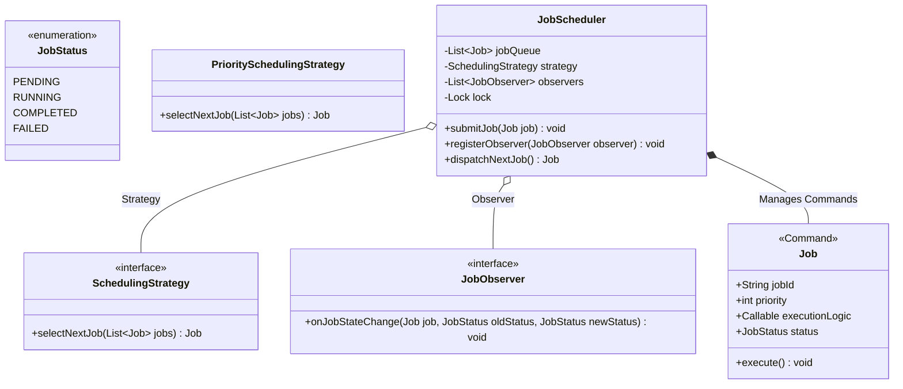

# LLD Case Study 1: Distributed Job Scheduler

> **Target Patterns:** Strategy Pattern, Command Pattern, Observer Pattern  
> **Key Engineering Focus:** Thread-safe task execution, pluggable scheduling algorithms, worker coordination, and lifecycle event streaming.

---

## 1. Problem Statement & Functional Requirements

Design a modular in-process Job Scheduler capable of scheduling, queuing, executing, and monitoring tasks across worker pools.

### Requirements:
1. **Job Definition (Command Pattern):** Encapsulate jobs as executable units of work with retry counts and parameters.
2. **Scheduling Policy (Strategy Pattern):** Support pluggable scheduling algorithms (e.g. First-Come-First-Served / Priority Scheduling vs Shortest Job First).
3. **Lifecycle Notifications (Observer Pattern):** Allow external monitoring systems (logging, metrics, alerting) to subscribe to job state changes (`PENDING`, `RUNNING`, `COMPLETED`, `FAILED`).
4. **Thread-Safety:** Multiple threads must be able to submit and execute jobs concurrently without state corruption.

---

## 2. Architecture & UML Class Diagram



---

## 3. Production-Grade Python Implementation

```python
import threading
import time
import uuid
from enum import Enum, auto
from abc import ABC, abstractmethod
from typing import Callable, Any, List, Optional

# --- Enums & Core Command ---
class JobStatus(Enum):
    PENDING = auto()
    RUNNING = auto()
    COMPLETED = auto()
    FAILED = auto()

class Job:
    """Command Pattern: Encapsulates task payload, priority, and execution."""
    def __init__(self, name: str, priority: int, action: Callable[[], Any]):
        self.job_id = str(uuid.uuid4())[:8]
        self.name = name
        self.priority = priority # Higher integer = higher priority
        self.action = action
        self.status = JobStatus.PENDING
        self.result = None
        self.error = None

    def execute(self) -> None:
        try:
            self.result = self.action()
            self.status = JobStatus.COMPLETED
        except Exception as err:
            self.error = err
            self.status = JobStatus.FAILED

# --- Strategy Pattern: Scheduling Algorithms ---
class SchedulingStrategy(ABC):
    @abstractmethod
    def select_next(self, queue: List[Job]) -> Optional[Job]:
        """Picks the next job to execute from the queue."""
        pass

class PrioritySchedulingStrategy(SchedulingStrategy):
    """Highest priority first."""
    def select_next(self, queue: List[Job]) -> Optional[Job]:
        if not queue:
            return None
        # Select job with max priority
        highest_priority_job = max(queue, key=lambda j: j.priority)
        queue.remove(highest_priority_job)
        return highest_priority_job

class FCFSSchedulingStrategy(SchedulingStrategy):
    """First-Come, First-Served."""
    def select_next(self, queue: List[Job]) -> Optional[Job]:
        return queue.pop(0) if queue else None

# --- Observer Pattern: Event Monitoring ---
class JobObserver(ABC):
    @abstractmethod
    def on_status_change(self, job: Job, old_status: JobStatus, new_status: JobStatus) -> None:
        pass

class MetricReporter(JobObserver):
    def on_status_change(self, job: Job, old_status: JobStatus, new_status: JobStatus) -> None:
        print(f"[Metrics Engine] Job '{job.name}' (ID: {job.job_id}) transition: {old_status.name} -> {new_status.name}")

class FailureAlertNotifier(JobObserver):
    def on_status_change(self, job: Job, old_status: JobStatus, new_status: JobStatus) -> None:
        if new_status == JobStatus.FAILED:
            print(f"[ALERT NOTIFIER] CRITICAL: Job '{job.name}' failed with error: {job.error}!")

# --- The Central Scheduler ---
class JobScheduler:
    def __init__(self, strategy: SchedulingStrategy):
        self._strategy = strategy
        self._queue: List[Job] = []
        self._observers: List[JobObserver] = []
        self._lock = threading.Lock()

    def register_observer(self, observer: JobObserver) -> None:
        with self._lock:
            self._observers.append(observer)

    def _notify(self, job: Job, old_status: JobStatus, new_status: JobStatus) -> None:
        for obs in self._observers:
            obs.on_status_change(job, old_status, new_status)

    def submit_job(self, job: Job) -> None:
        with self._lock:
            self._queue.append(job)
            self._notify(job, JobStatus.PENDING, JobStatus.PENDING)
            print(f"[Scheduler] Accepted Job '{job.name}' (Priority {job.priority}). Queue size: {len(self._queue)}")

    def run_next_job(self) -> bool:
        with self._lock:
            job = self._strategy.select_next(self._queue)
            if not job:
                return False
            
            old_status = job.status
            job.status = JobStatus.RUNNING
            self._notify(job, old_status, JobStatus.RUNNING)

        # Execute outside lock to avoid blocking other threads from submitting jobs!
        job.execute()

        with self._lock:
            self._notify(job, JobStatus.RUNNING, job.status)
        return True

# --- Verification Driver ---
if __name__ == "__main__":
    scheduler = JobScheduler(strategy=PrioritySchedulingStrategy())
    scheduler.register_observer(MetricReporter())
    scheduler.register_observer(FailureAlertNotifier())

    # Submit jobs in random order
    scheduler.submit_job(Job("BackupDatabase", priority=1, action=lambda: "Backup Done"))
    scheduler.submit_job(Job("PayVendorInvoices", priority=10, action=lambda: "Vendors Paid"))
    scheduler.submit_job(Job("FaultyCalculation", priority=5, action=lambda: 1 / 0))

    print("\n--- Executing Scheduled Jobs ---")
    while scheduler.run_next_job():
        pass
```
