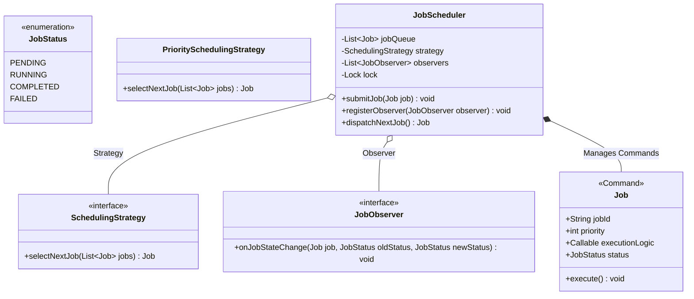

# LLD Case Study 1: Distributed Job Scheduler

> **Target Patterns:** Strategy Pattern, Command Pattern, Observer Pattern  
> **Key Engineering Focus:** Thread-safe task execution, pluggable scheduling algorithms, worker coordination, and lifecycle event streaming.

---

## 1. Problem Statement & Functional Requirements

Design a modular in-process Job Scheduler capable of scheduling, queuing, executing, and monitoring tasks across worker pools.

### Requirements:
1. **Job Definition (Command Pattern):** Encapsulate jobs as executable units of work with retry counts and parameters.
2. **Scheduling Policy (Strategy Pattern):** Support pluggable scheduling algorithms (e.g. First-Come-First-Served / Priority Scheduling vs Shortest Job First).
3. **Lifecycle Notifications (Observer Pattern):** Allow external monitoring systems (logging, metrics, alerting) to subscribe to job state changes (`PENDING`, `RUNNING`, `COMPLETED`, `FAILED`).
4. **Thread-Safety:** Multiple threads must be able to submit and execute jobs concurrently without state corruption.

---

## 2. Architecture & UML Class Diagram



---

## 3. Production-Grade Python Implementation

```python
import threading
import time
import uuid
from enum import Enum, auto
from abc import ABC, abstractmethod
from typing import Callable, Any, List, Optional

# --- Enums & Core Command ---
class JobStatus(Enum):
    PENDING = auto()
    RUNNING = auto()
    COMPLETED = auto()
    FAILED = auto()

class Job:
    """Command Pattern: Encapsulates task payload, priority, and execution."""
    def __init__(self, name: str, priority: int, action: Callable[[], Any]):
        self.job_id = str(uuid.uuid4())[:8]
        self.name = name
        self.priority = priority # Higher integer = higher priority
        self.action = action
        self.status = JobStatus.PENDING
        self.result = None
        self.error = None

    def execute(self) -> None:
        try:
            self.result = self.action()
            self.status = JobStatus.COMPLETED
        except Exception as err:
            self.error = err
            self.status = JobStatus.FAILED

# --- Strategy Pattern: Scheduling Algorithms ---
class SchedulingStrategy(ABC):
    @abstractmethod
    def select_next(self, queue: List[Job]) -> Optional[Job]:
        """Picks the next job to execute from the queue."""
        pass

class PrioritySchedulingStrategy(SchedulingStrategy):
    """Highest priority first."""
    def select_next(self, queue: List[Job]) -> Optional[Job]:
        if not queue:
            return None
        # Select job with max priority
        highest_priority_job = max(queue, key=lambda j: j.priority)
        queue.remove(highest_priority_job)
        return highest_priority_job

class FCFSSchedulingStrategy(SchedulingStrategy):
    """First-Come, First-Served."""
    def select_next(self, queue: List[Job]) -> Optional[Job]:
        return queue.pop(0) if queue else None

# --- Observer Pattern: Event Monitoring ---
class JobObserver(ABC):
    @abstractmethod
    def on_status_change(self, job: Job, old_status: JobStatus, new_status: JobStatus) -> None:
        pass

class MetricReporter(JobObserver):
    def on_status_change(self, job: Job, old_status: JobStatus, new_status: JobStatus) -> None:
        print(f"[Metrics Engine] Job '{job.name}' (ID: {job.job_id}) transition: {old_status.name} -> {new_status.name}")

class FailureAlertNotifier(JobObserver):
    def on_status_change(self, job: Job, old_status: JobStatus, new_status: JobStatus) -> None:
        if new_status == JobStatus.FAILED:
            print(f"[ALERT NOTIFIER] CRITICAL: Job '{job.name}' failed with error: {job.error}!")

# --- The Central Scheduler ---
class JobScheduler:
    def __init__(self, strategy: SchedulingStrategy):
        self._strategy = strategy
        self._queue: List[Job] = []
        self._observers: List[JobObserver] = []
        self._lock = threading.Lock()

    def register_observer(self, observer: JobObserver) -> None:
        with self._lock:
            self._observers.append(observer)

    def _notify(self, job: Job, old_status: JobStatus, new_status: JobStatus) -> None:
        for obs in self._observers:
            obs.on_status_change(job, old_status, new_status)

    def submit_job(self, job: Job) -> None:
        with self._lock:
            self._queue.append(job)
            self._notify(job, JobStatus.PENDING, JobStatus.PENDING)
            print(f"[Scheduler] Accepted Job '{job.name}' (Priority {job.priority}). Queue size: {len(self._queue)}")

    def run_next_job(self) -> bool:
        with self._lock:
            job = self._strategy.select_next(self._queue)
            if not job:
                return False
            
            old_status = job.status
            job.status = JobStatus.RUNNING
            self._notify(job, old_status, JobStatus.RUNNING)

        # Execute outside lock to avoid blocking other threads from submitting jobs!
        job.execute()

        with self._lock:
            self._notify(job, JobStatus.RUNNING, job.status)
        return True

# --- Verification Driver ---
if __name__ == "__main__":
    scheduler = JobScheduler(strategy=PrioritySchedulingStrategy())
    scheduler.register_observer(MetricReporter())
    scheduler.register_observer(FailureAlertNotifier())

    # Submit jobs in random order
    scheduler.submit_job(Job("BackupDatabase", priority=1, action=lambda: "Backup Done"))
    scheduler.submit_job(Job("PayVendorInvoices", priority=10, action=lambda: "Vendors Paid"))
    scheduler.submit_job(Job("FaultyCalculation", priority=5, action=lambda: 1 / 0))

    print("\n--- Executing Scheduled Jobs ---")
    while scheduler.run_next_job():
        pass
```


---

## 4. Edge Cases, Tests and Extensions

### Behaviour worth knowing before an interviewer asks

| Case | What happens | Why it matters |
| :--- | :--- | :--- |
| Equal priorities | `max(...)` returns the first maximal element, so ties run first-in-first-out | A free fairness guarantee, but it depends on `max`'s behaviour: test it |
| Low priority under constant high-priority load | **Starves forever** | Needs aging or a weighted fair strategy |
| Observer that calls `submit_job` | **Deadlocks**: observers run while holding a non-reentrant `Lock` | Notify outside the lock, or use `RLock` |
| Job raises | `FAILED` with `error` set; the scheduler keeps running | Correct isolation, but no retry |
| Selection cost | `max` plus `remove` is O(n) per job | A heap makes it O(log n) |
| No worker threads | `run_next_job()` runs on the caller's thread | A real scheduler adds a worker pool and a shutdown protocol |

### Tests, including the observer deadlock

This block extends the implementation above.

```python
# continues: job scheduler implementation above
import io, contextlib, threading

def quiet(fn, *a):
    with contextlib.redirect_stdout(io.StringIO()):
        return fn(*a)

# Priority order with FIFO ties
order = []
s = JobScheduler(PrioritySchedulingStrategy())
for name, pr in [("low", 1), ("high", 9), ("mid", 5), ("high2", 9)]:
    quiet(s.submit_job, Job(name, pr, lambda n=name: order.append(n)))
while quiet(s.run_next_job):
    pass
assert order == ["high", "high2", "mid", "low"]

# FCFS ignores priority
order.clear()
s = JobScheduler(FCFSSchedulingStrategy())
for name, pr in [("a", 1), ("b", 9)]:
    quiet(s.submit_job, Job(name, pr, lambda n=name: order.append(n)))
while quiet(s.run_next_job):
    pass
assert order == ["a", "b"]

# A failing job is isolated and recorded
def boom(): raise RuntimeError("disk full")
bad, good = Job("bad", 5, boom), Job("good", 1, lambda: 42)
s = JobScheduler(PrioritySchedulingStrategy())
quiet(s.submit_job, bad); quiet(s.submit_job, good)
quiet(s.run_next_job); quiet(s.run_next_job)
assert bad.status is JobStatus.FAILED and isinstance(bad.error, RuntimeError)
assert good.status is JobStatus.COMPLETED and good.result == 42

# Observers see PENDING -> RUNNING -> COMPLETED
class Recorder(JobObserver):
    def __init__(self): self.seen = []
    def on_status_change(self, job, old, new): self.seen.append((old.name, new.name))
rec, s = Recorder(), JobScheduler(FCFSSchedulingStrategy())
s.register_observer(rec)
quiet(s.submit_job, Job("j", 1, lambda: None)); quiet(s.run_next_job)
assert rec.seen == [("PENDING", "PENDING"), ("PENDING", "RUNNING"), ("RUNNING", "COMPLETED")]

# The deadlock: an observer that submits a follow-up job while the scheduler holds its lock
class Chainer(JobObserver):
    def __init__(self, sched): self.sched, self.done = sched, False
    def on_status_change(self, job, old, new):
        if new is JobStatus.RUNNING and not self.done:
            self.done = True
            self.sched.submit_job(Job("follow-up", 1, lambda: None))

def try_chain(scheduler):
    scheduler.register_observer(Chainer(scheduler))
    quiet(scheduler.submit_job, Job("first", 1, lambda: None))
    t = threading.Thread(target=lambda: quiet(scheduler.run_next_job), daemon=True)
    t.start(); t.join(1.0)
    return not t.is_alive()

assert try_chain(JobScheduler(FCFSSchedulingStrategy())) is False        # hangs: Lock is not re-entrant

class ReentrantScheduler(JobScheduler):
    def __init__(self, strategy):
        super().__init__(strategy)
        self._lock = threading.RLock()                                   # the one-line fix
assert try_chain(ReentrantScheduler(FCFSSchedulingStrategy())) is True

# Starvation and aging: effective priority grows with the time a job has waited
class AgingPriorityStrategy(SchedulingStrategy):
    def __init__(self, weight, clock): self.weight, self.clock = weight, clock
    def select_next(self, queue):
        if not queue: return None
        best = max(range(len(queue)), key=lambda i: queue[i].priority + self.weight * (self.clock() - queue[i].enqueued_at))
        return queue.pop(best)

old = Job("old-low", 1, lambda: None); old.enqueued_at = 0
fresh = []
for i in range(5):
    j = Job(f"hi{i}", 9, lambda: None); j.enqueued_at = 19; fresh.append(j)
now = lambda: 20
assert PrioritySchedulingStrategy().select_next([old] + fresh).name == "hi0"                 # plain priority: low keeps waiting
assert AgingPriorityStrategy(1, now).select_next([old] + fresh).name == "old-low"           # 1 + 20 waited beats 9 + 1 waited
print("scheduler tests passed")
```

### Extensions interviewers ask for

1. **Retries with backoff:** add `max_attempts` and `next_run_at` to `Job`; on failure re-enqueue with `next_run_at = now + base * 2**attempt` and make `select_next` skip jobs that are not yet due (the delay queue from the Python exercises).
2. **Worker pool:** start N threads that loop on `run_next_job`, wait on a `Condition` when the queue is empty, and stop on a sentinel.
3. **Scheduled and recurring jobs:** a min-heap keyed by `next_run_at`; recurring jobs re-insert themselves after each run.
4. **Distributed version:** the queue becomes a database table or broker; claiming a job must be atomic (`UPDATE ... WHERE status='PENDING' ... RETURNING`, or `SELECT ... FOR UPDATE SKIP LOCKED`), and a lease or heartbeat lets another worker take over a job whose owner died.

### Follow-up questions

- *Why execute the job outside the lock?* A slow job would otherwise block every submit; the lock protects queue structure, not job execution.
- *At-least-once or exactly-once?* With leases and retries it is at-least-once, so jobs must be idempotent; exactly-once needs an idempotency key stored with the result.
- *How do you stop a runaway job?* Cooperative cancellation with a flag the job polls, or run jobs in separate processes you can terminate; Python threads cannot be killed safely.
