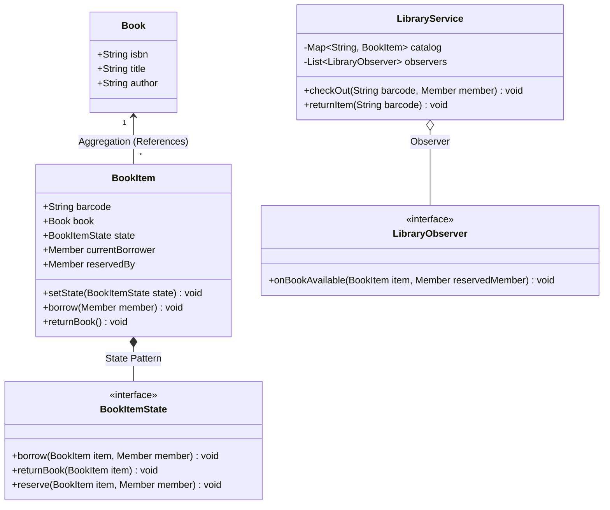

# LLD Case Study 2: Library Management System

> **Target Patterns:** Observer Pattern, State Pattern, Association vs Aggregation  
> **Key Engineering Focus:** Domain modeling, book item state transitions, reservation queues, and fine calculations.

---

## 1. Problem Statement & Functional Requirements

Design an enterprise Library Management System capable of cataloging books, managing physical copies (BookItems), issuing loans to members, tracking overdue fines, and managing waitlists for popular books.

### Key Requirements:
1. **Book vs BookItem (Aggregation/Composition):** A `Book` represents metadata (Title, ISBN, Author). A `BookItem` represents a physical barcoded copy on a shelf.
2. **State Pattern:** A `BookItem` transitions through states: `Available` $\rightarrow$ `Issued` $\rightarrow$ `Reserved` $\rightarrow$ `Lost`.
3. **Observer Pattern:** When an issued book that has an active reservation is returned, notify the reserved member automatically.
4. **Fines & Limits:** A member can borrow at most $N$ books. Overdue returns accumulate daily fines.

---

## 2. Architecture & UML Class Diagram



---

## 3. Production-Grade Python Implementation

```python
import datetime
from abc import ABC, abstractmethod
from typing import Optional, List, Dict

# --- Domain Entities ---
class Book:
    """Metadata aggregate (Independent entity)."""
    def __init__(self, isbn: str, title: str, author: str):
        self.isbn = isbn
        self.title = title
        self.author = author

class Member:
    def __init__(self, member_id: str, name: str, max_books: int = 5):
        self.member_id = member_id
        self.name = name
        self.max_books = max_books
        self.borrowed_items: List["BookItem"] = []

# --- State Pattern for Physical Book Items ---
class BookItemState(ABC):
    @abstractmethod
    def borrow(self, item: "BookItem", member: Member) -> None: pass
    @abstractmethod
    def return_item(self, item: "BookItem") -> None: pass
    @abstractmethod
    def reserve(self, item: "BookItem", member: Member) -> None: pass

class AvailableState(BookItemState):
    def borrow(self, item: "BookItem", member: Member) -> None:
        item.current_borrower = member
        item.borrowed_date = datetime.date.today()
        item.set_state(IssuedState())
        member.borrowed_items.append(item)
        print(f"[State] Book '{item.book.title}' checked out to {member.name}.")

    def return_item(self, item: "BookItem") -> None:
        raise ValueError("Cannot return a book that is already available.")

    def reserve(self, item: "BookItem", member: Member) -> None:
        raise ValueError("Book is currently on the shelf; borrow it directly.")

class IssuedState(BookItemState):
    def borrow(self, item: "BookItem", member: Member) -> None:
        raise ValueError(f"Book is already borrowed by {item.current_borrower.name}.")

    def return_item(self, item: "BookItem") -> None:
        borrower = item.current_borrower
        borrower.borrowed_items.remove(item)
        item.current_borrower = None
        
        if item.reserved_by:
            item.set_state(ReservedState())
            print(f"[State] Book returned. Transitioned to RESERVED for {item.reserved_by.name}.")
        else:
            item.set_state(AvailableState())
            print(f"[State] Book returned. Back on shelf as AVAILABLE.")

    def reserve(self, item: "BookItem", member: Member) -> None:
        if item.reserved_by:
            raise ValueError("Book is already reserved by another member.")
        item.reserved_by = member
        print(f"[State] Book reserved for {member.name} once returned.")

class ReservedState(BookItemState):
    def borrow(self, item: "BookItem", member: Member) -> None:
        if member != item.reserved_by:
            raise ValueError(f"Book is reserved specifically for {item.reserved_by.name}.")
        item.current_borrower = member
        item.reserved_by = None
        item.borrowed_date = datetime.date.today()
        item.set_state(IssuedState())
        member.borrowed_items.append(item)
        print(f"[State] Reserved book collected by {member.name}.")

    def return_item(self, item: "BookItem") -> None:
        raise ValueError("Cannot return book currently awaiting collection.")

    def reserve(self, item: "BookItem", member: Member) -> None:
        raise ValueError("Book is already reserved.")

# --- Context Object: BookItem ---
class BookItem:
    def __init__(self, barcode: str, book: Book):
        self.barcode = barcode
        self.book = book # Association / Aggregation
        self._state: BookItemState = AvailableState()
        self.current_borrower: Optional[Member] = None
        self.reserved_by: Optional[Member] = None
        self.borrowed_date: Optional[datetime.date] = None

    def set_state(self, state: BookItemState) -> None:
        self._state = state

    def borrow(self, member: Member) -> None:
        self._state.borrow(self, member)

    def return_item(self) -> None:
        self._state.return_item(self)

    def reserve(self, member: Member) -> None:
        self._state.reserve(self, member)

# --- Observer Notification ---
class ReservationNotifier:
    def notify_available(self, item: BookItem):
        if item.reserved_by:
            print(f"[EMAIL NOTIFICATION] Dear {item.reserved_by.name}, your reserved book '{item.book.title}' is now ready for pickup!")

# --- Service Orchestrator ---
class LibraryService:
    def __init__(self):
        self.items: Dict[str, BookItem] = {}
        self.notifier = ReservationNotifier()

    def add_book_item(self, item: BookItem):
        self.items[item.barcode] = item

    def check_out(self, barcode: str, member: Member):
        item = self.items[barcode]
        item.borrow(member)

    def return_book(self, barcode: str):
        item = self.items[barcode]
        had_reservation = item.reserved_by is not None
        item.return_item()
        if had_reservation:
            self.notifier.notify_available(item)

# --- Verification Driver ---
if __name__ == "__main__":
    service = LibraryService()
    clean_code = Book("978-0132350884", "Clean Code", "Robert C. Martin")
    copy1 = BookItem("BARCODE_001", clean_code)
    service.add_book_item(copy1)

    alice = Member("M1", "Alice")
    bob = Member("M2", "Bob")

    # 1. Alice borrows book
    service.check_out("BARCODE_001", alice)

    # 2. Bob tries to borrow (fails), so Bob reserves it
    copy1.reserve(bob)

    # 3. Alice returns book -> Triggers automatic Observer notification to Bob!
    service.return_book("BARCODE_001")

    # 4. Bob collects reserved book
    service.check_out("BARCODE_001", bob)
```


---

## 4. Edge Cases, Tests and Extensions

### State transitions the pattern enforces

| From state | borrow | return | reserve |
| :--- | :--- | :--- | :--- |
| Available | to Issued | error (already on shelf) | error (borrow it) |
| Issued | error (taken) | to Available, or to Reserved when someone waits | allowed once |
| Reserved | only the reserving member, to Issued | error (awaiting collection) | error |

Illegal moves raise `ValueError` from the state object, so the checks live next to the behaviour and there is no `if status == ...` in `LibraryService`.

A bug found while writing the tests below: `ReservedState.borrow` originally forgot `member.borrowed_items.append(item)`, so returning a collected reservation crashed with `list.remove(x): x not in list`. The fix is one line above, and the test sequence (reserve, return, collect, return) now covers it.

Gaps in the model:

| Gap | Effect |
| :--- | :--- |
| `Member.max_books` is stored but never checked | A member can borrow any number of books |
| `borrowed_date` is recorded but nothing uses it | No due date, no fine |
| A reservation has no expiry | An uncollected reserved copy is blocked forever |
| Not thread-safe | Two members borrowing the same copy at once can both pass the state check |

### Tests

This block extends the implementation above and adds the missing limit and fine logic.

```python
# continues: library implementation above
import io, contextlib, datetime

def quiet(fn, *a):
    with contextlib.redirect_stdout(io.StringIO()):
        return fn(*a)

def raises(fn, *a):
    try:
        quiet(fn, *a)
    except ValueError:
        return True
    return False

book = Book("111", "Clean Code", "R. Martin")
item = BookItem("B-1", book)
ana, bo = Member("m1", "Ana"), Member("m2", "Bo")

quiet(item.borrow, ana)
assert isinstance(item._state, IssuedState) and item in ana.borrowed_items
assert raises(item.borrow, bo)                         # already issued
quiet(item.reserve, bo)
assert raises(item.reserve, Member("m3", "Cy"))        # only one reservation
quiet(item.return_item)
assert isinstance(item._state, ReservedState) and item not in ana.borrowed_items
assert raises(item.borrow, ana)                        # reserved for Bo
quiet(item.borrow, bo)
assert isinstance(item._state, IssuedState) and item.reserved_by is None
quiet(item.return_item)
assert isinstance(item._state, AvailableState)
assert raises(item.return_item)                        # cannot return what is on the shelf

# The service notifies the reserving member when the copy comes back
svc = LibraryService(); svc.add_book_item(item)
quiet(svc.check_out, "B-1", ana); quiet(item.reserve, bo)
buf = io.StringIO()
with contextlib.redirect_stdout(buf):
    svc.return_book("B-1")
assert "EMAIL NOTIFICATION" in buf.getvalue() and "Bo" in buf.getvalue()

# Gap: the borrowing limit is not enforced
limited = Member("m9", "Dee", max_books=1)
for i in range(2):
    quiet(BookItem(f"X-{i}", book).borrow, limited)
assert len(limited.borrowed_items) == 2                # max_books=1 was ignored

# Fix: enforce the limit in the service, and compute fines from an injected date
class LimitedLibraryService(LibraryService):
    def check_out(self, barcode, member):
        if len(member.borrowed_items) >= member.max_books:
            raise ValueError("borrowing limit reached")
        super().check_out(barcode, member)

lib = LimitedLibraryService()
for i in range(2):
    lib.add_book_item(BookItem(f"Y-{i}", book))
m = Member("m8", "Eli", max_books=1)
quiet(lib.check_out, "Y-0", m)
assert raises(lib.check_out, "Y-1", m)

def fine(borrowed, returned, loan_days=14, per_day_cents=50):
    late = (returned - borrowed).days - loan_days
    return max(0, late) * per_day_cents

d0 = datetime.date(2025, 1, 1)
assert fine(d0, d0 + datetime.timedelta(days=14)) == 0
assert fine(d0, d0 + datetime.timedelta(days=17)) == 150
print("library tests passed")
```

### Extensions interviewers ask for

1. **Catalogue search:** an inverted index from title and author words to ISBNs; search returns `Book` metadata, availability is derived from the `BookItem` copies.
2. **Multiple copies and branches:** `Book` stays one record, each physical copy is a `BookItem` with a branch; a reservation targets a `Book`, and the first returned copy anywhere satisfies it (a queue per ISBN, not a single `reserved_by`).
3. **Reservation expiry:** store `ready_since` when a copy becomes Reserved; a sweeper returns it to Available (and notifies the next person in the queue) after, say, three days.
4. **Fines and holds:** a `FinePolicy` strategy; a member with unpaid fines is blocked from `check_out`.
5. **Concurrency:** wrap each `BookItem` transition in a per-item lock, or in a database use an optimistic `version` column.

### Follow-up questions

- *Why separate `Book` from `BookItem`?* Metadata is shared by every copy; availability, borrower and condition belong to one physical copy. Merging them would make a three-copy title look like one book.
- *Where do you put the borrowing limit?* In the service (or a policy object), because it spans several items and is not a property of one item's state machine.
- *State pattern versus a status enum?* With three states and three operations the pattern is slightly heavy, but each new rule (for example `Lost` or `InRepair`) becomes one class rather than edits scattered across every method.
