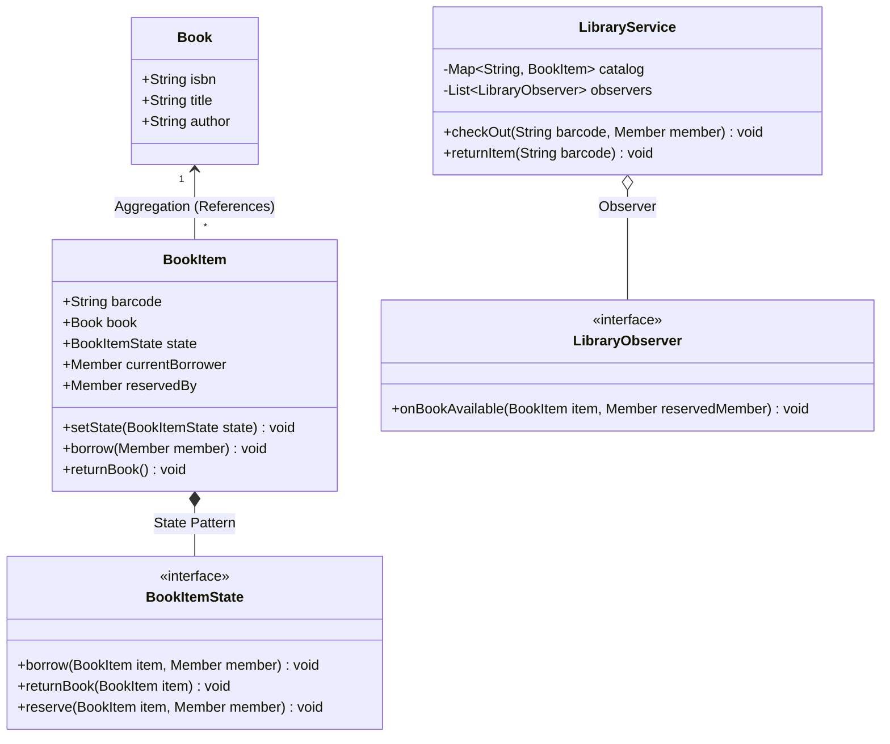

# LLD Case Study 2: Library Management System

> **Target Patterns:** Observer Pattern, State Pattern, Association vs Aggregation  
> **Key Engineering Focus:** Domain modeling, book item state transitions, reservation queues, and fine calculations.

---

## 1. Problem Statement & Functional Requirements

Design an enterprise Library Management System capable of cataloging books, managing physical copies (BookItems), issuing loans to members, tracking overdue fines, and managing waitlists for popular books.

### Key Requirements:
1. **Book vs BookItem (Aggregation/Composition):** A `Book` represents metadata (Title, ISBN, Author). A `BookItem` represents a physical barcoded copy on a shelf.
2. **State Pattern:** A `BookItem` transitions through states: `Available` $\rightarrow$ `Issued` $\rightarrow$ `Reserved` $\rightarrow$ `Lost`.
3. **Observer Pattern:** When an issued book that has an active reservation is returned, notify the reserved member automatically.
4. **Fines & Limits:** A member can borrow at most $N$ books. Overdue returns accumulate daily fines.

---

## 2. Architecture & UML Class Diagram



---

## 3. Production-Grade Python Implementation

```python
import datetime
from abc import ABC, abstractmethod
from typing import Optional, List, Dict

# --- Domain Entities ---
class Book:
    """Metadata aggregate (Independent entity)."""
    def __init__(self, isbn: str, title: str, author: str):
        self.isbn = isbn
        self.title = title
        self.author = author

class Member:
    def __init__(self, member_id: str, name: str, max_books: int = 5):
        self.member_id = member_id
        self.name = name
        self.max_books = max_books
        self.borrowed_items: List["BookItem"] = []

# --- State Pattern for Physical Book Items ---
class BookItemState(ABC):
    @abstractmethod
    def borrow(self, item: "BookItem", member: Member) -> None: pass
    @abstractmethod
    def return_item(self, item: "BookItem") -> None: pass
    @abstractmethod
    def reserve(self, item: "BookItem", member: Member) -> None: pass

class AvailableState(BookItemState):
    def borrow(self, item: "BookItem", member: Member) -> None:
        item.current_borrower = member
        item.borrowed_date = datetime.date.today()
        item.set_state(IssuedState())
        member.borrowed_items.append(item)
        print(f"[State] Book '{item.book.title}' checked out to {member.name}.")

    def return_item(self, item: "BookItem") -> None:
        raise ValueError("Cannot return a book that is already available.")

    def reserve(self, item: "BookItem", member: Member) -> None:
        raise ValueError("Book is currently on the shelf; borrow it directly.")

class IssuedState(BookItemState):
    def borrow(self, item: "BookItem", member: Member) -> None:
        raise ValueError(f"Book is already borrowed by {item.current_borrower.name}.")

    def return_item(self, item: "BookItem") -> None:
        borrower = item.current_borrower
        borrower.borrowed_items.remove(item)
        item.current_borrower = None
        
        if item.reserved_by:
            item.set_state(ReservedState())
            print(f"[State] Book returned. Transitioned to RESERVED for {item.reserved_by.name}.")
        else:
            item.set_state(AvailableState())
            print(f"[State] Book returned. Back on shelf as AVAILABLE.")

    def reserve(self, item: "BookItem", member: Member) -> None:
        if item.reserved_by:
            raise ValueError("Book is already reserved by another member.")
        item.reserved_by = member
        print(f"[State] Book reserved for {member.name} once returned.")

class ReservedState(BookItemState):
    def borrow(self, item: "BookItem", member: Member) -> None:
        if member != item.reserved_by:
            raise ValueError(f"Book is reserved specifically for {item.reserved_by.name}.")
        item.current_borrower = member
        item.reserved_by = None
        item.borrowed_date = datetime.date.today()
        item.set_state(IssuedState())
        print(f"[State] Reserved book collected by {member.name}.")

    def return_item(self, item: "BookItem") -> None:
        raise ValueError("Cannot return book currently awaiting collection.")

    def reserve(self, item: "BookItem", member: Member) -> None:
        raise ValueError("Book is already reserved.")

# --- Context Object: BookItem ---
class BookItem:
    def __init__(self, barcode: str, book: Book):
        self.barcode = barcode
        self.book = book # Association / Aggregation
        self._state: BookItemState = AvailableState()
        self.current_borrower: Optional[Member] = None
        self.reserved_by: Optional[Member] = None
        self.borrowed_date: Optional[datetime.date] = None

    def set_state(self, state: BookItemState) -> None:
        self._state = state

    def borrow(self, member: Member) -> None:
        self._state.borrow(self, member)

    def return_item(self) -> None:
        self._state.return_item(self)

    def reserve(self, member: Member) -> None:
        self._state.reserve(self, member)

# --- Observer Notification ---
class ReservationNotifier:
    def notify_available(self, item: BookItem):
        if item.reserved_by:
            print(f"[EMAIL NOTIFICATION] Dear {item.reserved_by.name}, your reserved book '{item.book.title}' is now ready for pickup!")

# --- Service Orchestrator ---
class LibraryService:
    def __init__(self):
        self.items: Dict[str, BookItem] = {}
        self.notifier = ReservationNotifier()

    def add_book_item(self, item: BookItem):
        self.items[item.barcode] = item

    def check_out(self, barcode: str, member: Member):
        item = self.items[barcode]
        item.borrow(member)

    def return_book(self, barcode: str):
        item = self.items[barcode]
        had_reservation = item.reserved_by is not None
        item.return_item()
        if had_reservation:
            self.notifier.notify_available(item)

# --- Verification Driver ---
if __name__ == "__main__":
    service = LibraryService()
    clean_code = Book("978-0132350884", "Clean Code", "Robert C. Martin")
    copy1 = BookItem("BARCODE_001", clean_code)
    service.add_book_item(copy1)

    alice = Member("M1", "Alice")
    bob = Member("M2", "Bob")

    # 1. Alice borrows book
    service.check_out("BARCODE_001", alice)

    # 2. Bob tries to borrow (fails), so Bob reserves it
    copy1.reserve(bob)

    # 3. Alice returns book -> Triggers automatic Observer notification to Bob!
    service.return_book("BARCODE_001")

    # 4. Bob collects reserved book
    service.check_out("BARCODE_001", bob)
```
