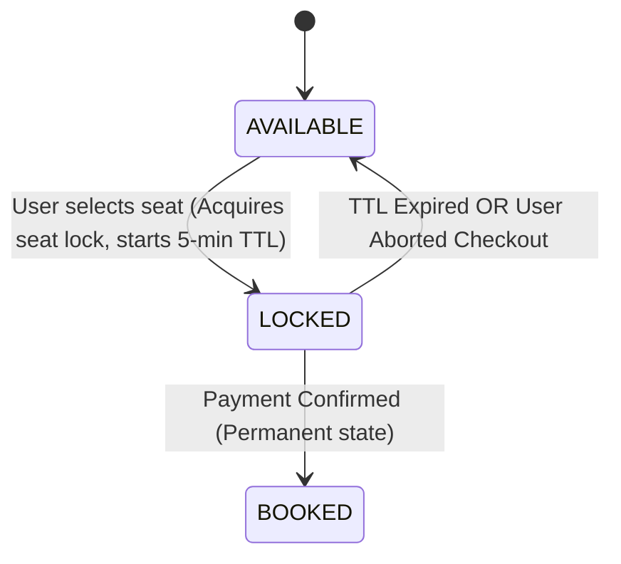
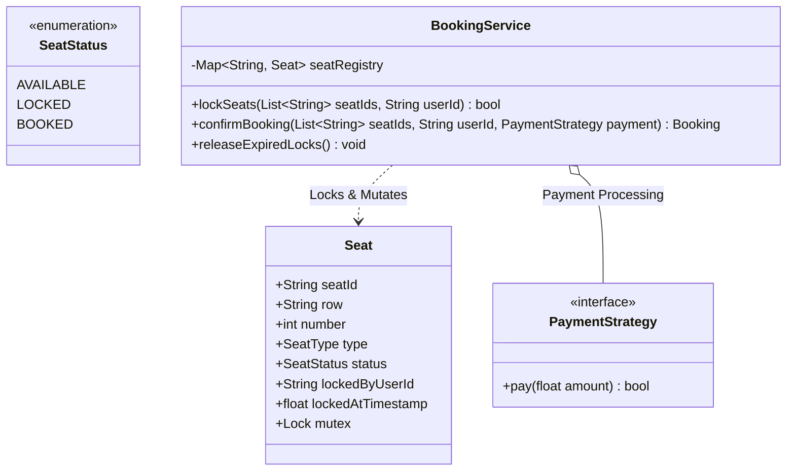

# LLD Case Study 3: Movie Ticket Booking System (BookMyShow / Fandango)

> **Target Patterns:** Concurrency Control, State Machine, Factory Pattern, Strategy Pattern  
> **Key Engineering Focus:** High-concurrency seat locking, race condition elimination, temporary seat reservations with TTL expiration, and payment processing.

---

## 1. Problem Statement & Functional Requirements

Design the core booking engine for a cinema platform. Thousands of concurrent users vie for high-demand premiere seats.

### Requirements:
1. **Cinema Hierarchy:** Cinema $\rightarrow$ Audi / Screen $\rightarrow$ Show $\rightarrow$ Seats (Regular, VIP, Recliner).
2. **State Machine:** A seat can be `AVAILABLE`, `TEMPORARILY_LOCKED` (e.g., 5-minute payment hold window), or `BOOKED`.
3. **Concurrency Control:** Absolutely no two users can book or lock the same seat simultaneously. Handled via thread-safe atomic mutexes.
4. **Auto-Expiration:** If payment is not completed within the hold window, the lock automatically expires and the seat returns to `AVAILABLE`.
5. **Payment Processing:** Decoupled via Strategy Pattern (UPI, CreditCard, NetBanking).

---

## 2. Architecture & State Diagram





---

## 3. Production-Grade Python Implementation

```python
import threading
import time
from enum import Enum, auto
from abc import ABC, abstractmethod
from typing import List, Dict, Optional

# --- Enums & Seat Model ---
class SeatStatus(Enum):
    AVAILABLE = auto()
    LOCKED = auto()
    BOOKED = auto()

class Seat:
    def __init__(self, seat_id: str, price: float):
        self.seat_id = seat_id
        self.price = price
        self.status = SeatStatus.AVAILABLE
        self.locked_by: Optional[str] = None
        self.locked_at: float = 0.0
        self.lock = threading.Lock() # Fine-grained per-seat lock!

    def is_lock_expired(self, ttl_seconds: float) -> bool:
        if self.status == SeatStatus.LOCKED and (time.monotonic() - self.locked_at) > ttl_seconds:
            return True
        return False

# --- Payment Strategy Pattern ---
class PaymentStrategy(ABC):
    @abstractmethod
    def process_payment(self, amount: float) -> bool: pass

class CreditCardPayment(PaymentStrategy):
    def process_payment(self, amount: float) -> bool:
        print(f"[Payment Gateway] Successfully charged ${amount:.2f} via Credit Card.")
        return True

class UPIPayment(PaymentStrategy):
    def process_payment(self, amount: float) -> bool:
        print(f"[Payment Gateway] Successfully transferred ${amount:.2f} via UPI.")
        return True

# --- The Booking Engine ---
class BookingService:
    LOCK_TTL_SECONDS = 5.0 # For demo; in prod usually 300s (5 mins)

    def __init__(self, seats: List[Seat]):
        self.seats: Dict[str, Seat] = {s.seat_id: s for s in seats}
        self._global_lock = threading.Lock()

    def lock_seats(self, seat_ids: List[str], user_id: str) -> bool:
        """
        Attempts to lock all requested seats atomically.
        Sorts seat_ids to guarantee strict global lock ordering (Deadlock Prevention!).
        """
        sorted_ids = sorted(seat_ids)
        acquired_locks = []

        try:
            # 1. Acquire all individual seat locks in order
            for sid in sorted_ids:
                seat = self.seats[sid]
                seat.lock.acquire()
                acquired_locks.append(seat.lock)

            # 2. Check if any seat is already booked or actively locked
            now = time.monotonic()
            for sid in sorted_ids:
                seat = self.seats[sid]
                # Auto-heal expired locks
                if seat.is_lock_expired(self.LOCK_TTL_SECONDS):
                    seat.status = SeatStatus.AVAILABLE
                    seat.locked_by = None

                if seat.status != SeatStatus.AVAILABLE:
                    print(f"[Lock Rejected] Seat {sid} is not available (Status: {seat.status.name})")
                    return False

            # 3. Transition all seats to LOCKED
            for sid in sorted_ids:
                seat = self.seats[sid]
                seat.status = SeatStatus.LOCKED
                seat.locked_by = user_id
                seat.locked_at = now

            print(f"[Lock Success] Seats {seat_ids} temporarily locked for user {user_id}.")
            return True

        finally:
            # Release all locks so other queries can proceed
            for lock in reversed(acquired_locks):
                lock.release()

    def confirm_booking(self, seat_ids: List[str], user_id: str, payment: PaymentStrategy) -> bool:
        """Confirms booking upon successful payment capture."""
        sorted_ids = sorted(seat_ids)
        acquired_locks = []

        try:
            for sid in sorted_ids:
                seat = self.seats[sid]
                seat.lock.acquire()
                acquired_locks.append(seat.lock)

            # Verify ownership and valid lock
            for sid in sorted_ids:
                seat = self.seats[sid]
                if seat.status != SeatStatus.LOCKED or seat.locked_by != user_id:
                    print(f"[Booking Failed] User {user_id} does not hold active lock for seat {sid}")
                    return False
                if seat.is_lock_expired(self.LOCK_TTL_SECONDS):
                    print(f"[Booking Failed] Lock on seat {sid} expired before checkout.")
                    seat.status = SeatStatus.AVAILABLE
                    return False

            total_amount = sum(self.seats[sid].price for sid in sorted_ids)
            
            # Execute payment
            if not payment.process_payment(total_amount):
                print("[Booking Failed] Payment gateway rejected transaction.")
                return False

            # Transition to permanently BOOKED
            for sid in sorted_ids:
                seat = self.seats[sid]
                seat.status = SeatStatus.BOOKED

            print(f"[Booking Confirmed] Seats {seat_ids} successfully booked for user {user_id}!")
            return True

        finally:
            for lock in reversed(acquired_locks):
                lock.release()

# --- Concurrent Simulation Test ---
if __name__ == "__main__":
    seats_pool = [Seat("A1", 15.0), Seat("A2", 15.0)]
    booking_system = BookingService(seats_pool)

    def user_action(user_name: str, target_seat: str):
        success = booking_system.lock_seats([target_seat], user_name)
        if success:
            time.sleep(0.1) # Simulate checkout interaction
            booking_system.confirm_booking([target_seat], user_name, CreditCardPayment())

    # Two concurrent threads race for seat A1 simultaneously
    t1 = threading.Thread(target=user_action, args=("Alice", "A1"))
    t2 = threading.Thread(target=user_action, args=("Bob", "A1"))

    t1.start()
    t2.start()
    t1.join()
    t2.join()
```


---

## 4. Edge Cases, Tests and Extensions

### What the design guarantees and where it needs help

| Concern | Status | Detail |
| :--- | :--- | :--- |
| Two users, one seat | Safe | Per-seat locks plus a status check inside the lock: only one `lock_seats` call succeeds |
| Deadlock across multi-seat requests | Safe | Seat ids are sorted before locking, so every thread acquires locks in the same global order |
| Abandoned checkout | Safe | A lock older than `LOCK_TTL_SECONDS` is treated as free by the next user |
| Unknown seat id | Safe | `KeyError` is raised and the `finally` block releases the locks acquired so far |
| Payment fails | By design | Seats stay `LOCKED` so the user can retry until the TTL runs out |
| Payment called while holding seat locks | **Weak** | A slow gateway blocks every other request touching those seats; real systems release locks, call the gateway, then re-verify |
| Charged but not booked | **Not handled** | A crash between `process_payment` and the status change loses the booking; use an idempotency key and reconcile |

### Tests

This block extends the implementation above (clock patched for the TTL tests).

```python
# continues: movie booking implementation above
import io, contextlib, threading
from unittest import mock

def quiet(fn, *a):
    with contextlib.redirect_stdout(io.StringIO()):
        return fn(*a)

def new_service():
    return BookingService([Seat("A1", 10.0), Seat("A2", 10.0), Seat("B1", 15.0)])

class Declined(PaymentStrategy):
    def process_payment(self, amount): return False

svc = new_service()
assert quiet(svc.lock_seats, ["A1", "A2"], "u1") is True
assert quiet(svc.lock_seats, ["A2"], "u2") is False                      # already locked
assert quiet(svc.confirm_booking, ["A2"], "u2", CreditCardPayment()) is False   # u2 does not own the lock
assert quiet(svc.confirm_booking, ["A1", "A2"], "u1", Declined()) is False
assert svc.seats["A1"].status is SeatStatus.LOCKED                       # failed payment keeps the lock
assert quiet(svc.confirm_booking, ["A1", "A2"], "u1", CreditCardPayment()) is True
assert svc.seats["A1"].status is SeatStatus.BOOKED
assert quiet(svc.lock_seats, ["A1"], "u3") is False                      # booked seats cannot be locked

# TTL: an abandoned lock is healed by the next user, and the first user's checkout then fails
clock = [0.0]
with mock.patch("time.monotonic", lambda: clock[0]):
    svc = new_service()
    assert quiet(svc.lock_seats, ["B1"], "u1") is True
    clock[0] = 6.0                                                       # beyond the 5 second TTL
    assert quiet(svc.lock_seats, ["B1"], "u2") is True
    assert quiet(svc.confirm_booking, ["B1"], "u1", CreditCardPayment()) is False

    svc = new_service()
    quiet(svc.lock_seats, ["A1"], "u1")
    clock[0] = 12.0
    assert quiet(svc.confirm_booking, ["A1"], "u1", CreditCardPayment()) is False   # expired before checkout
    assert svc.seats["A1"].status is SeatStatus.AVAILABLE

# Unknown seat: error, but nothing stays locked
svc = new_service()
try:
    quiet(svc.lock_seats, ["A1", "ZZ"], "u1")
    raise AssertionError("expected KeyError")
except KeyError:
    pass
assert svc.seats["A1"].lock.acquire(blocking=False)                      # lock was released
svc.seats["A1"].lock.release()

# Concurrency: 20 users race for one seat, exactly one wins
svc = new_service()
wins = []
ts = [threading.Thread(target=lambda i=i: wins.append(quiet(svc.lock_seats, ["A1"], f"u{i}"))) for i in range(20)]
[t.start() for t in ts]; [t.join() for t in ts]
assert sum(wins) == 1

# Deadlock freedom: opposite seat orders from two threads still terminate
svc = BookingService([Seat("A1", 1.0), Seat("B1", 1.0)])
def hammer(order, user):
    for _ in range(200):
        quiet(svc.lock_seats, order, user)
t1 = threading.Thread(target=hammer, args=(["A1", "B1"], "x"), daemon=True)
t2 = threading.Thread(target=hammer, args=(["B1", "A1"], "y"), daemon=True)
t1.start(); t2.start(); t1.join(10); t2.join(10)
assert not t1.is_alive() and not t2.is_alive()
print("movie booking tests passed")
```

### Extensions interviewers ask for

1. **Shows, screens and theatres:** seats belong to a `Show` (a movie at a time on a screen), not to a theatre; the same physical seat is a different bookable object per show.
2. **Seat maps and pricing tiers:** price comes from a `PricingStrategy` using seat class, show time and demand, evaluated when the lock is taken and stored with the lock.
3. **Distributed deployment:** move seat state to a database; the lock becomes `UPDATE seat SET status='LOCKED', locked_by=?, locked_until=? WHERE id=? AND (status='AVAILABLE' OR locked_until < now())` and the affected row count says who won.
4. **Waiting room under flash-sale load:** put a queue in front of the lock endpoint so a popular release does not hammer the seat table.
5. **Refunds and cancellation:** a `BOOKED -> CANCELLED -> AVAILABLE` path with a refund call that is idempotent.

### Follow-up questions

- *Why lock seats in sorted order?* A global ordering of lock acquisition removes circular waits, one of the four conditions for deadlock.
- *Why a TTL instead of waiting for the user to cancel?* Users abandon checkouts silently; without expiry, popular seats would stay blocked forever.
- *How do you avoid charging twice on retry?* Send an idempotency key (booking id) to the payment provider so a repeated charge returns the first result.
