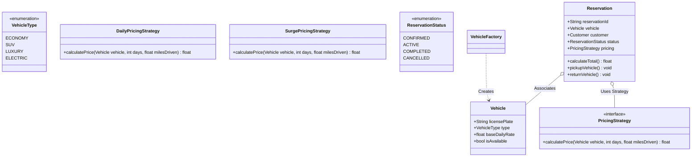

# LLD Case Study 4: Car Rental System (Hertz / Zoomcar)

> **Target Patterns:** Factory Pattern, Strategy Pattern, State Pattern  
> **Key Engineering Focus:** Multi-branch vehicle inventory, dynamic pricing algorithms, vehicle lifecycle states, and reservation management.

---

## 1. Problem Statement & Functional Requirements

Design an automated Car Rental Management platform operating across multiple cities and airport branches.

### Requirements:
1. **Vehicle Hierarchy (Factory Pattern):** Manage diverse vehicle classes (Economy Hatchback, Compact SUV, Luxury Sedan, Electric Vehicle) with distinct specifications and rates.
2. **Dynamic Pricing (Strategy Pattern):** Calculate rental costs using swappable pricing algorithms (Base Daily Rate, Surge/Peak Season Pricing, Distance/Mileage Model).
3. **Reservation State Machine (State Pattern):** Reservations progress from `Pending` $\rightarrow$ `Confirmed` $\rightarrow$ `PickedUp` $\rightarrow$ `Completed` (or `Cancelled`).
4. **Multi-Location Inventory:** Allow vehicle pickup at one branch and return at a different branch with inter-branch inventory rebalancing.

---

## 2. Architecture & UML Class Diagram



---

## 3. Production-Grade Python Implementation

```python
import uuid
from enum import Enum, auto
from abc import ABC, abstractmethod
from typing import Dict, List, Optional

# --- Enums & Vehicle Entities ---
class VehicleType(Enum):
    ECONOMY = auto()
    SUV = auto()
    LUXURY = auto()
    ELECTRIC = auto()

class Vehicle:
    def __init__(self, license_plate: str, vehicle_type: VehicleType, base_daily_rate: float):
        self.license_plate = license_plate
        self.vehicle_type = vehicle_type
        self.base_daily_rate = base_daily_rate
        self.is_available = True

# --- Factory Pattern: Vehicle Creation ---
class VehicleFactory:
    @staticmethod
    def create_vehicle(v_type: VehicleType, plate: str) -> Vehicle:
        rates = {
            VehicleType.ECONOMY: 45.0,
            VehicleType.SUV: 85.0,
            VehicleType.LUXURY: 180.0,
            VehicleType.ELECTRIC: 95.0,
        }
        return Vehicle(license_plate=plate, vehicle_type=v_type, base_daily_rate=rates[v_type])

# --- Strategy Pattern: Pricing Engines ---
class PricingStrategy(ABC):
    @abstractmethod
    def calculate_price(self, vehicle: Vehicle, rental_days: int, miles_driven: float) -> float:
        pass

class DailyPricingStrategy(PricingStrategy):
    """Standard flat daily rate with unlimited mileage."""
    def calculate_price(self, vehicle: Vehicle, rental_days: int, miles_driven: float) -> float:
        return vehicle.base_daily_rate * rental_days

class SurgePricingStrategy(PricingStrategy):
    """Applies a surge multiplier during high demand holidays."""
    def __init__(self, multiplier: float = 1.4):
        self.multiplier = multiplier

    def calculate_price(self, vehicle: Vehicle, rental_days: int, miles_driven: float) -> float:
        return (vehicle.base_daily_rate * rental_days) * self.multiplier

class MileageHybridStrategy(PricingStrategy):
    """Lower daily rate + per-mile charge."""
    def calculate_price(self, vehicle: Vehicle, rental_days: int, miles_driven: float) -> float:
        base = (vehicle.base_daily_rate * 0.7) * rental_days
        mileage_fee = miles_driven * 0.25
        return base + mileage_fee

# --- Reservation Lifecycle ---
class ReservationStatus(Enum):
    CONFIRMED = auto()
    ACTIVE = auto()
    COMPLETED = auto()
    CANCELLED = auto()

class Reservation:
    def __init__(self, customer_name: str, vehicle: Vehicle, days: int, pricing: PricingStrategy):
        self.reservation_id = str(uuid.uuid4())[:8]
        self.customer_name = customer_name
        self.vehicle = vehicle
        self.rental_days = days
        self.pricing_strategy = pricing
        self.status = ReservationStatus.CONFIRMED
        self.vehicle.is_available = False # Reserve vehicle

    def pickup(self) -> None:
        if self.status != ReservationStatus.CONFIRMED:
            raise ValueError("Only confirmed reservations can be picked up.")
        self.status = ReservationStatus.ACTIVE
        print(f"[Rental] Customer '{self.customer_name}' picked up vehicle {self.vehicle.license_plate}.")

    def complete_return(self, miles_driven: float) -> float:
        if self.status != ReservationStatus.ACTIVE:
            raise ValueError("Cannot return vehicle that is not currently active.")
        self.status = ReservationStatus.COMPLETED
        self.vehicle.is_available = True
        
        total_bill = self.pricing_strategy.calculate_price(self.vehicle, self.rental_days, miles_driven)
        print(f"[Rental] Vehicle {self.vehicle.license_plate} returned. Total Bill: ${total_bill:.2f}")
        return total_bill

# --- Verification Driver ---
if __name__ == "__main__":
    # Create vehicles using Factory
    suv = VehicleFactory.create_vehicle(VehicleType.SUV, "CA-992-XYZ")
    luxury = VehicleFactory.create_vehicle(VehicleType.LUXURY, "NY-771-LUX")

    # 1. Standard Daily Rental
    res1 = Reservation("David", suv, days=3, pricing=DailyPricingStrategy())
    res1.pickup()
    bill1 = res1.complete_return(miles_driven=120)

    # 2. Holiday Surge Rental
    res2 = Reservation("Elena", luxury, days=2, pricing=SurgePricingStrategy(multiplier=1.5))
    res2.pickup()
    bill2 = res2.complete_return(miles_driven=40)
```


---

## 4. Edge Cases, Tests and Extensions

### What the model gets right and what it hides

| Concern | Status | Detail |
| :--- | :--- | :--- |
| Pricing variants | Good | `PricingStrategy` keeps daily, surge and mileage pricing out of the reservation |
| Double booking | **Missing** | `Reservation.__init__` never checks `vehicle.is_available`, so the same car can be reserved twice |
| Future bookings | **Missing** | A boolean flag cannot say "free Monday, booked Tuesday"; availability must be a date range |
| Cancellation | **Missing** | `CANCELLED` exists but no method reaches it, and the vehicle would stay unavailable |
| Money as `float` | Risky | `0.1 + 0.2 != 0.3`; bill in `Decimal` or integer cents and round once |
| Late return, damage fee | Not modelled | Extra charge after the agreed return time; compute from timestamps, not days alone |

### Tests: pricing, lifecycle, and the double-booking bug

This block extends the implementation above. The last part adds a `RentalDesk` that owns date-range availability.

```python
# continues: car rental implementation above
import io, contextlib
from decimal import Decimal, ROUND_HALF_UP

def close(a, b): return abs(a - b) < 1e-9

eco = VehicleFactory.create_vehicle(VehicleType.ECONOMY, "ECO-1")
assert close(DailyPricingStrategy().calculate_price(eco, 3, 0), 135.0)
assert close(SurgePricingStrategy(1.4).calculate_price(eco, 3, 0), 189.0)
assert close(MileageHybridStrategy().calculate_price(eco, 2, 100), 88.0)

with contextlib.redirect_stdout(io.StringIO()):
    r = Reservation("ana", eco, 2, DailyPricingStrategy())
    try:
        r.complete_return(10)                      # cannot return before pickup
        raise AssertionError("expected ValueError")
    except ValueError:
        pass
    r.pickup()
    assert close(r.complete_return(10), 90.0) and eco.is_available
    try:
        r.complete_return(10)                      # cannot return twice
        raise AssertionError("expected ValueError")
    except ValueError:
        pass

# The bug: nothing stops two reservations of the same car
suv = VehicleFactory.create_vehicle(VehicleType.SUV, "SUV-1")
Reservation("a", suv, 1, DailyPricingStrategy())
Reservation("b", suv, 1, DailyPricingStrategy())      # silently accepted

# The fix: availability is a date range, checked by one owner
class RentalDesk:
    def __init__(self):
        self.bookings = {}                                    # plate -> [(start, end, reservation_id)]

    def reserve(self, customer, vehicle, start_day, days, pricing):
        end = start_day + days
        slots = self.bookings.setdefault(vehicle.license_plate, [])
        if any(start_day < e and s < end for s, e, _ in slots):
            raise ValueError("vehicle already booked for those dates")
        with contextlib.redirect_stdout(io.StringIO()):
            res = Reservation(customer, vehicle, days, pricing)
        vehicle.is_available = True                           # the flag is replaced by the date check
        slots.append((start_day, end, res.reservation_id))
        return res

    def cancel(self, vehicle, res):
        self.bookings[vehicle.license_plate] = [b for b in self.bookings[vehicle.license_plate] if b[2] != res.reservation_id]
        res.status = ReservationStatus.CANCELLED

desk, car = RentalDesk(), VehicleFactory.create_vehicle(VehicleType.ECONOMY, "ECO-2")
first = desk.reserve("a", car, start_day=1, days=3, pricing=DailyPricingStrategy())    # days 1..3
desk.reserve("b", car, start_day=4, days=2, pricing=DailyPricingStrategy())            # back to back is fine
try:
    desk.reserve("c", car, start_day=3, days=2, pricing=DailyPricingStrategy())        # overlaps
    raise AssertionError("expected ValueError")
except ValueError:
    pass
desk.cancel(car, first)
desk.reserve("c", car, start_day=2, days=2, pricing=DailyPricingStrategy())            # freed by the cancellation

# Money: float surprises versus Decimal
assert 0.1 + 0.2 != 0.3
q = lambda x: x.quantize(Decimal("0.01"), ROUND_HALF_UP)
assert q(Decimal("45.00") * Decimal("0.7") * 2 + Decimal(100) * Decimal("0.25")) == Decimal("88.00")
print("car rental tests passed")
```

### Extensions interviewers ask for

1. **Pickup and drop-off at different branches:** add a `Branch` and a location on each `Vehicle`; availability then depends on where the previous rental ended, and a relocation fee becomes a pricing input.
2. **Insurance and add-ons:** wrap the price with the Decorator pattern (`GpsAddOn(InsuranceAddOn(base_price))`) so add-ons compose without subclass explosions.
3. **Concurrent bookings:** the overlap check and the insert must be atomic; in-process use a lock per vehicle, in a database use an exclusion constraint on `(vehicle_id, daterange)` so the database rejects overlaps itself.
4. **Dynamic pricing:** feed utilisation and the date into a `PricingStrategy`; keep the quoted price on the reservation so later strategy changes never alter an existing booking.

### Follow-up questions

- *Why is the overlap test `start < other_end and other_start < end`?* It treats intervals as half-open `[start, end)`, so a rental ending on day 4 and one starting on day 4 do not clash.
- *Where does a lock on the whole fleet hurt?* Every booking serialises behind every other one; locking per vehicle (or per vehicle-and-date bucket) keeps unrelated bookings parallel.
- *How do you price a late return?* Store the due timestamp, charge `ceil(hours_late)` times an hourly rate beyond a grace period, and add it as a separate line on the bill.
