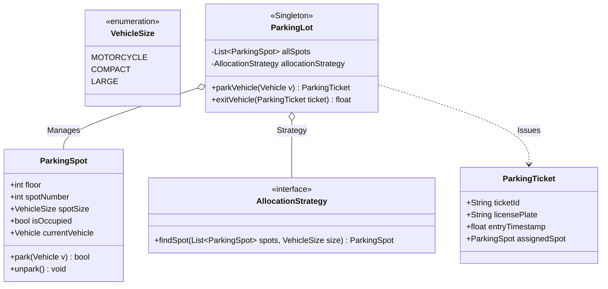

# LLD Case Study 5: Multi-Floor Parking Lot System

> **Target Patterns:** Singleton Pattern, Factory Pattern, Strategy Pattern  
> **Key Engineering Focus:** Multi-level spatial modeling, spot allocation algorithms, dynamic fee calculation, and thread-safe entry/exit gates.

---

## 1. Problem Statement & Functional Requirements

Design an automated multi-floor commercial parking lot management system.

### Requirements:
1. **Singleton Architecture:** The physical parking lot configuration is a system-wide Singleton.
2. **Vehicle & Spot Hierarchies (Factory Pattern):** Supports Motorcycles, Cars, and Heavy Trucks fitting into Motorcycle, Compact, and Large spots respectively.
3. **Spot Allocation Policy (Strategy Pattern):** Pluggable algorithms for spot assignment (e.g. Nearest to Entrance, Lowest Floor First).
4. **Automated Ticketing & Billing (Strategy Pattern):** Issue timestamped tickets at entry gates and compute fees at exit based on duration and vehicle size multipliers.

---

## 2. Architecture & UML Class Diagram



---

## 3. Production-Grade Python Implementation

```python
import time
import uuid
import threading
from enum import Enum, auto
from abc import ABC, abstractmethod
from typing import List, Optional, Dict

# --- Enums & Models ---
class VehicleSize(Enum):
    MOTORCYCLE = 1
    COMPACT = 2
    LARGE = 3

class Vehicle:
    def __init__(self, license_plate: str, size: VehicleSize):
        self.license_plate = license_plate
        self.size = size

class ParkingSpot:
    def __init__(self, floor: int, spot_id: int, size: VehicleSize):
        self.floor = floor
        self.spot_id = spot_id
        self.size = size
        self.is_occupied = False
        self.parked_vehicle: Optional[Vehicle] = None
        self.lock = threading.Lock()

    def can_fit(self, vehicle: Vehicle) -> bool:
        # A smaller vehicle can fit in a larger spot if needed
        return not self.is_occupied and self.size.value >= vehicle.size.value

    def park(self, vehicle: Vehicle) -> bool:
        with self.lock:
            if not self.can_fit(vehicle):
                return False
            self.is_occupied = True
            self.parked_vehicle = vehicle
            return True

    def unpark(self) -> None:
        with self.lock:
            self.is_occupied = False
            self.parked_vehicle = None

# --- Strategy Pattern: Spot Allocation ---
class SpotAllocationStrategy(ABC):
    @abstractmethod
    def find_spot(self, spots: List[ParkingSpot], vehicle: Vehicle) -> Optional[ParkingSpot]:
        pass

# ❌ Junior Anti-Pattern: O(N) linear search over 10,000 spots
class NaiveLinearSearchStrategy(SpotAllocationStrategy):
    def find_spot(self, spots: List[ParkingSpot], vehicle: Vehicle) -> Optional[ParkingSpot]:
        # Scans every spot in the lot: O(N) time complexity!
        eligible = [s for s in spots if s.can_fit(vehicle)]
        return min(eligible, key=lambda s: (s.floor, s.size.value, s.spot_id)) if eligible else None

# ✅ Staff Solution: O(log N) Min-Heap Priority Queue Partitioned by Vehicle Size
import heapq

class HeapOptimizedAllocationStrategy(SpotAllocationStrategy):
    """
    Maintains a min-heap of available spots ordered by (floor, spot_id).
    Acquisition is O(log N) rather than O(N)!
    """
    def __init__(self, spots: List[ParkingSpot]):
        # Partition available spots into size-specific min-heaps
        self._heaps: Dict[VehicleSize, list] = {size: [] for size in VehicleSize}
        for spot in spots:
            if not spot.is_occupied:
                heapq.heappush(self._heaps[spot.size], (spot.floor, spot.spot_id, spot))

    def find_spot(self, spots: List[ParkingSpot], vehicle: Vehicle) -> Optional[ParkingSpot]:
        # Search available sizes in ascending order of vehicle fit
        for size in VehicleSize:
            if size.value >= vehicle.size.value and self._heaps[size]:
                # Pop the optimal spot in O(log N) time!
                floor, spot_id, spot = heapq.heappop(self._heaps[size])
                return spot
        return None

    def return_spot(self, spot: ParkingSpot):
        """Returns spot to heap in O(log N) when vehicle exits."""
        heapq.heappush(self._heaps[spot.size], (spot.floor, spot.spot_id, spot))

# --- Parking Ticket ---
class ParkingTicket:
    def __init__(self, vehicle: Vehicle, spot: ParkingSpot):
        self.ticket_id = str(uuid.uuid4())[:8]
        self.license_plate = vehicle.license_plate
        self.spot = spot
        self.entry_time = time.monotonic()

# --- Singleton Parking Lot ---
class ParkingLot:
    _instance = None
    _lock = threading.Lock()

    @classmethod
    def get_instance(cls, spots: Optional[List[ParkingSpot]] = None):
        if cls._instance is None:
            with cls._lock:
                if cls._instance is None:
                    cls._instance = cls(spots or [])
        return cls._instance

    def __init__(self, spots: List[ParkingSpot]):
        if ParkingLot._instance is not None:
            raise RuntimeError("Cannot instantiate Singleton directly! Use get_instance().")
        self.spots = spots
        self.allocation_strategy: SpotAllocationStrategy = NaiveLinearSearchStrategy()
        self.active_tickets: Dict[str, ParkingTicket] = {}
        self.hourly_rate = 5.0

    def park_vehicle(self, vehicle: Vehicle) -> Optional[ParkingTicket]:
        spot = self.allocation_strategy.find_spot(self.spots, vehicle)
        if not spot:
            print(f"[Parking Lot] Full! No eligible spot for vehicle {vehicle.license_plate}")
            return None
        
        if spot.park(vehicle):
            ticket = ParkingTicket(vehicle, spot)
            self.active_tickets[ticket.ticket_id] = ticket
            print(f"[Entry] Parked {vehicle.license_plate} on Floor {spot.floor}, Spot #{spot.spot_id}")
            return ticket
        return None

    def exit_vehicle(self, ticket_id: str) -> float:
        ticket = self.active_tickets.pop(ticket_id, None)
        if not ticket:
            raise ValueError("Invalid ticket ID")

        duration_hours = max(1.0, (time.monotonic() - ticket.entry_time) / 3600.0) # Min 1 hour
        total_fee = duration_hours * self.hourly_rate * ticket.spot.size.value
        
        ticket.spot.unpark()
        print(f"[Exit] Vehicle {ticket.license_plate} departed. Total Fee: ${total_fee:.2f}")
        return total_fee

# --- Verification Driver ---
if __name__ == "__main__":
    # Setup test floor layout
    initial_spots = [
        ParkingSpot(floor=1, spot_id=101, size=VehicleSize.MOTORCYCLE),
        ParkingSpot(floor=1, spot_id=102, size=VehicleSize.COMPACT),
        ParkingSpot(floor=2, spot_id=201, size=VehicleSize.LARGE),
    ]

    lot = ParkingLot.get_instance(initial_spots)

    car = Vehicle("KA-01-AB-1234", VehicleSize.COMPACT)
    ticket = lot.park_vehicle(car)

    # Process exit
    if ticket:
        lot.exit_vehicle(ticket.ticket_id)
```


---

## 4. Edge Cases, Tests and Extensions

### A bug the audit found, and the design issues behind it

The first version of this chapter set `LowestFloorFirstStrategy()` as the default strategy, a class that was never defined, so the demo crashed with `NameError` on the first car. The fix is to use the `NaiveLinearSearchStrategy` defined above. It is a good reminder that a case study is not finished until its driver has been run: the repository's audit script now flags code blocks that fail on a name defined nowhere in their file.

| Concern | Status | Detail |
| :--- | :--- | :--- |
| Smallest fitting spot first | Good | The naive strategy sorts by floor, then spot size, then id, so a compact car takes a compact spot before a large one |
| Heap strategy loses spots | **Bug** | `find_spot` pops a spot from the heap; if the later `spot.park()` fails, nothing pushes it back, so a free spot disappears |
| Stale choice under concurrency | **Weak** | The strategy picks a spot without holding its lock; if another thread parks there first, `park_vehicle` returns `None` even though other spots are free |
| Fee uses the spot size | Questionable | A motorcycle in a large spot pays the large rate; most lots charge by vehicle type |
| `return_spot` never called on exit | **Bug** (heap only) | `exit_vehicle` frees the spot but does not return it to the heap strategy |
| Singleton | Works, hurts tests | Global state means tests must reset `ParkingLot._instance` |

### Tests

This block extends the implementation above (it uses `unittest.mock` to control the clock).

```python
# continues: parking lot implementation above
import io, contextlib
from unittest import mock

def quiet(fn, *a):
    with contextlib.redirect_stdout(io.StringIO()):
        return fn(*a)

def new_lot():
    ParkingLot._instance = None                       # reset the singleton between tests
    spots = [ParkingSpot(1, 101, VehicleSize.MOTORCYCLE), ParkingSpot(1, 102, VehicleSize.COMPACT), ParkingSpot(2, 201, VehicleSize.LARGE)]
    return ParkingLot.get_instance(spots), spots

clock = [0.0]
with mock.patch("time.monotonic", lambda: clock[0]):
    lot, spots = new_lot()
    car = Vehicle("CAR-1", VehicleSize.COMPACT)
    t1 = quiet(lot.park_vehicle, car)
    assert t1.spot.spot_id == 102                      # smallest spot that fits
    t2 = quiet(lot.park_vehicle, Vehicle("CAR-2", VehicleSize.COMPACT))
    assert t2.spot.spot_id == 201                      # compact spot is taken: falls back to a large one
    assert quiet(lot.park_vehicle, Vehicle("CAR-3", VehicleSize.COMPACT)) is None      # lot is full for cars
    assert quiet(lot.park_vehicle, Vehicle("BIKE", VehicleSize.MOTORCYCLE)).spot.spot_id == 101

    clock[0] = 60.0                                    # one minute later: minimum one hour is charged
    assert abs(quiet(lot.exit_vehicle, t1.ticket_id) - 10.0) < 1e-9          # 1h x $5 x size 2
    assert t1.spot.is_occupied is False
    assert quiet(lot.park_vehicle, Vehicle("CAR-4", VehicleSize.COMPACT)).spot.spot_id == 102   # the freed spot is reused

    clock[0] = 7200.0                                  # two hours
    assert abs(quiet(lot.exit_vehicle, t2.ticket_id) - 2 * 5.0 * 3) < 1e-9   # priced by the LARGE spot it occupied
    try:
        quiet(lot.exit_vehicle, "no-such-ticket")
        raise AssertionError("expected ValueError")
    except ValueError:
        pass

# Bug: a spot popped from the heap and never parked is lost
s = ParkingSpot(1, 1, VehicleSize.COMPACT)
heap = HeapOptimizedAllocationStrategy([s])
v = Vehicle("X", VehicleSize.COMPACT)
assert heap.find_spot([s], v) is s
assert heap.find_spot([s], v) is None                  # s is free, yet it can no longer be allocated
heap.return_spot(s)                                    # the missing step
assert heap.find_spot([s], v) is s

# Bug: a stale choice makes park_vehicle give up although another spot is free
class StaleOnce(SpotAllocationStrategy):
    def __init__(self, first, second): self.queue = [first, second]
    def find_spot(self, spots, vehicle): return self.queue.pop(0) if self.queue else None

lot, spots = new_lot()
taken, free = spots[1], ParkingSpot(1, 103, VehicleSize.COMPACT)
taken.park(Vehicle("OTHER", VehicleSize.COMPACT))      # another thread parked here between find and park
lot.allocation_strategy = StaleOnce(taken, free)
assert quiet(lot.park_vehicle, Vehicle("ME", VehicleSize.COMPACT)) is None      # lost the entry

# Fix: retry with a fresh choice a bounded number of times
class RetryingLot(ParkingLot):
    def park_vehicle(self, vehicle, attempts=3):
        for _ in range(attempts):
            ticket = super().park_vehicle(vehicle)
            if ticket:
                return ticket
        return None

ParkingLot._instance = None
rl = RetryingLot([taken, free])
rl.allocation_strategy = StaleOnce(taken, free)
assert quiet(rl.park_vehicle, Vehicle("ME", VehicleSize.COMPACT)).spot is free
print("parking lot tests passed")
```

### Extensions interviewers ask for

1. **Pricing by vehicle type and duration tiers:** pass the vehicle size, not the spot size, to a `PricingStrategy`; add tiers (first hour flat, then per 30 minutes, daily cap).
2. **Multiple entrances and exits:** the lot owns the allocation lock; each gate is a thin client holding a ticket printer, so gates never share state beyond the lot.
3. **EV charging and reserved spots:** add spot attributes (`has_charger`, `reserved_for`) and make eligibility a predicate list instead of the single `can_fit` rule.
4. **Reservations:** a `Reservation` holds a spot for a time window; the allocator excludes held spots, and a sweeper releases no-shows.
5. **Display board:** an observer updates free-spot counts per floor on every park and exit, using counters instead of scanning.

### Follow-up questions

- *Why is the naive search acceptable for a few hundred spots?* O(N) over a few hundred items is microseconds; a heap per size becomes worthwhile at tens of thousands of spots, and only if you fix the lost-spot bug above.
- *Is the Singleton needed?* A lot is naturally one object per site, but passing it in explicitly gives the same effect without global state and makes the tests simpler.
- *How do you make allocation race-free?* Allocate and park under one lock (or atomic compare-and-set on the spot) so the choice cannot go stale, rather than retrying afterwards.
