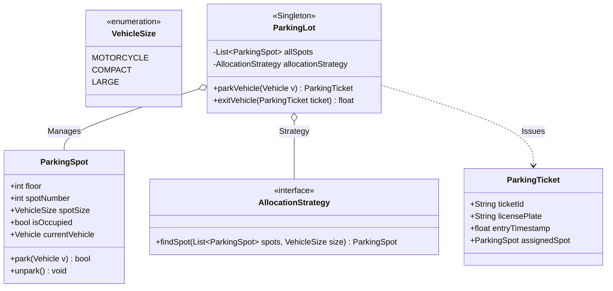

# LLD Case Study 5: Multi-Floor Parking Lot System

> **Target Patterns:** Singleton Pattern, Factory Pattern, Strategy Pattern  
> **Key Engineering Focus:** Multi-level spatial modeling, spot allocation algorithms, dynamic fee calculation, and thread-safe entry/exit gates.

---

## 1. Problem Statement & Functional Requirements

Design an automated multi-floor commercial parking lot management system.

### Requirements:
1. **Singleton Architecture:** The physical parking lot configuration is a system-wide Singleton.
2. **Vehicle & Spot Hierarchies (Factory Pattern):** Supports Motorcycles, Cars, and Heavy Trucks fitting into Motorcycle, Compact, and Large spots respectively.
3. **Spot Allocation Policy (Strategy Pattern):** Pluggable algorithms for spot assignment (e.g. Nearest to Entrance, Lowest Floor First).
4. **Automated Ticketing & Billing (Strategy Pattern):** Issue timestamped tickets at entry gates and compute fees at exit based on duration and vehicle size multipliers.

---

## 2. Architecture & UML Class Diagram



---

## 3. Production-Grade Python Implementation

```python
import time
import uuid
import threading
from enum import Enum, auto
from abc import ABC, abstractmethod
from typing import List, Optional, Dict

# --- Enums & Models ---
class VehicleSize(Enum):
    MOTORCYCLE = 1
    COMPACT = 2
    LARGE = 3

class Vehicle:
    def __init__(self, license_plate: str, size: VehicleSize):
        self.license_plate = license_plate
        self.size = size

class ParkingSpot:
    def __init__(self, floor: int, spot_id: int, size: VehicleSize):
        self.floor = floor
        self.spot_id = spot_id
        self.size = size
        self.is_occupied = False
        self.parked_vehicle: Optional[Vehicle] = None
        self.lock = threading.Lock()

    def can_fit(self, vehicle: Vehicle) -> bool:
        # A smaller vehicle can fit in a larger spot if needed
        return not self.is_occupied and self.size.value >= vehicle.size.value

    def park(self, vehicle: Vehicle) -> bool:
        with self.lock:
            if not self.can_fit(vehicle):
                return False
            self.is_occupied = True
            self.parked_vehicle = vehicle
            return True

    def unpark(self) -> None:
        with self.lock:
            self.is_occupied = False
            self.parked_vehicle = None

# --- Strategy Pattern: Spot Allocation ---
class SpotAllocationStrategy(ABC):
    @abstractmethod
    def find_spot(self, spots: List[ParkingSpot], vehicle: Vehicle) -> Optional[ParkingSpot]:
        pass

class LowestFloorFirstStrategy(SpotAllocationStrategy):
    """Prefers lowest floor and lowest spot ID first."""
    def find_spot(self, spots: List[ParkingSpot], vehicle: Vehicle) -> Optional[ParkingSpot]:
        eligible = [s for s in spots if s.can_fit(vehicle)]
        if not eligible:
            return None
        # Sort by floor asc, then best size fit (avoid wasting large spots for bikes)
        return min(eligible, key=lambda s: (s.floor, s.size.value, s.spot_id))

# --- Parking Ticket ---
class ParkingTicket:
    def __init__(self, vehicle: Vehicle, spot: ParkingSpot):
        self.ticket_id = str(uuid.uuid4())[:8]
        self.license_plate = vehicle.license_plate
        self.spot = spot
        self.entry_time = time.monotonic()

# --- Singleton Parking Lot ---
class ParkingLot:
    _instance = None
    _lock = threading.Lock()

    @classmethod
    def get_instance(cls, spots: Optional[List[ParkingSpot]] = None):
        if cls._instance is None:
            with cls._lock:
                if cls._instance is None:
                    cls._instance = cls(spots or [])
        return cls._instance

    def __init__(self, spots: List[ParkingSpot]):
        if ParkingLot._instance is not None:
            raise RuntimeError("Cannot instantiate Singleton directly! Use get_instance().")
        self.spots = spots
        self.allocation_strategy: SpotAllocationStrategy = LowestFloorFirstStrategy()
        self.active_tickets: Dict[str, ParkingTicket] = {}
        self.hourly_rate = 5.0

    def park_vehicle(self, vehicle: Vehicle) -> Optional[ParkingTicket]:
        spot = self.allocation_strategy.find_spot(self.spots, vehicle)
        if not spot:
            print(f"[Parking Lot] Full! No eligible spot for vehicle {vehicle.license_plate}")
            return None
        
        if spot.park(vehicle):
            ticket = ParkingTicket(vehicle, spot)
            self.active_tickets[ticket.ticket_id] = ticket
            print(f"[Entry] Parked {vehicle.license_plate} on Floor {spot.floor}, Spot #{spot.spot_id}")
            return ticket
        return None

    def exit_vehicle(self, ticket_id: str) -> float:
        ticket = self.active_tickets.pop(ticket_id, None)
        if not ticket:
            raise ValueError("Invalid ticket ID")

        duration_hours = max(1.0, (time.monotonic() - ticket.entry_time) / 3600.0) # Min 1 hour
        total_fee = duration_hours * self.hourly_rate * ticket.spot.size.value
        
        ticket.spot.unpark()
        print(f"[Exit] Vehicle {ticket.license_plate} departed. Total Fee: ${total_fee:.2f}")
        return total_fee

# --- Verification Driver ---
if __name__ == "__main__":
    # Setup test floor layout
    initial_spots = [
        ParkingSpot(floor=1, spot_id=101, size=VehicleSize.MOTORCYCLE),
        ParkingSpot(floor=1, spot_id=102, size=VehicleSize.COMPACT),
        ParkingSpot(floor=2, spot_id=201, size=VehicleSize.LARGE),
    ]

    lot = ParkingLot.get_instance(initial_spots)

    car = Vehicle("KA-01-AB-1234", VehicleSize.COMPACT)
    ticket = lot.park_vehicle(car)

    # Process exit
    if ticket:
        lot.exit_vehicle(ticket.ticket_id)
```
