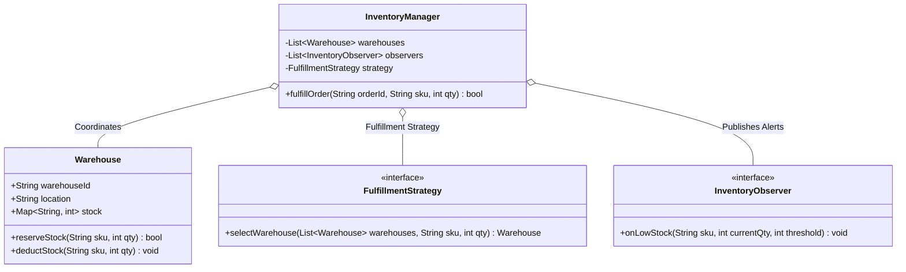

# LLD Case Study 6: Distributed Inventory Management System

> **Target Patterns:** Observer Pattern, Strategy Pattern, State Pattern  
> **Key Engineering Focus:** Stock level invariants, multi-warehouse fulfillment strategies, automatic replenishment alerts, and order lifecycle states.

---

## 1. Problem Statement & Functional Requirements

Design an enterprise inventory management backend supporting multi-warehouse fulfillment and low-stock alerts.

### Requirements:
1. **Multi-Warehouse Fulfillment (Strategy Pattern):** Route orders to warehouses based on customizable strategies (e.g. Nearest Warehouse First vs Consolidate into Single Shipment).
2. **Low Stock Alerts (Observer Pattern):** When stock for a SKU drops below its threshold, automatically trigger replenishment purchase orders.
3. **Order Inventory State Machine (State Pattern):** Orders transition from `Draft` $\rightarrow$ `StockReserved` $\rightarrow$ `Dispatched` $\rightarrow$ `Delivered` (or `Released` if canceled).
4. **Thread-Safe Inventory Mutations:** Prevent overselling under high concurrency.

---

## 2. Architecture & UML Class Diagram



---

## 3. Production-Grade Python Implementation

```python
import threading
from abc import ABC, abstractmethod
from typing import Dict, List, Optional

# --- Observer Pattern: Replenishment Alerting ---
class StockAlertObserver(ABC):
    @abstractmethod
    def on_low_stock(self, warehouse_id: str, sku: str, current_quantity: int) -> None:
        pass

class ProcurementAlertService(StockAlertObserver):
    def on_low_stock(self, warehouse_id: str, sku: str, current_quantity: int) -> None:
        print(f"[Procurement Alert] Warehouse '{warehouse_id}': SKU '{sku}' low stock ({current_quantity} remaining)! Auto-generating PO.")

# --- Warehouse Entity ---
class Warehouse:
    def __init__(self, warehouse_id: str, city: str):
        self.warehouse_id = warehouse_id
        self.city = city
        self.inventory: Dict[str, int] = {}
        self.thresholds: Dict[str, int] = {}
        self.lock = threading.Lock()

    def set_stock(self, sku: str, quantity: int, threshold: int = 10):
        with self.lock:
            self.inventory[sku] = quantity
            self.thresholds[sku] = threshold

    def get_stock(self, sku: str) -> int:
        with self.lock:
            return self.inventory.get(sku, 0)

    def deduct(self, sku: str, quantity: int) -> tuple[bool, int]:
        with self.lock:
            available = self.inventory.get(sku, 0)
            if available < quantity:
                return False, available
            self.inventory[sku] = available - quantity
            return True, self.inventory[sku]

# --- Strategy Pattern: Fulfillment Routing ---
class FulfillmentStrategy(ABC):
    @abstractmethod
    def pick_warehouse(self, warehouses: List[Warehouse], customer_city: str, sku: str, qty: int) -> Optional[Warehouse]:
        pass

class NearestWarehouseStrategy(FulfillmentStrategy):
    def pick_warehouse(self, warehouses: List[Warehouse], customer_city: str, sku: str, qty: int) -> Optional[Warehouse]:
        # Filter warehouses that hold sufficient inventory
        capable = [w for w in warehouses if w.get_stock(sku) >= qty]
        if not capable:
            return None
        # Prioritize exact city match, otherwise first capable
        exact_match = next((w for w in capable if w.city.lower() == customer_city.lower()), None)
        return exact_match or capable[0]

# --- Inventory Central Manager ---
class InventoryManager:
    def __init__(self, strategy: FulfillmentStrategy):
        self.warehouses: List[Warehouse] = []
        self.strategy = strategy
        self.observers: List[StockAlertObserver] = []

    def add_warehouse(self, w: Warehouse):
        self.warehouses.append(w)

    def register_observer(self, obs: StockAlertObserver):
        self.observers.append(obs)

    def fulfill_order(self, customer_city: str, sku: str, qty: int) -> bool:
        warehouse = self.strategy.pick_warehouse(self.warehouses, customer_city, sku, qty)
        if not warehouse:
            print(f"[Fulfillment Error] Out of stock for SKU '{sku}' across all warehouses!")
            return False

        success, remaining = warehouse.deduct(sku, qty)
        if not success:
            return False

        print(f"[Fulfillment Success] Dispatched {qty} of '{sku}' from {warehouse.warehouse_id} ({warehouse.city}). Remaining: {remaining}")

        # Check threshold trigger
        if remaining <= warehouse.thresholds.get(sku, 10):
            for obs in self.observers:
                obs.on_low_stock(warehouse.warehouse_id, sku, remaining)
        return True

# --- Verification Driver ---
if __name__ == "__main__":
    manager = InventoryManager(strategy=NearestWarehouseStrategy())
    manager.register_observer(ProcurementAlertService())

    # Setup warehouses
    w_sf = Warehouse("WH-01", "San Francisco")
    w_sf.set_stock("MACBOOK-PRO-16", quantity=12, threshold=5)

    w_ny = Warehouse("WH-02", "New York")
    w_ny.set_stock("MACBOOK-PRO-16", quantity=25, threshold=5)

    manager.add_warehouse(w_sf)
    manager.add_warehouse(w_ny)

    # Order in SF: Should route to WH-01
    manager.fulfill_order(customer_city="San Francisco", sku="MACBOOK-PRO-16", qty=8)
    # Remaining in SF is 4 (triggers low stock observer!)
```
