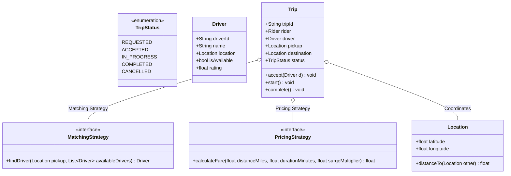

# LLD Case Study 7: Ride Sharing Application (Uber / Lyft)

> **Target Patterns:** Strategy Pattern, Observer Pattern, State Pattern, Pricing Calculations  
> **Key Engineering Focus:** Driver-rider matching heuristics, dynamic surge fare calculation, spatial coordinates, and trip lifecycle states.

---

## 1. Problem Statement & Functional Requirements

Design the core matching and trip dispatch engine for an on-demand ride sharing service.

### Requirements:
1. **Driver Matching Policy (Strategy Pattern):** Pluggable driver matching (e.g. Nearest Driver vs Top-Rated Driver).
2. **Fare Calculation Engine (Strategy Pattern):** Dynamic fare calculation combining base fare, distance traveled, trip duration, and real-time surge multiplier.
3. **Trip State Machine (State Pattern):** Trip progresses through `REQUESTED` $\rightarrow$ `ACCEPTED` $\rightarrow$ `DRIVER_ARRIVED` $\rightarrow$ `IN_PROGRESS` $\rightarrow$ `COMPLETED`.
4. **Real-Time Notification (Observer Pattern):** Broadcast state changes to Rider and Driver interfaces instantly.

---

## 2. Architecture & UML Class Diagram



---

## 3. Production-Grade Python Implementation

```python
import math
import uuid
from enum import Enum, auto
from abc import ABC, abstractmethod
from typing import List, Optional

# --- Spatial Coordinate Model ---
class Location:
    def __init__(self, lat: float, lon: float):
        self.lat = lat
        self.lon = lon

    def distance_to(self, other: "Location") -> float:
        """Euclidean distance approximation in miles."""
        dx = (self.lat - other.lat) * 69.0
        dy = (self.lon - other.lon) * 55.0
        return math.hypot(dx, dy)

# --- Actor Models ---
class Driver:
    def __init__(self, driver_id: str, name: str, location: Location, rating: float = 4.8):
        self.driver_id = driver_id
        self.name = name
        self.location = location
        self.rating = rating
        self.is_available = True

class Rider:
    def __init__(self, rider_id: str, name: str):
        self.rider_id = rider_id
        self.name = name

# --- Strategy Pattern: Driver Matching ---
class MatchingStrategy(ABC):
    @abstractmethod
    def match_driver(self, pickup: Location, drivers: List[Driver]) -> Optional[Driver]:
        pass

class NearestDriverStrategy(MatchingStrategy):
    def match_driver(self, pickup: Location, drivers: List[Driver]) -> Optional[Driver]:
        available = [d for d in drivers if d.is_available]
        if not available:
            return None
        return min(available, key=lambda d: d.location.distance_to(pickup))

# --- Strategy Pattern: Pricing Calculation ---
class PricingStrategy(ABC):
    @abstractmethod
    def calculate_fare(self, distance_miles: float, duration_mins: float, surge: float) -> float:
        pass

class StandardPricingStrategy(PricingStrategy):
    BASE_FARE = 2.50
    PER_MILE = 1.75
    PER_MINUTE = 0.35

    def calculate_fare(self, distance_miles: float, duration_mins: float, surge: float) -> float:
        raw = self.BASE_FARE + (distance_miles * self.PER_MILE) + (duration_mins * self.PER_MINUTE)
        return max(5.0, raw * surge) # Min fare $5.00

# --- State Pattern & Trip Orchestration ---
class TripStatus(Enum):
    REQUESTED = auto()
    ACCEPTED = auto()
    IN_PROGRESS = auto()
    COMPLETED = auto()

class Trip:
    def __init__(self, rider: Rider, pickup: Location, destination: Location, pricing: PricingStrategy):
        self.trip_id = str(uuid.uuid4())[:8]
        self.rider = rider
        self.pickup = pickup
        self.destination = destination
        self.pricing = pricing
        self.driver: Optional[Driver] = None
        self.status = TripStatus.REQUESTED
        self.surge_multiplier = 1.2

    def assign_driver(self, driver: Driver) -> None:
        self.driver = driver
        self.driver.is_available = False
        self.status = TripStatus.ACCEPTED
        print(f"[Trip {self.trip_id}] Driver '{driver.name}' assigned to Rider '{self.rider.name}'")

    def start_trip(self) -> None:
        self.status = TripStatus.IN_PROGRESS
        print(f"[Trip {self.trip_id}] In progress...")

    def complete_trip(self, actual_duration_mins: float) -> float:
        self.status = TripStatus.COMPLETED
        self.driver.is_available = True
        
        distance = self.pickup.distance_to(self.destination)
        total_fare = self.pricing.calculate_fare(distance, actual_duration_mins, self.surge_multiplier)
        
        print(f"[Trip {self.trip_id}] Finished! Distance: {distance:.1f} mi | Duration: {actual_duration_mins:.0f} mins | Total: ${total_fare:.2f}")
        return total_fare

# --- Verification Driver ---
if __name__ == "__main__":
    rider_alice = Rider("R1", "Alice")
    drivers_fleet = [
        Driver("D1", "Bob", Location(37.7749, -122.4194), rating=4.9),  # SF Downtown
        Driver("D2", "Charlie", Location(37.7833, -122.4167), rating=4.7), # SF SOMA
    ]

    pickup_loc = Location(37.7752, -122.4180)
    dest_loc = Location(37.8044, -122.2712) # Oakland

    matcher = NearestDriverStrategy()
    selected_driver = matcher.match_driver(pickup_loc, drivers_fleet)

    trip = Trip(rider_alice, pickup_loc, dest_loc, StandardPricingStrategy())
    if selected_driver:
        trip.assign_driver(selected_driver)
        trip.start_trip()
        trip.complete_trip(actual_duration_mins=25.0)
```


---

## 4. Edge Cases, Tests and Extensions

### Review of the model

| Concern | Status | Detail |
| :--- | :--- | :--- |
| Matching and pricing as strategies | Good | Swap nearest-driver for rating-weighted matching without touching `Trip` |
| Distance formula | Approximate | `69 miles per degree of latitude` is right everywhere; `55 miles per degree of longitude` is only right near 37 degrees latitude. Use the haversine formula in production |
| Same driver matched twice | **Bug** | `assign_driver` does not check `is_available`, and matching is not atomic, so two simultaneous requests can get one driver |
| Illegal transitions | **Bug** | `complete_trip()` on a `REQUESTED` trip crashes with `AttributeError` because `driver` is `None` |
| Surge | Hard-coded 1.2 | Should come from a demand service per zone and be locked in when the rider accepts the quote |
| Searching all drivers | O(n) per request | Use a geospatial index (grid cells, geohash or quadtree) |

### Tests: matching, fares, the double assignment, the state guard

This block extends the implementation above.

```python
# continues: ride sharing implementation above
import io, contextlib, threading

def quiet(fn, *a):
    with contextlib.redirect_stdout(io.StringIO()):
        return fn(*a)

def close(a, b): return abs(a - b) < 1e-6

assert close(Location(0, 0).distance_to(Location(1, 0)), 69.0)

d1 = Driver("d1", "Near", Location(37.77, -122.41))
d2 = Driver("d2", "Far", Location(37.80, -122.40))
pickup = Location(37.78, -122.41)
assert NearestDriverStrategy().match_driver(pickup, [d2, d1]) is d1
d1.is_available = False
assert NearestDriverStrategy().match_driver(pickup, [d1, d2]) is d2        # skips unavailable drivers
assert NearestDriverStrategy().match_driver(pickup, []) is None

std = StandardPricingStrategy()
assert close(std.calculate_fare(10.0, 20, 1.2), (2.5 + 17.5 + 7.0) * 1.2)
assert std.calculate_fare(0.1, 1, 1.0) == 5.0                              # minimum fare

# Bug: two trips accept the same driver
drv = Driver("d9", "Solo", Location(0, 0))
t1 = Trip(Rider("r1", "A"), Location(0, 0), Location(0.1, 0), std)
t2 = Trip(Rider("r2", "B"), Location(0, 0), Location(0.1, 0), std)
quiet(t1.assign_driver, drv); quiet(t2.assign_driver, drv)
assert t1.driver is t2.driver                                              # accepted twice

# Bug: completing a trip that never had a driver
t3 = Trip(Rider("r3", "C"), Location(0, 0), Location(0.1, 0), std)
try:
    quiet(t3.complete_trip, 5)
    raise AssertionError("expected AttributeError")
except AttributeError:
    pass

# Fix 1: one owner makes match-and-assign atomic
class Dispatcher:
    def __init__(self, strategy, drivers):
        self.strategy, self.drivers, self._lock = strategy, drivers, threading.Lock()

    def request(self, trip):
        with self._lock:
            driver = self.strategy.match_driver(trip.pickup, self.drivers)
            if driver is None:
                return None
            quiet(trip.assign_driver, driver)
            return driver

drivers = [Driver(f"d{i}", f"D{i}", Location(0.001 * i, 0)) for i in range(3)]
disp, got = Dispatcher(NearestDriverStrategy(), drivers), []
trips = [Trip(Rider(f"r{i}", f"R{i}"), Location(0, 0), Location(0.1, 0), std) for i in range(8)]
ts = [threading.Thread(target=lambda t=t: got.append(disp.request(t))) for t in trips]
[t.start() for t in ts]; [t.join() for t in ts]
assigned = [g for g in got if g is not None]
assert len(assigned) == 3 and len({id(g) for g in assigned}) == 3          # three drivers, three distinct assignments

# Fix 2: an explicit transition table
class GuardedTrip(Trip):
    ALLOWED = {TripStatus.REQUESTED: {TripStatus.ACCEPTED}, TripStatus.ACCEPTED: {TripStatus.IN_PROGRESS},
               TripStatus.IN_PROGRESS: {TripStatus.COMPLETED}, TripStatus.COMPLETED: set()}
    def _go(self, target):
        if target not in self.ALLOWED[self.status]:
            raise ValueError(f"illegal transition {self.status.name} -> {target.name}")
    def assign_driver(self, driver):
        self._go(TripStatus.ACCEPTED); super().assign_driver(driver)
    def start_trip(self):
        self._go(TripStatus.IN_PROGRESS); super().start_trip()
    def complete_trip(self, mins):
        self._go(TripStatus.COMPLETED); return super().complete_trip(mins)

g = GuardedTrip(Rider("r", "R"), Location(0, 0), Location(0.1, 0), std)
try:
    g.complete_trip(5)
    raise AssertionError("expected ValueError")
except ValueError:
    pass
print("ride sharing tests passed")
```

### Extensions interviewers ask for

1. **Geospatial index:** bucket drivers into grid cells (for example 1 km squares); a request searches its own cell and the eight neighbours, expanding outward only when empty. That turns O(drivers) into O(drivers in a few cells).
2. **Offer and timeout:** do not force-assign. Send the request to the best driver, wait for accept or timeout, then offer the next; this needs an `OFFERED` state and a timer.
3. **Pooled rides:** matching becomes a route-insertion problem; keep the same `MatchingStrategy` interface but return a driver plus the updated route.
4. **Fare integrity:** persist the quote (distance estimate, surge, strategy name) on the trip when it is accepted so a later pricing change cannot alter an in-flight fare.

### Follow-up questions

- *Why is `is_available` alone not enough to prevent double assignment?* Check and set are two steps; without a lock or an atomic compare-and-set, two requests can both observe `True`.
- *Where should the dispatcher state live at scale?* Partition drivers by geographic cell and run one single-writer dispatcher per partition, which removes the global lock without losing atomicity inside a cell.
- *How do you keep driver locations fresh?* Drivers push a ping every few seconds to an in-memory store with a TTL; a driver without a recent ping is treated as unavailable.
