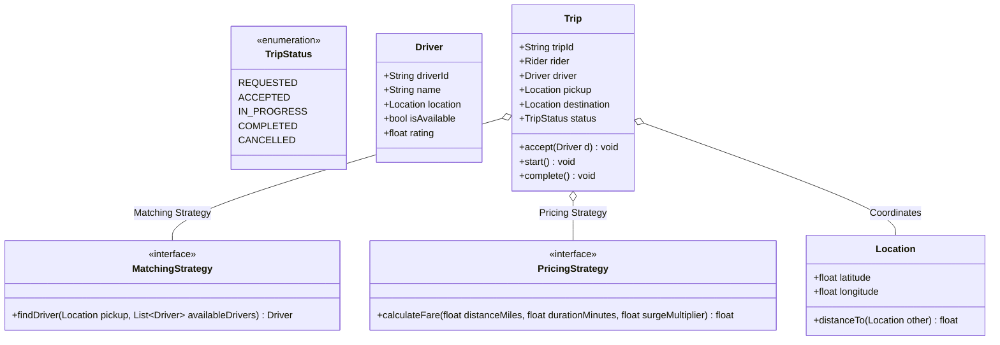

# LLD Case Study 7: Ride Sharing Application (Uber / Lyft)

> **Target Patterns:** Strategy Pattern, Observer Pattern, State Pattern, Pricing Calculations  
> **Key Engineering Focus:** Driver-rider matching heuristics, dynamic surge fare calculation, spatial coordinates, and trip lifecycle states.

---

## 1. Problem Statement & Functional Requirements

Design the core matching and trip dispatch engine for an on-demand ride sharing service.

### Requirements:
1. **Driver Matching Policy (Strategy Pattern):** Pluggable driver matching (e.g. Nearest Driver vs Top-Rated Driver).
2. **Fare Calculation Engine (Strategy Pattern):** Dynamic fare calculation combining base fare, distance traveled, trip duration, and real-time surge multiplier.
3. **Trip State Machine (State Pattern):** Trip progresses through `REQUESTED` $\rightarrow$ `ACCEPTED` $\rightarrow$ `DRIVER_ARRIVED` $\rightarrow$ `IN_PROGRESS` $\rightarrow$ `COMPLETED`.
4. **Real-Time Notification (Observer Pattern):** Broadcast state changes to Rider and Driver interfaces instantly.

---

## 2. Architecture & UML Class Diagram



---

## 3. Production-Grade Python Implementation

```python
import math
import uuid
from enum import Enum, auto
from abc import ABC, abstractmethod
from typing import List, Optional

# --- Spatial Coordinate Model ---
class Location:
    def __init__(self, lat: float, lon: float):
        self.lat = lat
        self.lon = lon

    def distance_to(self, other: "Location") -> float:
        """Euclidean distance approximation in miles."""
        dx = (self.lat - other.lat) * 69.0
        dy = (self.lon - other.lon) * 55.0
        return math.hypot(dx, dy)

# --- Actor Models ---
class Driver:
    def __init__(self, driver_id: str, name: str, location: Location, rating: float = 4.8):
        self.driver_id = driver_id
        self.name = name
        self.location = location
        self.rating = rating
        self.is_available = True

class Rider:
    def __init__(self, rider_id: str, name: str):
        self.rider_id = rider_id
        self.name = name

# --- Strategy Pattern: Driver Matching ---
class MatchingStrategy(ABC):
    @abstractmethod
    def match_driver(self, pickup: Location, drivers: List[Driver]) -> Optional[Driver]:
        pass

class NearestDriverStrategy(MatchingStrategy):
    def match_driver(self, pickup: Location, drivers: List[Driver]) -> Optional[Driver]:
        available = [d for d in drivers if d.is_available]
        if not available:
            return None
        return min(available, key=lambda d: d.location.distance_to(pickup))

# --- Strategy Pattern: Pricing Calculation ---
class PricingStrategy(ABC):
    @abstractmethod
    def calculate_fare(self, distance_miles: float, duration_mins: float, surge: float) -> float:
        pass

class StandardPricingStrategy(PricingStrategy):
    BASE_FARE = 2.50
    PER_MILE = 1.75
    PER_MINUTE = 0.35

    def calculate_fare(self, distance_miles: float, duration_mins: float, surge: float) -> float:
        raw = self.BASE_FARE + (distance_miles * self.PER_MILE) + (duration_mins * self.PER_MINUTE)
        return max(5.0, raw * surge) # Min fare $5.00

# --- State Pattern & Trip Orchestration ---
class TripStatus(Enum):
    REQUESTED = auto()
    ACCEPTED = auto()
    IN_PROGRESS = auto()
    COMPLETED = auto()

class Trip:
    def __init__(self, rider: Rider, pickup: Location, destination: Location, pricing: PricingStrategy):
        self.trip_id = str(uuid.uuid4())[:8]
        self.rider = rider
        self.pickup = pickup
        self.destination = destination
        self.pricing = pricing
        self.driver: Optional[Driver] = None
        self.status = TripStatus.REQUESTED
        self.surge_multiplier = 1.2

    def assign_driver(self, driver: Driver) -> None:
        self.driver = driver
        self.driver.is_available = False
        self.status = TripStatus.ACCEPTED
        print(f"[Trip {self.trip_id}] Driver '{driver.name}' assigned to Rider '{self.rider.name}'")

    def start_trip(self) -> None:
        self.status = TripStatus.IN_PROGRESS
        print(f"[Trip {self.trip_id}] In progress...")

    def complete_trip(self, actual_duration_mins: float) -> float:
        self.status = TripStatus.COMPLETED
        self.driver.is_available = True
        
        distance = self.pickup.distance_to(self.destination)
        total_fare = self.pricing.calculate_fare(distance, actual_duration_mins, self.surge_multiplier)
        
        print(f"[Trip {self.trip_id}] Finished! Distance: {distance:.1f} mi | Duration: {actual_duration_mins:.0f} mins | Total: ${total_fare:.2f}")
        return total_fare

# --- Verification Driver ---
if __name__ == "__main__":
    rider_alice = Rider("R1", "Alice")
    drivers_fleet = [
        Driver("D1", "Bob", Location(37.7749, -122.4194), rating=4.9),  # SF Downtown
        Driver("D2", "Charlie", Location(37.7833, -122.4167), rating=4.7), # SF SOMA
    ]

    pickup_loc = Location(37.7752, -122.4180)
    dest_loc = Location(37.8044, -122.2712) # Oakland

    matcher = NearestDriverStrategy()
    selected_driver = matcher.match_driver(pickup_loc, drivers_fleet)

    trip = Trip(rider_alice, pickup_loc, dest_loc, StandardPricingStrategy())
    if selected_driver:
        trip.assign_driver(selected_driver)
        trip.start_trip()
        trip.complete_trip(actual_duration_mins=25.0)
```
