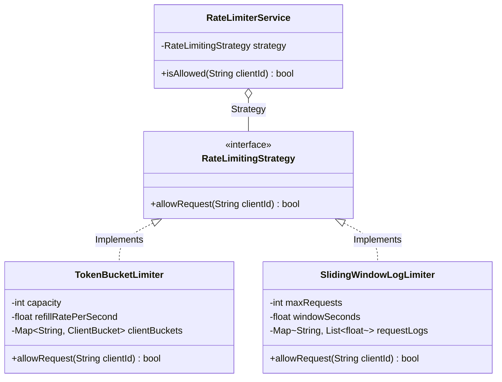

# LLD Case Study 8: In-Memory API Rate Limiter

> **Target Patterns:** Strategy Pattern, Encapsulation, State Synchronization  
> **Key Engineering Focus:** High-throughput rate-limiting algorithms: Token Bucket, Leaky Bucket, and Sliding Window Log with thread-safe client isolation.

---

## 1. Problem Statement & Functional Requirements

Design an API rate limiter capable of protecting backend microservices from Denial-of-Service (DoS) attacks, brute-force requests, and resource starvation.

### Requirements:
1. **Pluggable Algorithms (Strategy Pattern):** Easily interchange between **Token Bucket**, **Leaky Bucket**, and **Sliding Window Log**.
2. **Client Isolation:** Maintain independent rate limits per Client ID / IP address.
3. **Thread-Safety:** Atomic token consumption under high concurrent request volume.
4. **Instant Evaluation:** Must execute in under 1 millisecond ($O(1)$ time complexity).

---

## 2. Algorithm Comparison & Trade-Offs

| Algorithm | Memory Consumption | Burst Handling | Accuracy | Use Case |
| :--- | :--- | :--- | :--- | :--- |
| **Token Bucket** | $O(1)$ per client | Supports bursts up to bucket capacity | High | General API Gateways (Stripe, GitHub) |
| **Leaky Bucket** | $O(\text{Capacity})$ buffer | Enforces smooth, fixed outflow rate | High | Egress traffic shaping |
| **Sliding Window Log** | $O(N)$ requests in window | Accurate without boundary resets | $100\%$ Exact | Strict financial APIs |



---

## 3. Production-Grade Python Implementation

```python
import time
import threading
from abc import ABC, abstractmethod
from typing import Dict, List
from collections import deque

# --- Strategy Interface ---
class RateLimitingStrategy(ABC):
    @abstractmethod
    def allow_request(self, client_id: str) -> bool:
        pass

# --- Algorithm 1: Token Bucket ---
class TokenBucketLimiter(RateLimitingStrategy):
    class Bucket:
        def __init__(self, capacity: int, refill_rate: float):
            self.capacity = capacity
            self.refill_rate = refill_rate
            self.tokens = float(capacity)
            self.last_refill = time.monotonic()
            self.lock = threading.Lock()

        def consume(self) -> bool:
            with self.lock:
                now = time.monotonic()
                elapsed = now - self.last_refill
                self.last_refill = now
                
                # Refill tokens proportionally to elapsed seconds
                self.tokens = min(float(self.capacity), self.tokens + (elapsed * self.refill_rate))
                
                if self.tokens >= 1.0:
                    self.tokens -= 1.0
                    return True
                return False

    def __init__(self, capacity: int, refill_rate_per_sec: float):
        self.capacity = capacity
        self.refill_rate = refill_rate_per_sec
        self.buckets: Dict[str, TokenBucketLimiter.Bucket] = {}
        self._global_lock = threading.Lock()

    def _get_bucket(self, client_id: str) -> Bucket:
        with self._global_lock:
            if client_id not in self.buckets:
                self.buckets[client_id] = self.Bucket(self.capacity, self.refill_rate)
            return self.buckets[client_id]

    def allow_request(self, client_id: str) -> bool:
        return self._get_bucket(client_id).consume()

# --- Algorithm 2: Sliding Window Log ---
class SlidingWindowLogLimiter(RateLimitingStrategy):
    class Log:
        def __init__(self):
            self.timestamps = deque()
            self.lock = threading.Lock()

    def __init__(self, max_requests: int, window_seconds: float):
        self.max_requests = max_requests
        self.window_seconds = window_seconds
        self.logs: Dict[str, SlidingWindowLogLimiter.Log] = {}
        self._global_lock = threading.Lock()

    def _get_log(self, client_id: str) -> Log:
        with self._global_lock:
            if client_id not in self.logs:
                self.logs[client_id] = self.Log()
            return self.logs[client_id]

    def allow_request(self, client_id: str) -> bool:
        client_log = self._get_log(client_id)
        now = time.monotonic()
        threshold = now - self.window_seconds

        with client_log.lock:
            # Evict timestamps outside active sliding window
            while client_log.timestamps and client_log.timestamps[0] <= threshold:
                client_log.timestamps.popleft()

            if len(client_log.timestamps) < self.max_requests:
                client_log.timestamps.append(now)
                return True
            return False

# --- Context Service ---
class RateLimiterService:
    def __init__(self, strategy: RateLimitingStrategy):
        self.strategy = strategy

    def process_request(self, client_id: str) -> bool:
        allowed = self.strategy.allow_request(client_id)
        status = "ALLOWED" if allowed else "BLOCKED (429 Too Many Requests)"
        print(f"[RateLimiter] Client '{client_id}': {status}")
        return allowed

# --- Verification Driver ---
if __name__ == "__main__":
    # Test Token Bucket: Capacity = 3, Refill = 1 token/sec
    limiter = RateLimiterService(TokenBucketLimiter(capacity=3, refill_rate_per_sec=1.0))

    client = "client_ip_192.168.1.100"
    for i in range(5):
        limiter.process_request(client)

    print("\nSleeping 1.5 seconds for token refill...")
    time.sleep(1.5)
    limiter.process_request(client)
```


---

## 4. Edge Cases, Tests and Extensions

### Edge cases the code above handles, and the ones it does not

| Case | What happens today | What a production system does |
| :--- | :--- | :--- |
| Clock jumps (NTP step, VM pause) | Safe: `time.monotonic()` never goes backwards | Never use `time.time()` for elapsed time |
| Refill after a long idle period | `min(capacity, ...)` caps the bucket, so no hoarded burst | Same cap; document the burst size to clients |
| Two threads, same client | Per-bucket lock makes consume atomic | Same, or an atomic Redis Lua script when distributed |
| Millions of one-off client IDs | **Leak**: `buckets` grows forever | Evict buckets idle longer than `capacity / refill_rate` seconds (a full bucket is indistinguishable from a new one) |
| Several app servers | **Each keeps its own count**, so the real limit is `N x limit` | Central store (Redis `EVALSHA`) or sticky routing by client key |
| Rejected request | Returns `False` only | Return `Retry-After` computed from the refill rate |

### Deterministic tests (no sleeping)

Real sleeps make rate-limiter tests slow and flaky. Patch the clock instead. This block extends the implementation above and runs as is.

```python
# continues: rate limiter implementation above
from unittest import mock

clock = [0.0]
with mock.patch("time.monotonic", lambda: clock[0]):
    tb = TokenBucketLimiter(capacity=3, refill_rate_per_sec=1.0)
    assert [tb.allow_request("a") for _ in range(5)] == [True, True, True, False, False]
    assert tb.allow_request("b") is True                 # clients are isolated
    clock[0] = 1.0
    assert tb.allow_request("a") is True and tb.allow_request("a") is False   # exactly one token refilled
    clock[0] = 1000.0                                    # long idle: the bucket is capped, not hoarded
    assert [tb.allow_request("a") for _ in range(4)] == [True, True, True, False]

    clock[0] = 0.0
    sw = SlidingWindowLogLimiter(max_requests=2, window_seconds=10)
    assert sw.allow_request("c") and (clock.__setitem__(0, 1.0) or sw.allow_request("c"))
    clock[0] = 2.0
    assert sw.allow_request("c") is False
    clock[0] = 10.0                                      # the t=0 request has just left the window
    assert sw.allow_request("c") is True

# Atomicity under real threads: 100 racing requests, exactly 50 tokens, no refill
import threading
tb2 = TokenBucketLimiter(capacity=50, refill_rate_per_sec=0.0)
results = []
threads = [threading.Thread(target=lambda: results.append(tb2.allow_request("x"))) for _ in range(100)]
[t.start() for t in threads]; [t.join() for t in threads]
assert sum(results) == 50
print("rate limiter tests passed")
```

### Extensions interviewers ask for

1. **Tiered limits (free vs paid):** make the strategy factory take a plan, keep one limiter per plan, and key buckets by `(plan, client_id)`.
2. **Return remaining quota and `Retry-After`:** `consume()` already knows `tokens`; return `(allowed, tokens_left, seconds_until_next_token)` and map it to `X-RateLimit-*` headers.
3. **Distributed version:** move the bucket state to Redis and run the refill-and-consume as one Lua script so it stays atomic; fail open or closed on Redis outage depending on whether you protect a backend (fail closed) or user experience (fail open).
4. **Sliding window counter:** keep two fixed-window counters and weight the previous one; this approximates the log's accuracy at O(1) memory.

### Follow-up questions

- *Why is a token bucket allowed to burst while a leaky bucket is not?* The bucket stores unused capacity as tokens, so an idle client can spend `capacity` requests at once. A leaky bucket drains at a fixed rate regardless of history.
- *What is the memory cost of the sliding window log at 10,000 requests per client per window?* One timestamp per request, so about 10,000 floats per client; that is why high-volume APIs use the counter approximation.
- *Where would you put the limiter: client, gateway or service?* At the gateway for coarse protection, plus a per-service limiter for resources only that service knows are expensive; never rely on the client.
