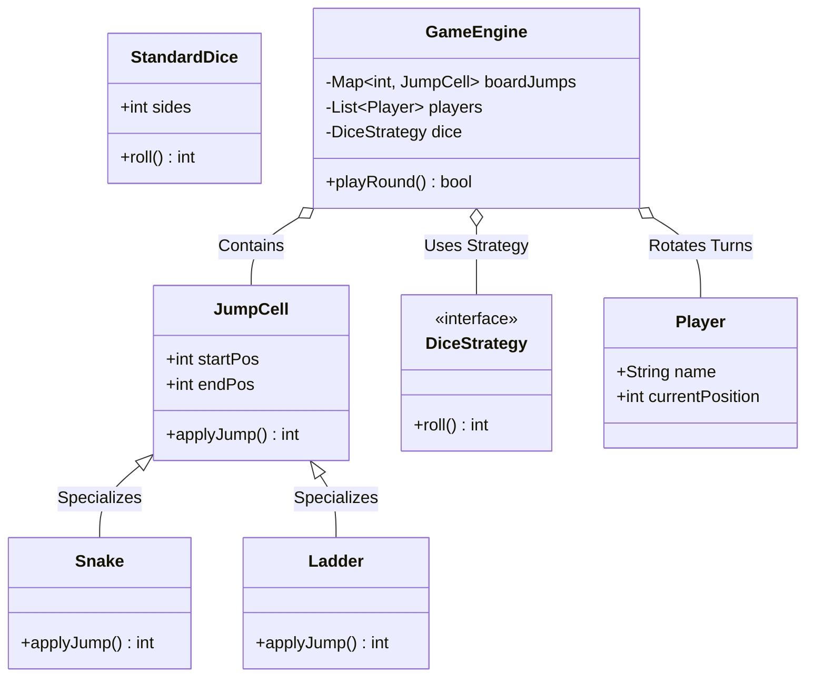

# LLD Case Study 9: Snake and Ladders Game

> **Target Patterns:** Factory Pattern, Strategy Pattern, State Machine  
> **Key Engineering Focus:** Modular board layout, jump cell behaviors (Snakes vs Ladders), deterministic dice strategies, and multi-player game loops.

---

## 1. Problem Statement & Functional Requirements

Design a modular, extensible Snake and Ladders board game.

### Requirements:
1. **Configurable Board:** Board with $N$ cells (default 1 to 100).
2. **Jump Entities:** Snakes (drops player back) and Ladders (propels player forward).
3. **Dice Strategy (Strategy Pattern):** Pluggable dice mechanics (Single 6-sided dice, Biased/Rigged dice for testing, Dual dice).
4. **Game State Engine (State Pattern):** Turns rotate in round-robin fashion until a player lands exactly on cell 100 to win.

---

## 2. Architecture & UML Class Diagram



---

## 3. Production-Grade Python Implementation

```python
import random
from abc import ABC, abstractmethod
from typing import Dict, List, Optional
from collections import deque

# --- Jump Entity (Snakes & Ladders) ---
class JumpCell(ABC):
    def __init__(self, start_pos: int, end_pos: int):
        self.start_pos = start_pos
        self.end_pos = end_pos

    @abstractmethod
    def message(self) -> str: pass

class Snake(JumpCell):
    def __init__(self, head: int, tail: int):
        if head <= tail:
            raise ValueError("Snake head must be greater than tail position!")
        super().__init__(head, tail)

    def message(self) -> str:
        return f"Bitten by Snake! Slipped down from {self.start_pos} to {self.end_pos}"

class Ladder(JumpCell):
    def __init__(self, base: int, top: int):
        if base >= top:
            raise ValueError("Ladder base must be lower than top position!")
        super().__init__(base, top)

    def message(self) -> str:
        return f"Climbed a Ladder! Advanced from {self.start_pos} to {self.end_pos}"

# --- Strategy Pattern: Dice Rolling ---
class DiceStrategy(ABC):
    @abstractmethod
    def roll(self) -> int: pass

class StandardDice(DiceStrategy):
    def __init__(self, sides: int = 6):
        self.sides = sides

    def roll(self) -> int:
        return random.randint(1, self.sides)

class DeterministicDice(DiceStrategy):
    """Rigged dice for predictable testing."""
    def __init__(self, sequence: List[int]):
        self.sequence = deque(sequence)

    def roll(self) -> int:
        val = self.sequence.popleft()
        self.sequence.append(val)
        return val

# --- Player & Game Engine ---
class Player:
    def __init__(self, name: str):
        self.name = name
        self.position = 0 # Starts off-board

class SnakeAndLaddersGame:
    WINNING_POSITION = 100

    def __init__(self, players: List[str], dice: DiceStrategy):
        self.players = deque([Player(p) for p in players])
        self.dice = dice
        self.jumps: Dict[int, JumpCell] = {}
        self.winner: Optional[Player] = None

    def add_snake(self, head: int, tail: int):
        self.jumps[head] = Snake(head, tail)

    def add_ladder(self, base: int, top: int):
        self.jumps[base] = Ladder(base, top)

    def take_turn(self) -> bool:
        if self.winner:
            return True

        current_player = self.players.popleft()
        roll_value = self.dice.roll()
        target_pos = current_player.position + roll_value

        if target_pos > self.WINNING_POSITION:
            print(f"[{current_player.name}] Rolled {roll_value}. Overshot 100! Remains at {current_player.position}")
        else:
            current_player.position = target_pos
            print(f"[{current_player.name}] Rolled {roll_value} -> Reached cell {current_player.position}")

            # Check if landed on Snake or Ladder
            if current_player.position in self.jumps:
                jump = self.jumps[current_player.position]
                print(f"  --> {jump.message()}")
                current_player.position = jump.end_pos

            # Check win condition
            if current_player.position == self.WINNING_POSITION:
                self.winner = current_player
                print(f"\n🎉 [WINNER] Player '{current_player.name}' has reached 100 and won the game!")
                return True

        # Rotate player back to end of queue
        self.players.append(current_player)
        return False

# --- Verification Driver ---
if __name__ == "__main__":
    game = SnakeAndLaddersGame(["Alice", "Bob"], StandardDice())

    # Add board jumps
    game.add_ladder(4, 25)
    game.add_ladder(21, 60)
    game.add_snake(99, 10)
    game.add_snake(50, 5)

    print("--- Starting Snake & Ladders Match ---")
    rounds = 0
    while not game.take_turn() and rounds < 50:
        rounds += 1
```
