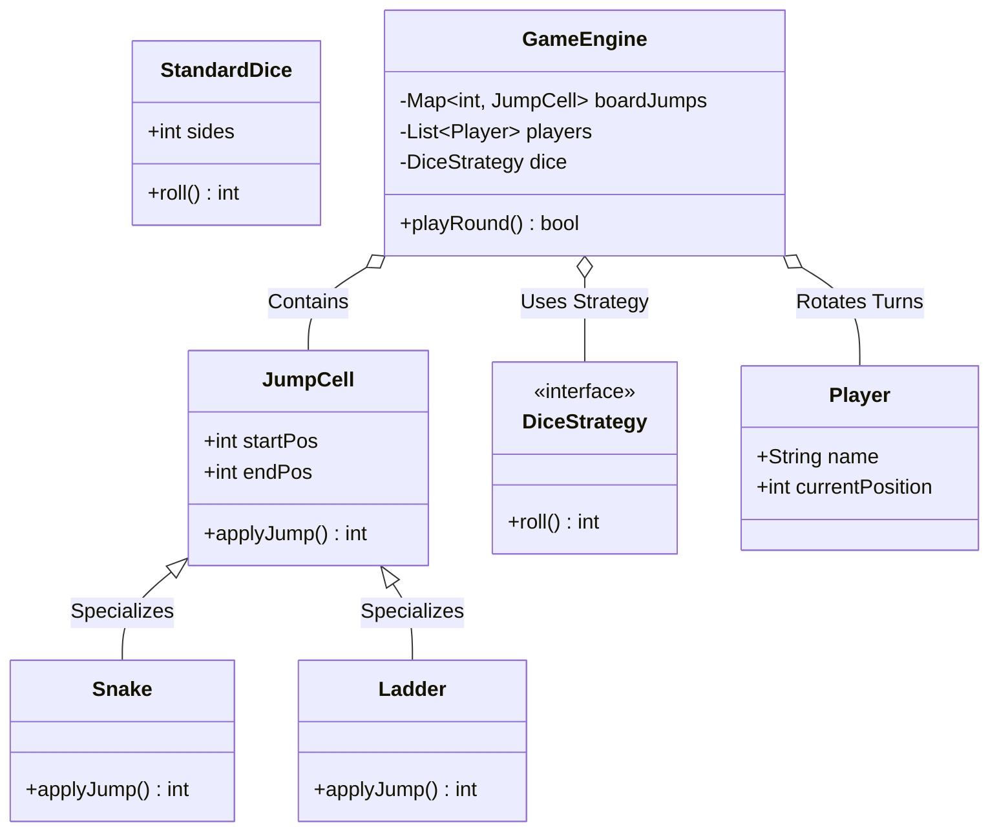

# LLD Case Study 9: Snake and Ladders Game

> **Target Patterns:** Factory Pattern, Strategy Pattern, State Machine  
> **Key Engineering Focus:** Modular board layout, jump cell behaviors (Snakes vs Ladders), deterministic dice strategies, and multi-player game loops.

---

## 1. Problem Statement & Functional Requirements

Design a modular, extensible Snake and Ladders board game.

### Requirements:
1. **Configurable Board:** Board with $N$ cells (default 1 to 100).
2. **Jump Entities:** Snakes (drops player back) and Ladders (propels player forward).
3. **Dice Strategy (Strategy Pattern):** Pluggable dice mechanics (Single 6-sided dice, Biased/Rigged dice for testing, Dual dice).
4. **Game State Engine (State Pattern):** Turns rotate in round-robin fashion until a player lands exactly on cell 100 to win.

---

## 2. Architecture & UML Class Diagram



---

## 3. Production-Grade Python Implementation

```python
import random
from abc import ABC, abstractmethod
from typing import Dict, List, Optional
from collections import deque

# --- Jump Entity (Snakes & Ladders) ---
class JumpCell(ABC):
    def __init__(self, start_pos: int, end_pos: int):
        self.start_pos = start_pos
        self.end_pos = end_pos

    @abstractmethod
    def message(self) -> str: pass

class Snake(JumpCell):
    def __init__(self, head: int, tail: int):
        if head <= tail:
            raise ValueError("Snake head must be greater than tail position!")
        super().__init__(head, tail)

    def message(self) -> str:
        return f"Bitten by Snake! Slipped down from {self.start_pos} to {self.end_pos}"

class Ladder(JumpCell):
    def __init__(self, base: int, top: int):
        if base >= top:
            raise ValueError("Ladder base must be lower than top position!")
        super().__init__(base, top)

    def message(self) -> str:
        return f"Climbed a Ladder! Advanced from {self.start_pos} to {self.end_pos}"

# --- Strategy Pattern: Dice Rolling ---
class DiceStrategy(ABC):
    @abstractmethod
    def roll(self) -> int: pass

class StandardDice(DiceStrategy):
    def __init__(self, sides: int = 6):
        self.sides = sides

    def roll(self) -> int:
        return random.randint(1, self.sides)

class DeterministicDice(DiceStrategy):
    """Rigged dice for predictable testing."""
    def __init__(self, sequence: List[int]):
        self.sequence = deque(sequence)

    def roll(self) -> int:
        val = self.sequence.popleft()
        self.sequence.append(val)
        return val

# --- Player & Game Engine ---
class Player:
    def __init__(self, name: str):
        self.name = name
        self.position = 0 # Starts off-board

class SnakeAndLaddersGame:
    WINNING_POSITION = 100

    def __init__(self, players: List[str], dice: DiceStrategy):
        self.players = deque([Player(p) for p in players])
        self.dice = dice
        self.jumps: Dict[int, JumpCell] = {}
        self.winner: Optional[Player] = None

    def add_snake(self, head: int, tail: int):
        self.jumps[head] = Snake(head, tail)

    def add_ladder(self, base: int, top: int):
        self.jumps[base] = Ladder(base, top)

    def take_turn(self) -> bool:
        if self.winner:
            return True

        current_player = self.players.popleft()
        roll_value = self.dice.roll()
        target_pos = current_player.position + roll_value

        if target_pos > self.WINNING_POSITION:
            print(f"[{current_player.name}] Rolled {roll_value}. Overshot 100! Remains at {current_player.position}")
        else:
            current_player.position = target_pos
            print(f"[{current_player.name}] Rolled {roll_value} -> Reached cell {current_player.position}")

            # Check if landed on Snake or Ladder
            if current_player.position in self.jumps:
                jump = self.jumps[current_player.position]
                print(f"  --> {jump.message()}")
                current_player.position = jump.end_pos

            # Check win condition
            if current_player.position == self.WINNING_POSITION:
                self.winner = current_player
                print(f"\n🎉 [WINNER] Player '{current_player.name}' has reached 100 and won the game!")
                return True

        # Rotate player back to end of queue
        self.players.append(current_player)
        return False

# --- Verification Driver ---
if __name__ == "__main__":
    game = SnakeAndLaddersGame(["Alice", "Bob"], StandardDice())

    # Add board jumps
    game.add_ladder(4, 25)
    game.add_ladder(21, 60)
    game.add_snake(99, 10)
    game.add_snake(50, 5)

    print("--- Starting Snake & Ladders Match ---")
    rounds = 0
    while not game.take_turn() and rounds < 50:
        rounds += 1
```


---

## 4. Edge Cases, Tests and Extensions

### Rules the implementation has to get right

| Case | What the code does | Note |
| :--- | :--- | :--- |
| Roll overshoots 100 | Player stays put; turn passes | Matches the "exact finish" house rule; some variants bounce back instead |
| Landing on a snake head or ladder base | One jump is applied | **A ladder whose top is a snake head is not chained**: the player stops on the snake head and is not bitten |
| Two jumps share the same start cell | The second `add_*` silently overwrites the first | Reject at board-build time |
| Jump starting on cell 100 | Winner check happens after the jump, so a snake on 100 would undo a win | Reject at board-build time |
| Game already won | `take_turn()` returns `True` without mutating anything | Idempotent end state |

The first three are board-validation problems, not game-loop problems. Validating once when the board is built is cheaper and safer than adding checks to every turn.

### Tests with rigged dice

`DeterministicDice` exists so that a game is a pure function of the roll sequence. This block extends the implementation above.

```python
# continues: snake and ladders implementation above
import io, contextlib

def play(rolls, players=("A",), setup=lambda g: None):
    g = SnakeAndLaddersGame(list(players), DeterministicDice(rolls))
    setup(g)
    with contextlib.redirect_stdout(io.StringIO()):
        for _ in range(len(rolls)):
            if g.take_turn():
                break
    return g

g = play([4], setup=lambda g: g.add_ladder(4, 25))
assert g.players[0].position == 25                       # ladder applied

g = play([5], setup=lambda g: g.add_snake(5, 2))
assert g.players[0].position == 2                        # snake applied

def near_end(g):
    g.players[0].position = 98
g = play([6], setup=near_end)
assert g.players[0].position == 98 and g.winner is None  # overshoot: stays put
g = play([2], setup=near_end)
assert g.winner is not None and g.winner.name == "A"     # exact roll wins

g = play([4], setup=lambda g: (g.add_ladder(4, 25), g.add_snake(25, 3)))
assert g.players[0].position == 25                       # documented limitation: jumps do not chain

# Hardening: validate the board once, up front
def validate_board(snakes, ladders, size=100):
    problems, starts = [], {}
    for kind, pairs in (("snake", snakes), ("ladder", ladders)):
        for a, b in pairs:
            if a == size:
                problems.append(f"{kind} starts on the final cell")
            if a in starts:
                problems.append(f"two jumps start at {a}")
            starts[a] = b
    for a, b in starts.items():
        if b in starts:
            problems.append(f"jump {a}->{b} lands on another jump start")
    return problems

assert validate_board([(25, 3)], [(4, 25)]) == ["jump 4->25 lands on another jump start"]
assert validate_board([(100, 5)], []) == ["snake starts on the final cell"]
assert validate_board([(50, 5)], [(4, 25)]) == []
print("snake and ladders tests passed")
```

### Extensions interviewers ask for

1. **Multiple dice, or "roll again on a six":** only `DiceStrategy` and the turn loop change; keep a `Turn` object that can request an extra roll.
2. **Board of arbitrary size:** pass `size` into the game instead of the class constant; `validate_board` already takes it.
3. **Persist and resume a game:** the state is the player positions, the queue order and the dice sequence position; serialise those three.
4. **Simulate a million games for statistics:** inject a seeded `random.Random` into `StandardDice` so runs are reproducible, and expect the average game to take about 40 turns on the classic board (measure it, it depends on the board).

### Follow-up questions

- *Why is the dice a strategy rather than a call to `random`?* Testability: randomness is the only non-determinism in the game, so injecting it makes every test exact.
- *What makes a board unwinnable?* Snakes and ladders that form a cycle, or a snake on the last reachable cells combined with exact-finish rules; `validate_board` catches the first kind, a reachability search (BFS over cells 1 to 100 with dice outcomes 1 to 6) catches both.
