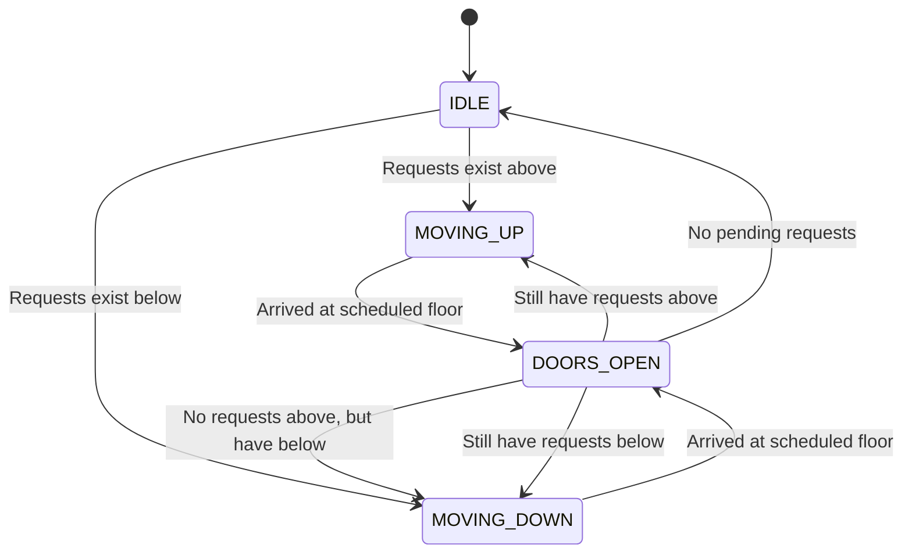
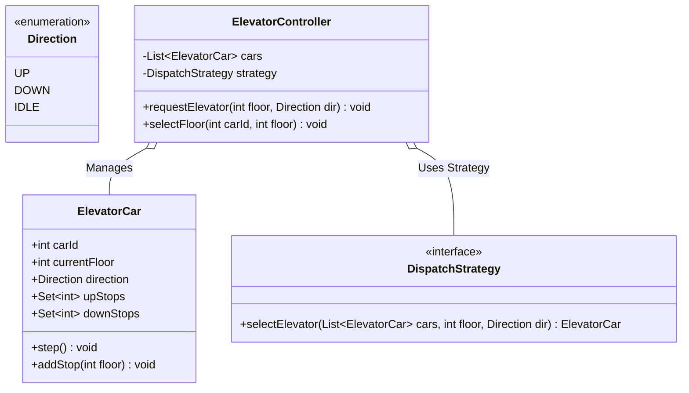

# LLD Case Study 10: Multi-Car Elevator Control System

> **Target Patterns:** State Pattern, Strategy Pattern, Command Pattern  
> **Key Engineering Focus:** Hardware movement states, SCAN / LOOK disk scheduling algorithms, internal/external hall call commands, and multi-elevator coordination.

---

## 1. Problem Statement & Functional Requirements

Design an automated Elevator Controller governing a bank of $M$ elevators across $N$ floors.

### Requirements:
1. **Movement State Machine (State Pattern):** Elevators transition between `IDLE`, `MOVING_UP`, `MOVING_DOWN`, and `DOORS_OPEN`.
2. **Elevator Dispatch Policy (Strategy Pattern):** Route hall calls to the most optimal car using algorithms like **LOOK / SCAN** (continue in current direction servicing all pending stops before reversing).
3. **Command Architecture:** Requests come from external hall panels (`direction = UP/DOWN`) and internal car panels (`destination_floor`).

---

## 2. Architecture & State Diagram





---

## 3. Production-Grade Python Implementation

```python
from enum import Enum, auto
from abc import ABC, abstractmethod
from typing import List, Set, Optional

# --- Direction & State Models ---
class Direction(Enum):
    UP = auto()
    DOWN = auto()
    IDLE = auto()

class ElevatorCar:
    def __init__(self, car_id: int):
        self.car_id = car_id
        self.current_floor = 1
        self.direction = Direction.IDLE
        self.up_stops: Set[int] = set()
        self.down_stops: Set[int] = set()

    def add_destination(self, floor: int) -> None:
        if floor > self.current_floor:
            self.up_stops.add(floor)
            if self.direction == Direction.IDLE:
                self.direction = Direction.UP
        elif floor < self.current_floor:
            self.down_stops.add(floor)
            if self.direction == Direction.IDLE:
                self.direction = Direction.DOWN
        else:
            print(f"[Elevator {self.car_id}] Already at floor {floor}. Opening doors.")

    def step(self) -> None:
        """LOOK (Elevator) Algorithm: Serves requests in current direction before reversing."""
        if self.direction == Direction.UP:
            if self.current_floor in self.up_stops:
                self.up_stops.remove(self.current_floor)
                print(f"[Elevator {self.car_id}] Arrived at Floor {self.current_floor}. Doors Opening.")
            
            # Check if more stops exist in UP direction
            remaining_above = [f for f in self.up_stops if f > self.current_floor]
            if remaining_above:
                self.current_floor += 1
            elif self.down_stops:
                self.direction = Direction.DOWN
            else:
                self.direction = Direction.IDLE

        elif self.direction == Direction.DOWN:
            if self.current_floor in self.down_stops:
                self.down_stops.remove(self.current_floor)
                print(f"[Elevator {self.car_id}] Arrived at Floor {self.current_floor}. Doors Opening.")

            remaining_below = [f for f in self.down_stops if f < self.current_floor]
            if remaining_below:
                self.current_floor -= 1
            elif self.up_stops:
                self.direction = Direction.UP
            else:
                self.direction = Direction.IDLE

# --- Strategy Pattern: Elevator Dispatching ---
class DispatchStrategy(ABC):
    @abstractmethod
    def pick_car(self, cars: List[ElevatorCar], floor: int, direction: Direction) -> ElevatorCar:
        pass

class NearestCarStrategy(DispatchStrategy):
    """Assigns the closest car already moving in that direction or currently idle."""
    def pick_car(self, cars: List[ElevatorCar], floor: int, direction: Direction) -> ElevatorCar:
        def score(car: ElevatorCar) -> int:
            distance = abs(car.current_floor - floor)
            if car.direction == Direction.IDLE:
                return distance
            # Penalty if car is moving away from the floor
            if car.direction == direction and (
                (direction == Direction.UP and car.current_floor <= floor) or
                (direction == Direction.DOWN and car.current_floor >= floor)
            ):
                return distance
            return distance + 100 # Heavy penalty for wrong direction

        return min(cars, key=score)

# --- Elevator Bank Controller ---
class ElevatorController:
    def __init__(self, num_cars: int):
        self.cars = [ElevatorCar(i + 1) for i in range(num_cars)]
        self.strategy = NearestCarStrategy()

    def handle_hall_call(self, floor: int, direction: Direction) -> None:
        best_car = self.strategy.pick_car(self.cars, floor, direction)
        print(f"[Hall Call] Floor {floor} {direction.name} -> Assigned to Elevator #{best_car.car_id}")
        best_car.add_destination(floor)

    def handle_internal_button(self, car_id: int, destination_floor: int) -> None:
        car = next(c for c in self.cars if c.car_id == car_id)
        car.add_destination(destination_floor)

    def simulate_step(self) -> None:
        for car in self.cars:
            if car.direction != Direction.IDLE:
                car.step()

# --- Verification Driver ---
if __name__ == "__main__":
    controller = ElevatorController(num_cars=2)

    # User at floor 5 presses UP
    controller.handle_hall_call(floor=5, direction=Direction.UP)

    # Passenger inside Elevator 1 presses 8
    controller.handle_internal_button(car_id=1, destination_floor=8)

    print("\n--- Simulating 6 Elevator Clock Cycles ---")
    for cycle in range(6):
        print(f"\n[Tick {cycle + 1}]")
        controller.simulate_step()
```


---

## 4. Edge Cases, Tests and Extensions

### Behaviour of the LOOK algorithm as implemented

| Situation | What the code does | Check |
| :--- | :--- | :--- |
| Requests above and below | Finishes all stops in the current direction, then reverses | Tested below |
| New request behind the car while moving | Goes to the opposite-direction set and is served after the reversal | Tested below |
| Request for the current floor | Prints "doors opening" and does nothing else | Correct, but no door state is modelled |
| Idle car after the last stop | `direction` becomes `IDLE` and the car stops moving | Tested below |
| Dispatch tie | `min` keeps the first car, so car 1 gets every tie | Fine for fairness-insensitive demos; real systems also balance load |
| Concurrency | **Not thread-safe**: `add_destination` and `step` mutate the same sets | One controller thread, or one lock per car |

### Tests

This block extends the implementation above. It records door-open events by reading the printed lines, so it also checks the messages the demo prints.

```python
# continues: elevator implementation above
import io, contextlib, re

def run_until_idle(car, limit=200):
    buf = io.StringIO()
    with contextlib.redirect_stdout(buf):
        for _ in range(limit):
            if car.direction == Direction.IDLE:
                break
            car.step()
    return [int(n) for n in re.findall(r"Arrived at Floor (\d+)", buf.getvalue())]

def quiet_add(car, floor):
    with contextlib.redirect_stdout(io.StringIO()):
        car.add_destination(floor)

# Serves upward stops in floor order, not request order
car = ElevatorCar(1)
quiet_add(car, 5); quiet_add(car, 3)
assert run_until_idle(car) == [3, 5] and car.direction == Direction.IDLE and car.current_floor == 5

# A request behind a moving car waits until the car reverses
car = ElevatorCar(1)
quiet_add(car, 4)
for _ in range(2):
    car.step()                                           # now at floor 3, still going up
assert car.current_floor == 3
quiet_add(car, 2)                                        # behind us: goes to the down set
assert run_until_idle(car) == [4, 2] and car.current_floor == 2

# Dispatch: prefer the car already heading toward the floor in the same direction
ctl = ElevatorController(2)
a, b = ctl.cars
a.current_floor = 1                                      # idle
b.current_floor, b.direction, b.up_stops = 4, Direction.UP, {9}
assert ctl.strategy.pick_car(ctl.cars, 5, Direction.UP) is b      # distance 1, same direction, ahead of it
assert ctl.strategy.pick_car(ctl.cars, 2, Direction.UP) is a      # b has already passed floor 2
assert ctl.strategy.pick_car(ctl.cars, 1, Direction.DOWN) is a

# Controller wiring: hall call, then an internal button, then simulate
ctl = ElevatorController(1)
with contextlib.redirect_stdout(io.StringIO()):
    ctl.handle_hall_call(3, Direction.UP)
    ctl.handle_internal_button(1, 6)
    for _ in range(50):
        ctl.simulate_step()
assert ctl.cars[0].current_floor == 6 and ctl.cars[0].direction == Direction.IDLE
print("elevator tests passed")
```

### Extensions interviewers ask for

1. **Capacity and weight:** give each car a load; a full car skips hall calls (a high score penalty) but still serves its internal stops.
2. **Door and motion timing:** replace instantaneous `step()` with states (`MOVING`, `DOORS_OPENING`, `DOORS_OPEN`, `DOORS_CLOSING`) driven by a clock; this is the State pattern again and is easiest to test with a fake clock.
3. **Peak traffic modes:** morning rush parks idle cars at the lobby; evening rush spreads them. Add a `DispatchStrategy` per mode and switch by schedule.
4. **Destination dispatch:** riders enter the destination floor at the lobby and the system groups them by direction and floor range; the assignment becomes an optimisation across all pending riders, not a nearest-car rule.
5. **Fault handling:** mark a car out of service, redistribute its pending stops to other cars, and stop assigning it.

### Follow-up questions

- *Why LOOK rather than SCAN or FCFS?* FCFS zig-zags and starves far floors. SCAN travels to the end of the shaft even with no requests there. LOOK reverses at the last pending stop, which saves the wasted travel.
- *Can a request starve under LOOK?* Not indefinitely: each reversal clears one direction's set, so a waiting stop is served within two sweeps, assuming the car does not stay permanently busy above it.
- *How would you make the controller thread-safe?* Make the controller the only writer: a queue of commands consumed by one thread that also runs the step clock, which removes locking from the car objects entirely.
