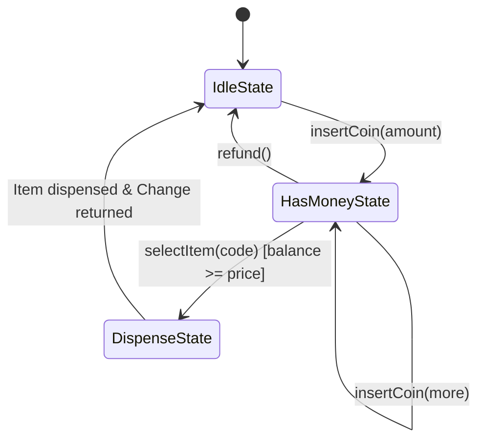
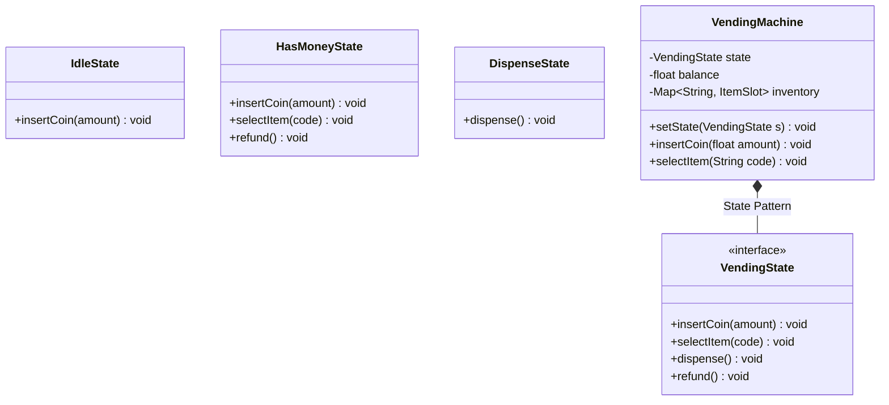

# LLD Case Study 11: Automated Vending Machine

> **Target Patterns:** State Pattern, State Machine Transitions  
> **Key Engineering Focus:** Hardware lifecycle modeling, coin balance tracking, inventory deduction, and change calculation.

---

## 1. Problem Statement & Functional Requirements

Design an automated snack and beverage vending machine.

### Requirements:
1. **Item Catalog & Inventory:** Slots storing items with fixed prices and quantities.
2. **State Pattern:** The machine transitions through strict states:
   * `IDLE`: Awaiting money insertion.
   * `HAS_MONEY`: Tracking user balance; accepts further coins or item selection.
   * `DISPENSING`: Deducting inventory and dispensing item.
   * `SOLD_OUT`: Out of stock state.
3. **Change Return:** Computes exact change if user inserts more than the item price.

---

## 2. Architecture & State Diagram





---

## 3. Production-Grade Python Implementation

```python
from abc import ABC, abstractmethod
from typing import Dict, Optional

# --- Item Model ---
class Item:
    def __init__(self, name: str, price: float):
        self.name = name
        self.price = price

class ItemSlot:
    def __init__(self, item: Item, quantity: int):
        self.item = item
        self.quantity = quantity

# --- State Interface ---
class VendingState(ABC):
    @abstractmethod
    def insert_coin(self, vm: "VendingMachine", amount: float) -> None: pass
    @abstractmethod
    def select_item(self, vm: "VendingMachine", code: str) -> None: pass
    @abstractmethod
    def dispense(self, vm: "VendingMachine") -> None: pass
    @abstractmethod
    def refund(self, vm: "VendingMachine") -> float: pass

# --- State 1: Idle ---
class IdleState(VendingState):
    def insert_coin(self, vm: "VendingMachine", amount: float) -> None:
        vm.balance += amount
        print(f"[Vending] Inserted ${amount:.2f}. Balance: ${vm.balance:.2f}")
        vm.set_state(HasMoneyState())

    def select_item(self, vm: "VendingMachine", code: str) -> None:
        print("[Vending] Please insert coins first.")

    def dispense(self, vm: "VendingMachine") -> None:
        print("[Vending] No operation in Idle state.")

    def refund(self, vm: "VendingMachine") -> float:
        return 0.0

# --- State 2: Has Money ---
class HasMoneyState(VendingState):
    def insert_coin(self, vm: "VendingMachine", amount: float) -> None:
        vm.balance += amount
        print(f"[Vending] Added ${amount:.2f}. Total Balance: ${vm.balance:.2f}")

    def select_item(self, vm: "VendingMachine", code: str) -> None:
        slot = vm.inventory.get(code)
        if not slot or slot.quantity == 0:
            print(f"[Vending] Item '{code}' is Sold Out!")
            return

        if vm.balance < slot.item.price:
            needed = slot.item.price - vm.balance
            print(f"[Vending] Insufficient funds for {slot.item.name}. Insert ${needed:.2f} more.")
            return

        vm.selected_code = code
        vm.set_state(DispenseState())
        vm.dispense()

    def dispense(self, vm: "VendingMachine") -> None:
        print("[Vending] Select an item first.")

    def refund(self, vm: "VendingMachine") -> float:
        change = vm.balance
        vm.balance = 0.0
        vm.set_state(IdleState())
        print(f"[Vending] Refunded ${change:.2f}")
        return change

# --- State 3: Dispense ---
class DispenseState(VendingState):
    def insert_coin(self, vm: "VendingMachine", amount: float) -> None:
        print("[Vending] Currently dispensing. Please wait.")

    def select_item(self, vm: "VendingMachine", code: str) -> None:
        print("[Vending] Currently dispensing. Please wait.")

    def dispense(self, vm: "VendingMachine") -> None:
        slot = vm.inventory[vm.selected_code]
        slot.quantity -= 1
        change = vm.balance - slot.item.price
        vm.balance = 0.0

        print(f"[Vending] *** DISPENSED: {slot.item.name} ***")
        if change > 0:
            print(f"[Vending] Returning change: ${change:.2f}")

        vm.selected_code = None
        vm.set_state(IdleState())

    def refund(self, vm: "VendingMachine") -> float:
        print("[Vending] Cannot refund during item dispensing.")
        return 0.0

# --- Context Object: VendingMachine ---
class VendingMachine:
    def __init__(self):
        self.state: VendingState = IdleState()
        self.balance: float = 0.0
        self.inventory: Dict[str, ItemSlot] = {}
        self.selected_code: Optional[str] = None

    def set_state(self, state: VendingState):
        self.state = state

    def add_item(self, code: str, item: Item, qty: int):
        self.inventory[code] = ItemSlot(item, qty)

    def insert_coin(self, amount: float):
        self.state.insert_coin(self, amount)

    def select_item(self, code: str):
        self.state.select_item(self, code)

    def dispense(self):
        self.state.dispense(self)

    def refund(self) -> float:
        return self.state.refund(self)

# --- Verification Driver ---
if __name__ == "__main__":
    machine = VendingMachine()
    machine.add_item("A1", Item("Diet Coke", 1.50), qty=2)

    # Scenario: User inserts $2.00 and buys A1 ($1.50)
    print("--- Purchasing Item A1 ---")
    machine.insert_coin(1.00)
    machine.insert_coin(1.00)
    machine.select_item("A1")
```
