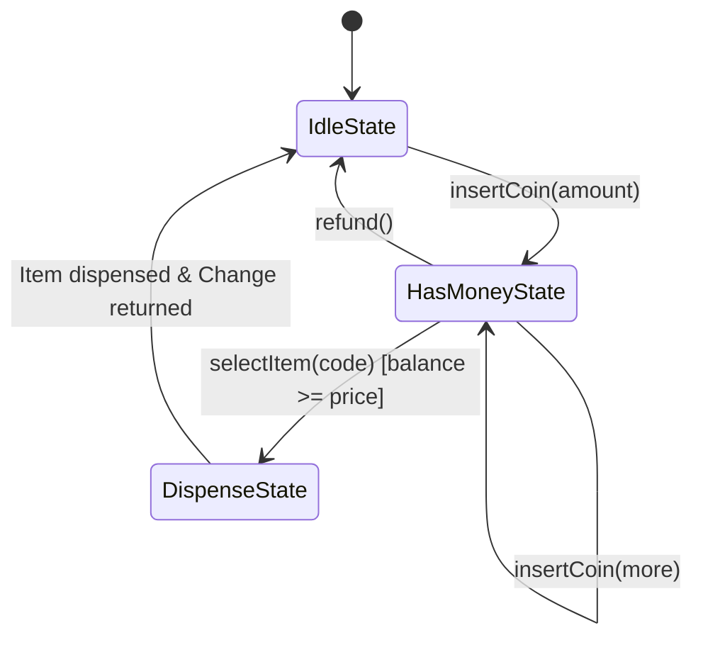
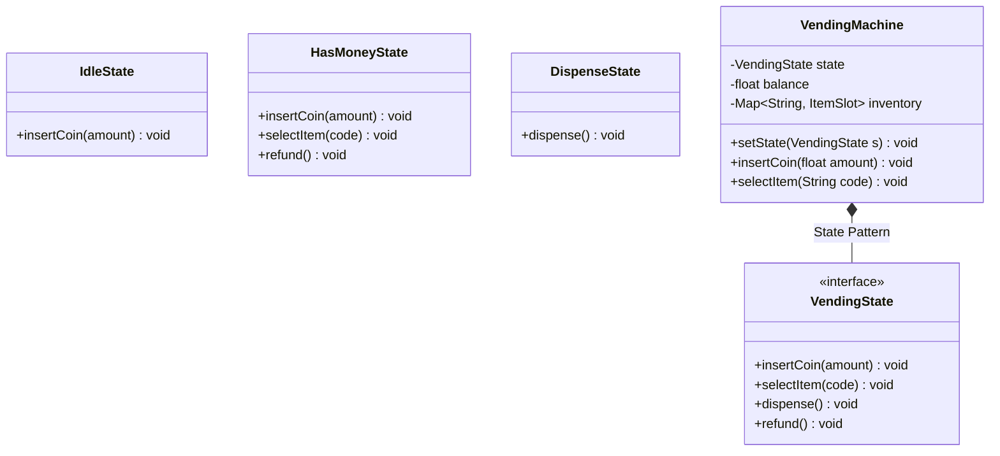

# LLD Case Study 11: Automated Vending Machine

> **Target Patterns:** State Pattern, State Machine Transitions  
> **Key Engineering Focus:** Hardware lifecycle modeling, coin balance tracking, inventory deduction, and change calculation.

---

## 1. Problem Statement & Functional Requirements

Design an automated snack and beverage vending machine.

### Requirements:
1. **Item Catalog & Inventory:** Slots storing items with fixed prices and quantities.
2. **State Pattern:** The machine transitions through strict states:
   * `IDLE`: Awaiting money insertion.
   * `HAS_MONEY`: Tracking user balance; accepts further coins or item selection.
   * `DISPENSING`: Deducting inventory and dispensing item.
   * `SOLD_OUT`: Out of stock state.
3. **Change Return:** Computes exact change if user inserts more than the item price.

---

## 2. Architecture & State Diagram





---

## 3. Production-Grade Python Implementation

```python
from abc import ABC, abstractmethod
from typing import Dict, Optional

# --- Item Model ---
class Item:
    def __init__(self, name: str, price: float):
        self.name = name
        self.price = price

class ItemSlot:
    def __init__(self, item: Item, quantity: int):
        self.item = item
        self.quantity = quantity

# --- State Interface ---
class VendingState(ABC):
    @abstractmethod
    def insert_coin(self, vm: "VendingMachine", amount: float) -> None: pass
    @abstractmethod
    def select_item(self, vm: "VendingMachine", code: str) -> None: pass
    @abstractmethod
    def dispense(self, vm: "VendingMachine") -> None: pass
    @abstractmethod
    def refund(self, vm: "VendingMachine") -> float: pass

# --- State 1: Idle ---
class IdleState(VendingState):
    def insert_coin(self, vm: "VendingMachine", amount: float) -> None:
        vm.balance += amount
        print(f"[Vending] Inserted ${amount:.2f}. Balance: ${vm.balance:.2f}")
        vm.set_state(HasMoneyState())

    def select_item(self, vm: "VendingMachine", code: str) -> None:
        print("[Vending] Please insert coins first.")

    def dispense(self, vm: "VendingMachine") -> None:
        print("[Vending] No operation in Idle state.")

    def refund(self, vm: "VendingMachine") -> float:
        return 0.0

# --- State 2: Has Money ---
class HasMoneyState(VendingState):
    def insert_coin(self, vm: "VendingMachine", amount: float) -> None:
        vm.balance += amount
        print(f"[Vending] Added ${amount:.2f}. Total Balance: ${vm.balance:.2f}")

    def select_item(self, vm: "VendingMachine", code: str) -> None:
        slot = vm.inventory.get(code)
        if not slot or slot.quantity == 0:
            print(f"[Vending] Item '{code}' is Sold Out!")
            return

        if vm.balance < slot.item.price:
            needed = slot.item.price - vm.balance
            print(f"[Vending] Insufficient funds for {slot.item.name}. Insert ${needed:.2f} more.")
            return

        vm.selected_code = code
        vm.set_state(DispenseState())
        vm.dispense()

    def dispense(self, vm: "VendingMachine") -> None:
        print("[Vending] Select an item first.")

    def refund(self, vm: "VendingMachine") -> float:
        change = vm.balance
        vm.balance = 0.0
        vm.set_state(IdleState())
        print(f"[Vending] Refunded ${change:.2f}")
        return change

# --- State 3: Dispense ---
class DispenseState(VendingState):
    def insert_coin(self, vm: "VendingMachine", amount: float) -> None:
        print("[Vending] Currently dispensing. Please wait.")

    def select_item(self, vm: "VendingMachine", code: str) -> None:
        print("[Vending] Currently dispensing. Please wait.")

    def dispense(self, vm: "VendingMachine") -> None:
        slot = vm.inventory[vm.selected_code]
        slot.quantity -= 1
        change = vm.balance - slot.item.price
        vm.balance = 0.0

        print(f"[Vending] *** DISPENSED: {slot.item.name} ***")
        if change > 0:
            print(f"[Vending] Returning change: ${change:.2f}")

        vm.selected_code = None
        vm.set_state(IdleState())

    def refund(self, vm: "VendingMachine") -> float:
        print("[Vending] Cannot refund during item dispensing.")
        return 0.0

# --- Context Object: VendingMachine ---
class VendingMachine:
    def __init__(self):
        self.state: VendingState = IdleState()
        self.balance: float = 0.0
        self.inventory: Dict[str, ItemSlot] = {}
        self.selected_code: Optional[str] = None

    def set_state(self, state: VendingState):
        self.state = state

    def add_item(self, code: str, item: Item, qty: int):
        self.inventory[code] = ItemSlot(item, qty)

    def insert_coin(self, amount: float):
        self.state.insert_coin(self, amount)

    def select_item(self, code: str):
        self.state.select_item(self, code)

    def dispense(self):
        self.state.dispense(self)

    def refund(self) -> float:
        return self.state.refund(self)

# --- Verification Driver ---
if __name__ == "__main__":
    machine = VendingMachine()
    machine.add_item("A1", Item("Diet Coke", 1.50), qty=2)

    # Scenario: User inserts $2.00 and buys A1 ($1.50)
    print("--- Purchasing Item A1 ---")
    machine.insert_coin(1.00)
    machine.insert_coin(1.00)
    machine.select_item("A1")
```


---

## 4. Edge Cases, Tests and Extensions

### State-machine review

| State | `insert_coin` | `select_item` | `refund` | Failure to watch for |
| :--- | :--- | :--- | :--- | :--- |
| Idle | to HasMoney | prompt only | returns 0 | none |
| HasMoney | adds balance | dispense, sold out, or short of funds | returns balance, to Idle | **float balance can look short by a tiny amount** |
| Dispense | rejected | rejected | rejected | power loss mid-dispense: persist the transaction first |

Every illegal operation in a state is handled by that state class, so there is no `if state == ...` ladder in the context object. That is the point of the State pattern, and it is the property to point out in an interview.

Two weaknesses: money is stored as `float` dollars, and the machine returns "change" as a number without checking that it holds the coins to pay it.

### Tests

This block extends the implementation above. The bug test shows the float problem; the next test shows that the same machine is exact when the amounts are integer cents.

```python
# continues: vending machine implementation above
import io, contextlib

def quiet(fn, *a):
    with contextlib.redirect_stdout(io.StringIO()):
        return fn(*a)

# Happy path with change
vm = VendingMachine(); vm.add_item("A1", Item("Chips", 0.75), 2)
quiet(vm.insert_coin, 1.00); quiet(vm.select_item, "A1")
assert vm.inventory["A1"].quantity == 1 and vm.balance == 0.0 and isinstance(vm.state, IdleState)

# Short of funds: stays in HasMoney, refund returns exactly what was inserted
vm = VendingMachine(); vm.add_item("A1", Item("Chips", 0.75), 1)
quiet(vm.insert_coin, 0.50); quiet(vm.select_item, "A1")
assert isinstance(vm.state, HasMoneyState) and vm.inventory["A1"].quantity == 1
assert quiet(vm.refund) == 0.50 and isinstance(vm.state, IdleState)

# Sold out
vm = VendingMachine(); vm.add_item("A1", Item("Chips", 0.75), 0)
quiet(vm.insert_coin, 1.00); quiet(vm.select_item, "A1")
assert isinstance(vm.state, HasMoneyState) and vm.balance == 1.00

# Illegal operations are no-ops, not crashes
vm = VendingMachine()
quiet(vm.select_item, "A1"); quiet(vm.dispense)
assert quiet(vm.refund) == 0.0 and isinstance(vm.state, IdleState)

# The bug: seven 10-cent coins are 0.7999999999999999 dollars, so an 80-cent item looks unaffordable
vm = VendingMachine(); vm.add_item("B1", Item("Gum", 0.80), 1)
for _ in range(7):
    quiet(vm.insert_coin, 0.10)
quiet(vm.select_item, "B1")
assert vm.inventory["B1"].quantity == 1               # nothing was dispensed

# The fix needs no new class: use integer cents everywhere
vm = VendingMachine(); vm.add_item("B1", Item("Gum", 80), 1)
for _ in range(7):
    quiet(vm.insert_coin, 10)
quiet(vm.select_item, "B1")
assert vm.inventory["B1"].quantity == 1               # 70 < 80: still short, correctly
quiet(vm.insert_coin, 10); quiet(vm.select_item, "B1")
assert vm.inventory["B1"].quantity == 0 and vm.balance == 0
print("vending machine tests passed")
```

### Extensions interviewers ask for

1. **Make change from a coin inventory:** add a `CoinBank` with counts per denomination and a greedy or dynamic-programming change-maker; refuse the sale (or demand exact change) when change cannot be formed. Greedy is correct for canonical coin systems such as US coins and wrong for arbitrary ones, so say which you assume.
2. **Timeouts:** an unselected balance should refund after 30 seconds; give the machine a clock and a `tick()` that moves HasMoney to Idle, tested with a fake clock like the rate limiter.
3. **Payment by card:** a `PaymentStrategy` (cash, card, mobile) so `HasMoneyState` stops assuming coins.
4. **Remote monitoring:** emit events (`ItemSold`, `LowStock`, `Jammed`) to observers, which is the same Observer shape used in the inventory case study.

### Follow-up questions

- *State pattern or an enum with a switch?* A switch is fine for three states and one method; the pattern pays off when states multiply, because each new state is a new class and existing ones stay untouched.
- *What if the machine loses power while dispensing?* Write the sale intent to durable storage before moving the motor, and on boot reconcile: either complete the dispense or refund.
- *Where would you add a maintenance mode?* A fourth state (`OutOfServiceState`) that rejects coins and allows only restocking commands.
