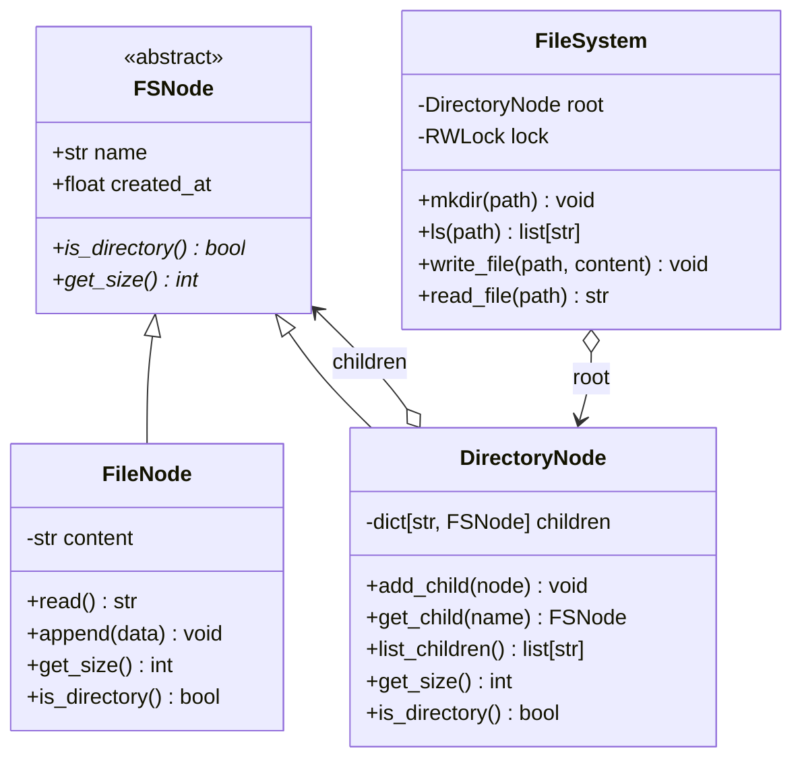

# System 12: In-Memory File System

> **Zero-Prerequisite Intuition: The "Nested Russian Doll" Metaphor**
> What is a file system?
> Imagine a massive physical library. You have folders inside boxes, and boxes inside cabinets. Some items in the cabinet are actual **documents** (files with text written on paper), while other items are **folders** that hold more documents or sub-folders.
> 
> When your computer boots, your operating system organizes data on a hard drive using a hierarchical tree structure: `/` (the root cabinet), `/var` (a drawer), and `/var/log/app.log` (a physical text page).
> 
> In top-tier software engineering interviews (Google, Dropbox, Amazon), candidates are asked: 
> *"Design and implement an in-memory file system from scratch that supports `mkdir`, `ls`, `create_file`, `read_file`, `write_file`, and nested path resolution."*
> 
> This is the ultimate test of the **Composite Design Pattern** and **Trie/Tree Traversal**.

---

## 1. Requirements & System Boundaries

### Functional Requirements
1. **`mkdir(path)`:** Creates a new directory at the specified absolute path. Supports recursive creation (e.g. creating `/a/b/c` automatically creates missing parents).
2. **`ls(path)`:** Lists the contents of a directory in alphabetical order. If the path points to a file, returns just the file name.
3. **`write_file(path, content)`:** Writes or appends text content to a file. If the file does not exist, creates it.
4. **`read_file(path)`:** Reads and returns the complete string content of the file.
5. **`delete(path)`:** Recursively deletes a directory or file.

### Non-Functional Requirements
* **Thread Safety:** Multiple threads can read concurrently; write mutations (`write_file`, `mkdir`, `delete`) must be atomic without corrupting the tree.
* **$O(L)$ Time Complexity:** Operations scale with path depth $L$ (number of `/` segments), not total files in the system.

---

## 2. Design Pattern Blueprint: The Composite Pattern

A directory contains files and other directories. Instead of treating files and directories as totally separate, the **Composite Pattern** treats them uniformly as `Node` objects.



---

## 3. Complete Python Implementation

```python
# in_memory_file_system.py
from abc import ABC, abstractmethod
from typing import Dict, List, Optional
import threading
import time

# ==========================================
# 1. Composite Base Component
# ==========================================
class FSNode(ABC):
    def __init__(self, name: str):
        self.name = name
        self.created_at = time.time()
        self.updated_at = time.time()

    @abstractmethod
    def is_directory(self) -> bool:
        pass

    @abstractmethod
    def get_size(self) -> int:
        pass

# ==========================================
# 2. Leaf Node: File
# ==========================================
class FileNode(FSNode):
    def __init__(self, name: str):
        super().__init__(name)
        self._content: str = ""

    def is_directory(self) -> bool:
        return False

    def get_size(self) -> int:
        return len(self._content.encode("utf-8"))

    def read(self) -> str:
        return self._content

    def write(self, content: str, append: bool = True) -> None:
        if append:
            self._content += content
        else:
            self._content = content
        self.updated_at = time.time()

# ==========================================
# 3. Composite Node: Directory
# ==========================================
class DirectoryNode(FSNode):
    def __init__(self, name: str):
        super().__init__(name)
        self.children: Dict[str, FSNode] = {}

    def is_directory(self) -> bool:
        return True

    def get_size(self) -> int:
        return sum(child.get_size() for child in self.children.values())

    def get_child(self, name: str) -> Optional[FSNode]:
        return self.children.get(name)

    def add_child(self, node: FSNode) -> None:
        self.children[node.name] = node
        self.updated_at = time.time()

    def remove_child(self, name: str) -> bool:
        if name in self.children:
            del self.children[name]
            self.updated_at = time.time()
            return True
        return False

    def list_children(self) -> List[str]:
        return sorted(self.children.keys())

# ==========================================
# 4. Master File System Orchestrator
# ==========================================
class InMemoryFileSystem:
    def __init__(self):
        self.root = DirectoryNode("")
        self._lock = threading.RLock() # Re-entrant lock for thread safety

    def _normalize_path(self, path: str) -> List[str]:
        """Splits '/a/b/c' into ['a', 'b', 'c']. Strips empty components."""
        return [part for part in path.split("/") if part]

    def mkdir(self, path: str) -> None:
        """Creates directory and any missing parent directories."""
        with self._lock:
            parts = self._normalize_path(path)
            curr = self.root
            for part in parts:
                child = curr.get_child(part)
                if child is None:
                    new_dir = DirectoryNode(part)
                    curr.add_child(new_dir)
                    curr = new_dir
                elif child.is_directory():
                    curr = child
                else:
                    raise ValueError(f"Path conflict: '{part}' is an existing file, not a directory.")

    def write_file(self, path: str, content: str) -> None:
        """Writes data to file. Creates parent directories if missing."""
        with self._lock:
            parts = self._normalize_path(path)
            if not parts:
                raise ValueError("Cannot write to root path.")

            file_name = parts[-1]
            dir_parts = parts[:-1]

            # Navigate to parent directory
            curr = self.root
            for part in dir_parts:
                child = curr.get_child(part)
                if child is None:
                    new_dir = DirectoryNode(part)
                    curr.add_child(new_dir)
                    curr = new_dir
                elif child.is_directory():
                    curr = child
                else:
                    raise ValueError(f"Path conflict: '{part}' is a file.")

            file_node = curr.get_child(file_name)
            if file_node is None:
                new_file = FileNode(file_name)
                new_file.write(content, append=False)
                curr.add_child(new_file)
            elif not file_node.is_directory():
                file_node.write(content, append=True)
            else:
                raise ValueError(f"Path conflict: '{file_name}' is an existing directory.")

    def read_file(self, path: str) -> str:
        with self._lock:
            parts = self._normalize_path(path)
            curr = self.root
            for part in parts:
                curr = curr.get_child(part)
                if curr is None:
                    raise FileNotFoundError(f"Path not found: '{path}'")

            if curr.is_directory():
                raise IsADirectoryError(f"'{path}' is a directory, not a file.")
            return curr.read()

    def ls(self, path: str) -> List[str]:
        with self._lock:
            parts = self._normalize_path(path)
            curr = self.root
            for part in parts:
                curr = curr.get_child(part)
                if curr is None:
                    raise FileNotFoundError(f"Path not found: '{path}'")

            if curr.is_directory():
                return curr.list_children()
            else:
                return [curr.name] # If path is a file, return file name only
```

---

## 4. Verification & Common Interview Follow-Ups

```python
if __name__ == "__main__":
    fs = InMemoryFileSystem()

    # 1. Recursive Directory Creation
    fs.mkdir("/usr/local/bin")
    fs.mkdir("/var/log")

    # 2. Writing files
    fs.write_file("/var/log/syslog.txt", "System initialized.\n")
    fs.write_file("/var/log/syslog.txt", "Service ready.\n")
    fs.write_file("/usr/local/bin/python", "BINARY_EXEC_DATA")

    # 3. Reading and Listing
    print("Files in /var/log:", fs.ls("/var/log")) # ['syslog.txt']
    print("Content of syslog.txt:\n" + fs.read_file("/var/log/syslog.txt"))
    print("Listing specific file:", fs.ls("/usr/local/bin/python")) # ['python']

    print("Total size of /var:", fs.root.get_child("var").get_size(), "bytes")
```

### Classic Senior Interview Follow-Ups
1. **"How do you support Hard Links and Symbolic Links (Symlinks)?"**
   * *Answer:* Introduce a `LinkNode(FSNode)` that stores an absolute or relative target path string. When resolving paths, `FileSystem` follows the target path recursively (with a `max_depth = 16` counter to prevent infinite cyclic link loops).
2. **"How do you implement permissions (`chmod`, `chown`)?"**
   * *Answer:* Add an integer bitmask `permissions = 0o755` (Read/Write/Execute for Owner, Group, Other) to `FSNode`. Check `user_id` and permission bits inside every `read_file` or `write_file` method.
