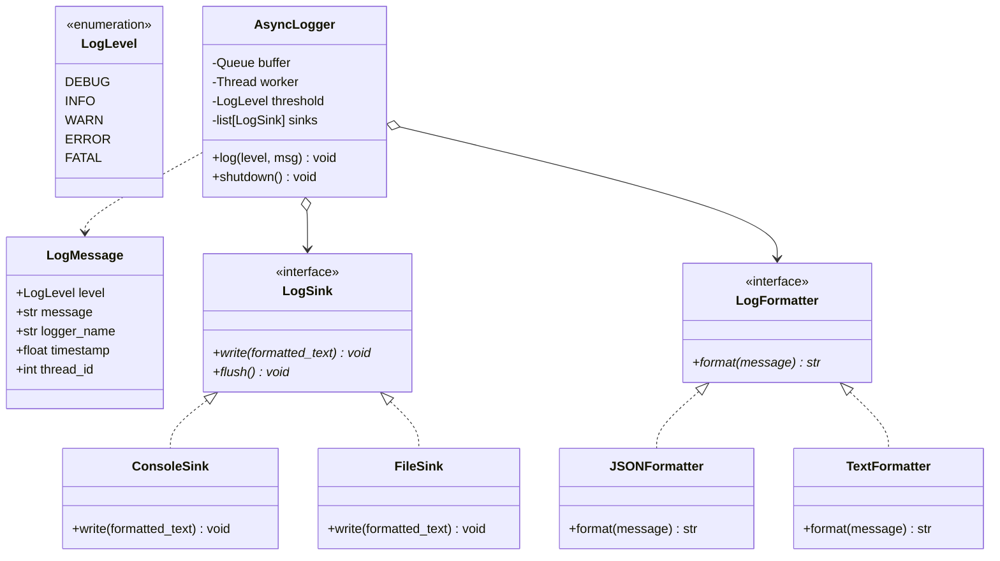

# System 13: High-Throughput Logging Framework

> **Zero-Prerequisite Intuition: The "Airport Black Box" Metaphor**
> What is a logging framework, and why can't we just use `print()`?
> Imagine an airplane in mid-flight. Hundreds of sensors (engine temperature, altitude, hydraulic pressure) record telemetry every millisecond. If the pilot had to stop flying the airplane and personally hand-write every temperature reading on paper before pulling the steering wheel, the plane would crash!
> 
> Instead, sensors dump readings into an automated **Black Box** in the background while the pilot continues flying uninterrupted.
> 
> In high-scale web servers, every request generates logs. If an application thread blocks on a synchronous disk write (`file.write()`) on every request, your server throughput drops from 10,000 requests/sec to 100 requests/sec because hard drives and networks are 100,000x slower than CPU RAM!
> 
> The **#1 Low-Level Design question at Uber, Stripe, and Google** is:
> *"Design a multi-threaded, asynchronous, high-throughput logging library that supports log levels, custom formatters, multiple destinations (Console, File, S3), and never blocks worker threads."*

---

## 1. Requirements & System Boundaries

### Functional Requirements
1. **Log Levels:** Strict priority filtering: `DEBUG (10) < INFO (20) < WARN (30) < ERROR (40) < FATAL (50)`.
2. **Pluggable Appenders / Sinks:** Support writing to multiple destinations simultaneously (Console, File, Remote Network).
3. **Pluggable Formatters:** Support converting log records into Human-Readable Plain Text or Machine-Readable JSON.

### Non-Functional Requirements
* **Zero Latency Overhead (Asynchronous):** Worker threads log in $< 1 \mu s$ by pushing into an in-memory queue. A background thread handles batch flushing to disk.
* **Buffer Overflow Policy:** What happens when logs arrive faster than disk can write? (Drop lowest priority logs vs. block producer).

---

## 2. Design Patterns Architecture



---

## 3. Complete Python Implementation

```python
# async_logger.py
import queue
import threading
import time
import json
from abc import ABC, abstractmethod
from enum import IntEnum
from dataclasses import dataclass
from typing import List, Optional

# ==========================================
# 1. Log Levels
# ==========================================
class LogLevel(IntEnum):
    DEBUG = 10
    INFO = 20
    WARN = 30
    ERROR = 40
    FATAL = 50

@dataclass(frozen=True)
class LogRecord:
    level: LogLevel
    message: str
    logger_name: str
    timestamp: float
    thread_id: int

# ==========================================
# 2. Strategy Pattern: Formatters
# ==========================================
class LogFormatter(ABC):
    @abstractmethod
    def format(self, record: LogRecord) -> str:
        pass

class TextFormatter(LogFormatter):
    def format(self, record: LogRecord) -> str:
        t_str = time.strftime("%Y-%m-%d %H:%M:%S", time.localtime(record.timestamp))
        return f"[{t_str}] [{record.level.name:5}] [{record.logger_name}] (Thread-{record.thread_id}): {record.message}"

class JSONFormatter(LogFormatter):
    def format(self, record: LogRecord) -> str:
        payload = {
            "timestamp": record.timestamp,
            "level": record.level.name,
            "logger": record.logger_name,
            "thread_id": record.thread_id,
            "message": record.message
        }
        return json.dumps(payload)

# ==========================================
# 3. Strategy Pattern: Sinks (Appenders)
# ==========================================
class LogSink(ABC):
    def __init__(self, formatter: LogFormatter):
        self.formatter = formatter

    @abstractmethod
    def emit(self, record: LogRecord) -> None:
        pass

    @abstractmethod
    def flush(self) -> None:
        pass

class ConsoleSink(LogSink):
    def emit(self, record: LogRecord) -> None:
        formatted = self.formatter.format(record)
        print(formatted)

    def flush(self) -> None:
        pass

class MemoryBufferSink(LogSink):
    """Sink used for unit testing or high-speed in-memory analytics."""
    def __init__(self, formatter: LogFormatter):
        super().__init__(formatter)
        self.entries: List[str] = []

    def emit(self, record: LogRecord) -> None:
        self.entries.append(self.formatter.format(record))

    def flush(self) -> None:
        pass

# ==========================================
# 4. Asynchronous Producer-Consumer Engine
# ==========================================
class AsyncLogger:
    def __init__(self, name: str, threshold: LogLevel = LogLevel.INFO, max_buffer_size: int = 10_000):
        self.name = name
        self.threshold = threshold
        self.sinks: List[LogSink] = []
        self._queue = queue.Queue(maxsize=max_buffer_size)
        self._shutdown_event = threading.Event()

        # Background consumer thread
        self._worker_thread = threading.Thread(target=self._drain_queue, daemon=True, name=f"LoggerWorker-{name}")
        self._worker_thread.start()

    def add_sink(self, sink: LogSink) -> None:
        self.sinks.append(sink)

    def log(self, level: LogLevel, message: str) -> None:
        # Fast filter: Drop messages below log threshold immediately!
        if level < self.threshold:
            return

        record = LogRecord(
            level=level,
            message=message,
            logger_name=self.name,
            timestamp=time.time(),
            thread_id=threading.get_ident()
        )

        try:
            # Non-blocking enqueue: takes < 1 microsecond!
            self._queue.put_nowait(record)
        except queue.Full:
            # Drop policy for overload protection
            print(f"[LOGGER OVERLOAD] Queue full! Dropping log from {self.name}")

    def info(self, msg: str): self.log(LogLevel.INFO, msg)
    def error(self, msg: str): self.log(LogLevel.ERROR, msg)
    def warn(self, msg: str): self.log(LogLevel.WARN, msg)
    def debug(self, msg: str): self.log(LogLevel.DEBUG, msg)

    def _drain_queue(self):
        """Dedicated background thread flushing log messages to all sinks."""
        while not self._shutdown_event.is_set() or not self._queue.empty():
            try:
                record = self._queue.get(timeout=0.1)
                for sink in self.sinks:
                    try:
                        sink.emit(record)
                    except Exception as e:
                        print(f"Sink emission error: {e}")
                self._queue.task_done()
            except queue.Empty:
                continue

    def shutdown(self):
        """Gracefully drain the remaining queue before exiting."""
        self._shutdown_event.set()
        self._worker_thread.join(timeout=2.0)
        for sink in self.sinks:
            sink.flush()
```

---

## 4. Verification & Stress-Testing

```python
if __name__ == "__main__":
    logger = AsyncLogger("PaymentService", threshold=LogLevel.DEBUG)
    
    # Attach two independent sinks: Plain text Console + JSON Memory
    logger.add_sink(ConsoleSink(TextFormatter()))
    mem_sink = MemoryBufferSink(JSONFormatter())
    logger.add_sink(mem_sink)

    # Multi-threaded stress test: 5 threads logging concurrently
    def simulate_traffic(user_id):
        logger.info(f"User {user_id} requested checkout")
        logger.debug(f"User {user_id} token verified")
        if user_id % 3 == 0:
            logger.error(f"User {user_id} payment declined")

    threads = [threading.Thread(target=simulate_traffic, args=(i,)) for i in range(10)]
    for t in threads: t.start()
    for t in threads: t.join()

    # Graceful flush
    logger.shutdown()

    print(f"\nTotal JSON logs in memory buffer: {len(mem_sink.entries)}")
    print("Sample JSON entry:\n" + mem_sink.entries[0])
```


---

## 4. Edge Cases, Tests and Extensions

### Behaviour under pressure

| Situation | What happens | Verdict |
| :--- | :--- | :--- |
| Level below the threshold | Dropped before any allocation | Correct and cheap |
| Queue full | `put_nowait` raises `queue.Full`; the record is dropped and a warning is printed | A deliberate overload policy: logging must never block the request path. Count the drops and expose the counter |
| A sink raises | The error is printed and the other sinks still receive the record | Isolation is right; add a circuit breaker so a dead sink is not retried every record |
| `shutdown()` | Sets the event, joins the worker for up to 2 seconds, then flushes sinks | A long backlog can outlive the 2 second join and lose records |
| `log()` after `shutdown()` | Record is queued and never emitted | Silent loss; reject or warn instead |
| Process exit without `shutdown()` | Worker is a daemon thread, so queued records vanish | Register `atexit(logger.shutdown)` |
| Ordering | Preserved per producer thread (FIFO queue), interleaved across threads | Good enough; do not promise a global order |

### Tests

This block extends the implementation above. `GateSink` blocks the worker so the overflow behaviour is deterministic.

```python
# continues: logging implementation above
import io, contextlib, json, threading

class GateSink(LogSink):
    """A sink that blocks until released, so we can fill the queue on purpose."""
    def __init__(self):
        super().__init__(TextFormatter())
        self.gate, self.entered, self.records = threading.Event(), threading.Event(), []
    def emit(self, record):
        self.entered.set(); self.gate.wait(5); self.records.append(record.message)
    def flush(self): pass

class BoomSink(LogSink):
    def emit(self, record): raise RuntimeError("disk full")
    def flush(self): pass

def quiet_call(fn, *a):
    with contextlib.redirect_stdout(io.StringIO()):
        return fn(*a)

# 1. Concurrency: 8 threads x 100 records, nothing lost after shutdown
lg = AsyncLogger("t", threshold=LogLevel.DEBUG, max_buffer_size=10_000)
mem = MemoryBufferSink(JSONFormatter()); lg.add_sink(mem)
ts = [threading.Thread(target=lambda i=i: [lg.info(f"{i}-{k}") for k in range(100)]) for i in range(8)]
[t.start() for t in ts]; [t.join() for t in ts]
lg.shutdown()
assert len(mem.entries) == 800
assert all(json.loads(e)["level"] == "INFO" for e in mem.entries)        # JSON formatter emits valid JSON

# 2. Per-thread FIFO order is preserved
lg = AsyncLogger("o"); mem = MemoryBufferSink(JSONFormatter()); lg.add_sink(mem)
for k in range(200):
    lg.info(str(k))
lg.shutdown()
assert [json.loads(e)["message"] for e in mem.entries] == [str(k) for k in range(200)]

# 3. Threshold filter
lg = AsyncLogger("f", threshold=LogLevel.WARN); mem = MemoryBufferSink(JSONFormatter()); lg.add_sink(mem)
lg.debug("no"); lg.info("no"); lg.warn("yes"); lg.error("yes")
lg.shutdown()
assert [json.loads(e)["message"] for e in mem.entries] == ["yes", "yes"]

# 4. Overload: capacity 1 and a blocked sink. record 1 is in the worker's hands, 2 fills the queue, 3 is dropped
gate = GateSink()
lg = AsyncLogger("g", max_buffer_size=1); lg.add_sink(gate)
lg.info("r1"); assert gate.entered.wait(2)
lg.info("r2")
out = io.StringIO()
with contextlib.redirect_stdout(out):
    lg.info("r3")
assert "LOGGER OVERLOAD" in out.getvalue()
gate.gate.set(); lg.shutdown()
assert gate.records == ["r1", "r2"]

# 5. A failing sink does not stop the others
lg = AsyncLogger("b"); mem = MemoryBufferSink(TextFormatter())
lg.add_sink(BoomSink(TextFormatter())); lg.add_sink(mem)
quiet_call(lg.info, "hello"); quiet_call(lg.shutdown)
assert len(mem.entries) == 1 and "hello" in mem.entries[0]

# 6. Documented gap: records logged after shutdown are silently lost
lg = AsyncLogger("late"); mem = MemoryBufferSink(TextFormatter()); lg.add_sink(mem)
lg.shutdown(); lg.info("too late")
import time; time.sleep(0.3)
assert mem.entries == []
print("logging tests passed")
```

### Extensions interviewers ask for

1. **File sink with rotation:** rotate by size or time; write to a temporary name and rename, and keep `flush()` meaningful (`fsync` on shutdown).
2. **Batching:** drain up to N records per wake-up and write them in one call; this is how throughput climbs from thousands to hundreds of thousands of records per second.
3. **Structured context (request id, user id):** use `contextvars.ContextVar` so the id is attached automatically in every thread or task without passing it around.
4. **Dropped-record metric:** increment a counter in the `queue.Full` branch and log it once per second from the worker, so an overload is visible instead of silent.
5. **Multiprocess safety:** several processes writing one file need a single writer process or a socket handler; two processes appending with their own buffers will interleave lines.

### Follow-up questions

- *Why a queue and a background thread rather than writing in the caller?* Disk and network latency would otherwise land on the request path. The queue decouples producer latency from sink latency at the cost of possible loss on a crash.
- *Block or drop when the buffer is full?* Dropping protects availability; blocking protects completeness. Choose per level: never drop `ERROR`, freely drop `DEBUG`.
- *How does Python's own `logging.handlers.QueueHandler` relate?* It is the same design: handlers enqueue records and a `QueueListener` thread owns the slow handlers.
