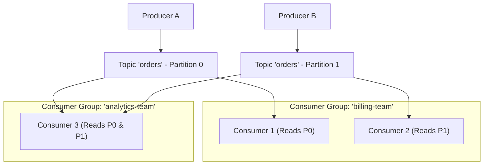
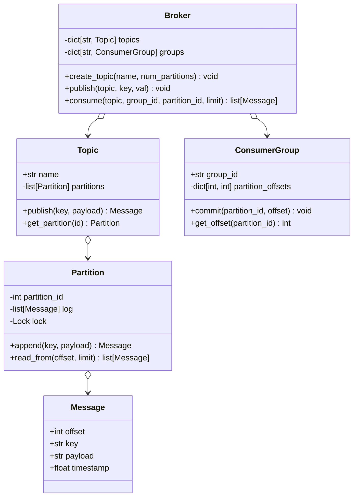

# System 14: In-Memory Pub/Sub Message Broker (Kafka Lite)

> **Zero-Prerequisite Intuition: The "Newspaper Subscription" Metaphor**
> What is a Publish/Subscribe (Pub/Sub) message broker, and why did the software industry invent it?
> Imagine a news agency that prints financial news. 
> If the news agency had to personally call 50,000 individual readers on the telephone every time a story broke, the journalists would spend 100% of their day dialing phones. If 5,000 new readers sign up, the journalists are completely overwhelmed.
> 
> Instead, the agency prints newspapers and drops them into a central **Newsstand (The Topic)**. 
> * **Publishers (Journalists):** Drop articles into the newsstand and immediately walk away.
> * **Subscribers (Readers):** Walk up to the newsstand whenever they are free, read the articles at their own speed, and remember which page they finished reading (**The Offset**).
> 
> In microservices (Amazon, Netflix, Uber), Order Services don't call Billing, Shipping, Analytics, and Fraud directly. They publish an `OrderPlaced` event to a message broker, and each downstream team consumes it independently!
> 
> This chapter designs an **In-Memory Pub/Sub Message Broker** (a simplified Apache Kafka engine) in pure Python.

---

## 1. Requirements & Core Concepts

### Core Primitives Defined
1. **Message:** An immutable payload with a `key`, `value`, `timestamp`, and assigned `offset`.
2. **Topic:** A named logical stream of messages (e.g., `user-signups`).
3. **Partition:** A strictly ordered, append-only log within a topic that guarantees message order.
4. **Consumer Group:** A collection of consumers cooperating to read data. Each message sent to a topic is delivered to **one consumer instance within each subscribing consumer group**.



---

## 2. Design Pattern & Class Hierarchy



---

## 3. Complete Python Implementation

```python
# pub_sub_broker.py
import threading
import time
from typing import Dict, List, Optional
from dataclasses import dataclass

# ==========================================
# 1. Immutable Message
# ==========================================
@dataclass(frozen=True)
class Message:
    offset: int
    key: Optional[str]
    payload: str
    timestamp: float

# ==========================================
# 2. Append-Only Partition Log
# ==========================================
class Partition:
    def __init__(self, partition_id: int):
        self.partition_id = partition_id
        self._log: List[Message] = []
        self._lock = threading.Lock()

    def append(self, key: Optional[str], payload: str) -> Message:
        with self._lock:
            offset = len(self._log)
            msg = Message(
                offset=offset,
                key=key,
                payload=payload,
                timestamp=time.time()
            )
            self._log.append(msg)
            return msg

    def read_from(self, offset: int, max_messages: int = 10) -> List[Message]:
        with self._lock:
            if offset >= len(self._log):
                return []
            return self._log[offset : offset + max_messages]

# ==========================================
# 3. Partitioned Topic
# ==========================================
class Topic:
    def __init__(self, name: str, num_partitions: int = 3):
        self.name = name
        self.num_partitions = num_partitions
        self.partitions: List[Partition] = [Partition(i) for i in range(num_partitions)]

    def _get_partition_index(self, key: Optional[str]) -> int:
        if key is None:
            # Round-robin or default to partition 0
            return 0
        # Deterministic hashing: same key always maps to same partition!
        return hash(key) % self.num_partitions

    def publish(self, key: Optional[str], payload: str) -> Message:
        p_idx = self._get_partition_index(key)
        partition = self.partitions[p_idx]
        return partition.append(key, payload)

# ==========================================
# 4. Consumer Group & Offset State
# ==========================================
class ConsumerGroup:
    def __init__(self, group_id: str):
        self.group_id = group_id
        # Tracks current committed offset: partition_id -> next_offset_to_read
        self.offsets: Dict[int, int] = {}
        self._lock = threading.Lock()

    def get_offset(self, partition_id: int) -> int:
        with self._lock:
            return self.offsets.get(partition_id, 0)

    def commit_offset(self, partition_id: int, processed_offset: int) -> None:
        with self._lock:
            # Next read begins at processed_offset + 1
            self.offsets[partition_id] = processed_offset + 1

# ==========================================
# 5. Master In-Memory Broker
# ==========================================
class InMemoryBroker:
    def __init__(self):
        self.topics: Dict[str, Topic] = {}
        self.consumer_groups: Dict[str, ConsumerGroup] = {}
        self._lock = threading.Lock()

    def create_topic(self, name: str, num_partitions: int = 3) -> Topic:
        with self._lock:
            if name in self.topics:
                raise ValueError(f"Topic '{name}' already exists.")
            topic = Topic(name, num_partitions)
            self.topics[name] = topic
            return topic

    def publish(self, topic_name: str, payload: str, key: Optional[str] = None) -> Message:
        topic = self.topics.get(topic_name)
        if not topic:
            raise KeyError(f"Topic '{topic_name}' does not exist.")
        return topic.publish(key, payload)

    def consume(self, topic_name: str, group_id: str, partition_id: int, limit: int = 5) -> List[Message]:
        topic = self.topics.get(topic_name)
        if not topic:
            raise KeyError(f"Topic '{topic_name}' does not exist.")

        with self._lock:
            if group_id not in self.consumer_groups:
                self.consumer_groups[group_id] = ConsumerGroup(group_id)
            group = self.consumer_groups[group_id]

        current_offset = group.get_offset(partition_id)
        partition = topic.partitions[partition_id]
        
        messages = partition.read_from(current_offset, max_messages=limit)
        if messages:
            # Advance offset to the last read message
            last_offset = messages[-1].offset
            group.commit_offset(partition_id, last_offset)

        return messages
```

---

## 4. Verification: Multi-Consumer Group Isolation

```python
if __name__ == "__main__":
    broker = InMemoryBroker()
    broker.create_topic("payments.v1", num_partitions=2)

    # 1. Publish events with keys
    msg1 = broker.publish("payments.v1", payload="Charge $100 for User Alice", key="user_alice")
    msg2 = broker.publish("payments.v1", payload="Charge $50 for User Bob", key="user_bob")
    msg3 = broker.publish("payments.v1", payload="Charge $200 for User Alice", key="user_alice")

    print(f"Published 3 messages. Notice how user_alice events landed on same partition!")

    # 2. Consumer Group 1: Fraud Detection
    fraud_batch = broker.consume("payments.v1", group_id="fraud-service", partition_id=0)
    print(f"\n[Fraud Service] Read {len(fraud_batch)} events from Partition 0:")
    for m in fraud_batch:
        print(f"  Offset {m.offset}: {m.payload}")

    # 3. Consumer Group 2: Analytics (Completely independent offsets!)
    analytics_batch = broker.consume("payments.v1", group_id="analytics-service", partition_id=0)
    print(f"\n[Analytics Service] Read {len(analytics_batch)} events from Partition 0:")
    for m in analytics_batch:
        print(f"  Offset {m.offset}: {m.payload}")
```
Both consumer groups read the exact same data without interfering with each other's reading progress!


---

## 4. Edge Cases, Tests and Extensions

### Semantics and the weak spots

| Concern | Status | Detail |
| :--- | :--- | :--- |
| Per-key ordering | Good | Same key goes to the same partition, and a partition is an append-only log |
| Independent consumer groups | Good | Each group has its own offsets, so fraud and analytics both see every message |
| Key to partition mapping | **Bug across restarts** | `hash(key)` for a `str` is randomised per process (hash randomisation), so after a restart the same key can land on a different partition and order is lost |
| Keyless messages | Hot partition | `key=None` always goes to partition 0; round-robin spreads the load |
| Offset committed on read | At-most-once | `consume` advances the offset before the caller has processed the batch; a crash loses messages. Kafka separates `poll` from `commit` |
| Two consumers in one group on one partition | **Duplicates** | `get_offset` and `commit_offset` are separate lock acquisitions, so both can read the same batch |
| Retention | None | The log grows forever; real brokers delete or compact by size, time or key |

### Tests

This block extends the implementation above. It starts subprocesses with different `PYTHONHASHSEED` values to show the partitioning bug for real.

```python
# continues: pub/sub implementation above
import os, subprocess, sys, threading, zlib

b = InMemoryBroker()
b.create_topic("t", num_partitions=3)
try:
    b.create_topic("t"); raise AssertionError("expected ValueError")
except ValueError:
    pass
try:
    b.publish("missing", "x"); raise AssertionError("expected KeyError")
except KeyError:
    pass

# Per-key ordering and independent groups
for i in range(5):
    b.publish("t", f"a{i}", key="alice")
p = b.topics["t"]._get_partition_index("alice")
first = b.consume("t", "g1", p, limit=3)
assert [m.payload for m in first] == ["a0", "a1", "a2"]
assert [m.payload for m in b.consume("t", "g1", p, limit=10)] == ["a3", "a4"]    # continues from the committed offset
assert b.consume("t", "g1", p) == []                                              # drained
assert len(b.consume("t", "g2", p, limit=10)) == 5                                # another group starts at 0

# Keyless messages all land on partition 0 (a hot partition)
b2 = InMemoryBroker(); b2.create_topic("k", 4)
for i in range(20):
    b2.publish("k", str(i))
assert [len(p._log) for p in b2.topics["k"].partitions] == [20, 0, 0, 0]

# Bug: the same key maps to different partitions in different processes
code = "print(hash('user_alice') % 3)"
seen = {subprocess.run([sys.executable, "-c", code], capture_output=True, text=True, env={**os.environ, "PYTHONHASHSEED": str(s)}).stdout.strip() for s in range(1, 9)}
assert len(seen) > 1

# Fix: a stable hash, and round-robin for keyless messages
class StableTopic(Topic):
    def __init__(self, name, num_partitions=3):
        super().__init__(name, num_partitions); self._rr = 0; self._rr_lock = threading.Lock()
    def _get_partition_index(self, key):
        if key is None:
            with self._rr_lock:
                self._rr += 1
                return self._rr % self.num_partitions
        return zlib.crc32(key.encode("utf-8")) % self.num_partitions

t = StableTopic("s", 5)
assert t._get_partition_index("user_alice") == zlib.crc32(b"user_alice") % 5      # same in every process
for i in range(20):
    t.publish(None, str(i))
assert all(len(p._log) == 4 for p in t.partitions)

# Duplicates: two consumers of one group both read offset 0 before either commits
g = ConsumerGroup("dup")
o1, o2 = g.get_offset(0), g.get_offset(0)
assert o1 == o2 == 0

# Fix: make read-and-advance atomic per group
class SafeBroker(InMemoryBroker):
    def consume(self, topic_name, group_id, partition_id, limit=5):
        with self._lock:
            self.consumer_groups.setdefault(group_id, ConsumerGroup(group_id))
            group = self.consumer_groups[group_id]
        with group._lock:
            start = group.offsets.get(partition_id, 0)
            msgs = self.topics[topic_name].partitions[partition_id].read_from(start, limit)
            if msgs:
                group.offsets[partition_id] = msgs[-1].offset + 1
            return msgs

sb = SafeBroker(); sb.create_topic("t", 1)
for i in range(300):
    sb.publish("t", str(i), key="k")
got = []
def worker():
    while True:
        m = sb.consume("t", "grp", 0, limit=1)
        if not m: return
        got.append(m[0].offset)
ts = [threading.Thread(target=worker) for _ in range(4)]
[x.start() for x in ts]; [x.join() for x in ts]
assert sorted(got) == list(range(300))            # every message exactly once across the four consumers
print("pub/sub tests passed")
```

### Extensions interviewers ask for

1. **At-least-once with explicit commit:** split `consume` into `poll` (returns messages and a token) and `commit(token)`; on restart the group resumes from the last commit, so messages may repeat and handlers must be idempotent.
2. **Consumer group membership:** assign partitions to the consumers of a group with the rebalance logic from the Kafka case study, so two consumers never read the same partition.
3. **Retention and compaction:** delete segments older than N hours, or keep only the latest message per key for a "current state" topic.
4. **Backpressure and slow consumers:** because consumers pull, a slow one just lags; expose lag (`log_end_offset - committed_offset`) as the key health metric.
5. **Delivery guarantees summary:** at-most-once (commit before processing), at-least-once (commit after), effectively-once (at-least-once plus idempotent processing or transactions).

### Follow-up questions

- *Why partition at all?* One log has one writer-ordering point; partitions give parallelism while preserving order per key, and are the unit of consumer scaling.
- *What limits consumer parallelism?* The partition count: a group cannot usefully have more active consumers than partitions.
- *Why must the key hash be stable?* Ordering per key depends on the key always reaching the same partition; a hash that changes between runs silently breaks it.
