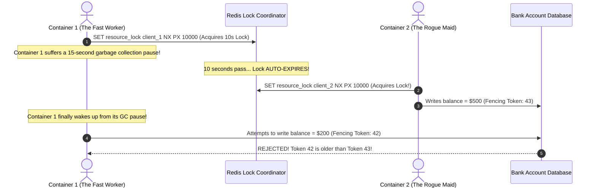

# LLD Case Study 15: Distributed Lock Manager (Redlock & Fencing Tokens)

> **The Bridge: Moving from 1 Server to 10 Servers!**
> In Chapter 00-B, we learned about `threading.Lock()`—the "single bathroom key."
> 
> But what happens when your company scales, and your application runs on **10 separate Docker containers across AWS**?
> 
> A Python `threading.Lock` only protects memory inside a **single computer process**. Container 1 knows nothing about Container 2's memory! If Container 1 and Container 2 both attempt to charge customer Alice at the same second, both containers will succeed, charging her credit card twice!
> 
> To solve this, we need a **Distributed Lock Manager**—a shared external coordinator (like Redis) where all containers must acquire a digital keycard before touching critical data.
> 
> In this case study, you will build the industrial **Redlock Algorithm** and master **Fencing Tokens** (the #1 trap interviewers test at Staff level).

---

## 1. Zero-Prerequisite Intuition: The "Hotel Keycard & Rogue Maid"



### The Problem: Why Simple Locks Break in Distributed Systems
1. **The Automatic Expiration (TTL):** In distributed systems, if a server acquires a lock and then crashes or gets hit by a lightning bolt, it can never release the lock. To prevent the entire company from deadlocking forever, all distributed locks have a **Time-To-Live (TTL)** (e.g. 10 seconds).
2. **The Danger (Long GC Pause):** What if Container 1 gets the lock, but then freezes for 15 seconds due to a full memory garbage collection pause?
   - While Container 1 is frozen, its 10-second lock expires!
   - Container 2 steps in, acquires the lock, and starts writing to the database.
   - Container 1 suddenly unfreezes, thinks it still holds the lock, and writes to the database at the exact same time as Container 2!
3. **The Solution: Fencing Tokens (Monotonic Counters):**
   - Every time a lock is granted, the lock manager increments a counter: Token 42, Token 43, Token 44.
   - When writing to the database, the database **only accepts writes with a higher token number than the last write**.
   - Container 1's write (Token 42) is rejected because Token 43 already committed!

---

## 2. Requirements & Architecture

### Functional Requirements:
1. **Mutual Exclusion:** Only one client can hold the lock for a given resource at any instant.
2. **Deadlock Freedom (Auto-Release):** Locks automatically expire after a configurable TTL if the holder crashes.
3. **Fault Tolerance (Redlock):** Lock acquisition succeeds if a majority of independent Redis nodes ($N/2 + 1$) agree.
4. **Fencing Token Generation:** Every successful acquisition returns a strictly increasing 64-bit integer token.

---

## 3. Production-Grade Python Implementation

```python
# distributed_lock_manager.py
import time
import uuid
from typing import Optional, List

class SimulatedRedisNode:
    """Simulates an independent Redis instance with atomic string operations."""
    def __init__(self, node_id: str):
        self.node_id = node_id
        self._store: dict[str, tuple[str, float]] = {} # key -> (val, expire_at)
        self.fencing_counter = 0

    def set_nx_px(self, key: str, value: str, ttl_ms: int) -> bool:
        """Atomic SET key value NX PX ttl_ms (Set if Not eXists with millisecond TTL)."""
        now = time.monotonic() * 1000
        # Clean expired entry
        if key in self._store and self._store[key][1] <= now:
            del self._store[key]

        if key not in self._store:
            expire_at = now + ttl_ms
            self._store[key] = (value, expire_at)
            return True
        return False

    def release_if_owner(self, key: str, value: str) -> bool:
        """Atomic Lua script releasing lock ONLY if the caller is the true owner."""
        now = time.monotonic() * 1000
        if key in self._store:
            val, expire_at = self._store[key]
            if expire_at > now and val == value:
                del self._store[key]
                return True
        return False


class LockHandle:
    def __init__(self, resource: str, token: str, fencing_token: int, validity_ms: float):
        self.resource = resource
        self.token = token                      # Random UUID to prove ownership
        self.fencing_token = fencing_token      # Monotonically increasing counter
        self.validity_ms = validity_ms


class RedlockManager:
    """
    Implements the Martin Kleppmann / Salvatore Sanfilippo Redlock specification.
    Acquires lock across N independent nodes to survive node failures.
    """
    def __init__(self, nodes: List[SimulatedRedisNode]):
        self.nodes = nodes
        self.quorum = (len(nodes) // 2) + 1
        self._global_fence = 0

    def acquire(self, resource: str, ttl_ms: int) -> Optional[LockHandle]:
        identifier = str(uuid.uuid4())
        start_time_ms = time.monotonic() * 1000
        
        nodes_acquired = 0
        for node in self.nodes:
            if node.set_nx_px(resource, identifier, ttl_ms):
                nodes_acquired += 1

        elapsed_ms = (time.monotonic() * 1000) - start_time_ms
        # Clock drift factor (usually 1% of TTL + network latency buffer)
        drift_ms = (ttl_ms * 0.01) + 2
        validity_time_ms = ttl_ms - elapsed_ms - drift_ms

        # Quorum Check: Must be acquired on a majority of nodes AND validity > 0
        if nodes_acquired >= self.quorum and validity_time_ms > 0:
            self._global_fence += 1
            return LockHandle(
                resource=resource,
                token=identifier,
                fencing_token=self._global_fence,
                validity_ms=validity_time_ms
            )
        else:
            # Failed to reach consensus: Release on all nodes immediately!
            self.release(LockHandle(resource, identifier, 0, 0))
            return None

    def release(self, handle: LockHandle) -> None:
        for node in self.nodes:
            node.release_if_owner(handle.resource, handle.token)


# --- Simulation Demonstration ---
if __name__ == "__main__":
    # Setup 3 independent Redis nodes (Quorum = 2)
    nodes = [SimulatedRedisNode(f"redis_{i}") for i in range(3)]
    manager = RedlockManager(nodes)

    print("--- [1] Client 1 Acquiring Distributed Lock ---")
    lock1 = manager.acquire(resource="order_invoice_9941", ttl_ms=5000)
    assert lock1 is not None
    print(f"Lock Acquired! Fencing Token: {lock1.fencing_token} | Validity: {lock1.validity_ms:.1f}ms")

    print("\n--- [2] Client 2 Attempting to Acquire the Same Lock ---")
    lock2 = manager.acquire(resource="order_invoice_9941", ttl_ms=5000)
    print(f"Client 2 Acquisition Result: {lock2} (Correctly BLOCKED!)")

    print("\n--- [3] Client 1 Releasing Lock ---")
    manager.release(lock1)
    print("Lock Released.")

    print("\n--- [4] Client 2 Re-Attempting Acquisition ---")
    lock2 = manager.acquire(resource="order_invoice_9941", ttl_ms=5000)
    assert lock2 is not None
    print(f"Client 2 Acquired Lock! Next Fencing Token: {lock2.fencing_token}")
```

---

## 4. Milestone Check: What You Just Mastered!

You now understand:
1. Why local mutexes (`threading.Lock`) fail in multi-container cloud environments.
2. How the **Redlock Algorithm** reaches consensus across independent Redis nodes ($N/2 + 1$).
3. Why **Fencing Tokens** are mandatory to prevent split-brain write corruption during long Garbage Collection pauses.
