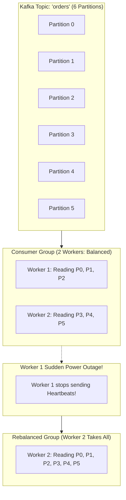

# LLD Case Study 16: Kafka Consumer Group Partition Rebalancing

> **The Bridge: How Do Consumers Share Work at Scale?**
> In Chapter 16 of Track 1, we learned that Apache Kafka scales horizontally by splitting a topic into **Partitions** (e.g. 12 partitions).
> 
> But what happens inside a **Consumer Group** when you have 4 worker applications reading those 12 partitions, and suddenly:
> 1. Worker 3 crashes!
> 2. Or you deploy 2 new servers to handle a traffic surge!
> 
> How do the surviving workers detect the crash, renegotiate ownership of the 12 partitions, and resume reading without duplicating or dropping messages?
> 
> This process is called **Consumer Group Partition Rebalancing**.
> In this case study, we will design the industrial **Cooperative Sticky Assignor** protocol and examine how modern streaming brokers avoid catastrophic "Stop-The-World" rebalance storms.

---

## 1. Zero-Prerequisite Intuition: The "Airport Baggage Carousel Shift"



### The Eager vs Cooperative Rebalance Revolution
* **The Legacy Eager Way ("Evasive Stop-The-World"):** When Worker 1 died, Kafka forced ALL surviving workers to drop ALL their assigned partitions. The entire message processing pipeline stopped cold for 30 seconds while everyone renegotiated from zero!
* **The Modern Cooperative Sticky Way (Incremental Handover):** 
  - Surviving workers keep processing their existing partitions without interruption.
  - Only the orphaned partitions (from the dead worker) are reassigned to the surviving workers.
  - Downtime drops from 30 seconds to **$0$ seconds**!

---

## 2. Requirements & Architecture

### Functional Requirements:
1. **Group Membership & Heartbeats:** Workers periodically send heartbeats to the Group Coordinator. If no heartbeat arrives within `session_timeout_ms`, the worker is marked dead.
2. **Deterministic Partition Assignment:** Distribute $M$ partitions across $N$ active consumers fairly and evenly.
3. **Sticky Allocation:** When rebalancing occurs, minimize partition movement (keep partitions on their previous consumers if still alive).
4. **Generation ID (Epoch Fencing):** Every rebalance increments a `generation_id` to reject stale commits from zombie workers.

---

## 3. Production-Grade Python Implementation

```python
# kafka_rebalance_engine.py
import time
from typing import Dict, List, Set, Optional

class Partition:
    def __init__(self, topic: str, partition_id: int):
        self.topic = topic
        self.partition_id = partition_id

    def __repr__(self):
        return f"{self.topic}-{self.partition_id}"


class ConsumerMember:
    def __init__(self, member_id: str):
        self.member_id = member_id
        self.assigned_partitions: Set[Partition] = set()
        self.last_heartbeat = time.monotonic()


class CooperativeStickyAssignor:
    """
    Distributes partitions evenly while preserving existing assignments (Stickiness).
    Minimizes partition migration during rebalances.
    """
    @staticmethod
    def assign(
        all_partitions: List[Partition], 
        active_members: List[ConsumerMember]
    ) -> Dict[str, Set[Partition]]:
        if not active_members:
            return {}

        target_per_consumer = len(all_partitions) // len(active_members)
        remainder = len(all_partitions) % len(active_members)
        
        new_assignments: Dict[str, Set[Partition]] = {m.member_id: set() for m in active_members}
        unassigned_partitions: Set[Partition] = set(all_partitions)

        # Step 1: Retain sticky partitions if still valid
        for member in active_members:
            retained = member.assigned_partitions.intersection(unassigned_partitions)
            # Cap retention to fair share
            while len(retained) > target_per_consumer + (1 if remainder > 0 else 0):
                retained.pop()
            
            new_assignments[member.member_id] = retained
            unassigned_partitions.difference_update(retained)

        # Step 2: Distribute remaining unassigned partitions evenly
        member_idx = 0
        for partition in sorted(unassigned_partitions, key=lambda p: p.partition_id):
            # Find member with fewest partitions
            least_loaded = min(active_members, key=lambda m: len(new_assignments[m.member_id]))
            new_assignments[least_loaded.member_id].add(partition)

        return new_assignments


class GroupCoordinator:
    """Manages group heartbeats, failure detection, and incremental rebalance triggers."""
    def __init__(self, group_id: str, partitions: List[Partition], session_timeout_sec: float = 3.0):
        self.group_id = group_id
        self.partitions = partitions
        self.session_timeout_sec = session_timeout_sec
        self.members: Dict[str, ConsumerMember] = {}
        self.generation_id = 0

    def register_member(self, member_id: str):
        self.members[member_id] = ConsumerMember(member_id)
        self.trigger_rebalance("Member joined")

    def heartbeat(self, member_id: str):
        if member_id in self.members:
            self.members[member_id].last_heartbeat = time.monotonic()

    def check_failures_and_rebalance(self):
        now = time.monotonic()
        dead_members = [
            m_id for m_id, m in self.members.items() 
            if now - m.last_heartbeat > self.session_timeout_sec
        ]
        
        if dead_members:
            for d in dead_members:
                print(f"[COORDINATOR] Worker '{d}' missed heartbeats! Marking DEAD.")
                del self.members[d]
            self.trigger_rebalance("Worker failure detected")

    def trigger_rebalance(self, reason: str):
        self.generation_id += 1
        print(f"\n[REBALANCE Triggered: {reason}] Generation: {self.generation_id}")
        
        assignments = CooperativeStickyAssignor.assign(
            self.partitions, 
            list(self.members.values())
        )
        
        for m_id, parts in assignments.items():
            self.members[m_id].assigned_partitions = parts
            print(f"  -> {m_id}: {[str(p) for p in parts]}")


# --- Simulation Demonstration ---
if __name__ == "__main__":
    # Create 6 topic partitions
    partitions = [Partition("orders", i) for i in range(6)]
    coordinator = GroupCoordinator("order_consumers", partitions, session_timeout_sec=1.0)

    print("--- [STAGE 1] Workers A and B Join the Group ---")
    coordinator.register_member("worker_A")
    coordinator.register_member("worker_B")

    print("\n--- [STAGE 2] Worker C Joins to Share Load ---")
    coordinator.register_member("worker_C")

    print("\n--- [STAGE 3] Normal Heartbeats Keep Group Stable ---")
    coordinator.heartbeat("worker_A")
    coordinator.heartbeat("worker_B")
    coordinator.heartbeat("worker_C")
    print("Heartbeats acknowledged. Zero rebalances needed.")

    print("\n--- [STAGE 4] Worker B Crashes (Misses Heartbeats) ---")
    # Simulate time passing without Worker B sending heartbeats
    time.sleep(1.2)
    coordinator.heartbeat("worker_A")
    coordinator.heartbeat("worker_C")
    # Coordinator detects Worker B timeout and rebalances stickily!
    coordinator.check_failures_and_rebalance()
```

---

## 4. Milestone Check: What You Just Mastered!

You now understand:
1. How Kafka divides topic partitions among consumer group members.
2. Why **Stop-The-World** rebalances caused multi-minute production outages in legacy systems.
3. How the **Cooperative Sticky Assignor** preserves live partition assignments while transferring only orphaned partitions.
4. How **Generation IDs** prevent stale writes from zombie workers that temporarily disconnected.
