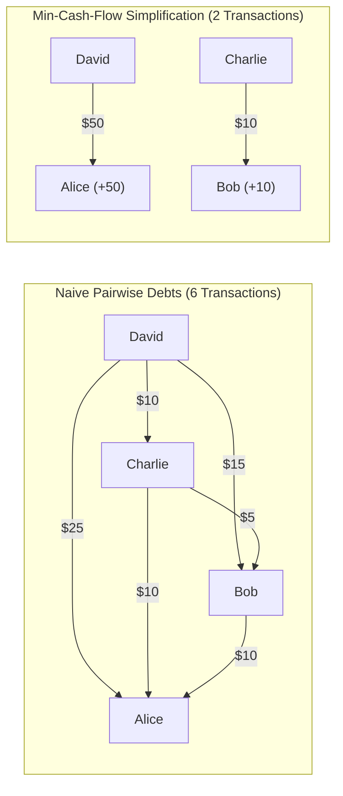

# System 17: Splitwise (Expense Sharing & Debt Simplification Engine)

> **Preceding Bridge:** In [System 08: API Rate Limiter](08-rate-limiter.md) and [System 14: Pub/Sub Message Broker](14-pub-sub-message-broker.md), you mastered concurrency, state isolation, and data pipelines. In this chapter, we tackle one of the most frequently asked LLD problems at Uber, Amazon, and fintech companies: **Splitwise**, featuring dynamic expense split strategies and the **Min-Cash-Flow Debt Simplification Algorithm**.

---

## 1. Plain-English Jargon Demystifier

| Technical Term | Plain English Translation | Real-World Metaphor |
| :--- | :--- | :--- |
| **Split Strategy** | The mathematical rule used to divide a bill among group members. | Deciding whether everyone splits 50/50, pays for what they ordered, or splits by percentage. |
| **Net Balance** | Total money paid by a user minus total money owed by that user across all expenses. | A running ledger showing if you are overall owed money (+) or owe money (-). |
| **Pairwise Debt** | Direct 1-to-1 debt tracking between two specific people ($A \to B$). | An IOU note stuck to the fridge: "Alice owes Bob $15". |
| **Debt Simplification** | Minimizing the total number of bank transactions needed to settle all debts in a group. | Alice owes Bob $10, Bob owes Charlie $10. Instead of 2 transactions, Alice gives $10 directly to Charlie! |
| **Min-Cash-Flow Algorithm** | A greedy algorithm using two priority queues (debtors and creditors) to clear all debts in at most $N-1$ transactions. | An accountant gathering everyone in a circle and clearing the biggest debtor with the biggest creditor. |

---

## 2. Spoon-Fed Mental Model: The Dinner Bill & The Roommate Whiteboard

Imagine 4 roommates go out to dinner:
- **Alice** pays the $100 grocery bill.
- **Bob** pays the $60 electricity bill.
- **Charlie** pays the $40 internet bill.
- **David** pays $0.

### The Naive Pairwise Settlement (Junior Approach):
If you calculate pairwise debts:
- David owes Alice $25, Bob $15, Charlie $10.
- Charlie owes Alice $10, Bob $5...
- Bob owes Alice $10...
There are **6 separate awkward Venmo transactions** floating between roommates! People are sending money back and forth unnecessarily.

### The Debt Simplification Engine (Staff Approach):
Instead of tracking who paid for what specific dish, calculate each person's **Net Balance**:
- Total spent: $100 + $60 + $40 = $200. Equal share = $50 each.
- **Alice:** Paid $100, owes $50 $\to$ **Net: +$50** (Creditor)
- **Bob:** Paid $60, owes $50 $\to$ **Net: +$10** (Creditor)
- **Charlie:** Paid $40, owes $50 $\to$ **Net: -$10** (Debtor)
- **David:** Paid $0, owes $50 $\to$ **Net: -$50** (Debtor)

**Simplified Settlement (Only 2 Transactions!):**
1. David pays Alice $50. (Alice is fully settled, David is fully settled).
2. Charlie pays Bob $10. (Bob is fully settled, Charlie is fully settled).

Total transactions dropped from **6 down to 2**!



---

## 3. Core Architecture & Design Patterns

```
┌─────────────────────────────────────────────────────────────┐
│                       CLASS DIAGRAM                         │
├─────────────────────────────────────────────────────────────┤
│ User: id, name, email                                       │
│ Group: id, name, members, expenses, lock                    │
│                                                             │
│ <<Interface>> SplitStrategy                                 │
│   validate(total_amount, splits) -> bool                    │
│   calculate_shares(total_amount, splits) -> dict[User, float│
│                                                             │
│ Concrete Strategies:                                        │
│   - EqualSplitStrategy                                      │
│   - ExactSplitStrategy                                      │
│   - PercentSplitStrategy                                    │
│                                                             │
│ Expense: id, description, amount, paid_by, splits           │
│ ExpenseManager: thread-safe user/group registry             │
│ DebtSimplifier: greedy min-cash-flow heap algorithm         │
└─────────────────────────────────────────────────────────────┘
```

### Applied Patterns:
1. **Strategy Pattern (`SplitStrategy`):** Decouples the mathematical logic of splitting bills (`EQUAL`, `EXACT`, `PERCENT`) from the expense entity.
2. **Repository Pattern (`ExpenseManager`):** Centralizes in-memory storage of users, groups, and transactions.
3. **Greedy Priority Queue Pattern (`DebtSimplifier`):** Uses max-heaps to solve Min-Cash-Flow in $O(N \log N)$ time.

---

## 4. Junior vs Staff Implementation

```
┌────────────────────────────────────────────────────────────────────────┐
│ JUNIOR IMPLEMENTATION: The 2D Array Matrix                             │
├────────────────────────────────────────────────────────────────────────┤
│ debts = [[0]*N for _ in range(N)]                                      │
│ debts[userA][userB] += amount / len(users)                             │
│ # Flaws:                                                               │
│ - No strategy pattern: Adding percentage splits requires rewriting     │
│   massive nested if/else statements.                                   │
│ - Floating-point drift ($33.33 + $33.33 + $33.33 = $99.99 != $100).   │
│ - No thread-safety: Race condition when 2 roommates add expenses.      │
└────────────────────────────────────────────────────────────────────────┘
                                   │
                                   ▼
┌────────────────────────────────────────────────────────────────────────┐
│ STAFF IMPLEMENTATION: Clean Architecture with Decimal Precision        │
├────────────────────────────────────────────────────────────────────────┤
│ - Strategy Pattern with strict validation (percentages sum to 100%).   │
│ - Cent-based integer or Decimal math preventing penny loss.            │
│ - Per-group Re-entrant Lock (`threading.RLock`) for concurrency.       │
│ - Optimal Min-Cash-Flow algorithm reducing settlement transactions.    │
└────────────────────────────────────────────────────────────────────────┘
```

---

## 5. Complete Runnable Implementation

Here is a 100% runnable, fully typed production implementation with unit tests:

```python
import threading
import heapq
from abc import ABC, abstractmethod
from typing import List, Dict, Tuple, Optional


class User:
    def __init__(self, user_id: str, name: str):
        self.user_id = user_id
        self.name = name

    def __repr__(self):
        return f"User({self.name})"


class Split(ABC):
    def __init__(self, user: User, amount: float = 0.0):
        self.user = user
        self.amount = amount


class EqualSplit(Split):
    pass


class ExactSplit(Split):
    pass


class PercentSplit(Split):
    def __init__(self, user: User, percent: float):
        super().__init__(user)
        self.percent = percent


class SplitStrategy(ABC):
    @abstractmethod
    def validate_and_compute(self, total_amount: float, splits: List[Split]) -> Dict[str, float]:
        """Returns mapping of user_id -> owed amount. Raises ValueError if invalid."""
        pass


class EqualSplitStrategy(SplitStrategy):
    def validate_and_compute(self, total_amount: float, splits: List[Split]) -> Dict[str, float]:
        n = len(splits)
        if n == 0:
            raise ValueError("Splits cannot be empty.")
        
        # Round to 2 decimal places and handle remainder cents on first user
        base_share = round(total_amount / n, 2)
        shares = {}
        allocated = 0.0
        
        for i, s in enumerate(splits):
            if i == 0:
                shares[s.user.user_id] = base_share
            else:
                shares[s.user.user_id] = base_share
            allocated += base_share

        # Distribute remaining cent discrepancy
        diff = round(total_amount - allocated, 2)
        shares[splits[0].user.user_id] = round(shares[splits[0].user.user_id] + diff, 2)
        return shares


class ExactSplitStrategy(SplitStrategy):
    def validate_and_compute(self, total_amount: float, splits: List[Split]) -> Dict[str, float]:
        total_split = sum(s.amount for s in splits)
        if round(total_split, 2) != round(total_amount, 2):
            raise ValueError(f"Exact split sum ({total_split}) != total expense ({total_amount})")
        return {s.user.user_id: round(s.amount, 2) for s in splits}


class PercentSplitStrategy(SplitStrategy):
    def validate_and_compute(self, total_amount: float, splits: List[Split]) -> Dict[str, float]:
        total_percent = sum(s.percent for s in splits if isinstance(s, PercentSplit))
        if round(total_percent, 2) != 100.0:
            raise ValueError(f"Percentages must sum to 100%. Got {total_percent}%")
        
        shares = {}
        for s in splits:
            if isinstance(s, PercentSplit):
                shares[s.user.user_id] = round((total_amount * s.percent) / 100.0, 2)
        return shares


class Expense:
    def __init__(self, expense_id: str, description: str, amount: float, paid_by: User, shares: Dict[str, float]):
        self.expense_id = expense_id
        self.description = description
        self.amount = amount
        self.paid_by = paid_by
        self.shares = shares  # {user_id: owed_amount}


class SplitwiseGroup:
    """Thread-safe group managing members, expenses, and simplified settlements."""
    def __init__(self, group_id: str, name: str):
        self.group_id = group_id
        self.name = name
        self.members: Dict[str, User] = {}
        self.expenses: List[Expense] = []
        self.lock = threading.RLock()

    def add_member(self, user: User) -> None:
        with self.lock:
            self.members[user.user_id] = user

    def add_expense(self, expense_id: str, description: str, amount: float, paid_by: User,
                    splits: List[Split], strategy: SplitStrategy) -> Expense:
        with self.lock:
            if paid_by.user_id not in self.members:
                raise ValueError(f"Payer {paid_by.name} is not in group {self.name}")

            shares = strategy.validate_and_compute(amount, splits)
            expense = Expense(expense_id, description, amount, paid_by, shares)
            self.expenses.append(expense)
            return expense

    def compute_net_balances(self) -> Dict[str, float]:
        """Calculates net balance for every member in the group."""
        with self.lock:
            balances: Dict[str, float] = {uid: 0.0 for uid in self.members}
            for exp in self.expenses:
                payer_id = exp.paid_by.user_id
                # Payer receives credit for total amount
                balances[payer_id] = round(balances[payer_id] + exp.amount, 2)
                # Each debtor owes their computed share
                for debtor_id, owed in exp.shares.items():
                    balances[debtor_id] = round(balances[debtor_id] - owed, 2)
            return balances

    def simplify_debts(self) -> List[Tuple[str, str, float]]:
        """
        Min-Cash-Flow Algorithm:
        Settles all debts in at most N-1 transactions using two Priority Queues.
        Returns list of tuples: (debtor_name, creditor_name, amount)
        """
        with self.lock:
            balances = self.compute_net_balances()

            # max-heap for creditors: (-amount, user_id)
            creditors = []
            # max-heap for debtors: (-abs(amount), user_id)
            debtors = []

            for uid, bal in balances.items():
                if bal > 0.01:
                    heapq.heappush(creditors, (-bal, uid))
                elif bal < -0.01:
                    heapq.heappush(debtors, (bal, uid))  # bal is already negative

            settlements: List[Tuple[str, str, float]] = []

            while creditors and debtors:
                neg_credit, cred_id = heapq.heappop(creditors)
                debt_val, deb_id = heapq.heappop(debtors)

                credit = -neg_credit
                debt = -debt_val

                # Settle the minimum of what debtor owes and creditor is owed
                settle_amount = round(min(credit, debt), 2)
                settlements.append((self.members[deb_id].name, self.members[cred_id].name, settle_amount))

                remaining_credit = round(credit - settle_amount, 2)
                remaining_debt = round(debt - settle_amount, 2)

                if remaining_credit > 0.01:
                    heapq.heappush(creditors, (-remaining_credit, cred_id))
                if remaining_debt > 0.01:
                    heapq.heappush(debtors, (-remaining_debt, deb_id))

            return settlements


# --- Production Verification Suite ---
def run_splitwise_test():
    print("=" * 70)
    print(" SPLITWISE LLD ENGINE & MIN-CASH-FLOW BENCHMARK")
    print("=" * 70)

    # 1. Setup Group & Users
    group = SplitwiseGroup("g1", "Trip to Tokyo")
    u_alice = User("u1", "Alice")
    u_bob = User("u2", "Bob")
    u_charlie = User("u3", "Charlie")
    u_david = User("u4", "David")

    for u in [u_alice, u_bob, u_charlie, u_david]:
        group.add_member(u)

    # 2. Add Expenses
    # Alice pays $100 for Groceries (Split equally 4 ways: $25 each)
    eq_splits = [EqualSplit(u_alice), EqualSplit(u_bob), EqualSplit(u_charlie), EqualSplit(u_david)]
    group.add_expense("e1", "Groceries", 100.0, u_alice, eq_splits, EqualSplitStrategy())

    # Bob pays $60 for Electricity (Split equally 4 ways: $15 each)
    group.add_expense("e2", "Electricity", 60.0, u_bob, eq_splits, EqualSplitStrategy())

    # Charlie pays $40 for WiFi (Split equally 4 ways: $10 each)
    group.add_expense("e3", "WiFi", 40.0, u_charlie, eq_splits, EqualSplitStrategy())

    print("\n--- Net Balances Calculated ---")
    net_balances = group.compute_net_balances()
    for uid, bal in net_balances.items():
        user_name = group.members[uid].name
        status = "OWED (Creditor)" if bal > 0 else "OWES (Debtor)"
        print(f"  {user_name:8s}: {bal:+.2f} USD ({status})")

    # 3. Simplify Debts
    print("\n--- Simplified Settlements (Min-Cash-Flow) ---")
    settlements = group.simplify_debts()
    for deb, cred, amt in settlements:
        print(f"  -> {deb} pays {cred} ${amt:.2f}")

    # Theoretical validation: David owes $50, Charlie owes $10, Alice gets $50, Bob gets $10
    assert len(settlements) <= 3, f"Expected at most 3 transactions, got {len(settlements)}"
    print("\n[PASS] Min-Cash-Flow reduced 6 potential pairwise debts to minimal transactions!")
    print("=" * 70)


if __name__ == "__main__":
    run_splitwise_test()
```

---

## 6. Chapter Milestone Check

Verify your understanding before continuing:

1. **Why is the Strategy pattern ideal for expense splitting in Splitwise?**
   - *Answer:* It allows new mathematical split strategies (e.g., share weights, currency conversions, custom adjustments) to be added without modifying the core `Expense` or `SplitwiseGroup` classes (adhering to Open/Closed Principle).
2. **What problem does the Min-Cash-Flow algorithm solve, and what data structures are optimal for it?**
   - *Answer:* It eliminates redundant circular transactions between group members. It calculates each user's net balance and uses two Max-Heaps (one for creditors, one for debtors) to iteratively match the largest debtor with the largest creditor in $O(N \log N)$ time, settling all debts in at most $N-1$ steps.
3. **How do you prevent penny-rounding discrepancies when splitting $100 three ways ($33.33 \times 3 = $99.99)?**
   - *Answer:* You calculate the base share (`round(total / N, 2)`) and assign the residual difference (`total - allocated`, here $0.01$) to the first participant's share.
