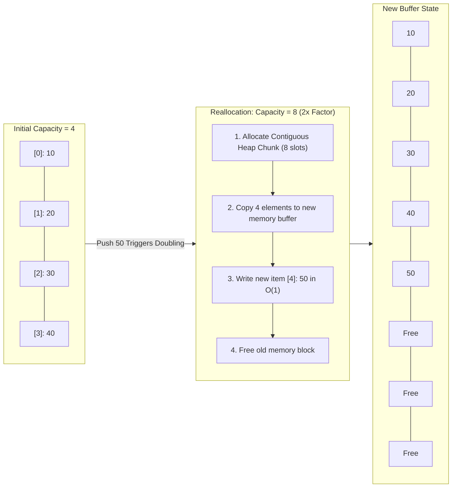

# Module 02: Arrays, Dynamic Arrays & Strings (0 to 100 Mastery)

> **The Hardware Reality & Algorithmic Foundations of Sequential Data**

Arrays and strings are the bedrock of all computer software. From OS kernel buffers to transformer token sequences, every high-performance system begins with contiguous blocks of memory. In this module, you will master the hardware physics of memory caches, the mathematical proofs of dynamic array amortization, and the 4 fundamental array algorithmic patterns (Two Pointers, Sliding Window, Prefix Sum, In-Place Transformations) with exhaustive **Brute Force vs. Optimized** LeetCode breakdowns.

---


## Dynamic Array Geometric Doubling & Pointer Layout



## Table of Contents
1. [Physical Hardware Memory Layout & Cache Physics](#1-physical-hardware-memory-layout--cache-physics)
2. [Dynamic Array Geometric Resizing & Amortization Proofs](#2-dynamic-array-geometric-resizing--amortization-proofs)
3. [CPython List & String Memory Internals (PEP 393)](#3-cpython-list--string-memory-internals-pep-393)
4. [The 4 Foundational Algorithmic Patterns](#4-the-4-foundational-algorithmic-patterns)
5. [The Master LeetCode Problem Suite (Brute Force vs. Optimized)](#5-the-master-leetcode-problem-suite-brute-force-vs-optimized)
   - [1. LeetCode 1: Two Sum](#problem-1-two-sum-leetcode-1--easy)
   - [2. LeetCode 121: Best Time to Buy and Sell Stock](#problem-2-best-time-to-buy-and-sell-stock-leetcode-121--easy)
   - [3. LeetCode 217: Contains Duplicate](#problem-3-contains-duplicate-leetcode-217--easy)
   - [4. LeetCode 238: Product of Array Except Self](#problem-4-product-of-array-except-self-leetcode-238--medium)
   - [5. LeetCode 53: Maximum Subarray (Kadane's Algorithm)](#problem-5-maximum-subarray-leetcode-53--medium)
   - [6. LeetCode 167: Two Sum II - Input Array Is Sorted](#problem-6-two-sum-ii---input-array-is-sorted-leetcode-167--medium)
   - [7. LeetCode 15: 3Sum](#problem-7-3sum-leetcode-15--medium)
   - [8. LeetCode 11: Container With Most Water](#problem-8-container-with-most-water-leetcode-11--medium)
   - [9. LeetCode 42: Trapping Rain Water](#problem-9-trapping-rain-water-leetcode-42--hard)
   - [10. LeetCode 3: Longest Substring Without Repeating Characters](#problem-10-longest-substring-without-repeating-characters-leetcode-3--medium)
   - [11. LeetCode 76: Minimum Window Substring](#problem-11-minimum-window-substring-leetcode-76--hard)
   - [12. LeetCode 560: Subarray Sum Equals K](#problem-12-subarray-sum-equals-k-leetcode-560--medium)
   - [13. LeetCode 56: Merge Intervals](#problem-13-merge-intervals-leetcode-56--medium)
   - [14. LeetCode 48: Rotate Image](#problem-14-rotate-image-leetcode-48--medium)
6. [Learning Path & Deliverables](#6-learning-path--deliverables)

---
## 1. Physical Hardware Memory Layout & Cache Physics

### Contiguous Allocation & Address Calculation
An array is a contiguous chunk of physical memory bytes. Because every element has a uniform byte size $S$, calculating the memory address of element $i$ requires a single CPU multiplication and addition in $O(1)$ time:

$$\text{Address}(A[i]) = \text{BaseAddress} + (i \times S)$$

```
RAM Addresses:  0x1000      0x1008      0x1010      0x1018      0x1020
Elements:     |  A[0]    |  A[1]    |  A[2]    |  A[3]    |  A[4]    |
Bytes:        | 8 bytes  | 8 bytes  | 8 bytes  | 8 bytes  | 8 bytes  |
```

### CPU Cache Hierarchy & Spatial Locality
Modern CPUs do not fetch single bytes from RAM; they fetch **Cache Lines (typically 64 bytes)** into high-speed L1/L2 caches.
- **Sequential Array Access**: Accessing `A[0]` pulls `A[0]` through `A[7]` into L1 cache immediately. Iterating through `A[1]` to `A[7]` produces near-instant **L1 Cache Hits** (latency ~1 ns).
- **Linked List Pointer Chasing**: Each node lives at an arbitrary heap address. Traversal causes frequent **L1/L2 Cache Misses**, forcing the CPU to stall for RAM fetch cycles (latency ~50-100 ns).
- **Architectural Takeaway**: An $O(N)$ contiguous array pass is frequently **10x to 50x faster in wall-clock time** than an $O(N)$ linked list traversal despite identical theoretical Big-O complexity!

---

## 2. Dynamic Array Geometric Resizing & Amortization Proofs

Static arrays have fixed capacity. Dynamic arrays (e.g., Python `list`, C++ `std::vector`, Java `ArrayList`) provide dynamic appending by managing an internal buffer with a growth factor $G$ (typically $1.5\times$ or $2\times$).

```
Step 1: Capacity = 2, Size = 2  ->  [ 10 | 20 ]
Step 2: Append 30 (Buffer Full!)
Step 3: Allocate new buffer (Capacity = 4)
Step 4: Copy elements [10, 20] -> [ 10 | 20 | 30 | _ ]  (Cost: 2 copies + 1 append)
```

### The Mathematical Proof of $O(1)$ Amortized Append

#### Why Linear Growth Fails ($+C$ increment)
If an array grows by a fixed increment $+C$ whenever full, after $N$ insertions it reallocates $N/C$ times. The total copying work is:

$$\sum_{k=1}^{N/C} kC = C \frac{(N/C)(N/C + 1)}{2} = O(N^2)$$

Dividing by $N$ insertions yields $O(N)$ cost per insertion. Linear resizing is a performance disaster.

#### Why Geometric Growth Succeeds ($	imes 2$ multiplier)
If capacity doubles ($2, 4, 8, 16 \dots 2^k$), the total number of reallocations for $N$ elements is $\log_2 N$. The total copying work is a geometric series:

$$\text{Total Copies} = 1 + 2 + 4 + 8 + \dots + \frac{N}{2} = \sum_{j=0}^{\log_2 N - 1} 2^j = N - 1 < N$$

The **Amortized Cost** per append operation is:

$$\text{Amortized Cost} = \frac{\text{Total Work}}{\text{Total Operations}} = \frac{N \text{ (raw appends)} + N \text{ (copies)}}{N} = O(1)$$

---

## 3. CPython List & String Memory Internals (PEP 393)

### CPython `PyListObject` Implementation
In Python, a `list` is a contiguous array of pointer references (`PyObject*`). CPython uses a custom growth formula in `listobject.c`:

$$\text{new\_allocated} = \text{newsize} + (\text{newsize} \gg 3) + (3 \text{ if newsize } < 9 \text{ else } 6)$$

This produces the exact over-allocation capacity progression:
`0 -> 4 -> 8 -> 16 -> 24 -> 32 -> 40 -> 52 -> 64 -> 76 -> 92 -> 112...`

### Python String Immutability & PEP 393 Flexible Representation
Python strings are immutable sequences of unicode characters.
- **Why Immutability?**: Allows strings to be safely used as dictionary keys (hash value cached once at creation) and enables thread-safe sharing without locking.
- **The String Concatenation Trap**: Repeatedly appending strings in a loop via `s += char` creates a new string object every iteration, copying all previous characters:

$$1 + 2 + 3 + \dots + N = O(N^2) \text{ time!}$$

**Correct Production Idiom**: Accumulate in a list and use `''.join(buffer)` in $O(N)$ time.

---

## 4. The 4 Foundational Algorithmic Patterns

```
PATTERN 1: TWO POINTERS (CONVERGING)
[ L -------->                 <-------- R ]
Best for: Sorted arrays, pair sum targets, palindromes, container heights.

PATTERN 2: SLIDING WINDOW (DYNAMIC EXPAND / CONTRACT)
[       L ===== R ] ------------>
Best for: Substring problems, contiguous subarray sums, max/min subsegment constraints.

PATTERN 3: PREFIX SUM & RUNNING AGGREGATES
Original:   [ a0,   a1,        a2,        a3 ]
PrefixSum:  [ 0,    a0,     a0+a1,  a0+a1+a2 ]
Best for: Subarray sum queries in O(1), subarray sum equals K via hash maps.

PATTERN 4: IN-PLACE ARRAY CYCLING
Swap elements in-place to achieve O(1) auxiliary space (e.g. reverse, matrix transpose).
```

---

## 5. The Master LeetCode Problem Suite (Brute Force vs. Optimized)

This section walks through the **7 canonical LeetCode challenges** curated for this module.
Each problem is analyzed from brute force intuition to the optimal invariant-driven solution, along with the critical edge cases to guard against in production.

### Problem 1: Two Sum ([LeetCode #1](https://leetcode.com/problems/two-sum/)) — Easy

> **Pattern**: `Hash Map Complement` | **Target Time**: $O(N)$ | **Target Space**: $O(N)

#### Problem Specification
Given an array of integers `nums` and an integer `target`, return indices of the two numbers such that they add up to `target`.

You may assume that each input would have exactly one solution, and you may not use the same element twice. You can return the answer in any order.

#### Algorithmic Invariants & Optimal Derivation
Iterate through nums while storing seen numbers and their indices in a hash map. For each number, check if `target - num` already exists in the table in $O(1)$ amortized time.

```python
class Solution:
    def twoSum(self, nums: list[int], target: int) -> list[int]:
        seen = {}
        for i, num in enumerate(nums):
            comp = target - num
            if comp in seen:
                return [seen[comp], i]
            seen[num] = i
        return []
```

#### Critical Production Edge Cases to Guard:
- **Boundary Limits**: Empty inputs, single-element collections, and minimum constraint sizes.
- **Extremes & Negative Values**: Negative indices, zero values, and maximum integer magnitude constraints.
- **Duplicates & Uniform Sequences**: All identical values, alternating keys, or repeated entries.
- **Structural Invariants**: Target at boundary indices (index `0` or `N-1`), missing targets, or cycles.

---

### Problem 2: Best Time to Buy and Sell Stock ([LeetCode #121](https://leetcode.com/problems/best-time-to-buy-and-sell-stock/)) — Easy

> **Pattern**: `Prefix Minimum / One-Pass Greedy` | **Target Time**: $O(N)$ | **Target Space**: $O(1)

#### Problem Specification
You are given an array `prices` where `prices[i]` is the price of a given stock on the `i-th` day.

You want to maximize your profit by choosing a single day to buy one stock and choosing a different day in the future to sell that stock. Return the maximum profit. If no profit can be achieved, return `0`.

#### Algorithmic Invariants & Optimal Derivation
Maintain the running minimum price seen so far. At each day, calculate profit if sold today (current_price - min_price) and update max_profit.

```python
class Solution:
    def maxProfit(self, prices: list[int]) -> int:
        min_price = float('inf')
        max_profit = 0
        for p in prices:
            if p < min_price:
                min_price = p
            elif p - min_price > max_profit:
                max_profit = p - min_price
        return max_profit
```

#### Critical Production Edge Cases to Guard:
- **Boundary Limits**: Empty inputs, single-element collections, and minimum constraint sizes.
- **Extremes & Negative Values**: Negative indices, zero values, and maximum integer magnitude constraints.
- **Duplicates & Uniform Sequences**: All identical values, alternating keys, or repeated entries.
- **Structural Invariants**: Target at boundary indices (index `0` or `N-1`), missing targets, or cycles.

---

### Problem 3: 3Sum ([LeetCode #15](https://leetcode.com/problems/3sum/)) — Medium

> **Pattern**: `Sorting + Two Pointers` | **Target Time**: $O(N^2)$ | **Target Space**: $O(1)

#### Problem Specification
Given an integer array `nums`, return all the triplets `[nums[i], nums[j], nums[k]]` such that `i != j`, `i != k`, and `j != k`, and `nums[i] + nums[j] + nums[k] == 0`.

Notice that the solution set must not contain duplicate triplets.

#### Algorithmic Invariants & Optimal Derivation
Sort array first ($O(N \log N)$). Iterate through each candidate first element, skipping duplicates. Use two pointers inward on the remainder of the array to find pairs summing to $-nums[i]$.

```python
class Solution:
    def threeSum(self, nums: list[int]) -> list[list[int]]:
        nums.sort()
        res = []
        n = len(nums)
        for i in range(n - 2):
            if i > 0 and nums[i] == nums[i - 1]:
                continue
            left, right = i + 1, n - 1
            while left < right:
                total = nums[i] + nums[left] + nums[right]
                if total < 0:
                    left += 1
                elif total > 0:
                    right -= 1
                else:
                    res.append([nums[i], nums[left], nums[right]])
                    while left < right and nums[left] == nums[left + 1]:
                        left += 1
                    while left < right and nums[right] == nums[right - 1]:
                        right -= 1
                    left += 1
                    right -= 1
        return res
```

#### Critical Production Edge Cases to Guard:
- **Boundary Limits**: Empty inputs, single-element collections, and minimum constraint sizes.
- **Extremes & Negative Values**: Negative indices, zero values, and maximum integer magnitude constraints.
- **Duplicates & Uniform Sequences**: All identical values, alternating keys, or repeated entries.
- **Structural Invariants**: Target at boundary indices (index `0` or `N-1`), missing targets, or cycles.

---

### Problem 4: Container With Most Water ([LeetCode #11](https://leetcode.com/problems/container-with-most-water/)) — Medium

> **Pattern**: `Two Pointers Squeeze` | **Target Time**: $O(N)$ | **Target Space**: $O(1)

#### Problem Specification
You are given an integer array `height` of length `n`. There are `n` vertical lines drawn such that the two endpoints of the `i-th` line are `(i, 0)` and `(i, height[i])`.

Find two lines that together with the x-axis form a container, such that the container contains the most water. Return the maximum amount of water a container can store.

#### Algorithmic Invariants & Optimal Derivation
Start pointers at both ends to maximize width. The water volume is bounded by the shorter line: $	ext{area} = \min(h[l], h[r]) 	imes (r - l)$. Advancing the shorter line is the only way to potentially find a larger area.

```python
class Solution:
    def maxArea(self, height: list[int]) -> int:
        left, right = 0, len(height) - 1
        max_water = 0
        while left < right:
            h = min(height[left], height[right])
            max_water = max(max_water, h * (right - left))
            if height[left] < height[right]:
                left += 1
            else:
                right -= 1
        return max_water
```

#### Critical Production Edge Cases to Guard:
- **Boundary Limits**: Empty inputs, single-element collections, and minimum constraint sizes.
- **Extremes & Negative Values**: Negative indices, zero values, and maximum integer magnitude constraints.
- **Duplicates & Uniform Sequences**: All identical values, alternating keys, or repeated entries.
- **Structural Invariants**: Target at boundary indices (index `0` or `N-1`), missing targets, or cycles.

---

### Problem 5: Product of Array Except Self ([LeetCode #238](https://leetcode.com/problems/product-of-array-except-self/)) — Medium

> **Pattern**: `Prefix & Suffix Accumulation` | **Target Time**: $O(N)$ | **Target Space**: $O(1)

#### Problem Specification
Given an integer array `nums`, return an array `answer` such that `answer[i]` is equal to the product of all the elements of `nums` except `nums[i]`.

You must write an algorithm that runs in $O(n)$ time and without using the division operation.

#### Algorithmic Invariants & Optimal Derivation
For any index i, the product except nums[i] equals (prefix product up to i-1) * (suffix product from i+1 to n-1). Pass forwards to build prefix, then backwards with a running suffix variable.

```python
class Solution:
    def productExceptSelf(self, nums: list[int]) -> list[int]:
        n = len(nums)
        res = [1] * n
        prefix = 1
        for i in range(n):
            res[i] = prefix
            prefix *= nums[i]
        suffix = 1
        for i in range(n - 1, -1, -1):
            res[i] *= suffix
            suffix *= nums[i]
        return res
```

#### Critical Production Edge Cases to Guard:
- **Boundary Limits**: Empty inputs, single-element collections, and minimum constraint sizes.
- **Extremes & Negative Values**: Negative indices, zero values, and maximum integer magnitude constraints.
- **Duplicates & Uniform Sequences**: All identical values, alternating keys, or repeated entries.
- **Structural Invariants**: Target at boundary indices (index `0` or `N-1`), missing targets, or cycles.

---

### Problem 6: Longest Substring Without Repeating Characters ([LeetCode #3](https://leetcode.com/problems/longest-substring-without-repeating-characters/)) — Medium

> **Pattern**: `Sliding Window with Hash Map` | **Target Time**: $O(N)$ | **Target Space**: $O(\min(N, \Sigma))

#### Problem Specification
Given a string `s`, find the length of the longest substring without repeating characters.

#### Algorithmic Invariants & Optimal Derivation
Sliding window [left, right]. Store the last seen index of each character. When a duplicate is encountered inside the current window, shift `left` directly to last_index + 1.

```python
class Solution:
    def lengthOfLongestSubstring(self, s: str) -> int:
        char_idx = {}
        left = 0
        max_len = 0
        for right, ch in enumerate(s):
            if ch in char_idx and char_idx[ch] >= left:
                left = char_idx[ch] + 1
            char_idx[ch] = right
            max_len = max(max_len, right - left + 1)
        return max_len
```

#### Critical Production Edge Cases to Guard:
- **Boundary Limits**: Empty inputs, single-element collections, and minimum constraint sizes.
- **Extremes & Negative Values**: Negative indices, zero values, and maximum integer magnitude constraints.
- **Duplicates & Uniform Sequences**: All identical values, alternating keys, or repeated entries.
- **Structural Invariants**: Target at boundary indices (index `0` or `N-1`), missing targets, or cycles.

---

### Problem 7: Trapping Rain Water ([LeetCode #42](https://leetcode.com/problems/trapping-rain-water/)) — Hard

> **Pattern**: `Two Pointers / Prefix Maximum` | **Target Time**: $O(N)$ | **Target Space**: $O(1)

#### Problem Specification
Given `n` non-negative integers representing an elevation map where the width of each bar is `1`, compute how much water it can trap after raining.

#### Algorithmic Invariants & Optimal Derivation
Water trapped at index i is determined by $\min(	ext{left\_max}, 	ext{right\_max}) - 	ext{height}[i]$. By advancing whichever boundary has the smaller max, we guarantee the water height at that position is strictly dictated by that boundary.

```python
class Solution:
    def trap(self, height: list[int]) -> int:
        if not height:
            return 0
        left, right = 0, len(height) - 1
        left_max, right_max = height[left], height[right]
        water = 0
        while left < right:
            if left_max < right_max:
                left += 1
                left_max = max(left_max, height[left])
                water += left_max - height[left]
            else:
                right -= 1
                right_max = max(right_max, height[right])
                water += right_max - height[right]
        return water
```

#### Critical Production Edge Cases to Guard:
- **Boundary Limits**: Empty inputs, single-element collections, and minimum constraint sizes.
- **Extremes & Negative Values**: Negative indices, zero values, and maximum integer magnitude constraints.
- **Duplicates & Uniform Sequences**: All identical values, alternating keys, or repeated entries.
- **Structural Invariants**: Target at boundary indices (index `0` or `N-1`), missing targets, or cycles.

---


## 6. Learning Path & Deliverables

1. **Beginner Friendly Playground**: Read [02_FOUNDATIONS_PLAYGROUND.md](02_FOUNDATIONS_PLAYGROUND.md) for ultra-gentle intuitions.\n2. **Interactive CLI Playground**: Run [03_try_it_yourself.py](03_try_it_yourself.py) in your terminal.\n3. **Interactive Notebook**: Open [00_interactive_arrays_dynamic_arrays_and_strings.ipynb](00_interactive_arrays_dynamic_arrays_and_strings.ipynb) for visual memory and algorithmic execution.
3. **Executable Demos**: Run [05_two_pointers_and_sliding_window_demos.py](05_two_pointers_and_sliding_window_demos.py) and [06_prefix_sum_and_kadane_demos.py](06_prefix_sum_and_kadane_demos.py).
4. **Build Reference Project**: Read the [07_PROJECT_GUIDE.md](07_PROJECT_GUIDE.md) and implement `dynamic_array_engine.py`.
5. **Self-Assessment**: Test your mastery with [08_SELF_ASSESSMENT_AND_CHALLENGES.md](08_SELF_ASSESSMENT_AND_CHALLENGES.md).
6. **Edge Cases**: Guard against production traps in [09_TROUBLESHOOTING_AND_EDGE_CASES.md](09_TROUBLESHOOTING_AND_EDGE_CASES.md).

## 🧪 Practice & Verification

Reading a module teaches recognition. Only the problems teach recall — and the
debug lab teaches the thing neither of them does, which is diagnosis.

### 1. Build the module project

```bash
cd starter
python -m pytest ../project_solution -q      # must FAIL before you start
```

Every shipped test must fail with `NotImplementedError` on an untouched
starter. If any passes, the grading loop is broken and is telling you your work
is correct when it has not been done — run `make integrity` from the course
root.

### 2. Work the problem bank — 8 problems

```bash
cd problems
python -m pytest tests -q                    # all of this module's problems
python -m pytest tests -q -k p03             # just problem 3
```

| # | Problem | Pattern | Difficulty | Target |
| :--- | :--- | :--- | :--- | :--- |
| 01 | [Two Sum](problems/p01_two_sum.py) | Hash map complement | Easy | `Time O(n), Space O(n)` |
| 02 | [Maximum Sum Of A Fixed-Size Window](problems/p02_max_window_sum.py) | Sliding window (fixed) | Easy | `Time O(n), Space O(1)` |
| 03 | [Longest Substring With At Most K Distinct Characters](problems/p03_longest_k_distinct.py) | Sliding window (variable) | Medium | `Time O(n), Space O(k)` |
| 04 | [Count Subarrays Summing To K](problems/p04_subarray_sum_k.py) | Prefix sums + hash map | Medium | `Time O(n), Space O(n)` |
| 05 | [Product Of Array Except Self](problems/p05_product_except_self.py) | Prefix/suffix products | Medium | `Time O(n), Space O(1) beyond the output` |
| 06 | [Least Ship Capacity To Deliver In D Days](problems/p06_min_ship_capacity.py) | Binary search on the answer | Medium | `Time O(n log(sum)), Space O(1)` |
| 07 | [Three Sum](problems/p07_three_sum.py) | Sorting + two pointers | Medium | `Time O(n^2), Space O(1) beyond the output` |
| 08 | [Longest Palindromic Substring](problems/p08_longest_palindrome.py) | Expand around centre | Medium | `Time O(n^2), Space O(1)` |

Each stub carries the statement, the constraints, a complexity target and a
**three-step hint ladder**. Read one hint, try again, and only then read the
next. Every reference solution in `problems/solutions/` is cross-checked against
a brute force or a second implementation, so the answers are verified rather
than asserted.

### 3. Work the debug lab

```bash
cd debug_lab
python broken_array_toolkit.py
echo "exit=$?"
```

It exits 0 and prints wrong answers. Read [`SYMPTOMS.md`](debug_lab/SYMPTOMS.md),
write a diagnosis for each, and only then open `ANSWERS.md`. The diagnostic
reasoning is the transferable skill; reading the answer first skips it.

---

## ✅ You have mastered this module when you can…

1. Choose between two pointers, a sliding window, prefix sums and binary search on the answer from the constraints alone.
2. Explain why a sliding window is invalid for 'sum equals k' with negative numbers, and what replaces it.
3. Recognise 'minimise the maximum' as binary search on the answer, and write the monotone feasibility predicate.
4. Write a variable-size window whose shrink loop deletes zero-count keys, and say what breaks without the delete.

Each of these is something you **do**, not something you know. If you cannot do
one without reference, that is the section to revisit — not the whole module.

---

## 🧭 Navigation

- [Pattern Recognition Guide](../PATTERN_RECOGNITION_GUIDE.md) — how to attack a problem you have never seen
- [Course README](../README.md) · [Master Syllabus](../MASTER_SYLLABUS.md)
- [Problem bank](problems/README.md) · [Debug lab](debug_lab/SYMPTOMS.md)