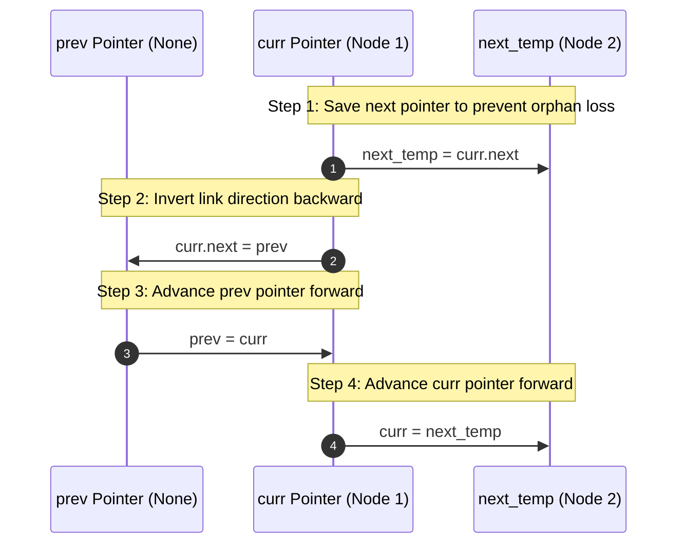

# Module 03: Linked Lists & Pointer Manipulation (0 to 100 Mastery)

> **Discontinuous Node Allocation, Pointer Chasing & In-Place Splicing**

Unlike arrays, linked lists allocate memory in discontinuous chunks on the heap. Inserting or deleting an element does not require shifting elements; it requires updating pointers. In this module, you master the core linked list patterns: **Sentinel Dummy Nodes**, **Fast & Slow Pointer Runners**, and **In-Place Three-Pointer Reversal**.

---


## Linked List Pointer Mutation: In-Place Reversal Workflow



---

## 1. Physical Node Architecture vs Array Cache Locality

```
Array:        [ 0x1000 | 0x1008 | 0x1010 ]  (Contiguous -> Cache hits!)
Linked List:  [ Node A (0x7F10) ] ---> [ Node B (0x12A0) ] ---> [ Node C (0x99F0) ]
              (Discontinuous heap allocations -> CPU Cache misses!)
```

```python
class ListNode:
    def __init__(self, val: int = 0, next: ListNode | None = None):
        self.val = val
        self.next = next
```

---

## 2. Curated LeetCode Problem Breakdowns (Brute Force vs. Optimized)

This section walks through the **6 canonical LeetCode challenges** curated for this module.
Each problem is analyzed from brute force intuition to the optimal invariant-driven solution, along with the critical edge cases to guard against in production.

### Problem 1: Reverse Linked List ([LeetCode #206](https://leetcode.com/problems/reverse-linked-list/)) — Easy

> **Pattern**: `Three Pointers Iterative` | **Target Time**: $O(N)$ | **Target Space**: $O(1)

#### Problem Specification
Given the `head` of a singly linked list, reverse the list, and return the reversed list.

#### Algorithmic Invariants & Optimal Derivation
Maintain `prev` initialized to None and `curr` to head. At each node, save `curr.next`, reverse pointer `curr.next = prev`, then advance `prev` and `curr`.

```python
class Solution:
    def reverseList(self, head: Optional[ListNode]) -> Optional[ListNode]:
        prev = None
        curr = head
        while curr:
            next_node = curr.next
            curr.next = prev
            prev = curr
            curr = next_node
        return prev
```

#### Critical Production Edge Cases to Guard:
- **Boundary Limits**: Empty inputs, single-element collections, and minimum constraint sizes.
- **Extremes & Negative Values**: Negative indices, zero values, and maximum integer magnitude constraints.
- **Duplicates & Uniform Sequences**: All identical values, alternating keys, or repeated entries.
- **Structural Invariants**: Target at boundary indices (index `0` or `N-1`), missing targets, or cycles.

---

### Problem 2: Merge Two Sorted Lists ([LeetCode #21](https://leetcode.com/problems/merge-two-sorted-lists/)) — Easy

> **Pattern**: `Dummy Node Merge` | **Target Time**: $O(N + M)$ | **Target Space**: $O(1)

#### Problem Specification
You are given the heads of two sorted linked lists `list1` and `list2`.

Merge the two lists into one sorted list. The list should be made by splicing together the nodes of the first two lists. Return the head of the merged linked list.

#### Algorithmic Invariants & Optimal Derivation
Create a dummy sentinel head. At each step compare current values of list1 and list2, attach the smaller node to tail.next, and advance. Attach any remaining non-empty list at the end.

```python
class Solution:
    def mergeTwoLists(self, list1: Optional[ListNode], list2: Optional[ListNode]) -> Optional[ListNode]:
        dummy = ListNode(-1)
        tail = dummy
        while list1 and list2:
            if list1.val <= list2.val:
                tail.next = list1
                list1 = list1.next
            else:
                tail.next = list2
                list2 = list2.next
            tail = tail.next
        tail.next = list1 if list1 else list2
        return dummy.next
```

#### Critical Production Edge Cases to Guard:
- **Boundary Limits**: Empty inputs, single-element collections, and minimum constraint sizes.
- **Extremes & Negative Values**: Negative indices, zero values, and maximum integer magnitude constraints.
- **Duplicates & Uniform Sequences**: All identical values, alternating keys, or repeated entries.
- **Structural Invariants**: Target at boundary indices (index `0` or `N-1`), missing targets, or cycles.

---

### Problem 3: Linked List Cycle ([LeetCode #141](https://leetcode.com/problems/linked-list-cycle/)) — Easy

> **Pattern**: `Floyd's Tortoise and Hare` | **Target Time**: $O(N)$ | **Target Space**: $O(1)

#### Problem Specification
Given `head`, the head of a linked list, determine if the linked list has a cycle in it.

There is a cycle in a linked list if there is some node in the list that can be reached again by continuously following the `next` pointer. Return `true` if there is a cycle in the linked list. Otherwise, return `false`.

#### Algorithmic Invariants & Optimal Derivation
Slow pointer moves 1 step, fast pointer moves 2 steps. If a cycle exists, the fast pointer will eventually overlap with the slow pointer inside the cycle.

```python
class Solution:
    def hasCycle(self, head: Optional[ListNode]) -> bool:
        slow, fast = head, head
        while fast and fast.next:
            slow = slow.next
            fast = fast.next.next
            if slow == fast:
                return True
        return False
```

#### Critical Production Edge Cases to Guard:
- **Boundary Limits**: Empty inputs, single-element collections, and minimum constraint sizes.
- **Extremes & Negative Values**: Negative indices, zero values, and maximum integer magnitude constraints.
- **Duplicates & Uniform Sequences**: All identical values, alternating keys, or repeated entries.
- **Structural Invariants**: Target at boundary indices (index `0` or `N-1`), missing targets, or cycles.

---

### Problem 4: Remove Nth Node From End of List ([LeetCode #19](https://leetcode.com/problems/remove-nth-node-from-end-of-list/)) — Medium

> **Pattern**: `Two Pointers Fast/Slow Offset` | **Target Time**: $O(N)$ | **Target Space**: $O(1)

#### Problem Specification
Given the `head` of a linked list, remove the `n-th` node from the end of the list and return its head.

#### Algorithmic Invariants & Optimal Derivation
Advance fast pointer n steps ahead. Then advance both fast and slow until fast reaches the last node. slow.next is now pointing to the node that needs deletion.

```python
class Solution:
    def removeNthFromEnd(self, head: Optional[ListNode], n: int) -> Optional[ListNode]:
        dummy = ListNode(0, head)
        fast = dummy
        slow = dummy
        for _ in range(n):
            fast = fast.next
        while fast.next:
            fast = fast.next
            slow = slow.next
        slow.next = slow.next.next
        return dummy.next
```

#### Critical Production Edge Cases to Guard:
- **Boundary Limits**: Empty inputs, single-element collections, and minimum constraint sizes.
- **Extremes & Negative Values**: Negative indices, zero values, and maximum integer magnitude constraints.
- **Duplicates & Uniform Sequences**: All identical values, alternating keys, or repeated entries.
- **Structural Invariants**: Target at boundary indices (index `0` or `N-1`), missing targets, or cycles.

---

### Problem 5: Reorder List ([LeetCode #143](https://leetcode.com/problems/reorder-list/)) — Medium

> **Pattern**: `Find Middle + Reverse + Interleave` | **Target Time**: $O(N)$ | **Target Space**: $O(1)

#### Problem Specification
You are given the head of a singly linked-list: $L_0 	o L_1 	o \dots 	o L_{n-1} 	o L_n$.
Reorder the list to be: $L_0 	o L_n 	o L_1 	o L_{n-1} 	o L_2 	o L_{n-2} 	o \dots$
You may not modify the values in the list's nodes. Only nodes themselves may be changed.

#### Algorithmic Invariants & Optimal Derivation
Divide the problem into 3 standard subroutines: 1. Find middle node using slow/fast pointers. 2. Reverse the second half in-place. 3. Merge/interleave the two halves.

```python
class Solution:
    def reorderList(self, head: Optional[ListNode]) -> Optional[ListNode]:
        if not head or not head.next:
            return head
        # 1. Find middle with slow/fast
        slow, fast = head, head
        while fast and fast.next:
            slow = slow.next
            fast = fast.next.next
        # 2. Reverse second half
        prev, curr = None, slow.next
        slow.next = None
        while curr:
            nxt = curr.next
            curr.next = prev
            prev = curr
            curr = nxt
        # 3. Interleave first and reversed second
        first, second = head, prev
        while second:
            tmp1, tmp2 = first.next, second.next
            first.next = second
            second.next = tmp1
            first = tmp1
            second = tmp2
        return head
```

#### Critical Production Edge Cases to Guard:
- **Boundary Limits**: Empty inputs, single-element collections, and minimum constraint sizes.
- **Extremes & Negative Values**: Negative indices, zero values, and maximum integer magnitude constraints.
- **Duplicates & Uniform Sequences**: All identical values, alternating keys, or repeated entries.
- **Structural Invariants**: Target at boundary indices (index `0` or `N-1`), missing targets, or cycles.

---

### Problem 6: Merge k Sorted Lists ([LeetCode #23](https://leetcode.com/problems/merge-k-sorted-lists/)) — Hard

> **Pattern**: `Min-Heap / Priority Queue` | **Target Time**: $O(N \log K)$ | **Target Space**: $O(K)

#### Problem Specification
You are given an array of `k` linked-lists `lists`, each linked-list is sorted in ascending order.
Merge all the linked-lists into one sorted linked-list and return it.

#### Algorithmic Invariants & Optimal Derivation
Maintain a min-heap storing (node.val, list_index, node). At each step pop the minimum element, append it to the merged list, and push node.next into the heap.

```python
class Solution:
    def mergeKLists(self, lists: list[Optional[ListNode]]) -> Optional[ListNode]:
        import heapq
        dummy = ListNode(0)
        curr = dummy
        heap = []
        for i, node in enumerate(lists):
            if node:
                heapq.heappush(heap, (node.val, i, node))
        while heap:
            val, i, node = heapq.heappop(heap)
            curr.next = node
            curr = curr.next
            if node.next:
                heapq.heappush(heap, (node.next.val, i, node.next))
        return dummy.next
```

#### Critical Production Edge Cases to Guard:
- **Boundary Limits**: Empty inputs, single-element collections, and minimum constraint sizes.
- **Extremes & Negative Values**: Negative indices, zero values, and maximum integer magnitude constraints.
- **Duplicates & Uniform Sequences**: All identical values, alternating keys, or repeated entries.
- **Structural Invariants**: Target at boundary indices (index `0` or `N-1`), missing targets, or cycles.

---


## 3. Hands-On Project & Test Suite

Verify your Doubly Linked List engine:
- Starter Template: [`starter/doubly_linked_list_engine.py`](starter/doubly_linked_list_engine.py)
- Production Solution: [`project_solution/doubly_linked_list_engine.py`](project_solution/doubly_linked_list_engine.py)
- Pytest Suite: [`project_solution/test_doubly_linked_list_engine.py`](project_solution/test_doubly_linked_list_engine.py)

## 🧪 Practice & Verification

Reading a module teaches recognition. Only the problems teach recall — and the
debug lab teaches the thing neither of them does, which is diagnosis.

### 1. Build the module project

```bash
cd starter
python -m pytest ../project_solution -q      # must FAIL before you start
```

Every shipped test must fail with `NotImplementedError` on an untouched
starter. If any passes, the grading loop is broken and is telling you your work
is correct when it has not been done — run `make integrity` from the course
root.

### 2. Work the problem bank — 8 problems

```bash
cd problems
python -m pytest tests -q                    # all of this module's problems
python -m pytest tests -q -k p03             # just problem 3
```

| # | Problem | Pattern | Difficulty | Target |
| :--- | :--- | :--- | :--- | :--- |
| 01 | [Reverse A Linked List](problems/p01_reverse_list.py) | Pointer manipulation | Easy | `Time O(n), Space O(1)` |
| 02 | [Detect A Cycle](problems/p02_has_cycle.py) | Fast and slow pointers | Easy | `Time O(n), Space O(1)` |
| 03 | [Find Where The Cycle Begins](problems/p03_cycle_start.py) | Floyd's algorithm | Medium | `Time O(n), Space O(1)` |
| 04 | [Middle Of The List](problems/p04_middle_node.py) | Fast and slow pointers | Easy | `Time O(n), Space O(1)` |
| 05 | [Merge Two Sorted Lists](problems/p05_merge_sorted.py) | Dummy head + two pointers | Easy | `Time O(n + m), Space O(1)` |
| 06 | [Remove The N-th Node From The End](problems/p06_remove_nth_from_end.py) | Dummy head + gap pointers | Medium | `Time O(n), Space O(1)` |
| 07 | [Palindrome Linked List](problems/p07_is_palindrome_list.py) | Fast/slow + in-place reversal | Medium | `Time O(n), Space O(1)` |
| 08 | [Reorder List](problems/p08_reorder_list.py) | Split + reverse + weave | Hard | `Time O(n), Space O(1)` |

Each stub carries the statement, the constraints, a complexity target and a
**three-step hint ladder**. Read one hint, try again, and only then read the
next. Every reference solution in `problems/solutions/` is cross-checked against
a brute force or a second implementation, so the answers are verified rather
than asserted.

### 3. Work the debug lab

```bash
cd debug_lab
python broken_list_surgery.py
echo "exit=$?"
```

It exits 0 and prints wrong answers. Read [`SYMPTOMS.md`](debug_lab/SYMPTOMS.md),
write a diagnosis for each, and only then open `ANSWERS.md`. The diagnostic
reasoning is the transferable skill; reading the answer first skips it.

---

## ✅ You have mastered this module when you can…

1. Reverse a list in place with three pointers, naming the order the assignments must take.
2. Explain why fast/slow pointers must move at different speeds, and where the cycle-entrance arithmetic comes from.
3. Use a dummy head to remove the 'is it the head?' special case, and name two problems where it does so.
4. Say which middle node an even-length list returns for a given loop condition, and change it deliberately.

Each of these is something you **do**, not something you know. If you cannot do
one without reference, that is the section to revisit — not the whole module.

---

## 🧭 Navigation

- [Pattern Recognition Guide](../PATTERN_RECOGNITION_GUIDE.md) — how to attack a problem you have never seen
- [Course README](../README.md) · [Master Syllabus](../MASTER_SYLLABUS.md)
- [Problem bank](problems/README.md) · [Debug lab](debug_lab/SYMPTOMS.md)