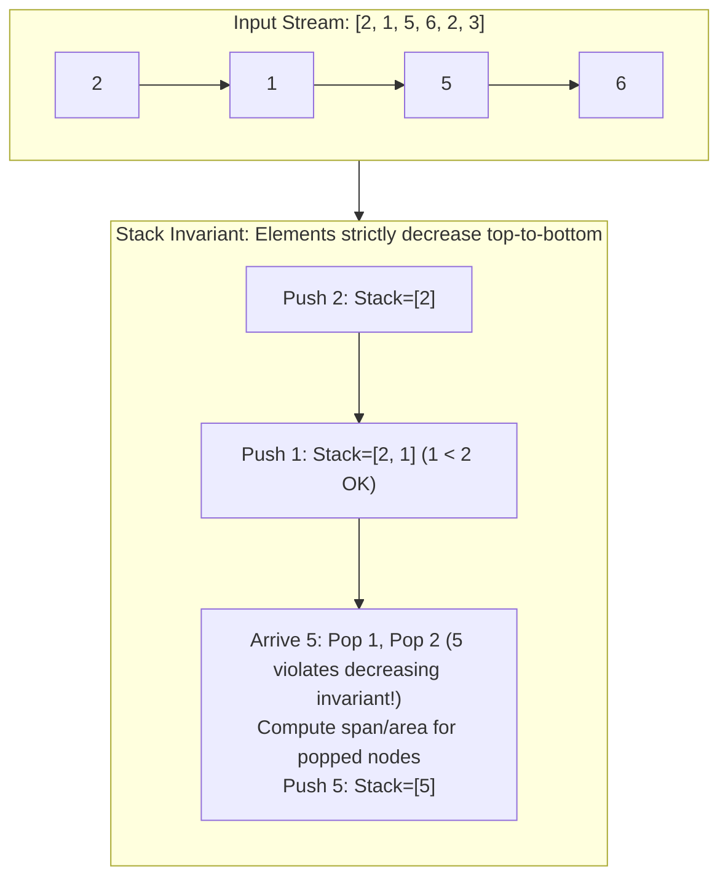

# Module 04: Stacks, Queues & Monotonic Structures (0 to 100 Mastery)

> **LIFO Execution, FIFO Buffers, Amortized $O(1)$ Invariant Deques & Monotonic Scans**

Stacks and Queues form the execution backbone of computer runtime systems (call stacks, AST parsers, task schedulers). In this module, you master **Monotonic Stacks** and **Monotonic Deques**, which eliminate $O(N^2)$ brute-force scans in range queries down to $O(N)$ amortized time.

---


## Monotonic Decreasing Stack Invariant



---

## 1. Monotonic Stack Invariant Mechanics

A monotonic stack maintains elements in strictly increasing or decreasing order:
```
Incoming element: 5
Current stack:    [ 10, 8, 3, 2 ]  (Monotonic Decreasing)

To push 5, elements smaller than 5 (2, 3) must be popped:
Pop 2 -> Process (5 is the Next Greater Element for 2!)
Pop 3 -> Process (5 is the Next Greater Element for 3!)
Push 5 -> [ 10, 8, 5 ]
```
Every element is pushed once and popped at most once $\\implies$ Total operations $\\le 2N \\implies O(N)$ time!

---

## 2. Curated LeetCode Problem Breakdowns (Brute Force vs. Optimized)

This section walks through the **6 canonical LeetCode challenges** curated for this module.
Each problem is analyzed from brute force intuition to the optimal invariant-driven solution, along with the critical edge cases to guard against in production.

### Problem 1: Valid Parentheses ([LeetCode #20](https://leetcode.com/problems/valid-parentheses/)) — Easy

> **Pattern**: `LIFO Stack Matching` | **Target Time**: $O(N)$ | **Target Space**: $O(N)

#### Problem Specification
Given a string `s` containing just the characters `'('`, `')'`, `'{'`, `'}'`, `'['` and `']'`, determine if the input string is valid.

An input string is valid if:
1. Open brackets must be closed by the same type of brackets.
2. Open brackets must be closed in the correct order.
3. Every close bracket has a corresponding open bracket of the same type.

#### Algorithmic Invariants & Optimal Derivation
Push open brackets onto a LIFO stack. When a closing bracket is encountered, pop the top of the stack and check for type matching. At the end, verify stack is empty.

```python
class Solution:
    def isValid(self, s: str) -> bool:
        stack = []
        mapping = {")": "(", "}": "{", "]": "["}
        for char in s:
            if char in mapping:
                top = stack.pop() if stack else '#'
                if mapping[char] != top:
                    return False
            else:
                stack.append(char)
        return not stack
```

#### Critical Production Edge Cases to Guard:
- **Boundary Limits**: Empty inputs, single-element collections, and minimum constraint sizes.
- **Extremes & Negative Values**: Negative indices, zero values, and maximum integer magnitude constraints.
- **Duplicates & Uniform Sequences**: All identical values, alternating keys, or repeated entries.
- **Structural Invariants**: Target at boundary indices (index `0` or `N-1`), missing targets, or cycles.

---

### Problem 2: Min Stack ([LeetCode #155](https://leetcode.com/problems/min-stack/)) — Medium

> **Pattern**: `Dual Stack / Paired Minimum` | **Target Time**: $O(1) all ops$ | **Target Space**: $O(N)

#### Problem Specification
Design a stack that supports `push`, `pop`, `top`, and retrieving the minimum element in constant time $O(1)$.

Implement the `MinStack` class:
- `MinStack()` initializes the stack object.
- `void push(int val)` pushes the element `val` onto the stack.
- `void pop()` removes the element on the top of the stack.
- `int top()` gets the top element of the stack.
- `int getMin()` retrieves the minimum element in the stack.

#### Algorithmic Invariants & Optimal Derivation
Maintain an auxiliary min_stack tracking current minimums. When pushing val <= min_stack[-1], push to min_stack. When popping equal value, pop from min_stack.

```python
class MinStack:
    def __init__(self):
        self.stack = []
        self.min_stack = []

    def push(self, val: int) -> None:
        self.stack.append(val)
        if not self.min_stack or val <= self.min_stack[-1]:
            self.min_stack.append(val)

    def pop(self) -> None:
        if self.stack:
            val = self.stack.pop()
            if self.min_stack and val == self.min_stack[-1]:
                self.min_stack.pop()

    def top(self) -> int:
        return self.stack[-1] if self.stack else None

    def getMin(self) -> int:
        return self.min_stack[-1] if self.min_stack else None
```

#### Critical Production Edge Cases to Guard:
- **Boundary Limits**: Empty inputs, single-element collections, and minimum constraint sizes.
- **Extremes & Negative Values**: Negative indices, zero values, and maximum integer magnitude constraints.
- **Duplicates & Uniform Sequences**: All identical values, alternating keys, or repeated entries.
- **Structural Invariants**: Target at boundary indices (index `0` or `N-1`), missing targets, or cycles.

---

### Problem 3: Daily Temperatures ([LeetCode #739](https://leetcode.com/problems/daily-temperatures/)) — Medium

> **Pattern**: `Monotonic Decreasing Stack` | **Target Time**: $O(N)$ | **Target Space**: $O(N)

#### Problem Specification
Given an array of integers `temperatures` represents the daily temperatures, return an array `answer` such that `answer[i]` is the number of days you have to wait after the `i-th` day to get a warmer temperature. If there is no future day for which this is possible, keep `answer[i] == 0` instead.

#### Algorithmic Invariants & Optimal Derivation
Use a monotonic stack storing indices of days. As soon as a warmer temperature appears, pop smaller previous temperatures and compute distance $i - 	ext{prev\_idx}$.

```python
class Solution:
    def dailyTemperatures(self, temperatures: list[int]) -> list[int]:
        n = len(temperatures)
        ans = [0] * n
        stack = []  # indices of monotonic decreasing temps
        for i, t in enumerate(temperatures):
            while stack and t > temperatures[stack[-1]]:
                prev_idx = stack.pop()
                ans[prev_idx] = i - prev_idx
            stack.append(i)
        return ans
```

#### Critical Production Edge Cases to Guard:
- **Boundary Limits**: Empty inputs, single-element collections, and minimum constraint sizes.
- **Extremes & Negative Values**: Negative indices, zero values, and maximum integer magnitude constraints.
- **Duplicates & Uniform Sequences**: All identical values, alternating keys, or repeated entries.
- **Structural Invariants**: Target at boundary indices (index `0` or `N-1`), missing targets, or cycles.

---

### Problem 4: Evaluate Reverse Polish Notation ([LeetCode #150](https://leetcode.com/problems/evaluate-reverse-polish-notation/)) — Medium

> **Pattern**: `Postfix Stack Evaluation` | **Target Time**: $O(N)$ | **Target Space**: $O(N)

#### Problem Specification
You are given an array of strings `tokens` that represents an arithmetic expression in Reverse Polish Notation.

Evaluate the expression. Return an integer that represents the value of the expression.
Division between two integers always truncates toward zero.

#### Algorithmic Invariants & Optimal Derivation
Iterate tokens. Push numbers onto stack. When an operator is met, pop operand b then operand a, perform operation $a 	ext{ op } b$, and push result back.

```python
class Solution:
    def evalRPN(self, tokens: list[str]) -> int:
        stack = []
        for t in tokens:
            if t not in {"+", "-", "*", "/"}:
                stack.append(int(t))
            else:
                b = stack.pop()
                a = stack.pop()
                if t == "+":
                    stack.append(a + b)
                elif t == "-":
                    stack.append(a - b)
                elif t == "*":
                    stack.append(a * b)
                elif t == "/":
                    stack.append(int(a / b))
        return stack[0]
```

#### Critical Production Edge Cases to Guard:
- **Boundary Limits**: Empty inputs, single-element collections, and minimum constraint sizes.
- **Extremes & Negative Values**: Negative indices, zero values, and maximum integer magnitude constraints.
- **Duplicates & Uniform Sequences**: All identical values, alternating keys, or repeated entries.
- **Structural Invariants**: Target at boundary indices (index `0` or `N-1`), missing targets, or cycles.

---

### Problem 5: Implement Queue using Stacks ([LeetCode #232](https://leetcode.com/problems/implement-queue-using-stacks/)) — Easy

> **Pattern**: `Dual Stack In/Out FIFO Simulation` | **Target Time**: $Amortized O(1) all ops$ | **Target Space**: $O(N)

#### Problem Specification
Implement a first in first out (FIFO) queue using only two stacks. The implemented queue should support all the functions of a normal queue (`push`, `peek`, `pop`, and `empty`).

#### Algorithmic Invariants & Optimal Derivation
Use `in_stack` to accept pushes and `out_stack` for pop/peek. When `out_stack` is empty, dump elements from `in_stack` to invert order. Each item is moved at most twice, yielding amortized $O(1)$ per operation.

```python
class MyQueue:
    def __init__(self):
        self.in_stack = []
        self.out_stack = []

    def push(self, x: int) -> None:
        self.in_stack.append(x)

    def _transfer(self):
        if not self.out_stack:
            while self.in_stack:
                self.out_stack.append(self.in_stack.pop())

    def pop(self) -> int:
        self._transfer()
        return self.out_stack.pop()

    def peek(self) -> int:
        self._transfer()
        return self.out_stack[-1]

    def empty(self) -> bool:
        return not self.in_stack and not self.out_stack
```

#### Critical Production Edge Cases to Guard:
- **Boundary Limits**: Empty inputs, single-element collections, and minimum constraint sizes.
- **Extremes & Negative Values**: Negative indices, zero values, and maximum integer magnitude constraints.
- **Duplicates & Uniform Sequences**: All identical values, alternating keys, or repeated entries.
- **Structural Invariants**: Target at boundary indices (index `0` or `N-1`), missing targets, or cycles.

---

### Problem 6: Largest Rectangle in Histogram ([LeetCode #84](https://leetcode.com/problems/largest-rectangle-in-histogram/)) — Hard

> **Pattern**: `Monotonic Increasing Stack` | **Target Time**: $O(N)$ | **Target Space**: $O(N)

#### Problem Specification
Given an array of integers `heights` representing the histogram's bar height where the width of each bar is 1, return the area of the largest rectangle in the histogram.

#### Algorithmic Invariants & Optimal Derivation
Maintain a monotonic increasing stack of (start_index, height). When a shorter bar is encountered, pop taller bars and calculate rectangle area with popped height extending from its start_index to current index.

```python
class Solution:
    def largestRectangleArea(self, heights: list[int]) -> int:
        stack = []  # pairs (index, height)
        max_area = 0
        for i, h in enumerate(heights):
            start = i
            while stack and stack[-1][1] > h:
                idx, prev_h = stack.pop()
                max_area = max(max_area, prev_h * (i - idx))
                start = idx
            stack.append((start, h))
        n = len(heights)
        for idx, h in stack:
            max_area = max(max_area, h * (n - idx))
        return max_area
```

#### Critical Production Edge Cases to Guard:
- **Boundary Limits**: Empty inputs, single-element collections, and minimum constraint sizes.
- **Extremes & Negative Values**: Negative indices, zero values, and maximum integer magnitude constraints.
- **Duplicates & Uniform Sequences**: All identical values, alternating keys, or repeated entries.
- **Structural Invariants**: Target at boundary indices (index `0` or `N-1`), missing targets, or cycles.

---


## 3. Hands-On Project & Test Suite

Verify your MinMaxStack and MonotonicQueue engine:
- Starter Template: [`starter/monotonic_queue_engine.py`](starter/monotonic_queue_engine.py)
- Production Solution: [`project_solution/monotonic_queue_engine.py`](project_solution/monotonic_queue_engine.py)
- Pytest Suite: [`project_solution/test_monotonic_queue_engine.py`](project_solution/test_monotonic_queue_engine.py)

## 🧪 Practice & Verification

Reading a module teaches recognition. Only the problems teach recall — and the
debug lab teaches the thing neither of them does, which is diagnosis.

### 1. Build the module project

```bash
cd starter
python -m pytest ../project_solution -q      # must FAIL before you start
```

Every shipped test must fail with `NotImplementedError` on an untouched
starter. If any passes, the grading loop is broken and is telling you your work
is correct when it has not been done — run `make integrity` from the course
root.

### 2. Work the problem bank — 8 problems

```bash
cd problems
python -m pytest tests -q                    # all of this module's problems
python -m pytest tests -q -k p03             # just problem 3
```

| # | Problem | Pattern | Difficulty | Target |
| :--- | :--- | :--- | :--- | :--- |
| 01 | [Valid Parentheses](problems/p01_balanced_brackets.py) | Stack | Easy | `Time O(n), Space O(n)` |
| 02 | [Next Greater Element](problems/p02_next_greater.py) | Monotonic stack | Medium | `Time O(n), Space O(n)` |
| 03 | [Daily Temperatures](problems/p03_daily_temperatures.py) | Monotonic stack | Medium | `Time O(n), Space O(n)` |
| 04 | [Largest Rectangle In A Histogram](problems/p04_largest_rectangle.py) | Monotonic stack | Hard | `Time O(n), Space O(n)` |
| 05 | [Sliding Window Maximum](problems/p05_sliding_window_max.py) | Monotonic deque | Hard | `Time O(n), Space O(k)` |
| 06 | [Min Stack (O(1) Minimum)](problems/p06_min_stack.py) | Stack with auxiliary state | Medium | `Time O(1) per operation, Space O(n)` |
| 07 | [Evaluate Reverse Polish Notation](problems/p07_eval_rpn.py) | Stack | Medium | `Time O(n), Space O(n)` |
| 08 | [Decode String](problems/p08_decode_string.py) | Stack of contexts | Medium | `Time O(output length), Space O(depth + output)` |

Each stub carries the statement, the constraints, a complexity target and a
**three-step hint ladder**. Read one hint, try again, and only then read the
next. Every reference solution in `problems/solutions/` is cross-checked against
a brute force or a second implementation, so the answers are verified rather
than asserted.

### 3. Work the debug lab

```bash
cd debug_lab
python broken_monotonic_toolkit.py
echo "exit=$?"
```

It exits 0 and prints wrong answers. Read [`SYMPTOMS.md`](debug_lab/SYMPTOMS.md),
write a diagnosis for each, and only then open `ANSWERS.md`. The diagnostic
reasoning is the transferable skill; reading the answer first skips it.

---

## ✅ You have mastered this module when you can…

1. Identify a monotonic stack from the words 'next greater', 'previous smaller' or 'span'.
2. Explain why a while loop inside a for loop is still O(n) for a monotonic stack.
3. Choose between a stack, a deque and a heap for a sliding-window extremum, with reasons.
4. State the two evictions a monotonic deque performs each step and what each one is for.

Each of these is something you **do**, not something you know. If you cannot do
one without reference, that is the section to revisit — not the whole module.

---

## 🧭 Navigation

- [Pattern Recognition Guide](../PATTERN_RECOGNITION_GUIDE.md) — how to attack a problem you have never seen
- [Course README](../README.md) · [Master Syllabus](../MASTER_SYLLABUS.md)
- [Problem bank](problems/README.md) · [Debug lab](debug_lab/SYMPTOMS.md)