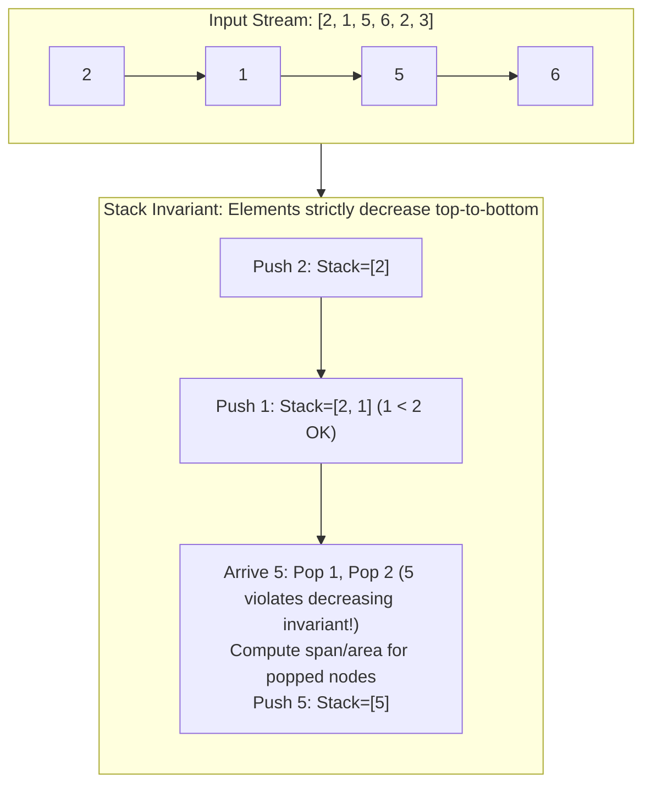

# Module 04: Stacks, Queues & Monotonic Structures (0 to 100 Mastery)

> **LIFO Execution, FIFO Buffers, Amortized $O(1)$ Invariant Deques & Monotonic Scans**

Stacks and Queues form the execution backbone of computer runtime systems (call stacks, AST parsers, task schedulers). In this module, you master **Monotonic Stacks** and **Monotonic Deques**, which eliminate $O(N^2)$ brute-force scans in range queries down to $O(N)$ amortized time.

---


## Monotonic Decreasing Stack Invariant



## 1. Monotonic Stack Invariant Mechanics

A monotonic stack maintains elements in strictly increasing or decreasing order:
```
Incoming element: 5
Current stack:    [ 10, 8, 3, 2 ]  (Monotonic Decreasing)

To push 5, elements smaller than 5 (2, 3) must be popped:
Pop 2 -> Process (5 is the Next Greater Element for 2!)
Pop 3 -> Process (5 is the Next Greater Element for 3!)
Push 5 -> [ 10, 8, 5 ]
```
Every element is pushed once and popped at most once $\\implies$ Total operations $\\le 2N \\implies O(N)$ time!

---

## 2. Curated LeetCode Problem Breakdowns (Brute Force vs. Optimized)

### Problem 1: Valid Parentheses ([LeetCode 20](https://leetcode.com/problems/valid-parentheses/)) — Easy

#### Brute Force: Repeated String Replacement
Repeatedly replace `"()"`, `"{}"`, `"[]"` with `""` until length stops decreasing.
- **Time Complexity**: $O(N^2)$ — String reallocation on every reduction.

#### Optimized: LIFO Stack Matching
```python
def is_valid_parentheses(s: str) -> bool:
    stack = []
    mapping = {')': '(', '}': '{', ']': '['}
    for char in s:
        if char in mapping:
            if not stack or stack[-1] != mapping[char]:
                return False
            stack.pop()
        else:
            stack.append(char)
    return len(stack) == 0
```
- **Time Complexity**: $O(N)$ — Single scan.
- **Space Complexity**: $O(N)$ worst-case stack storage.

---

### Problem 2: Min Stack ([LeetCode 155](https://leetcode.com/problems/min-stack/)) — Medium

#### Optimized: Parallel Min Tracking ($O(1)$ All Operations)
Maintain a primary stack and an auxiliary min stack tracking current minimum at every depth.
```python
class MinStack:
    def __init__(self):
        self.stack: list[int] = []
        self.min_stack: list[int] = []

    def push(self, val: int) -> None:
        self.stack.append(val)
        current_min = val if not self.min_stack else min(val, self.min_stack[-1])
        self.min_stack.append(current_min)

    def pop(self) -> None:
        self.stack.pop()
        self.min_stack.pop()

    def top(self) -> int:
        return self.stack[-1]

    def getMin(self) -> int:
        return self.min_stack[-1]
```
- **Time Complexity**: $O(1)$ for `push`, `pop`, `top`, and `getMin`.
- **Space Complexity**: $O(N)$ storage.

---

### Problem 3: Daily Temperatures ([LeetCode 739](https://leetcode.com/problems/daily-temperatures/)) — Medium

#### Brute Force: Forward Scan
For each day $i$, scan days $j > i$ until $temperatures[j] > temperatures[i]$.
- **Time Complexity**: $O(N^2)$ — Hits TLE when temperatures are monotonically decreasing.

#### Optimized: Monotonic Decreasing Stack
Stack stores pairs `(temperature, index)`. When an incoming temperature exceeds stack top, pop and calculate span `i - prev_idx`.
```python
def daily_temperatures(temperatures: list[int]) -> list[int]:
    res = [0] * len(temperatures)
    stack: list[int] = []  # Stores indices
    
    for i, temp in enumerate(temperatures):
        while stack and temperatures[stack[-1]] < temp:
            prev_idx = stack.pop()
            res[prev_idx] = i - prev_idx
        stack.append(i)
        
    return res
```
- **Time Complexity**: $O(N)$ — Each index pushed and popped at most once.
- **Space Complexity**: $O(N)$ stack memory.

---

### Problem 4: Evaluate Reverse Polish Notation ([LeetCode 150](https://leetcode.com/problems/evaluate-reverse-polish-notation/)) — Medium

#### Optimized: Operand Stack
Push numbers; on encountering an operator, pop two operands, apply operator, and push result. Note integer division towards zero in Python: `int(a / b)`.
- **Time Complexity**: $O(N)$, **Space Complexity**: $O(N)$.

---

### Problem 5: Car Fleet ([LeetCode 853](https://leetcode.com/problems/car-fleet/)) — Medium

#### Optimized: Sort by Position + Monotonic Time Stack
Sort cars by descending starting position. Calculate time to reach target: $(target - pos) / speed$. If current car takes less or equal time than car ahead, it joins that fleet.
- **Time Complexity**: $O(N \\log N)$ for sorting.
- **Space Complexity**: $O(N)$ stack memory.

---

### Problem 6: Largest Rectangle in Histogram ([LeetCode 84](https://leetcode.com/problems/largest-rectangle-in-histogram/)) — Hard

#### Brute Force: All Pairs Scan
For every bar, expand left and right to find boundaries where height $\\ge$ current bar.
- **Time Complexity**: $O(N^2)$ — TLE.

#### Optimized: Monotonic Increasing Stack
Maintain monotonically increasing heights. When a shorter bar appears, pop from stack and calculate area where popped bar is the minimum height.
```python
def largest_rectangle_area(heights: list[int]) -> int:
    stack: list[tuple[int, int]] = []  # (index, height)
    max_area = 0
    
    for i, h in enumerate(heights):
        start = i
        while stack and stack[-1][1] > h:
            idx, height = stack.pop()
            max_area = max(max_area, height * (i - idx))
            start = idx
        stack.append((start, h))
        
    for idx, height in stack:
        max_area = max(max_area, height * (len(heights) - idx))
        
    return max_area
```
- **Time Complexity**: $O(N)$ — Single pass.
- **Space Complexity**: $O(N)$.

---

### Problem 7: Sliding Window Maximum ([LeetCode 239](https://leetcode.com/problems/sliding-window-maximum/)) — Hard

#### Brute Force: Window Rescan
Compute `max(nums[i:i+k])` for all $N - K + 1$ windows.
- **Time Complexity**: $O(N \\times K)$ — Hits TLE for $N = 10^5, K = 5 \\times 10^4$.

#### Optimized: Monotonic Decreasing Deque ($O(N)$ Time)
Maintain indices in a deque whose values are strictly decreasing. Front of deque is always the maximum for the current window.
```python
from collections import deque

def max_sliding_window(nums: list[int], k: int) -> list[int]:
    q: deque[int] = deque()  # stores indices
    res: list[int] = []
    
    for i in range(len(nums)):
        # Evict indices outside current window
        if q and q[0] < i - k + 1:
            q.popleft()
            
        # Maintain decreasing invariant
        while q and nums[q[-1]] < nums[i]:
            q.pop()
            
        q.append(i)
        
        if i >= k - 1:
            res.append(nums[q[0]])
            
    return res
```
- **Time Complexity**: $O(N)$ — Each index enters and exits deque at most once.
- **Space Complexity**: $O(K)$ deque space.

---

### Problem 8: Implement Queue using Stacks ([LeetCode 232](https://leetcode.com/problems/implement-queue-using-stacks/)) — Easy

#### Optimized: Two Stacks (Amortized $O(1)$)
`stack_in` receives `push`. `stack_out` serves `pop`/`peek`. Only when `stack_out` is empty do we transfer all elements from `stack_in` to `stack_out` (reversing their order to FIFO).
- **Time Complexity**: $O(1)$ amortized per operation.
- **Space Complexity**: $O(N)$.

---

## 3. Hands-On Project & Test Suite

Verify your MinMaxStack and MonotonicQueue engine:
- Starter Template: [`starter/monotonic_queue_engine.py`](starter/monotonic_queue_engine.py)
- Production Solution: [`project_solution/monotonic_queue_engine.py`](project_solution/monotonic_queue_engine.py)
- Pytest Suite: [`project_solution/test_monotonic_queue_engine.py`](project_solution/test_monotonic_queue_engine.py)

## 🧪 Practice & Verification

Reading a module teaches recognition. Only the problems teach recall — and the
debug lab teaches the thing neither of them does, which is diagnosis.

### 1. Build the module project

```bash
cd starter
python -m pytest ../project_solution -q      # must FAIL before you start
```

Every shipped test must fail with `NotImplementedError` on an untouched
starter. If any passes, the grading loop is broken and is telling you your work
is correct when it has not been done — run `make integrity` from the course
root.

### 2. Work the problem bank — 8 problems

```bash
cd problems
python -m pytest tests -q                    # all of this module's problems
python -m pytest tests -q -k p03             # just problem 3
```

| # | Problem | Pattern | Difficulty | Target |
| :--- | :--- | :--- | :--- | :--- |
| 01 | [Valid Parentheses](problems/p01_balanced_brackets.py) | Stack | Easy | `Time O(n), Space O(n)` |
| 02 | [Next Greater Element](problems/p02_next_greater.py) | Monotonic stack | Medium | `Time O(n), Space O(n)` |
| 03 | [Daily Temperatures](problems/p03_daily_temperatures.py) | Monotonic stack | Medium | `Time O(n), Space O(n)` |
| 04 | [Largest Rectangle In A Histogram](problems/p04_largest_rectangle.py) | Monotonic stack | Hard | `Time O(n), Space O(n)` |
| 05 | [Sliding Window Maximum](problems/p05_sliding_window_max.py) | Monotonic deque | Hard | `Time O(n), Space O(k)` |
| 06 | [Min Stack (O(1) Minimum)](problems/p06_min_stack.py) | Stack with auxiliary state | Medium | `Time O(1) per operation, Space O(n)` |
| 07 | [Evaluate Reverse Polish Notation](problems/p07_eval_rpn.py) | Stack | Medium | `Time O(n), Space O(n)` |
| 08 | [Decode String](problems/p08_decode_string.py) | Stack of contexts | Medium | `Time O(output length), Space O(depth + output)` |

Each stub carries the statement, the constraints, a complexity target and a
**three-step hint ladder**. Read one hint, try again, and only then read the
next. Every reference solution in `problems/solutions/` is cross-checked against
a brute force or a second implementation, so the answers are verified rather
than asserted.

### 3. Work the debug lab

```bash
cd debug_lab
python broken_monotonic_toolkit.py
echo "exit=$?"
```

It exits 0 and prints wrong answers. Read [`SYMPTOMS.md`](debug_lab/SYMPTOMS.md),
write a diagnosis for each, and only then open `ANSWERS.md`. The diagnostic
reasoning is the transferable skill; reading the answer first skips it.

---

## ✅ You have mastered this module when you can…

1. Identify a monotonic stack from the words 'next greater', 'previous smaller' or 'span'.
2. Explain why a while loop inside a for loop is still O(n) for a monotonic stack.
3. Choose between a stack, a deque and a heap for a sliding-window extremum, with reasons.
4. State the two evictions a monotonic deque performs each step and what each one is for.

Each of these is something you **do**, not something you know. If you cannot do
one without reference, that is the section to revisit — not the whole module.

---

## 🧭 Navigation

- [Pattern Recognition Guide](../PATTERN_RECOGNITION_GUIDE.md) — how to attack a problem you have never seen
- [Course README](../README.md) · [Master Syllabus](../MASTER_SYLLABUS.md)
- [Problem bank](problems/README.md) · [Debug lab](debug_lab/SYMPTOMS.md)