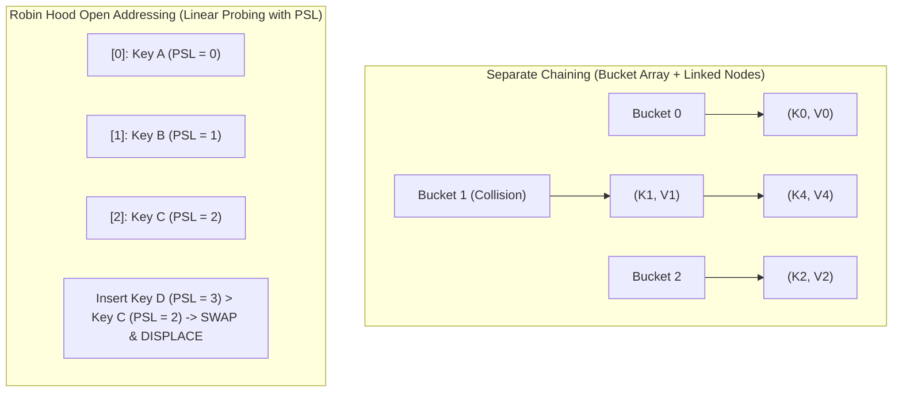

# Module 05: Hash Tables & Collision Resolution (0 to 100 Mastery)

> **Hash Functions, Open Addressing, Robin Hood Hashing, and $O(1)$ Lookup Invariants**

Hash tables map arbitrary keys to fixed table indices using hash functions. In this module, you master **Separate Chaining**, **Open Addressing with Linear Probing**, **Robin Hood displacement heuristics**, and frequency-based algorithmic patterns.

---


## Hash Collision Resolution: Separate Chaining vs Robin Hood Probing



## 1. Collision Resolution: Robin Hood Hashing vs Standard Linear Probing

In standard linear probing, clusters grow rapidly (primary clustering), leading to catastrophic lookup variance. **Robin Hood Hashing** solves this:
- Each slot records the **Probe Sequence Length (PSL)** (distance from its ideal hashed slot).
- When inserting an element with PSL $P_{new}$, if the slot is occupied with $P_{existing} < P_{new}$, the "rich" gives to the "poor": we swap elements and continue inserting the displaced element.
- Result: **Variance in search time drops to near-zero**.

---

## 2. Curated LeetCode Problem Breakdowns (Brute Force vs. Optimized)

### Problem 1: Contains Duplicate ([LeetCode 217](https://leetcode.com/problems/contains-duplicate/)) — Easy

#### Brute Force: Pairwise Comparison
- **Time Complexity**: $O(N^2)$ — TLE.

#### Optimized: Hash Set
```python
def contains_duplicate(nums: list[int]) -> bool:
    seen = set()
    for x in nums:
        if x in seen:
            return True
        seen.add(x)
    return False
```
- **Time Complexity**: $O(N)$, **Space Complexity**: $O(N)$.

---

### Problem 2: Valid Anagram ([LeetCode 242](https://leetcode.com/problems/valid-anagram/)) — Easy

#### Brute Force: String Sorting
`sorted(s) == sorted(t)`.
- **Time Complexity**: $O(N \\log N)$.

#### Optimized: Frequency Count Array ($O(1)$ Auxiliary Space)
Since inputs are lowercase English letters, maintain a 26-element integer array.
```python
def is_anagram(s: str, t: str) -> bool:
    if len(s) != len(t):
        return False
    counts = [0] * 26
    for c1, c2 in zip(s, t):
        counts[ord(c1) - ord('a')] += 1
        counts[ord(c2) - ord('a')] -= 1
    return all(x == 0 for x in counts)
```
- **Time Complexity**: $O(N)$, **Space Complexity**: $O(1)$ fixed 26 integers.

---

### Problem 3: Group Anagrams ([LeetCode 49](https://leetcode.com/problems/group-anagrams/)) — Medium

#### Optimized: Character Count Tuple as Hash Key
Map each string to a 26-tuple frequency signature `(1, 0, 0, ..., 1)` which is hashable and serves as dictionary key.
```python
from collections import defaultdict

def group_anagrams(strs: list[str]) -> list[list[str]]:
    groups = defaultdict(list)
    for s in strs:
        count = [0] * 26
        for c in s:
            count[ord(c) - ord('a')] += 1
        groups[tuple(count)].append(s)
    return list(groups.values())
```
- **Time Complexity**: $O(N \\times K)$ where $N$ is number of strings, $K$ is max length.
- **Space Complexity**: $O(N \\times K)$.

---

### Problem 4: Top K Frequent Elements ([LeetCode 347](https://leetcode.com/problems/top-k-frequent-elements/)) — Medium

#### Brute Force: Sort All Frequencies
Count frequencies and sort: $O(N \\log N)$.

#### Optimized: Bucket Sort ($O(N)$ Linear Time)
An array of buckets where index is frequency (max frequency is $N$). Collect top $K$ from the highest bucket downwards.
```python
def top_k_frequent(nums: list[int], k: int) -> list[int]:
    counts: dict[int, int] = {}
    for n in nums:
        counts[n] = counts.get(n, 0) + 1
        
    buckets: list[list[int]] = [[] for _ in range(len(nums) + 1)]
    for num, freq in counts.items():
        buckets[freq].append(num)
        
    res = []
    for i in range(len(buckets) - 1, 0, -1):
        for num in buckets[i]:
            res.append(num)
            if len(res) == k:
                return res
    return res
```
- **Time Complexity**: $O(N)$ — Fully linear; avoids $O(N \\log N)$ sorting.
- **Space Complexity**: $O(N)$.

---

### Problem 5: Product of Array Except Self ([LeetCode 238](https://leetcode.com/problems/product-of-array-except-self/)) — Medium

#### Brute Force: Nested Loops ($O(N^2)$) or Division Operator
Division operator is prohibited by problem constraints (and fails when elements are zero).

#### Optimized: Two Passes (Prefix and Suffix Accumulation)
```python
def product_except_self(nums: list[int]) -> list[int]:
    n = len(nums)
    res = [1] * n
    
    # 1. Left prefix product
    prefix = 1
    for i in range(n):
        res[i] = prefix
        prefix *= nums[i]
        
    # 2. Right suffix product
    suffix = 1
    for i in range(n - 1, -1, -1):
        res[i] *= suffix
        suffix *= nums[i]
        
    return res
```
- **Time Complexity**: $O(N)$ — Exactly 2 passes.
- **Space Complexity**: $O(1)$ auxiliary space (output array does not count).

---

### Problem 6: Valid Sudoku ([LeetCode 36](https://leetcode.com/problems/valid-sudoku/)) — Medium

#### Optimized: Single-Pass Hash Set Validation
Each cell $(r, c)$ with value $val$ produces 3 check tokens: `(r, val)`, `(val, c)`, and `(r // 3, c // 3, val)`.
- **Time Complexity**: $O(9^2) = O(1)$ fixed grid operations.
- **Space Complexity**: $O(1)$ fixed size sets.

---

### Problem 7: Longest Consecutive Sequence ([LeetCode 128](https://leetcode.com/problems/longest-consecutive-sequence/)) — Medium

#### Brute Force: Sort First
- **Time Complexity**: $O(N \\log N)$.

#### Optimized: Hash Set Start-of-Sequence Verification ($O(N)$ Time)
Insert all into a hash set. Only attempt to expand a streak from $x$ if $(x - 1)$ is NOT in the set (i.e. $x$ is the true start of a streak).
```python
def longest_consecutive(nums: list[int]) -> int:
    num_set = set(nums)
    longest = 0
    
    for x in num_set:
        if (x - 1) not in num_set:  # Start of sequence
            curr = x
            streak = 1
            while (curr + 1) in num_set:
                curr += 1
                streak += 1
            longest = max(longest, streak)
            
    return longest
```
- **Time Complexity**: $O(N)$ — Each number is visited at most twice.
- **Space Complexity**: $O(N)$ for hash set.

---

### Problem 8: Subarray Sum Equals K ([LeetCode 560](https://leetcode.com/problems/subarray-sum-equals-k/)) — Medium

#### Brute Force: All Subarrays Sum
- **Time Complexity**: $O(N^2)$ — TLE.

#### Optimized: Prefix Sum Frequency Hash Map
If $prefix[j] - prefix[i] = k$, then the subarray between $i$ and $j$ sums to $k$. Maintain a hash map of prefix sum frequencies.
```python
def subarray_sum(nums: list[int], k: int) -> int:
    counts = {0: 1}
    curr_sum = 0
    ans = 0
    
    for x in nums:
        curr_sum += x
        diff = curr_sum - k
        ans += counts.get(diff, 0)
        counts[curr_sum] = counts.get(curr_sum, 0) + 1
        
    return ans
```
- **Time Complexity**: $O(N)$ — Single pass.
- **Space Complexity**: $O(N)$ hash table storage.

---

## 3. Hands-On Project & Test Suite

Verify your Robin Hood hash table engine:
- Starter Template: [`starter/robin_hood_hash_map.py`](starter/robin_hood_hash_map.py)
- Production Solution: [`project_solution/robin_hood_hash_map.py`](project_solution/robin_hood_hash_map.py)
- Pytest Suite: [`project_solution/test_robin_hood_hash_map.py`](project_solution/test_robin_hood_hash_map.py)

## 🧪 Practice & Verification

Reading a module teaches recognition. Only the problems teach recall — and the
debug lab teaches the thing neither of them does, which is diagnosis.

### 1. Build the module project

```bash
cd starter
python -m pytest ../project_solution -q      # must FAIL before you start
```

Every shipped test must fail with `NotImplementedError` on an untouched
starter. If any passes, the grading loop is broken and is telling you your work
is correct when it has not been done — run `make integrity` from the course
root.

### 2. Work the problem bank — 8 problems

```bash
cd problems
python -m pytest tests -q                    # all of this module's problems
python -m pytest tests -q -k p03             # just problem 3
```

| # | Problem | Pattern | Difficulty | Target |
| :--- | :--- | :--- | :--- | :--- |
| 01 | [Group Anagrams](problems/p01_group_anagrams.py) | Hash map with a canonical key | Medium | `Time O(total characters), Space O(total characters)` |
| 02 | [Top K Frequent Elements](problems/p02_top_k_frequent.py) | Counting + bucket sort | Medium | `Time O(n), Space O(n)` |
| 03 | [Longest Consecutive Sequence](problems/p03_longest_consecutive.py) | Hash set + sequence-start check | Medium | `Time O(n), Space O(n)` |
| 04 | [First Unique Character](problems/p04_first_unique_char.py) | Frequency counting | Easy | `Time O(n), Space O(alphabet)` |
| 05 | [Duplicate Within Distance K](problems/p05_contains_nearby_duplicate.py) | Sliding window + hash set | Medium | `Time O(n), Space O(min(n, k))` |
| 06 | [Isomorphic Strings](problems/p06_is_isomorphic.py) | Two-way hash mapping | Easy | `Time O(n), Space O(alphabet)` |
| 07 | [Subarray Sums Divisible By K](problems/p07_subarrays_div_by_k.py) | Prefix sums + modular arithmetic | Medium | `Time O(n), Space O(k)` |
| 08 | [Four Sum Count (Two Hash Maps)](problems/p08_four_sum_count.py) | Meet in the middle with a hash map | Hard | `Time O(n^2), Space O(n^2)` |

Each stub carries the statement, the constraints, a complexity target and a
**three-step hint ladder**. Read one hint, try again, and only then read the
next. Every reference solution in `problems/solutions/` is cross-checked against
a brute force or a second implementation, so the answers are verified rather
than asserted.

### 3. Work the debug lab

```bash
cd debug_lab
python broken_hash_toolkit.py
echo "exit=$?"
```

It exits 0 and prints wrong answers. Read [`SYMPTOMS.md`](debug_lab/SYMPTOMS.md),
write a diagnosis for each, and only then open `ANSWERS.md`. The diagnostic
reasoning is the transferable skill; reading the answer first skips it.

---

## ✅ You have mastered this module when you can…

1. Name two questions a hash map cannot answer, and the structure that answers each.
2. Design a canonical key that is equal exactly when two inputs are equivalent, and say what a set-based key loses.
3. Explain why the run-start guard turns longest-consecutive from O(n^2) into O(n).
4. Use prefix-sum counts with a hash map for subarray problems that a window cannot handle.

Each of these is something you **do**, not something you know. If you cannot do
one without reference, that is the section to revisit — not the whole module.

---

## 🧭 Navigation

- [Pattern Recognition Guide](../PATTERN_RECOGNITION_GUIDE.md) — how to attack a problem you have never seen
- [Course README](../README.md) · [Master Syllabus](../MASTER_SYLLABUS.md)
- [Problem bank](problems/README.md) · [Debug lab](debug_lab/SYMPTOMS.md)