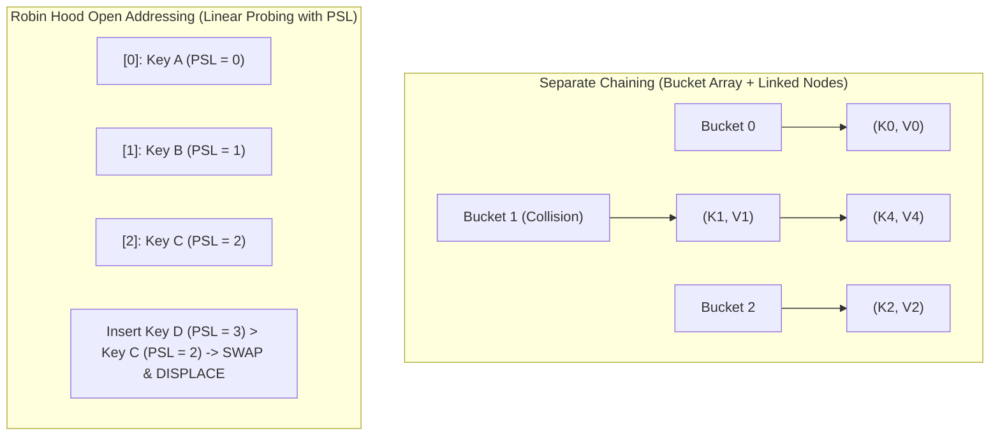

# Module 05: Hash Tables & Collision Resolution (0 to 100 Mastery)

> **Hash Functions, Open Addressing, Robin Hood Hashing, and $O(1)$ Lookup Invariants**

Hash tables map arbitrary keys to fixed table indices using hash functions. In this module, you master **Separate Chaining**, **Open Addressing with Linear Probing**, **Robin Hood displacement heuristics**, and frequency-based algorithmic patterns.

---


## Hash Collision Resolution: Separate Chaining vs Robin Hood Probing



---

## 1. Collision Resolution: Robin Hood Hashing vs Standard Linear Probing

In standard linear probing, clusters grow rapidly (primary clustering), leading to catastrophic lookup variance. **Robin Hood Hashing** solves this:
- Each slot records the **Probe Sequence Length (PSL)** (distance from its ideal hashed slot).
- When inserting an element with PSL $P_{new}$, if the slot is occupied with $P_{existing} < P_{new}$, the "rich" gives to the "poor": we swap elements and continue inserting the displaced element.
- Result: **Variance in search time drops to near-zero**.

---

## 2. Curated LeetCode Problem Breakdowns (Brute Force vs. Optimized)

This section walks through the **6 canonical LeetCode challenges** curated for this module.
Each problem is analyzed from brute force intuition to the optimal invariant-driven solution, along with the critical edge cases to guard against in production.

### Problem 1: Contains Duplicate ([LeetCode #217](https://leetcode.com/problems/contains-duplicate/)) — Easy

> **Pattern**: `Hash Set Membership` | **Target Time**: $O(N)$ | **Target Space**: $O(N)

#### Problem Specification
Given an integer array `nums`, return `true` if any value appears at least twice in the array, and return `false` if every element is distinct.

#### Algorithmic Invariants & Optimal Derivation
Iterate through elements adding to a hash set. If an element is already in the set, a duplicate is found in $O(1)$ amortized time.

```python
class Solution:
    def containsDuplicate(self, nums: list[int]) -> bool:
        seen = set()
        for x in nums:
            if x in seen:
                return True
            seen.add(x)
        return False
```

#### Critical Production Edge Cases to Guard:
- **Boundary Limits**: Empty inputs, single-element collections, and minimum constraint sizes.
- **Extremes & Negative Values**: Negative indices, zero values, and maximum integer magnitude constraints.
- **Duplicates & Uniform Sequences**: All identical values, alternating keys, or repeated entries.
- **Structural Invariants**: Target at boundary indices (index `0` or `N-1`), missing targets, or cycles.

---

### Problem 2: Valid Anagram ([LeetCode #242](https://leetcode.com/problems/valid-anagram/)) — Easy

> **Pattern**: `Character Frequency Counting` | **Target Time**: $O(N)$ | **Target Space**: $O(1) (bounded alphabet)

#### Problem Specification
Given two strings `s` and `t`, return `true` if `t` is an anagram of `s`, and `false` otherwise.

An Anagram is a word formed by rearranging the letters of a different word, typically using all the original letters exactly once.

#### Algorithmic Invariants & Optimal Derivation
Compare character frequency counts. If lengths differ, immediately return False. Otherwise tally frequencies and verify equality in $O(N)$ time.

```python
class Solution:
    def isAnagram(self, s: str, t: str) -> bool:
        if len(s) != len(t):
            return False
        from collections import Counter
        return Counter(s) == Counter(t)
```

#### Critical Production Edge Cases to Guard:
- **Boundary Limits**: Empty inputs, single-element collections, and minimum constraint sizes.
- **Extremes & Negative Values**: Negative indices, zero values, and maximum integer magnitude constraints.
- **Duplicates & Uniform Sequences**: All identical values, alternating keys, or repeated entries.
- **Structural Invariants**: Target at boundary indices (index `0` or `N-1`), missing targets, or cycles.

---

### Problem 3: Group Anagrams ([LeetCode #49](https://leetcode.com/problems/group-anagrams/)) — Medium

> **Pattern**: `Canonical Tuple / Sorted Key Grouping` | **Target Time**: $O(N \cdot K \log K)$ | **Target Space**: $O(N \cdot K)

#### Problem Specification
Given an array of strings `strs`, group the anagrams together. You can return the answer in any order.

#### Algorithmic Invariants & Optimal Derivation
Map each word to its canonical form (the sorted characters). Words with the exact same canonical string belong to the same anagram group.

```python
class Solution:
    def groupAnagrams(self, strs: list[str]) -> list[list[str]]:
        from collections import defaultdict
        groups = defaultdict(list)
        for s in strs:
            key = "".join(sorted(s))
            groups[key].append(s)
        return list(groups.values())
```

#### Critical Production Edge Cases to Guard:
- **Boundary Limits**: Empty inputs, single-element collections, and minimum constraint sizes.
- **Extremes & Negative Values**: Negative indices, zero values, and maximum integer magnitude constraints.
- **Duplicates & Uniform Sequences**: All identical values, alternating keys, or repeated entries.
- **Structural Invariants**: Target at boundary indices (index `0` or `N-1`), missing targets, or cycles.

---

### Problem 4: Top K Frequent Elements ([LeetCode #347](https://leetcode.com/problems/top-k-frequent-elements/)) — Medium

> **Pattern**: `Frequency Hash Map + Bucket Sort` | **Target Time**: $O(N)$ | **Target Space**: $O(N)

#### Problem Specification
Given an integer array `nums` and an integer `k`, return the `k` most frequent elements. You may return the answer in any order.

#### Algorithmic Invariants & Optimal Derivation
Tally counts with a hash map, then use Bucket Sort where index represents frequency (0 to N). Traverse buckets from highest frequency downwards to collect k elements in $O(N)$ linear time.

```python
class Solution:
    def topKFrequent(self, nums: list[int], k: int) -> list[int]:
        from collections import Counter
        count = Counter(nums)
        buckets = [[] for _ in range(len(nums) + 1)]
        for val, freq in count.items():
            buckets[freq].append(val)
        res = []
        for freq in range(len(buckets) - 1, 0, -1):
            for val in buckets[freq]:
                res.append(val)
                if len(res) == k:
                    return res
        return res
```

#### Critical Production Edge Cases to Guard:
- **Boundary Limits**: Empty inputs, single-element collections, and minimum constraint sizes.
- **Extremes & Negative Values**: Negative indices, zero values, and maximum integer magnitude constraints.
- **Duplicates & Uniform Sequences**: All identical values, alternating keys, or repeated entries.
- **Structural Invariants**: Target at boundary indices (index `0` or `N-1`), missing targets, or cycles.

---

### Problem 5: Longest Consecutive Sequence ([LeetCode #128](https://leetcode.com/problems/longest-consecutive-sequence/)) — Medium

> **Pattern**: `Hash Set Intelligent Expansion` | **Target Time**: $O(N)$ | **Target Space**: $O(N)

#### Problem Specification
Given an unsorted array of integers `nums`, return the length of the longest consecutive elements sequence.

You must write an algorithm that runs in $O(n)$ time.

#### Algorithmic Invariants & Optimal Derivation
Store numbers in a hash set. Only begin counting sequence length from numbers that are the start of a streak (i.e., `num - 1` is not in set). Each number is visited at most twice, guaranteeing $O(N)$ time.

```python
class Solution:
    def longestConsecutive(self, nums: list[int]) -> int:
        num_set = set(nums)
        longest = 0
        for num in num_set:
            if num - 1 not in num_set:
                curr = num
                curr_len = 1
                while curr + 1 in num_set:
                    curr += 1
                    curr_len += 1
                longest = max(longest, curr_len)
        return longest
```

#### Critical Production Edge Cases to Guard:
- **Boundary Limits**: Empty inputs, single-element collections, and minimum constraint sizes.
- **Extremes & Negative Values**: Negative indices, zero values, and maximum integer magnitude constraints.
- **Duplicates & Uniform Sequences**: All identical values, alternating keys, or repeated entries.
- **Structural Invariants**: Target at boundary indices (index `0` or `N-1`), missing targets, or cycles.

---

### Problem 6: Subarray Sum Equals K ([LeetCode #560](https://leetcode.com/problems/subarray-sum-equals-k/)) — Medium

> **Pattern**: `Prefix Sum Hash Map` | **Target Time**: $O(N)$ | **Target Space**: $O(N)

#### Problem Specification
Given an array of integers `nums` and an integer `k`, return the total number of subarrays whose sum equals to `k`.

A subarray is a contiguous non-empty sequence of elements within an array.

#### Algorithmic Invariants & Optimal Derivation
Subarray sum $(i \dots j) = 	ext{prefix}[j] - 	ext{prefix}[i-1] = k$. Thus $	ext{prefix}[i-1] = 	ext{prefix}[j] - k$. As we accumulate running prefix sum, add occurrences of `prefix_sum - k` to count in $O(N)$.

```python
class Solution:
    def subarraySum(self, nums: list[int], k: int) -> int:
        from collections import defaultdict
        prefix_count = defaultdict(int)
        prefix_count[0] = 1
        curr_sum = 0
        count = 0
        for x in nums:
            curr_sum += x
            count += prefix_count[curr_sum - k]
            prefix_count[curr_sum] += 1
        return count
```

#### Critical Production Edge Cases to Guard:
- **Boundary Limits**: Empty inputs, single-element collections, and minimum constraint sizes.
- **Extremes & Negative Values**: Negative indices, zero values, and maximum integer magnitude constraints.
- **Duplicates & Uniform Sequences**: All identical values, alternating keys, or repeated entries.
- **Structural Invariants**: Target at boundary indices (index `0` or `N-1`), missing targets, or cycles.

---


## 3. Hands-On Project & Test Suite

Verify your Robin Hood hash table engine:
- Starter Template: [`starter/robin_hood_hash_map.py`](starter/robin_hood_hash_map.py)
- Production Solution: [`project_solution/robin_hood_hash_map.py`](project_solution/robin_hood_hash_map.py)
- Pytest Suite: [`project_solution/test_robin_hood_hash_map.py`](project_solution/test_robin_hood_hash_map.py)

## 🧪 Practice & Verification

Reading a module teaches recognition. Only the problems teach recall — and the
debug lab teaches the thing neither of them does, which is diagnosis.

### 1. Build the module project

```bash
cd starter
python -m pytest ../project_solution -q      # must FAIL before you start
```

Every shipped test must fail with `NotImplementedError` on an untouched
starter. If any passes, the grading loop is broken and is telling you your work
is correct when it has not been done — run `make integrity` from the course
root.

### 2. Work the problem bank — 8 problems

```bash
cd problems
python -m pytest tests -q                    # all of this module's problems
python -m pytest tests -q -k p03             # just problem 3
```

| # | Problem | Pattern | Difficulty | Target |
| :--- | :--- | :--- | :--- | :--- |
| 01 | [Group Anagrams](problems/p01_group_anagrams.py) | Hash map with a canonical key | Medium | `Time O(total characters), Space O(total characters)` |
| 02 | [Top K Frequent Elements](problems/p02_top_k_frequent.py) | Counting + bucket sort | Medium | `Time O(n), Space O(n)` |
| 03 | [Longest Consecutive Sequence](problems/p03_longest_consecutive.py) | Hash set + sequence-start check | Medium | `Time O(n), Space O(n)` |
| 04 | [First Unique Character](problems/p04_first_unique_char.py) | Frequency counting | Easy | `Time O(n), Space O(alphabet)` |
| 05 | [Duplicate Within Distance K](problems/p05_contains_nearby_duplicate.py) | Sliding window + hash set | Medium | `Time O(n), Space O(min(n, k))` |
| 06 | [Isomorphic Strings](problems/p06_is_isomorphic.py) | Two-way hash mapping | Easy | `Time O(n), Space O(alphabet)` |
| 07 | [Subarray Sums Divisible By K](problems/p07_subarrays_div_by_k.py) | Prefix sums + modular arithmetic | Medium | `Time O(n), Space O(k)` |
| 08 | [Four Sum Count (Two Hash Maps)](problems/p08_four_sum_count.py) | Meet in the middle with a hash map | Hard | `Time O(n^2), Space O(n^2)` |

Each stub carries the statement, the constraints, a complexity target and a
**three-step hint ladder**. Read one hint, try again, and only then read the
next. Every reference solution in `problems/solutions/` is cross-checked against
a brute force or a second implementation, so the answers are verified rather
than asserted.

### 3. Work the debug lab

```bash
cd debug_lab
python broken_hash_toolkit.py
echo "exit=$?"
```

It exits 0 and prints wrong answers. Read [`SYMPTOMS.md`](debug_lab/SYMPTOMS.md),
write a diagnosis for each, and only then open `ANSWERS.md`. The diagnostic
reasoning is the transferable skill; reading the answer first skips it.

---

## ✅ You have mastered this module when you can…

1. Name two questions a hash map cannot answer, and the structure that answers each.
2. Design a canonical key that is equal exactly when two inputs are equivalent, and say what a set-based key loses.
3. Explain why the run-start guard turns longest-consecutive from O(n^2) into O(n).
4. Use prefix-sum counts with a hash map for subarray problems that a window cannot handle.

Each of these is something you **do**, not something you know. If you cannot do
one without reference, that is the section to revisit — not the whole module.

---

## 🧭 Navigation

- [Pattern Recognition Guide](../PATTERN_RECOGNITION_GUIDE.md) — how to attack a problem you have never seen
- [Course README](../README.md) · [Master Syllabus](../MASTER_SYLLABUS.md)
- [Problem bank](problems/README.md) · [Debug lab](debug_lab/SYMPTOMS.md)