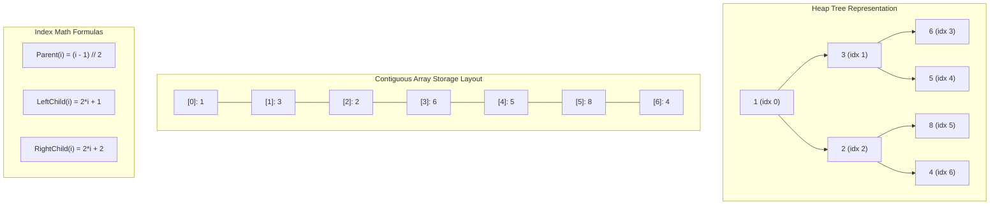

# Module 07: Heaps, Priority Queues & TopK Patterns (0 to 100 Mastery)

> **Complete Binary Trees, Sift-Up/Sift-Down, $O(N)$ Heapify & Streaming Quantiles**

Binary Heaps provide guaranteed $O(1)$ minimum/maximum lookup and $O(\\log N)$ insertion and deletion. In this module, you master **Bottom-Up Heapify ($O(N)$ proof)**, **Top-K Streaming Elements**, **Two-Heap Median Tracking**, and **K-Way List Merging**.

---


## Binary Min-Heap Array Mapping & Sift-Down Invariant



## 1. The $O(N)$ Bottom-Up Heapify Proof

Building a heap by inserting $N$ elements one by one takes $O(N \\log N)$.
However, bottom-up `heapify` sifts down starting at index $\\lfloor N/2 \\rfloor - 1$:
$$\\sum_{h=0}^{\\log N} \\frac{N}{2^{h+1}} \\cdot O(h) = O(N \\sum_{h=0}^\\infty \\frac{h}{2^h}) = O(2N) = O(N)$$

---

## 2. Curated LeetCode Problem Breakdowns (Brute Force vs. Optimized)

This section walks through the **6 canonical LeetCode challenges** curated for this module.
Each problem is analyzed from brute force intuition to the optimal invariant-driven solution, along with the critical edge cases to guard against in production.

### Problem 1: Kth Largest Element in a Stream ([LeetCode #703](https://leetcode.com/problems/kth-largest-element-in-a-stream/)) — Easy

> **Pattern**: `Size-K Min-Heap` | **Target Time**: $O(\log K) per add$ | **Target Space**: $O(K)

#### Problem Specification
Design a class to find the `k-th` largest element in a stream. Note that it is the `k-th` largest element in the sorted order, not the `k-th` distinct element.

Implement `KthLargest` class:
- `KthLargest(int k, int[] nums)` Initializes the object with the integer `k` and the stream of integers `nums`.
- `int add(int val)` Appends the integer `val` to the stream and returns the element representing the `k-th` largest element in the stream.

#### Algorithmic Invariants & Optimal Derivation
Maintain a min-heap of size k. The root of the min-heap is always the k-th largest element seen so far. Each add takes $O(\log K)$.

```python
import heapq

class KthLargest:
    def __init__(self, k: int, nums: list[int]):
        self.k = k
        self.min_heap = nums
        heapq.heapify(self.min_heap)
        while len(self.min_heap) > k:
            heapq.heappop(self.min_heap)

    def add(self, val: int) -> int:
        heapq.heappush(self.min_heap, val)
        if len(self.min_heap) > self.k:
            heapq.heappop(self.min_heap)
        return self.min_heap[0]
```

#### Critical Production Edge Cases to Guard:
- **Boundary Limits**: Empty inputs, single-element collections, and minimum constraint sizes.
- **Extremes & Negative Values**: Negative indices, zero values, and maximum integer magnitude constraints.
- **Duplicates & Uniform Sequences**: All identical values, alternating keys, or repeated entries.
- **Structural Invariants**: Target at boundary indices (index `0` or `N-1`), missing targets, or cycles.

---

### Problem 2: Last Stone Weight ([LeetCode #1046](https://leetcode.com/problems/last-stone-weight/)) — Easy

> **Pattern**: `Max-Heap Simulation` | **Target Time**: $O(N \log N)$ | **Target Space**: $O(N)

#### Problem Specification
You are given an array of integers `stones` where `stones[i]` is the weight of the `i-th` stone.

We are playing a game with the stones. On each turn, we choose the heaviest two stones with weights `x` and `y` with `x <= y`. The result of this smash is:
- If `x == y`, both stones are destroyed.
- If `x != y`, the stone of weight `x` is destroyed, and the stone of weight `y` has new weight `y - x`.

At the end of the game, there is at most one stone left. Return the weight of the last remaining stone. If there are no stones left, return `0`.

#### Algorithmic Invariants & Optimal Derivation
Simulate max-heap by negating values in Python's heapq. Repeatedly pop the two largest stones and push the difference back if non-zero.

```python
import heapq

class Solution:
    def lastStoneWeight(self, stones: list[int]) -> int:
        max_heap = [-s for s in stones]
        heapq.heapify(max_heap)
        while len(max_heap) > 1:
            first = -heapq.heappop(max_heap)
            second = -heapq.heappop(max_heap)
            if first != second:
                heapq.heappush(max_heap, -(first - second))
        return -max_heap[0] if max_heap else 0
```

#### Critical Production Edge Cases to Guard:
- **Boundary Limits**: Empty inputs, single-element collections, and minimum constraint sizes.
- **Extremes & Negative Values**: Negative indices, zero values, and maximum integer magnitude constraints.
- **Duplicates & Uniform Sequences**: All identical values, alternating keys, or repeated entries.
- **Structural Invariants**: Target at boundary indices (index `0` or `N-1`), missing targets, or cycles.

---

### Problem 3: K Closest Points to Origin ([LeetCode #973](https://leetcode.com/problems/k-closest-points-to-origin/)) — Medium

> **Pattern**: `Max-Heap of Size K / Euclidean Distance` | **Target Time**: $O(N \log K)$ | **Target Space**: $O(K)

#### Problem Specification
Given an array of `points` where `points[i] = [xi, yi]` represents a point on the X-Y plane and an integer `k`, return the `k` closest points to the origin `(0, 0)`.

The distance between two points on the X-Y plane is Euclidean distance: $\sqrt{x^2 + y^2}$. You may return the answer in any order.

#### Algorithmic Invariants & Optimal Derivation
Maintain a max-heap of size K using negative squared distances. Points farther away than the current K closest are automatically evicted.

```python
import heapq

class Solution:
    def kClosest(self, points: list[list[int]], k: int) -> list[list[int]]:
        max_heap = []
        for x, y in points:
            dist = -(x * x + y * y)
            if len(max_heap) < k:
                heapq.heappush(max_heap, (dist, [x, y]))
            else:
                heapq.heappushpop(max_heap, (dist, [x, y]))
        return [pt for _, pt in max_heap]
```

#### Critical Production Edge Cases to Guard:
- **Boundary Limits**: Empty inputs, single-element collections, and minimum constraint sizes.
- **Extremes & Negative Values**: Negative indices, zero values, and maximum integer magnitude constraints.
- **Duplicates & Uniform Sequences**: All identical values, alternating keys, or repeated entries.
- **Structural Invariants**: Target at boundary indices (index `0` or `N-1`), missing targets, or cycles.

---

### Problem 4: Task Scheduler ([LeetCode #621](https://leetcode.com/problems/task-scheduler/)) — Medium

> **Pattern**: `Greedy Max-Heap with Cooldown Queue` | **Target Time**: $O(N)$ | **Target Space**: $O(1) (26 tasks)

#### Problem Specification
Given a characters array `tasks`, representing the tasks a CPU needs to do, where each letter represents a different task. Tasks could be done in any order. Each task is done in one unit of time. For each unit of time, the CPU could complete either one task or just be idle.

However, there is a non-negative integer `n` that represents the cooldown period between two same tasks (the same task must be separated by at least `n` units of time).

Return the least number of units of times that the CPU will take to finish all the given tasks.

#### Algorithmic Invariants & Optimal Derivation
The bottleneck is dictated by the task(s) with the maximum frequency $M$. There are $M - 1$ frame blocks of size $n+1$, plus the final row of size $K$ (where $K$ is the number of tasks sharing max frequency).

```python
from collections import Counter

class Solution:
    def leastInterval(self, tasks: list[str], n: int) -> int:
        counts = Counter(tasks)
        max_freq = max(counts.values())
        max_count = sum(1 for c, v in counts.items() if v == max_freq)
        empty_slots = (max_freq - 1) * (n - (max_count - 1))
        available_tasks = len(tasks) - max_freq * max_count
        idles = max(0, empty_slots - available_tasks)
        return len(tasks) + idles
```

#### Critical Production Edge Cases to Guard:
- **Boundary Limits**: Empty inputs, single-element collections, and minimum constraint sizes.
- **Extremes & Negative Values**: Negative indices, zero values, and maximum integer magnitude constraints.
- **Duplicates & Uniform Sequences**: All identical values, alternating keys, or repeated entries.
- **Structural Invariants**: Target at boundary indices (index `0` or `N-1`), missing targets, or cycles.

---

### Problem 5: Find Median from Data Stream ([LeetCode #295](https://leetcode.com/problems/find-median-from-data-stream/)) — Hard

> **Pattern**: `Dual Balancing Heaps (Min/Max)` | **Target Time**: $O(\log N) add, O(1) find$ | **Target Space**: $O(N)

#### Problem Specification
The median is the middle value in an ordered integer list. If the size of the list is even, there is no middle value, and the median is the mean of the two middle values.

Implement the `MedianFinder` class:
- `MedianFinder()` initializes the MedianFinder object.
- `void addNum(int num)` adds the integer `num` from the data stream to the data structure.
- `double findMedian()` returns the median of all elements so far.

#### Algorithmic Invariants & Optimal Derivation
Maintain two heaps: a max-heap `small` for the lower half of numbers, and a min-heap `large` for the upper half. Keep heaps balanced such that `len(small) == len(large)` or `len(small) == len(large) + 1`.

```python
import heapq

class MedianFinder:
    def __init__(self):
        # small: max_heap (invert numbers)
        # large: min_heap
        self.small = []
        self.large = []

    def addNum(self, num: int) -> None:
        heapq.heappush(self.small, -num)
        # ensure every in small <= every in large
        if self.small and self.large and (-self.small[0] > self.large[0]):
            val = -heapq.heappop(self.small)
            heapq.heappush(self.large, val)
        # balance sizes
        if len(self.small) > len(self.large) + 1:
            val = -heapq.heappop(self.small)
            heapq.heappush(self.large, val)
        if len(self.large) > len(self.small):
            val = heapq.heappop(self.large)
            heapq.heappush(self.small, -val)

    def findMedian(self) -> float:
        if len(self.small) > len(self.large):
            return float(-self.small[0])
        return (-self.small[0] + self.large[0]) / 2.0
```

#### Critical Production Edge Cases to Guard:
- **Boundary Limits**: Empty inputs, single-element collections, and minimum constraint sizes.
- **Extremes & Negative Values**: Negative indices, zero values, and maximum integer magnitude constraints.
- **Duplicates & Uniform Sequences**: All identical values, alternating keys, or repeated entries.
- **Structural Invariants**: Target at boundary indices (index `0` or `N-1`), missing targets, or cycles.

---

### Problem 6: Kth Largest Element in an Array ([LeetCode #215](https://leetcode.com/problems/kth-largest-element-in-an-array/)) — Medium

> **Pattern**: `Min-Heap of Size K / Quickselect` | **Target Time**: $O(N \log K)$ | **Target Space**: $O(K)

#### Problem Specification
Given an integer array `nums` and an integer `k`, return the `k-th` largest element in the array.

Note that it is the `k-th` largest element in the sorted order, not the `k-th` distinct element. Can you solve it without sorting?

#### Algorithmic Invariants & Optimal Derivation
Feed elements into a min-heap of maximum size K. When size exceeds K, pop the smallest. After scanning all elements, the root of the heap holds the Kth largest.

```python
import heapq

class Solution:
    def findKthLargest(self, nums: list[int], k: int) -> int:
        heap = []
        for x in nums:
            heapq.heappush(heap, x)
            if len(heap) > k:
                heapq.heappop(heap)
        return heap[0]
```

#### Critical Production Edge Cases to Guard:
- **Boundary Limits**: Empty inputs, single-element collections, and minimum constraint sizes.
- **Extremes & Negative Values**: Negative indices, zero values, and maximum integer magnitude constraints.
- **Duplicates & Uniform Sequences**: All identical values, alternating keys, or repeated entries.
- **Structural Invariants**: Target at boundary indices (index `0` or `N-1`), missing targets, or cycles.

---


## 3. Hands-On Project & Test Suite

Verify your Binary Min-Heap and Top-K tracking engine:
- Starter Template: [`starter/binary_min_heap_engine.py`](starter/binary_min_heap_engine.py)
- Production Solution: [`project_solution/binary_min_heap_engine.py`](project_solution/binary_min_heap_engine.py)
- Pytest Suite: [`project_solution/test_binary_min_heap_engine.py`](project_solution/test_binary_min_heap_engine.py)

## 🧪 Practice & Verification

Reading a module teaches recognition. Only the problems teach recall — and the
debug lab teaches the thing neither of them does, which is diagnosis.

### 1. Build the module project

```bash
cd starter
python -m pytest ../project_solution -q      # must FAIL before you start
```

Every shipped test must fail with `NotImplementedError` on an untouched
starter. If any passes, the grading loop is broken and is telling you your work
is correct when it has not been done — run `make integrity` from the course
root.

### 2. Work the problem bank — 8 problems

```bash
cd problems
python -m pytest tests -q                    # all of this module's problems
python -m pytest tests -q -k p03             # just problem 3
```

| # | Problem | Pattern | Difficulty | Target |
| :--- | :--- | :--- | :--- | :--- |
| 01 | [K-th Largest Element](problems/p01_kth_largest.py) | Min-heap of size k | Medium | `Time O(n log k), Space O(k)` |
| 02 | [Merge K Sorted Lists](problems/p02_merge_k_sorted.py) | Min-heap k-way merge | Hard | `Time O(N log k), Space O(k)` |
| 03 | [Median From A Data Stream](problems/p03_streaming_median.py) | Two heaps | Hard | `Time O(n log n) total, O(1) per query, Space O(n)` |
| 04 | [K Closest Points To The Origin](problems/p04_k_closest_points.py) | Max-heap of size k | Medium | `Time O(n log k), Space O(k)` |
| 05 | [Last Stone Weight](problems/p05_last_stone_weight.py) | Max-heap simulation | Easy | `Time O(n log n), Space O(n)` |
| 06 | [Minimum Meeting Rooms](problems/p06_min_meeting_rooms.py) | Heap of end times | Medium | `Time O(n log n), Space O(n)` |
| 07 | [Task Scheduler With Cooldown](problems/p07_task_scheduler.py) | Greedy counting (heap-free) | Medium | `Time O(n), Space O(alphabet)` |
| 08 | [Reorganize String](problems/p08_reorganize_string.py) | Greedy with a max-heap | Hard | `Time O(n log 26), Space O(n)` |

Each stub carries the statement, the constraints, a complexity target and a
**three-step hint ladder**. Read one hint, try again, and only then read the
next. Every reference solution in `problems/solutions/` is cross-checked against
a brute force or a second implementation, so the answers are verified rather
than asserted.

### 3. Work the debug lab

```bash
cd debug_lab
python broken_priority_toolkit.py
echo "exit=$?"
```

It exits 0 and prints wrong answers. Read [`SYMPTOMS.md`](debug_lab/SYMPTOMS.md),
write a diagnosis for each, and only then open `ANSWERS.md`. The diagnostic
reasoning is the transferable skill; reading the answer first skips it.

---

## ✅ You have mastered this module when you can…

1. Explain why the k LARGEST elements are kept in a MIN-heap of size k.
2. Maintain a streaming median with two heaps, and state the size invariant that makes it work.
3. Recognise k-way merge, top-k and scheduling as heap problems from their phrasing.
4. Say when a heap is the wrong tool because a counting or bucket approach is O(n).

Each of these is something you **do**, not something you know. If you cannot do
one without reference, that is the section to revisit — not the whole module.

---

## 🧭 Navigation

- [Pattern Recognition Guide](../PATTERN_RECOGNITION_GUIDE.md) — how to attack a problem you have never seen
- [Course README](../README.md) · [Master Syllabus](../MASTER_SYLLABUS.md)
- [Problem bank](problems/README.md) · [Debug lab](debug_lab/SYMPTOMS.md)