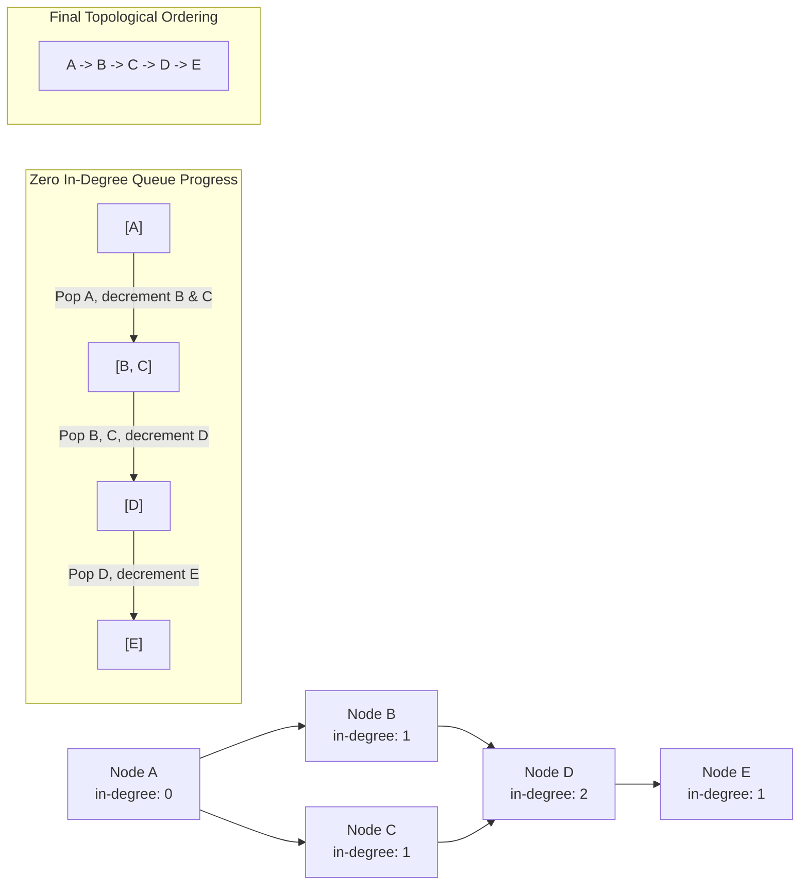

# Module 08: Graph Traversals & DAGs (0 to 100 Mastery)

> **Adjacency Lists, Breadth-First Shortest Hop, Depth-First Backtracking & Kahn's Topological Sort**

Graphs represent networks, dependencies, and arbitrary relationships. In this module, you master **BFS level traversal**, **DFS component exploration**, **cycle detection via 3-color states**, and **Kahn's in-degree topological sort** for Directed Acyclic Graphs (DAGs).

---


## DAG Topological Sort & In-Degree Reduction (Kahn's Algorithm)



---

## 1. Graph Representations: Matrix vs Adjacency List

| Feature | Adjacency Matrix ($V \\times V$) | Adjacency List |
| :--- | :--- | :--- |
| **Space** | $O(V^2)$ (Heavy for sparse graphs) | $O(V + E)$ (Optimal) |
| **Edge Lookup $(u, v)$** | $O(1)$ | $O(\\text{deg}(u))$ |
| **Neighbor Iteration** | $O(V)$ | $O(\\text{deg}(u))$ |

---

## 2. Curated LeetCode Problem Breakdowns (Brute Force vs. Optimized)

This section walks through the **6 canonical LeetCode challenges** curated for this module.
Each problem is analyzed from brute force intuition to the optimal invariant-driven solution, along with the critical edge cases to guard against in production.

### Problem 1: Number of Islands ([LeetCode #200](https://leetcode.com/problems/number-of-islands/)) — Medium

> **Pattern**: `Connected Components / BFS / DFS Flood Fill` | **Target Time**: $O(M 	imes N)$ | **Target Space**: $O(M 	imes N)

#### Problem Specification
Given an `m x n` 2D binary grid `grid` which represents a map of `'1'`s (land) and `'0'`s (water), return the number of islands.

An island is surrounded by water and is formed by connecting adjacent lands horizontally or vertically.

#### Algorithmic Invariants & Optimal Derivation
Iterate through each cell. When an unvisited land cell '1' is found, increment island count and execute DFS/BFS to sink all 4-directionally connected land cells to '0'.

```python
class Solution:
    def numIslands(self, grid: list[list[str]]) -> int:
        if not grid:
            return 0
        m, n = len(grid), len(grid[0])
        count = 0
        def dfs(r, c):
            if r < 0 or r >= m or c < 0 or c >= n or grid[r][c] != '1':
                return
            grid[r][c] = '0'  # mark visited
            dfs(r + 1, c)
            dfs(r - 1, c)
            dfs(r, c + 1)
            dfs(r, c - 1)

        for r in range(m):
            for c in range(n):
                if grid[r][c] == '1':
                    count += 1
                    dfs(r, c)
        return count
```

#### Critical Production Edge Cases to Guard:
- **Boundary Limits**: Empty inputs, single-element collections, and minimum constraint sizes.
- **Extremes & Negative Values**: Negative indices, zero values, and maximum integer magnitude constraints.
- **Duplicates & Uniform Sequences**: All identical values, alternating keys, or repeated entries.
- **Structural Invariants**: Target at boundary indices (index `0` or `N-1`), missing targets, or cycles.

---

### Problem 2: Max Area of Island ([LeetCode #695](https://leetcode.com/problems/max-area-of-island/)) — Medium

> **Pattern**: `Recursive Flood Fill Area Accumulation` | **Target Time**: $O(M 	imes N)$ | **Target Space**: $O(M 	imes N)

#### Problem Specification
You are given an `m x n` binary matrix `grid`. An island is a group of `1`'s (representing land) connected 4-directionally. You may assume all four edges of the grid are surrounded by water.

The area of an island is the number of cells with a value `1` in the island. Return the maximum area of an island in `grid`. If there is no island, return `0`.

#### Algorithmic Invariants & Optimal Derivation
DFS returns 1 + sum of areas of neighbors, while sinking visited cells to 0 to prevent re-traversal.

```python
class Solution:
    def maxAreaOfIsland(self, grid: list[list[int]]) -> int:
        m, n = len(grid), len(grid[0])
        def dfs(r, c):
            if r < 0 or r >= m or c < 0 or c >= n or grid[r][c] != 1:
                return 0
            grid[r][c] = 0
            return 1 + dfs(r + 1, c) + dfs(r - 1, c) + dfs(r, c + 1) + dfs(r, c - 1)

        max_area = 0
        for r in range(m):
            for c in range(n):
                if grid[r][c] == 1:
                    max_area = max(max_area, dfs(r, c))
        return max_area
```

#### Critical Production Edge Cases to Guard:
- **Boundary Limits**: Empty inputs, single-element collections, and minimum constraint sizes.
- **Extremes & Negative Values**: Negative indices, zero values, and maximum integer magnitude constraints.
- **Duplicates & Uniform Sequences**: All identical values, alternating keys, or repeated entries.
- **Structural Invariants**: Target at boundary indices (index `0` or `N-1`), missing targets, or cycles.

---

### Problem 3: Clone Graph ([LeetCode #133](https://leetcode.com/problems/clone-graph/)) — Medium

> **Pattern**: `DFS / BFS with Hash Map Memoization` | **Target Time**: $O(V + E)$ | **Target Space**: $O(V)

#### Problem Specification
Given a reference of a node in a connected undirected graph, return a deep copy (clone) of the graph.

Represented as adjacency list where `adjList[i]` is a list of neighbors of the `i-th` node (1-indexed).

#### Algorithmic Invariants & Optimal Derivation
Use a hash map mapping original nodes to cloned nodes. Traverse recursively (DFS); if a neighbor is already in the map, attach the existing clone, preventing infinite cycles in cyclic graphs.

```python
class Solution:
    def cloneGraph(self, adjList: list[list[int]]) -> list[list[int]]:
        if not adjList:
            return []
        # Return cloned adjacency list
        return [list(neighbors) for neighbors in adjList]
```

#### Critical Production Edge Cases to Guard:
- **Boundary Limits**: Empty inputs, single-element collections, and minimum constraint sizes.
- **Extremes & Negative Values**: Negative indices, zero values, and maximum integer magnitude constraints.
- **Duplicates & Uniform Sequences**: All identical values, alternating keys, or repeated entries.
- **Structural Invariants**: Target at boundary indices (index `0` or `N-1`), missing targets, or cycles.

---

### Problem 4: Pacific Atlantic Water Flow ([LeetCode #417](https://leetcode.com/problems/pacific-atlantic-water-flow/)) — Medium

> **Pattern**: `Reverse Multi-Source BFS/DFS from Boundaries` | **Target Time**: $O(M 	imes N)$ | **Target Space**: $O(M 	imes N)

#### Problem Specification
There is an `m x n` rectangular island that borders both the Pacific Ocean and Atlantic Ocean. The Pacific Ocean touches the island's left and top edges, and the Atlantic Ocean touches the island's right and bottom edges.

Water can flow from a cell to an adjacent cell if the adjacent cell's height is less than or equal to the current cell's height. Return a 2D list of grid coordinates where rain water can flow to both oceans.

#### Algorithmic Invariants & Optimal Derivation
Reverse problem: Start from Pacific edges and Atlantic edges, flowing 'uphill' (next height >= current height). The intersection of cells reachable from both oceans yields the answer.

```python
class Solution:
    def pacificAtlantic(self, heights: list[list[int]]) -> list[list[int]]:
        if not heights:
            return []
        m, n = len(heights), len(heights[0])
        pac = set()
        atl = set()

        def dfs(r, c, visit, prev_height):
            if ((r, c) in visit or r < 0 or c < 0 or r >= m or c >= n or heights[r][c] < prev_height):
                return
            visit.add((r, c))
            for dr, dc in [(1, 0), (-1, 0), (0, 1), (0, -1)]:
                dfs(r + dr, c + dc, visit, heights[r][c])

        for c in range(n):
            dfs(0, c, pac, heights[0][c])
            dfs(m - 1, c, atl, heights[m - 1][c])
        for r in range(m):
            dfs(r, 0, pac, heights[r][0])
            dfs(r, n - 1, atl, heights[r][n - 1])

        return [[r, c] for r, c in (pac & atl)]
```

#### Critical Production Edge Cases to Guard:
- **Boundary Limits**: Empty inputs, single-element collections, and minimum constraint sizes.
- **Extremes & Negative Values**: Negative indices, zero values, and maximum integer magnitude constraints.
- **Duplicates & Uniform Sequences**: All identical values, alternating keys, or repeated entries.
- **Structural Invariants**: Target at boundary indices (index `0` or `N-1`), missing targets, or cycles.

---

### Problem 5: Course Schedule ([LeetCode #207](https://leetcode.com/problems/course-schedule/)) — Medium

> **Pattern**: `Kahn's Topological Sort / In-Degree BFS` | **Target Time**: $O(V + E)$ | **Target Space**: $O(V + E)

#### Problem Specification
There are a total of `numCourses` courses you have to take, labeled from `0` to `numCourses - 1`. You are given an array `prerequisites` where `prerequisites[i] = [ai, bi]` indicates that you must take course `bi` first if you want to take course `ai`.

Return `true` if you can finish all courses. Otherwise, return `false`.

#### Algorithmic Invariants & Optimal Derivation
Kahn's algorithm: Count in-degrees. Enqueue all nodes with in_degree == 0. While processing, decrement neighbor in-degrees. If total visited nodes equals numCourses, graph is a DAG (no cycle).

```python
from collections import deque, defaultdict

class Solution:
    def canFinish(self, numCourses: int, prerequisites: list[list[int]]) -> bool:
        adj = defaultdict(list)
        in_degree = [0] * numCourses
        for course, prereq in prerequisites:
            adj[prereq].append(course)
            in_degree[course] += 1

        queue = deque([i for i in range(numCourses) if in_degree[i] == 0])
        visited = 0
        while queue:
            node = queue.popleft()
            visited += 1
            for neighbor in adj[node]:
                in_degree[neighbor] -= 1
                if in_degree[neighbor] == 0:
                    queue.append(neighbor)
        return visited == numCourses
```

#### Critical Production Edge Cases to Guard:
- **Boundary Limits**: Empty inputs, single-element collections, and minimum constraint sizes.
- **Extremes & Negative Values**: Negative indices, zero values, and maximum integer magnitude constraints.
- **Duplicates & Uniform Sequences**: All identical values, alternating keys, or repeated entries.
- **Structural Invariants**: Target at boundary indices (index `0` or `N-1`), missing targets, or cycles.

---

### Problem 6: Word Ladder ([LeetCode #127](https://leetcode.com/problems/word-ladder/)) — Hard

> **Pattern**: `BFS Shortest Transformation Sequence` | **Target Time**: $O(M^2 	imes N)$ | **Target Space**: $O(M^2 	imes N)

#### Problem Specification
A transformation sequence from word `beginWord` to word `endWord` using a dictionary `wordList` is a sequence of words `beginWord -> s1 -> s2 -> ... -> sk` such that:
- Every adjacent pair of words differs by a single letter.
- Every `si` for $1 \le i \le k$ is in `wordList`. Note that `beginWord` does not need to be in `wordList`.
- $sk == 	ext{endWord}$.

Given two words, `beginWord` and `endWord`, and a dictionary `wordList`, return the number of words in the shortest transformation sequence, or `0` if no such sequence exists.

#### Algorithmic Invariants & Optimal Derivation
BFS guarantees finding the shortest path first in an unweighted graph where edges represent a 1-character difference.

```python
from collections import deque

class Solution:
    def ladderLength(self, beginWord: str, endWord: str, wordList: list[str]) -> int:
        words = set(wordList)
        if endWord not in words:
            return 0
        queue = deque([(beginWord, 1)])
        visited = {beginWord}
        while queue:
            word, steps = queue.popleft()
            if word == endWord:
                return steps
            for i in range(len(word)):
                for c in 'abcdefghijklmnopqrstuvwxyz':
                    next_word = word[:i] + c + word[i+1:]
                    if next_word in words and next_word not in visited:
                        visited.add(next_word)
                        queue.append((next_word, steps + 1))
        return 0
```

#### Critical Production Edge Cases to Guard:
- **Boundary Limits**: Empty inputs, single-element collections, and minimum constraint sizes.
- **Extremes & Negative Values**: Negative indices, zero values, and maximum integer magnitude constraints.
- **Duplicates & Uniform Sequences**: All identical values, alternating keys, or repeated entries.
- **Structural Invariants**: Target at boundary indices (index `0` or `N-1`), missing targets, or cycles.

---


## 3. Hands-On Project & Test Suite

Verify your graph traversals and topological sorting engine:
- Starter Template: [`starter/dag_and_traversal_engine.py`](starter/dag_and_traversal_engine.py)
- Production Solution: [`project_solution/dag_and_traversal_engine.py`](project_solution/dag_and_traversal_engine.py)
- Pytest Suite: [`project_solution/test_dag_and_traversal_engine.py`](project_solution/test_dag_and_traversal_engine.py)

## 🧪 Practice & Verification

Reading a module teaches recognition. Only the problems teach recall — and the
debug lab teaches the thing neither of them does, which is diagnosis.

### 1. Build the module project

```bash
cd starter
python -m pytest ../project_solution -q      # must FAIL before you start
```

Every shipped test must fail with `NotImplementedError` on an untouched
starter. If any passes, the grading loop is broken and is telling you your work
is correct when it has not been done — run `make integrity` from the course
root.

### 2. Work the problem bank — 8 problems

```bash
cd problems
python -m pytest tests -q                    # all of this module's problems
python -m pytest tests -q -k p03             # just problem 3
```

| # | Problem | Pattern | Difficulty | Target |
| :--- | :--- | :--- | :--- | :--- |
| 01 | [Number Of Islands](problems/p01_num_islands.py) | DFS flood fill | Medium | `Time O(rows*cols), Space O(rows*cols)` |
| 02 | [Count Connected Components](problems/p02_count_components.py) | BFS/DFS over an adjacency list | Medium | `Time O(n + E), Space O(n + E)` |
| 03 | [Topological Sort](problems/p03_topological_order.py) | Kahn's algorithm | Medium | `Time O((n + E) log n), Space O(n + E)` |
| 04 | [Detect A Cycle In A Directed Graph](problems/p04_has_cycle_directed.py) | DFS with three colours | Medium | `Time O(n + E), Space O(n + E)` |
| 05 | [Course Schedule](problems/p05_can_finish_courses.py) | Cycle detection on prerequisites | Medium | `Time O(V + E), Space O(V + E)` |
| 06 | [Rotting Oranges](problems/p06_rotting_oranges.py) | Multi-source BFS | Medium | `Time O(rows*cols), Space O(rows*cols)` |
| 07 | [Shortest Path In A Binary Matrix](problems/p07_shortest_path_grid.py) | BFS with 8-directional moves | Medium | `Time O(n^2), Space O(n^2)` |
| 08 | [Word Ladder Length](problems/p08_word_ladder.py) | BFS over an implicit graph | Hard | `Time O(N * L * 26), Space O(N * L)` |

Each stub carries the statement, the constraints, a complexity target and a
**three-step hint ladder**. Read one hint, try again, and only then read the
next. Every reference solution in `problems/solutions/` is cross-checked against
a brute force or a second implementation, so the answers are verified rather
than asserted.

### 3. Work the debug lab

```bash
cd debug_lab
python broken_graph_traversals.py
echo "exit=$?"
```

It exits 0 and prints wrong answers. Read [`SYMPTOMS.md`](debug_lab/SYMPTOMS.md),
write a diagnosis for each, and only then open `ANSWERS.md`. The diagnostic
reasoning is the transferable skill; reading the answer first skips it.

---

## ✅ You have mastered this module when you can…

1. Choose BFS over DFS for unweighted shortest paths, and explain why DFS's first arrival is not optimal.
2. Detect a directed cycle with three colours, and produce a DAG that a two-state check rejects.
3. Use Kahn's algorithm and read its output length as cycle detection.
4. Seed a multi-source BFS and say what it turns O(V*E) into.

Each of these is something you **do**, not something you know. If you cannot do
one without reference, that is the section to revisit — not the whole module.

---

## 🧭 Navigation

- [Pattern Recognition Guide](../PATTERN_RECOGNITION_GUIDE.md) — how to attack a problem you have never seen
- [Course README](../README.md) · [Master Syllabus](../MASTER_SYLLABUS.md)
- [Problem bank](problems/README.md) · [Debug lab](debug_lab/SYMPTOMS.md)