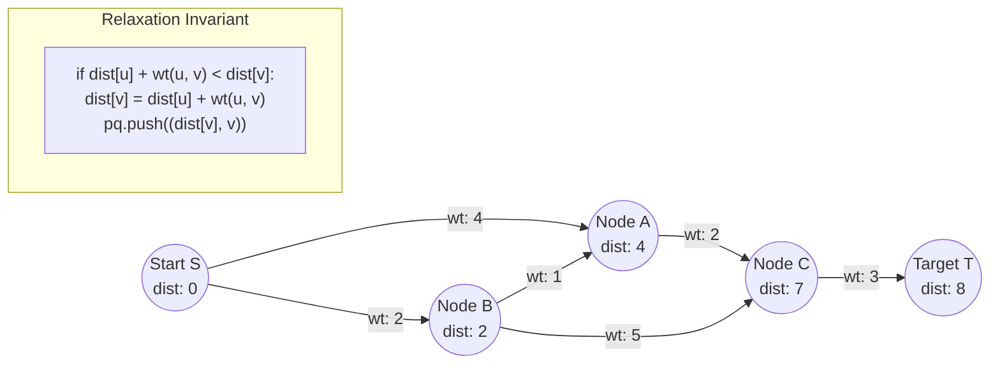

# Module 09: Shortest Paths & MST (0 to 100 Mastery)

> **Greedy Edge Relaxation, Priority Queue Dijkstra, Bellman-Ford Negative Cycles & Kruskal's MST**

Weighted graph algorithms solve latency routing in distributed systems and network layout design. In this module, you master **Dijkstra's Algorithm with Min-Heap**, **Bellman-Ford relaxation and negative cycle detection**, and **Kruskal's Minimum Spanning Tree with Disjoint Set Union**.

---


## Dijkstra Shortest Path Relaxation Frontier



## 1. Algorithmic Tradeoffs for Shortest Paths

| Algorithm | Edge Weights | Time Complexity | Cycle Handling |
| :--- | :--- | :--- | :--- |
| **BFS** | Unweighted ($w=1$) | $O(V + E)$ | Handles general graphs |
| **Dijkstra** | Non-negative ($w \\ge 0$) | $O((V + E) \\log V)$ | Fails on negative edges |
| **Bellman-Ford** | Any ($w \\in \\mathbb{R}$) | $O(V \\cdot E)$ | Detects negative weight cycles |
| **Floyd-Warshall** | Any ($w \\in \\mathbb{R}$) | $O(V^3)$ | All-Pairs Shortest Path |

---

## 2. Curated LeetCode Problem Breakdowns (Brute Force vs. Optimized)

This section walks through the **6 canonical LeetCode challenges** curated for this module.
Each problem is analyzed from brute force intuition to the optimal invariant-driven solution, along with the critical edge cases to guard against in production.

### Problem 1: Network Delay Time ([LeetCode #743](https://leetcode.com/problems/network-delay-time/)) — Medium

> **Pattern**: `Dijkstra's Single-Source Shortest Path` | **Target Time**: $O(E \log V)$ | **Target Space**: $O(V + E)

#### Problem Specification
You are given a network of `n` nodes, labeled from `1` to `n`. You are also given `times`, a list of travel times as directed edges `times[i] = (ui, vi, wi)`, where `ui` is the source node, `vi` is the target node, and `wi` is the time it takes for a signal to travel from source to target.

We will send a signal from a given node `k`. Return the minimum time it takes for all the `n` nodes to receive the signal. If it is impossible for all the `n` nodes to receive the signal, return `-1`.

#### Algorithmic Invariants & Optimal Derivation
Classic Dijkstra's algorithm with a min-priority queue. The answer is $\max(	ext{dist}[v])$ across all nodes once all have been settled.

```python
import heapq
from collections import defaultdict

class Solution:
    def networkDelayTime(self, times: list[list[int]], n: int, k: int) -> int:
        graph = defaultdict(list)
        for u, v, w in times:
            graph[u].append((v, w))
        pq = [(0, k)]
        dist = {}
        while pq:
            d, node = heapq.heappop(pq)
            if node in dist:
                continue
            dist[node] = d
            for neighbor, weight in graph[node]:
                if neighbor not in dist:
                    heapq.heappush(pq, (d + weight, neighbor))
        return max(dist.values()) if len(dist) == n else -1
```

#### Critical Production Edge Cases to Guard:
- **Boundary Limits**: Empty inputs, single-element collections, and minimum constraint sizes.
- **Extremes & Negative Values**: Negative indices, zero values, and maximum integer magnitude constraints.
- **Duplicates & Uniform Sequences**: All identical values, alternating keys, or repeated entries.
- **Structural Invariants**: Target at boundary indices (index `0` or `N-1`), missing targets, or cycles.

---

### Problem 2: Cheapest Flights Within K Stops ([LeetCode #787](https://leetcode.com/problems/cheapest-flights-within-k-stops/)) — Medium

> **Pattern**: `Bellman-Ford / BFS Step-Bounded Relaxation` | **Target Time**: $O(K 	imes E)$ | **Target Space**: $O(V)

#### Problem Specification
There are `n` cities connected by some number of flights. You are given an array `flights` where `flights[i] = [fromi, toi, pricei]` indicates that there is a flight from city `fromi` to city `toi` with cost `pricei`.

You are also given three integers `src`, `dst`, and `k`, return the cheapest price from `src` to `dst` with at most `k` stops. If there is no such route, return `-1`.

#### Algorithmic Invariants & Optimal Derivation
Bellman-Ford relaxation executed exactly $K + 1$ rounds. Using a cloned copy `tmp_prices` prevents using flights from the same iteration (which would count as multiple stops).

```python
class Solution:
    def findCheapestPrice(self, n: int, flights: list[list[int]], src: int, dst: int, k: int) -> int:
        prices = [float('inf')] * n
        prices[src] = 0
        for _ in range(k + 1):
            tmp_prices = prices.copy()
            for u, v, w in flights:
                if prices[u] == float('inf'):
                    continue
                if prices[u] + w < tmp_prices[v]:
                    tmp_prices[v] = prices[u] + w
            prices = tmp_prices
        return prices[dst] if prices[dst] != float('inf') else -1
```

#### Critical Production Edge Cases to Guard:
- **Boundary Limits**: Empty inputs, single-element collections, and minimum constraint sizes.
- **Extremes & Negative Values**: Negative indices, zero values, and maximum integer magnitude constraints.
- **Duplicates & Uniform Sequences**: All identical values, alternating keys, or repeated entries.
- **Structural Invariants**: Target at boundary indices (index `0` or `N-1`), missing targets, or cycles.

---

### Problem 3: Min Cost to Connect All Points ([LeetCode #1584](https://leetcode.com/problems/min-cost-to-connect-all-points/)) — Medium

> **Pattern**: `Prim's Algorithm / Minimum Spanning Tree (MST)` | **Target Time**: $O(N^2)$ | **Target Space**: $O(N)

#### Problem Specification
You are given an array `points` representing integer coordinates of some points on a 2D-plane, where `points[i] = [xi, yi]`.

The cost of connecting two points `[xi, yi]` and `[xj, yj]` is the Manhattan distance between them: $|xi - xj| + |yi - yj|$.

Return the minimum cost to make all points connected. All points are connected if there is exactly one simple path between any two points.

#### Algorithmic Invariants & Optimal Derivation
Prim's algorithm builds an MST by greedily adding the lowest-cost edge connecting an unvisited vertex to the growing connected tree component.

```python
import heapq

class Solution:
    def minCostConnectPoints(self, points: list[list[int]]) -> int:
        n = len(points)
        visited = set()
        min_heap = [(0, 0)]  # (cost, point_idx)
        total_cost = 0
        while len(visited) < n:
            cost, u = heapq.heappop(min_heap)
            if u in visited:
                continue
            visited.add(u)
            total_cost += cost
            x1, y1 = points[u]
            for v in range(n):
                if v not in visited:
                    x2, y2 = points[v]
                    dist = abs(x1 - x2) + abs(y1 - y2)
                    heapq.heappush(min_heap, (dist, v))
        return total_cost
```

#### Critical Production Edge Cases to Guard:
- **Boundary Limits**: Empty inputs, single-element collections, and minimum constraint sizes.
- **Extremes & Negative Values**: Negative indices, zero values, and maximum integer magnitude constraints.
- **Duplicates & Uniform Sequences**: All identical values, alternating keys, or repeated entries.
- **Structural Invariants**: Target at boundary indices (index `0` or `N-1`), missing targets, or cycles.

---

### Problem 4: Path With Minimum Effort ([LeetCode #1631](https://leetcode.com/problems/path-with-minimum-effort/)) — Medium

> **Pattern**: `Minimax Path / Modified Dijkstra` | **Target Time**: $O(M 	imes N \log(M 	imes N))$ | **Target Space**: $O(M 	imes N)

#### Problem Specification
You are a hiker preparing for an upcoming hike. You are given `heights`, a 2D array of size `rows x columns`, where `heights[row][col]` represents the height of cell `(row, col)`.
A route's effort is the maximum absolute difference in heights between two consecutive cells of the route.
Return the minimum effort required to travel from the top-left cell `(0, 0)` to the bottom-right cell `(rows - 1, columns - 1)`.

#### Algorithmic Invariants & Optimal Derivation
Modify Dijkstra's distance update rule from addition to minimax: $	ext{new\_effort} = \max(	ext{effort}, |h_{curr} - h_{next}|)$.

```python
import heapq

class Solution:
    def minimumEffortPath(self, heights: list[list[int]]) -> int:
        rows, cols = len(heights), len(heights[0])
        pq = [(0, 0, 0)]  # (effort, r, c)
        dist = [[float('inf')] * cols for _ in range(rows)]
        dist[0][0] = 0
        while pq:
            effort, r, c = heapq.heappop(pq)
            if r == rows - 1 and c == cols - 1:
                return effort
            if effort > dist[r][c]:
                continue
            for dr, dc in [(0, 1), (0, -1), (1, 0), (-1, 0)]:
                nr, nc = r + dr, c + dc
                if 0 <= nr < rows and 0 <= nc < cols:
                    new_effort = max(effort, abs(heights[r][c] - heights[nr][nc]))
                    if new_effort < dist[nr][nc]:
                        dist[nr][nc] = new_effort
                        heapq.heappush(pq, (new_effort, nr, nc))
        return 0
```

#### Critical Production Edge Cases to Guard:
- **Boundary Limits**: Empty inputs, single-element collections, and minimum constraint sizes.
- **Extremes & Negative Values**: Negative indices, zero values, and maximum integer magnitude constraints.
- **Duplicates & Uniform Sequences**: All identical values, alternating keys, or repeated entries.
- **Structural Invariants**: Target at boundary indices (index `0` or `N-1`), missing targets, or cycles.

---

### Problem 5: Swim in Rising Water ([LeetCode #778](https://leetcode.com/problems/swim-in-rising-water/)) — Hard

> **Pattern**: `Minimax Dijkstra on Grid` | **Target Time**: $O(N^2 \log N)$ | **Target Space**: $O(N^2)

#### Problem Specification
You are given an `n x n` integer matrix `grid` where each value `grid[i][j]` represents the elevation at that point `(i, j)`.

The rain starts to fall at time `t = 0`. At time `t`, the depth of the water everywhere is `t`. You can swim from a square to any 4-directionally adjacent square if and only if the elevation of both squares is at most `t`.

Return the least time until you can reach the bottom right square `(n - 1, n - 1)` if you start at the top left square `(0, 0)`.

#### Algorithmic Invariants & Optimal Derivation
Dijkstra using max elevation on path: `max(current_t, grid[nr][nc])`. The first time the destination is popped from the priority queue, its time is guaranteed to be minimal.

```python
import heapq

class Solution:
    def swimInWater(self, grid: list[list[int]]) -> int:
        n = len(grid)
        visited = set([(0, 0)])
        pq = [(grid[0][0], 0, 0)]
        while pq:
            t, r, c = heapq.heappop(pq)
            if r == n - 1 and c == n - 1:
                return t
            for dr, dc in [(1, 0), (-1, 0), (0, 1), (0, -1)]:
                nr, nc = r + dr, c + dc
                if 0 <= nr < n and 0 <= nc < n and (nr, nc) not in visited:
                    visited.add((nr, nc))
                    heapq.heappush(pq, (max(t, grid[nr][nc]), nr, nc))
        return 0
```

#### Critical Production Edge Cases to Guard:
- **Boundary Limits**: Empty inputs, single-element collections, and minimum constraint sizes.
- **Extremes & Negative Values**: Negative indices, zero values, and maximum integer magnitude constraints.
- **Duplicates & Uniform Sequences**: All identical values, alternating keys, or repeated entries.
- **Structural Invariants**: Target at boundary indices (index `0` or `N-1`), missing targets, or cycles.

---

### Problem 6: Find City With Smallest Neighbors at Threshold ([LeetCode #1334](https://leetcode.com/problems/find-city-with-smallest-neighbors-at-threshold/)) — Medium

> **Pattern**: `Floyd-Warshall All-Pairs Shortest Path` | **Target Time**: $O(N^3)$ | **Target Space**: $O(N^2)

#### Problem Specification
There are `n` cities numbered from `0` to `n-1`. Given the array `edges` where `edges[i] = [fromi, toi, weighti]` represents a bidirectional and weighted edge between cities `fromi` and `toi`, and given the integer `distanceThreshold`.

Return the city with the smallest number of cities that are reachable through some path and whose distance is at most `distanceThreshold`. If there are multiple such cities, return the city with the greatest number.

#### Algorithmic Invariants & Optimal Derivation
Floyd-Warshall dynamic programming computes all-pairs shortest paths in $O(N^3)$ via `dist[i][j] = min(dist[i][j], dist[i][k] + dist[k][j])`. Then count neighbors within threshold for each city.

```python
class Solution:
    def findTheCity(self, n: int, edges: list[list[int]], distanceThreshold: int) -> int:
        dist = [[float('inf')] * n for _ in range(n)]
        for i in range(n):
            dist[i][i] = 0
        for u, v, w in edges:
            dist[u][v] = w
            dist[v][u] = w

        for k in range(n):
            for i in range(n):
                for j in range(n):
                    if dist[i][k] + dist[k][j] < dist[i][j]:
                        dist[i][j] = dist[i][k] + dist[k][j]

        min_reachable = float('inf')
        best_city = -1
        for i in range(n):
            reachable = sum(1 for j in range(n) if i != j and dist[i][j] <= distanceThreshold)
            if reachable <= min_reachable:
                min_reachable = reachable
                best_city = i
        return best_city
```

#### Critical Production Edge Cases to Guard:
- **Boundary Limits**: Empty inputs, single-element collections, and minimum constraint sizes.
- **Extremes & Negative Values**: Negative indices, zero values, and maximum integer magnitude constraints.
- **Duplicates & Uniform Sequences**: All identical values, alternating keys, or repeated entries.
- **Structural Invariants**: Target at boundary indices (index `0` or `N-1`), missing targets, or cycles.

---


## 3. Hands-On Project & Test Suite

Verify your Shortest Path and MST engine:
- Starter Template: [`starter/shortest_path_mst_engine.py`](starter/shortest_path_mst_engine.py)
- Production Solution: [`project_solution/shortest_path_mst_engine.py`](project_solution/shortest_path_mst_engine.py)
- Pytest Suite: [`project_solution/test_shortest_path_mst_engine.py`](project_solution/test_shortest_path_mst_engine.py)

## 🧪 Practice & Verification

Reading a module teaches recognition. Only the problems teach recall — and the
debug lab teaches the thing neither of them does, which is diagnosis.

### 1. Build the module project

```bash
cd starter
python -m pytest ../project_solution -q      # must FAIL before you start
```

Every shipped test must fail with `NotImplementedError` on an untouched
starter. If any passes, the grading loop is broken and is telling you your work
is correct when it has not been done — run `make integrity` from the course
root.

### 2. Work the problem bank — 8 problems

```bash
cd problems
python -m pytest tests -q                    # all of this module's problems
python -m pytest tests -q -k p03             # just problem 3
```

| # | Problem | Pattern | Difficulty | Target |
| :--- | :--- | :--- | :--- | :--- |
| 01 | [Dijkstra's Shortest Paths](problems/p01_dijkstra.py) | Dijkstra with a heap | Medium | `Time O(E log V), Space O(V + E)` |
| 02 | [Bellman-Ford With Negative Cycle Detection](problems/p02_bellman_ford.py) | Bellman-Ford | Hard | `Time O(V*E), Space O(V)` |
| 03 | [Network Delay Time](problems/p03_network_delay.py) | Dijkstra, single-source maximum | Medium | `Time O(E log V), Space O(V + E)` |
| 04 | [Cheapest Flight With At Most K Stops](problems/p04_cheapest_flights_k_stops.py) | Bellman-Ford by rounds | Hard | `Time O(k*E), Space O(V)` |
| 05 | [Minimum Spanning Tree (Kruskal)](problems/p05_kruskal_mst.py) | Sort edges + union-find | Medium | `Time O(E log E), Space O(V)` |
| 06 | [Minimum Spanning Tree (Prim)](problems/p06_prim_mst.py) | Prim with a heap | Medium | `Time O(E log V), Space O(V + E)` |
| 07 | [Redundant Connection](problems/p07_redundant_connection.py) | Union-find cycle detection | Medium | `Time O(n α(n)), Space O(n)` |
| 08 | [Minimum Cost To Connect All Points](problems/p08_min_cost_connect_points.py) | MST on a complete graph | Hard | `Time O(n^2 log n), Space O(n)` |

Each stub carries the statement, the constraints, a complexity target and a
**three-step hint ladder**. Read one hint, try again, and only then read the
next. Every reference solution in `problems/solutions/` is cross-checked against
a brute force or a second implementation, so the answers are verified rather
than asserted.

### 3. Work the debug lab

```bash
cd debug_lab
python broken_routing_engine.py
echo "exit=$?"
```

It exits 0 and prints wrong answers. Read [`SYMPTOMS.md`](debug_lab/SYMPTOMS.md),
write a diagnosis for each, and only then open `ANSWERS.md`. The diagnostic
reasoning is the transferable skill; reading the answer first skips it.

---

## ✅ You have mastered this module when you can…

1. State the decision rule from edge weights to shortest-path algorithm, all four cases.
2. Explain what Dijkstra assumes and give a graph where a negative edge silently breaks it.
3. Use Bellman-Ford's extra round to detect a negative cycle, and say why the answer is otherwise meaningless.
4. Implement both Kruskal and Prim, and say which suits a dense graph.

Each of these is something you **do**, not something you know. If you cannot do
one without reference, that is the section to revisit — not the whole module.

---

## 🧭 Navigation

- [Pattern Recognition Guide](../PATTERN_RECOGNITION_GUIDE.md) — how to attack a problem you have never seen
- [Course README](../README.md) · [Master Syllabus](../MASTER_SYLLABUS.md)
- [Problem bank](problems/README.md) · [Debug lab](debug_lab/SYMPTOMS.md)