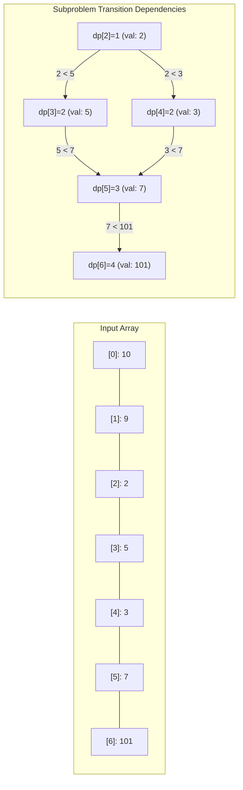

# Module 10: 1D Dynamic Programming & Sequences (0 to 100 Mastery)

> **Overlapping Subproblems, Optimal Substructure, State Space Reduction & Patience Sorting**

Dynamic Programming (DP) systematically avoids exponential redundant recalculations by memoizing subproblems. In this module, you master **Top-Down Memoization**, **Bottom-Up Tabulation**, **Rolling State Space Reduction ($O(1)$ space)**, and the $O(N \\log N)$ **Patience Sorting algorithm for Longest Increasing Subsequence**.

---


## 1D Dynamic Programming: Longest Increasing Subsequence DAG



## 1. The 4-Step DP Framework

1. **State Definition**: What does $dp[i]$ represent mathematically?
2. **Base Cases**: Smallest trivial subproblems (e.g. $dp[0] = 1$).
3. **State Transition Relation**: Recurrence equation expressing $dp[i]$ via smaller states.
4. **Order of Computation & Space Optimization**: Can we compute iteratively and keep only the last $k$ states?

---

## 2. Curated LeetCode Problem Breakdowns (Brute Force vs. Optimized)

### Problem 1: Climbing Stairs ([LeetCode 70](https://leetcode.com/problems/climbing-stairs/)) — Easy

#### Brute Force: Pure Recursion
$T(N) = T(N-1) + T(N-2)$.
- **Time Complexity**: $O(2^N)$ — Exponential call tree. TLE on $N \ge 40$.

#### Optimized: Space-Optimized Fibonacci ($O(N)$ Time, $O(1)$ Space)
```python
def climb_stairs(n: int) -> int:
    one, two = 1, 1
    for _ in range(n - 1):
        one, two = one + two, one
    return one
```
- **Time Complexity**: $O(N)$, **Space Complexity**: $O(1)$.

---

### Problem 2: House Robber ([LeetCode 198](https://leetcode.com/problems/house-robber/)) — Medium

#### Optimized: 2-Variable Bottom-Up DP
$dp[i] = \\max(dp[i-1], dp[i-2] + nums[i])$.
```python
def rob(nums: list[int]) -> int:
    rob1, rob2 = 0, 0
    for n in nums:
        new_rob = max(rob2, rob1 + n)
        rob1 = rob2
        rob2 = new_rob
    return rob2
```
- **Time Complexity**: $O(N)$, **Space Complexity**: $O(1)$.

---

### Problem 3: House Robber II ([LeetCode 213](https://leetcode.com/problems/house-robber-ii/)) — Medium

#### Optimized: Two Linear Passes on Circular Neighborhood
Since houses are in a circle, house $0$ and house $N-1$ are adjacent. Take $\\max(\\text{rob}(nums[1:]), \\text{rob}(nums[:-1]))$.
```python
def rob_circle(nums: list[int]) -> int:
    if len(nums) == 1:
        return nums[0]
    return max(rob(nums[1:]), rob(nums[:-1]))
```
- **Time Complexity**: $O(N)$, **Space Complexity**: $O(1)$.

---

### Problem 4: Longest Palindromic Substring ([LeetCode 5](https://leetcode.com/problems/longest-palindromic-substring/)) — Medium

#### Brute Force: Check All Substrings
$O(N^2)$ substrings, each checked in $O(N)$ time $\\implies O(N^3)$.

#### Optimized: Expand Around Center ($O(N^2)$ Time, $O(1)$ Space)
Expand from all $2N - 1$ centers (odd and even length palindromes).
```python
def longest_palindrome(s: str) -> str:
    res = ""
    def expand(l: int, r: int) -> str:
        while l >= 0 and r < len(s) and s[l] == s[r]:
            l -= 1
            r += 1
        return s[l + 1:r]
        
    for i in range(len(s)):
        p1 = expand(i, i)       # Odd
        p2 = expand(i, i + 1)   # Even
        res = max(res, p1, p2, key=len)
    return res
```
- **Time Complexity**: $O(N^2)$, **Space Complexity**: $O(1)$.

---

### Problem 5: Decode Ways ([LeetCode 91](https://leetcode.com/problems/decode-ways/)) — Medium

#### Optimized: 1D Dynamic Programming
$dp[i]$ counts decodings of $s[:i]$. Check single digit validity ($1-9$) and two digit validity ($10-26$).
- **Time Complexity**: $O(N)$, **Space Complexity**: $O(1)$ (maintaining 2 variables).

---

### Problem 6: Coin Change ([LeetCode 322](https://leetcode.com/problems/coin-change/)) — Medium

#### Brute Force: Recursive Exploration
- **Time Complexity**: $O(C^{\\text{amount}})$ where $C$ is number of coin denominations.

#### Optimized: Bottom-Up Tabulation ($O(\\text{amount} \\times C)$)
```python
def coin_change(coins: list[int], amount: int) -> int:
    dp = [float("inf")] * (amount + 1)
    dp[0] = 0
    for a in range(1, amount + 1):
        for c in coins:
            if a - c >= 0:
                dp[a] = min(dp[a], 1 + dp[a - c])
    return int(dp[amount]) if dp[amount] != float("inf") else -1
```
- **Time Complexity**: $O(\\text{amount} \\times C)$.
- **Space Complexity**: $O(\\text{amount})$.

---

### Problem 7: Maximum Product Subarray ([LeetCode 152](https://leetcode.com/problems/maximum-product-subarray/)) — Medium

#### Optimized: Tracking Min and Max Simultaneously
A negative number flips the minimum product into the maximum product.
```python
def max_product(nums: list[int]) -> int:
    res = max(nums)
    cur_min, cur_max = 1, 1
    for n in nums:
        if n == 0:
            cur_min, cur_max = 1, 1
            continue
        tmp = cur_max * n
        cur_max = max(n * cur_max, n * cur_min, n)
        cur_min = min(tmp, n * cur_min, n)
        res = max(res, cur_max)
    return res
```
- **Time Complexity**: $O(N)$, **Space Complexity**: $O(1)$.

---

### Problem 8: Word Break ([LeetCode 139](https://leetcode.com/problems/word-break/)) — Medium

#### Optimized: DP Boolean Array
$dp[i] = \\text{True}$ if any $dp[j] == \\text{True}$ and $s[j:i] \\in word\\_dict$.
- **Time Complexity**: $O(N \\times L)$ where $L$ is max word length.
- **Space Complexity**: $O(N)$.

---

### Problem 9: Longest Increasing Subsequence ([LeetCode 300](https://leetcode.com/problems/longest-increasing-subsequence/)) — Medium

#### Brute Force: $O(N^2)$ Tabulation
$dp[i] = 1 + \\max(\\{dp[j] \\mid j < i, nums[j] < nums[i]\\})$.

#### Optimized: Patience Sorting with Binary Search ($O(N \\log N)$ Time)
Maintain an array `tails` where `tails[i]` stores the smallest tail of an increasing subsequence of length $i+1$. Use `bisect_left` to update in $O(\\log N)$.
```python
import bisect

def length_of_lis(nums: list[int]) -> int:
    tails = []
    for x in nums:
        idx = bisect.bisect_left(tails, x)
        if idx == len(tails):
            tails.append(x)
        else:
            tails[idx] = x
    return len(tails)
```
- **Time Complexity**: $O(N \\log N)$, **Space Complexity**: $O(N)$.

---

## 3. Hands-On Project & Test Suite

Verify your 1D dynamic programming engine:
- Starter Template: [`starter/sequence_dp_engine.py`](starter/sequence_dp_engine.py)
- Production Solution: [`project_solution/sequence_dp_engine.py`](project_solution/sequence_dp_engine.py)
- Pytest Suite: [`project_solution/test_sequence_dp_engine.py`](project_solution/test_sequence_dp_engine.py)

## 🧪 Practice & Verification

Reading a module teaches recognition. Only the problems teach recall — and the
debug lab teaches the thing neither of them does, which is diagnosis.

### 1. Build the module project

```bash
cd starter
python -m pytest ../project_solution -q      # must FAIL before you start
```

Every shipped test must fail with `NotImplementedError` on an untouched
starter. If any passes, the grading loop is broken and is telling you your work
is correct when it has not been done — run `make integrity` from the course
root.

### 2. Work the problem bank — 8 problems

```bash
cd problems
python -m pytest tests -q                    # all of this module's problems
python -m pytest tests -q -k p03             # just problem 3
```

| # | Problem | Pattern | Difficulty | Target |
| :--- | :--- | :--- | :--- | :--- |
| 01 | [Climbing Stairs](problems/p01_climb_stairs.py) | 1D DP / Fibonacci recurrence | Easy | `Time O(n), Space O(1)` |
| 02 | [House Robber](problems/p02_house_robber.py) | 1D DP with a skip constraint | Medium | `Time O(n), Space O(1)` |
| 03 | [Coin Change (Fewest Coins)](problems/p03_coin_change_min.py) | Unbounded knapsack DP | Medium | `Time O(amount * len(coins)), Space O(amount)` |
| 04 | [Longest Increasing Subsequence](problems/p04_lis.py) | Patience sorting / binary search DP | Hard | `Time O(n log n), Space O(n)` |
| 05 | [Word Break](problems/p05_word_break.py) | 1D DP over string prefixes | Medium | `Time O(n * longest_word), Space O(n)` |
| 06 | [Decode Ways](problems/p06_decode_ways.py) | 1D DP with a two-character lookback | Medium | `Time O(n), Space O(1)` |
| 07 | [Maximum Product Subarray](problems/p07_max_product_subarray.py) | 1D DP with two-value state | Medium | `Time O(n), Space O(1)` |
| 08 | [Best Time To Buy And Sell Stock With Cooldown](problems/p08_stock_with_cooldown.py) | DP as a state machine | Hard | `Time O(n), Space O(1)` |

Each stub carries the statement, the constraints, a complexity target and a
**three-step hint ladder**. Read one hint, try again, and only then read the
next. Every reference solution in `problems/solutions/` is cross-checked against
a brute force or a second implementation, so the answers are verified rather
than asserted.

### 3. Work the debug lab

```bash
cd debug_lab
python broken_dp_planner.py
echo "exit=$?"
```

It exits 0 and prints wrong answers. Read [`SYMPTOMS.md`](debug_lab/SYMPTOMS.md),
write a diagnosis for each, and only then open `ANSWERS.md`. The diagnostic
reasoning is the transferable skill; reading the answer first skips it.

---

## ✅ You have mastered this module when you can…

1. Answer the four DP questions — state, transition, base case, order — on an unseen problem.
2. Recognise when one running extremum is insufficient state and a second must be carried.
3. Convert a top-down memoised solution into a bottom-up rolling-array one.
4. Model a problem with modes as a state machine, and write the transitions from the previous step's values.

Each of these is something you **do**, not something you know. If you cannot do
one without reference, that is the section to revisit — not the whole module.

---

## 🧭 Navigation

- [Pattern Recognition Guide](../PATTERN_RECOGNITION_GUIDE.md) — how to attack a problem you have never seen
- [Course README](../README.md) · [Master Syllabus](../MASTER_SYLLABUS.md)
- [Problem bank](problems/README.md) · [Debug lab](debug_lab/SYMPTOMS.md)