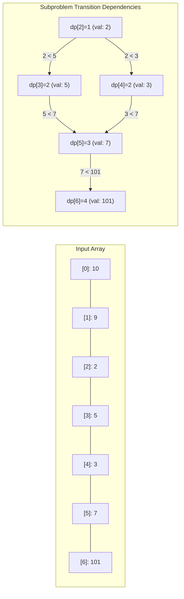

# Module 10: 1D Dynamic Programming & Sequences (0 to 100 Mastery)

> **Overlapping Subproblems, Optimal Substructure, State Space Reduction & Patience Sorting**

Dynamic Programming (DP) systematically avoids exponential redundant recalculations by memoizing subproblems. In this module, you master **Top-Down Memoization**, **Bottom-Up Tabulation**, **Rolling State Space Reduction ($O(1)$ space)**, and the $O(N \\log N)$ **Patience Sorting algorithm for Longest Increasing Subsequence**.

---


## 1D Dynamic Programming: Longest Increasing Subsequence DAG



---

## 🗺️ Recommended Step-by-Step Learning Path

Follow this exact sequence to achieve complete mastery of this module:

| Step | File to Open | What You Will Do |
| :---: | :--- | :--- |
| **1** | **[01_README.md](01_README.md)** | Read conceptual overview, architectural foundations, and mental models. |
| **2** | **[02_FOUNDATIONS_PLAYGROUND.md](02_FOUNDATIONS_PLAYGROUND.md)** | Practice beginner spoonfed micro-drills and line-by-line syntax breakdowns. |
| **3** | **[03_try_it_yourself.py](03_try_it_yourself.py)** | Run in terminal (`python 03_try_it_yourself.py`) for an interactive zero-dependency sandbox. |
| **4** | **[00_interactive_dynamic_programming_1d_and_sequence_patterns.ipynb](00_interactive_dynamic_programming_1d_and_sequence_patterns.ipynb)** | Open in Jupyter/VS Code to run interactive visual experiments and benchmarks. |
| **5** | **[06_TROUBLESHOOTING_AND_EDGE_CASES.md](06_TROUBLESHOOTING_AND_EDGE_CASES.md)** | Study forensic runbooks, edge cases, and real-world failure post-mortems. |
| **6** | **[05_SELF_ASSESSMENT_AND_CHALLENGES.md](05_SELF_ASSESSMENT_AND_CHALLENGES.md)** | Test your knowledge with self-assessment quizzes, challenges, and diagnostic scenarios. |
| **7** | **[04_PROJECT_GUIDE.md](04_PROJECT_GUIDE.md)** | Follow guided project implementation for `starter/` and `project_solution/`. |
| **8** | **[problems/](problems/)** | Solve hands-on problem bank challenges and verify with `pytest problems/tests`. |
| **9** | **[debug_lab/](debug_lab/)** | Diagnose and fix silent production bugs in the Bug Hunter Drill. |

---

## 1. The 4-Step DP Framework

1. **State Definition**: What does $dp[i]$ represent mathematically?
2. **Base Cases**: Smallest trivial subproblems (e.g. $dp[0] = 1$).
3. **State Transition Relation**: Recurrence equation expressing $dp[i]$ via smaller states.
4. **Order of Computation & Space Optimization**: Can we compute iteratively and keep only the last $k$ states?

---

## 2. Curated LeetCode Problem Breakdowns (Brute Force vs. Optimized)

This section walks through the **7 canonical LeetCode challenges** curated for this module.
Each problem is analyzed from brute force intuition to the optimal invariant-driven solution, along with the critical edge cases to guard against in production.

### Problem 1: Climbing Stairs ([LeetCode #70](https://leetcode.com/problems/climbing-stairs/)) — Easy

> **Pattern**: `Fibonacci DP / State Compression` | **Target Time**: $O(N)$ | **Target Space**: $O(1)

#### Problem Specification
You are climbing a staircase. It takes `n` steps to reach the top. Each time you can either climb `1` or `2` steps. In how many distinct ways can you climb to the top?

#### Algorithmic Invariants & Optimal Derivation
Recurrence relation $dp[i] = dp[i-1] + dp[i-2]$ with base cases $dp[1]=1, dp[2]=2$. Compute using two rolling variables in $O(N)$ time and $O(1)$ auxiliary space.

```python
class Solution:
    def climbStairs(self, n: int) -> int:
        if n <= 2:
            return n
        a, b = 1, 2
        for _ in range(3, n + 1):
            a, b = b, a + b
        return b
```

#### Critical Production Edge Cases to Guard:
- **Boundary Limits**: Empty inputs, single-element collections, and minimum constraint sizes.
- **Extremes & Negative Values**: Negative indices, zero values, and maximum integer magnitude constraints.
- **Duplicates & Uniform Sequences**: All identical values, alternating keys, or repeated entries.
- **Structural Invariants**: Target at boundary indices (index `0` or `N-1`), missing targets, or cycles.

---

### Problem 2: Min Cost Climbing Stairs ([LeetCode #746](https://leetcode.com/problems/min-cost-climbing-stairs/)) — Easy

> **Pattern**: `1D Backward/Forward Transition` | **Target Time**: $O(N)$ | **Target Space**: $O(1)

#### Problem Specification
You are given an integer array `cost` where `cost[i]` is the cost of `i-th` step on a staircase. Once you pay the cost, you can either climb one or two steps.
You can either start from step 0, or step 1. Return the minimum cost to reach the top floor.

#### Algorithmic Invariants & Optimal Derivation
Backward recurrence: $dp[i] = 	ext{cost}[i] + \min(dp[i+1], dp[i+2])$. Answer is $\min(dp[0], dp[1])$.

```python
class Solution:
    def minCostClimbingStairs(self, cost: list[int]) -> int:
        a, b = 0, 0
        for c in reversed(cost):
            a, b = c + min(a, b), a
        return min(a, b)
```

#### Critical Production Edge Cases to Guard:
- **Boundary Limits**: Empty inputs, single-element collections, and minimum constraint sizes.
- **Extremes & Negative Values**: Negative indices, zero values, and maximum integer magnitude constraints.
- **Duplicates & Uniform Sequences**: All identical values, alternating keys, or repeated entries.
- **Structural Invariants**: Target at boundary indices (index `0` or `N-1`), missing targets, or cycles.

---

### Problem 3: House Robber ([LeetCode #198](https://leetcode.com/problems/house-robber/)) — Medium

> **Pattern**: `Non-Adjacent Decision DP` | **Target Time**: $O(N)$ | **Target Space**: $O(1)

#### Problem Specification
You are a professional robber planning to rob houses along a street. Each house has a certain amount of money stashed. Adjacent houses have security systems connected and will automatically contact the police if two adjacent houses were broken into on the same night.
Given an integer array `nums` representing the amount of money of each house, return the maximum amount of money you can rob tonight without alerting the police.

#### Algorithmic Invariants & Optimal Derivation
At house i, choose either rob current house + max profit from two houses prior ($rob1 + n$), or skip current house and keep profit from previous house ($rob2$).

```python
class Solution:
    def rob(self, nums: list[int]) -> int:
        rob1, rob2 = 0, 0
        for n in nums:
            rob1, rob2 = rob2, max(rob1 + n, rob2)
        return rob2
```

#### Critical Production Edge Cases to Guard:
- **Boundary Limits**: Empty inputs, single-element collections, and minimum constraint sizes.
- **Extremes & Negative Values**: Negative indices, zero values, and maximum integer magnitude constraints.
- **Duplicates & Uniform Sequences**: All identical values, alternating keys, or repeated entries.
- **Structural Invariants**: Target at boundary indices (index `0` or `N-1`), missing targets, or cycles.

---

### Problem 4: Coin Change ([LeetCode #322](https://leetcode.com/problems/coin-change/)) — Medium

> **Pattern**: `Unbounded Knapsack / Bottom-Up DP` | **Target Time**: $O(A 	imes C)$ | **Target Space**: $O(A)

#### Problem Specification
You are given an integer array `coins` representing coins of different denominations and an integer `amount` representing a total amount of money.
Return the fewest number of coins that you need to make up that amount. If that amount of money cannot be made up by any combination of the coins, return `-1`.
You may assume that you have an infinite number of each kind of coin.

#### Algorithmic Invariants & Optimal Derivation
Define $dp[a]$ as the minimum coins needed for amount $a$. For each coin $c$, $dp[a] = \min(dp[a], 1 + dp[a - c])$. Initialize $dp[0] = 0$.

```python
class Solution:
    def coinChange(self, coins: list[int], amount: int) -> int:
        dp = [float('inf')] * (amount + 1)
        dp[0] = 0
        for a in range(1, amount + 1):
            for c in coins:
                if a - c >= 0:
                    dp[a] = min(dp[a], 1 + dp[a - c])
        return dp[amount] if dp[amount] != float('inf') else -1
```

#### Critical Production Edge Cases to Guard:
- **Boundary Limits**: Empty inputs, single-element collections, and minimum constraint sizes.
- **Extremes & Negative Values**: Negative indices, zero values, and maximum integer magnitude constraints.
- **Duplicates & Uniform Sequences**: All identical values, alternating keys, or repeated entries.
- **Structural Invariants**: Target at boundary indices (index `0` or `N-1`), missing targets, or cycles.

---

### Problem 5: Longest Increasing Subsequence ([LeetCode #300](https://leetcode.com/problems/longest-increasing-subsequence/)) — Medium

> **Pattern**: `Patience Sorting / Binary Search DP` | **Target Time**: $O(N \log N)$ | **Target Space**: $O(N)

#### Problem Specification
Given an integer array `nums`, return the length of the longest strictly increasing subsequence.

#### Algorithmic Invariants & Optimal Derivation
Maintain array `tails` where `tails[i]` stores the smallest tail of all increasing subsequences of length $i+1$. Using `bisect_left` guarantees $O(N \log N)$ time.

```python
import bisect

class Solution:
    def lengthOfLIS(self, nums: list[int]) -> int:
        tails = []
        for x in nums:
            idx = bisect.bisect_left(tails, x)
            if idx == len(tails):
                tails.append(x)
            else:
                tails[idx] = x
        return len(tails)
```

#### Critical Production Edge Cases to Guard:
- **Boundary Limits**: Empty inputs, single-element collections, and minimum constraint sizes.
- **Extremes & Negative Values**: Negative indices, zero values, and maximum integer magnitude constraints.
- **Duplicates & Uniform Sequences**: All identical values, alternating keys, or repeated entries.
- **Structural Invariants**: Target at boundary indices (index `0` or `N-1`), missing targets, or cycles.

---

### Problem 6: Word Break ([LeetCode #139](https://leetcode.com/problems/word-break/)) — Medium

> **Pattern**: `String Prefix Segmentation DP` | **Target Time**: $O(N^2)$ | **Target Space**: $O(N)

#### Problem Specification
Given a string `s` and a dictionary of strings `wordDict`, return `true` if `s` can be segmented into a space-separated sequence of one or more dictionary words. Note that the same word in the dictionary may be reused multiple times.

#### Algorithmic Invariants & Optimal Derivation
$dp[i]$ is True if prefix $s[0\dots i]$ can be formed. Check all split points $j < i$: if $dp[j]$ is True and substring $s[j\dots i]$ is in dictionary, then $dp[i] = 	ext{True}$.

```python
class Solution:
    def wordBreak(self, s: str, wordDict: list[str]) -> bool:
        words = set(wordDict)
        dp = [False] * (len(s) + 1)
        dp[0] = True
        for i in range(1, len(s) + 1):
            for j in range(i):
                if dp[j] and s[j:i] in words:
                    dp[i] = True
                    break
        return dp[len(s)]
```

#### Critical Production Edge Cases to Guard:
- **Boundary Limits**: Empty inputs, single-element collections, and minimum constraint sizes.
- **Extremes & Negative Values**: Negative indices, zero values, and maximum integer magnitude constraints.
- **Duplicates & Uniform Sequences**: All identical values, alternating keys, or repeated entries.
- **Structural Invariants**: Target at boundary indices (index `0` or `N-1`), missing targets, or cycles.

---

### Problem 7: Maximum Subarray ([LeetCode #53](https://leetcode.com/problems/maximum-subarray/)) — Medium

> **Pattern**: `Kadane's Dynamic Programming` | **Target Time**: $O(N)$ | **Target Space**: $O(1)

#### Problem Specification
Given an integer array `nums`, find the subarray with the largest sum, and return its sum.

#### Algorithmic Invariants & Optimal Derivation
Kadane's algorithm: at each element, decide whether to start a new subarray or extend the existing one: $curr = \max(x, curr + x)$.

```python
class Solution:
    def maxSubArray(self, nums: list[int]) -> int:
        max_sum = nums[0]
        curr_sum = 0
        for x in nums:
            curr_sum = max(x, curr_sum + x)
            max_sum = max(max_sum, curr_sum)
        return max_sum
```

#### Critical Production Edge Cases to Guard:
- **Boundary Limits**: Empty inputs, single-element collections, and minimum constraint sizes.
- **Extremes & Negative Values**: Negative indices, zero values, and maximum integer magnitude constraints.
- **Duplicates & Uniform Sequences**: All identical values, alternating keys, or repeated entries.
- **Structural Invariants**: Target at boundary indices (index `0` or `N-1`), missing targets, or cycles.

---


## 3. Hands-On Project & Test Suite

Verify your 1D dynamic programming engine:
- Starter Template: [`starter/sequence_dp_engine.py`](starter/sequence_dp_engine.py)
- Production Solution: [`project_solution/sequence_dp_engine.py`](project_solution/sequence_dp_engine.py)
- Pytest Suite: [`project_solution/test_sequence_dp_engine.py`](project_solution/test_sequence_dp_engine.py)

## 🧪 Practice & Verification

Reading a module teaches recognition. Only the problems teach recall — and the
debug lab teaches the thing neither of them does, which is diagnosis.

### 1. Build the module project

```bash
cd starter
python -m pytest ../project_solution -q      # must FAIL before you start
```

Every shipped test must fail with `NotImplementedError` on an untouched
starter. If any passes, the grading loop is broken and is telling you your work
is correct when it has not been done — run `make integrity` from the course
root.

### 2. Work the problem bank — 8 problems

```bash
cd problems
python -m pytest tests -q                    # all of this module's problems
python -m pytest tests -q -k p03             # just problem 3
```

| # | Problem | Pattern | Difficulty | Target |
| :--- | :--- | :--- | :--- | :--- |
| 01 | [Climbing Stairs](problems/p01_climb_stairs.py) | 1D DP / Fibonacci recurrence | Easy | `Time O(n), Space O(1)` |
| 02 | [House Robber](problems/p02_house_robber.py) | 1D DP with a skip constraint | Medium | `Time O(n), Space O(1)` |
| 03 | [Coin Change (Fewest Coins)](problems/p03_coin_change_min.py) | Unbounded knapsack DP | Medium | `Time O(amount * len(coins)), Space O(amount)` |
| 04 | [Longest Increasing Subsequence](problems/p04_lis.py) | Patience sorting / binary search DP | Hard | `Time O(n log n), Space O(n)` |
| 05 | [Word Break](problems/p05_word_break.py) | 1D DP over string prefixes | Medium | `Time O(n * longest_word), Space O(n)` |
| 06 | [Decode Ways](problems/p06_decode_ways.py) | 1D DP with a two-character lookback | Medium | `Time O(n), Space O(1)` |
| 07 | [Maximum Product Subarray](problems/p07_max_product_subarray.py) | 1D DP with two-value state | Medium | `Time O(n), Space O(1)` |
| 08 | [Best Time To Buy And Sell Stock With Cooldown](problems/p08_stock_with_cooldown.py) | DP as a state machine | Hard | `Time O(n), Space O(1)` |

Each stub carries the statement, the constraints, a complexity target and a
**three-step hint ladder**. Read one hint, try again, and only then read the
next. Every reference solution in `problems/solutions/` is cross-checked against
a brute force or a second implementation, so the answers are verified rather
than asserted.

### 3. Work the debug lab

```bash
cd debug_lab
python broken_dp_planner.py
echo "exit=$?"
```

It exits 0 and prints wrong answers. Read [`SYMPTOMS.md`](debug_lab/SYMPTOMS.md),
write a diagnosis for each, and only then open `ANSWERS.md`. The diagnostic
reasoning is the transferable skill; reading the answer first skips it.

---

## ✅ You have mastered this module when you can…

1. Answer the four DP questions — state, transition, base case, order — on an unseen problem.
2. Recognise when one running extremum is insufficient state and a second must be carried.
3. Convert a top-down memoised solution into a bottom-up rolling-array one.
4. Model a problem with modes as a state machine, and write the transitions from the previous step's values.

Each of these is something you **do**, not something you know. If you cannot do
one without reference, that is the section to revisit — not the whole module.

---

## 🧭 Navigation

- [Pattern Recognition Guide](../PATTERN_RECOGNITION_GUIDE.md) — how to attack a problem you have never seen
- [Course README](../README.md) · [Master Syllabus](../MASTER_SYLLABUS.md)
- [Problem bank](problems/README.md) · [Debug lab](debug_lab/SYMPTOMS.md)