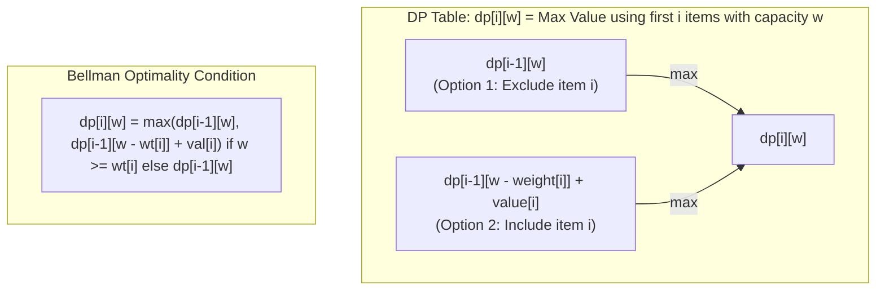

# Module 11: 2D Dynamic Programming, Knapsack & Grids (0 to 100 Mastery)

> **2D State Matrices, 0/1 Knapsack Variants, String Edit Distance & Space Compression**

2D Dynamic Programming addresses problems with two independent subproblem dimensions: grid coordinates $(r, c)$, string dual indices $(i, j)$, or item index and capacity $(i, w)$. In this module, you master **0/1 Knapsack**, **Longest Common Subsequence (LCS)**, **Levenshtein Edit Distance**, and **$O(\\min(N, M))$ space reduction**.

---


## 2D Dynamic Programming: 0/1 Knapsack Grid Transitions



---

## 1. 2D DP Space Optimization Principle

If a transition only depends on the previous row:
$$dp[i][j] = f(dp[i-1][j], dp[i-1][j-1], dp[i][j-1])$$
You never need an $M \\times N$ matrix. Keep only two rows (`prev` and `curr`), reducing space complexity from $O(M \\times N)$ to $O(N)$.

---

## 2. Curated LeetCode Problem Breakdowns (Brute Force vs. Optimized)

This section walks through the **7 canonical LeetCode challenges** curated for this module.
Each problem is analyzed from brute force intuition to the optimal invariant-driven solution, along with the critical edge cases to guard against in production.

### Problem 1: Unique Paths ([LeetCode #62](https://leetcode.com/problems/unique-paths/)) — Medium

> **Pattern**: `2D Grid Dynamic Programming` | **Target Time**: $O(M 	imes N)$ | **Target Space**: $O(N)

#### Problem Specification
There is a robot on an `m x n` grid. The robot is initially located at the top-left corner `(0, 0)` and tries to move to the bottom-right corner `(m - 1, n - 1)`. The robot can only move either down or right at any point in time.

Given two integers `m` and `n`, return the number of possible unique paths that the robot can take to reach the bottom-right corner.

#### Algorithmic Invariants & Optimal Derivation
$dp[r][c] = dp[r+1][c] + dp[r][c+1]$. Compress into a single 1D row of length N to optimize space to $O(N)$.

```python
class Solution:
    def uniquePaths(self, m: int, n: int) -> int:
        row = [1] * n
        for _ in range(m - 1):
            new_row = [1] * n
            for j in range(n - 2, -1, -1):
                new_row[j] = new_row[j + 1] + row[j]
            row = new_row
        return row[0]
```

#### Critical Production Edge Cases to Guard:
- **Boundary Limits**: Empty inputs, single-element collections, and minimum constraint sizes.
- **Extremes & Negative Values**: Negative indices, zero values, and maximum integer magnitude constraints.
- **Duplicates & Uniform Sequences**: All identical values, alternating keys, or repeated entries.
- **Structural Invariants**: Target at boundary indices (index `0` or `N-1`), missing targets, or cycles.

---

### Problem 2: Minimum Path Sum ([LeetCode #64](https://leetcode.com/problems/minimum-path-sum/)) — Medium

> **Pattern**: `2D Grid Cost Minimization` | **Target Time**: $O(M 	imes N)$ | **Target Space**: $O(1) in-place

#### Problem Specification
Given a `m x n` `grid` filled with non-negative numbers, find a path from top left to bottom right, which minimizes the sum of all numbers along its path. You can only move either down or right at any point in time.

#### Algorithmic Invariants & Optimal Derivation
At cell $(r, c)$, minimum path sum is $	ext{grid}[r][c] + \min(dp[r-1][c], dp[r][c-1])$. We can accumulate directly into the matrix in-place.

```python
class Solution:
    def minPathSum(self, grid: list[list[int]]) -> int:
        m, n = len(grid), len(grid[0])
        for r in range(m):
            for c in range(n):
                if r == 0 and c == 0:
                    continue
                elif r == 0:
                    grid[r][c] += grid[r][c - 1]
                elif c == 0:
                    grid[r][c] += grid[r - 1][c]
                else:
                    grid[r][c] += min(grid[r - 1][c], grid[r][c - 1])
        return grid[-1][-1]
```

#### Critical Production Edge Cases to Guard:
- **Boundary Limits**: Empty inputs, single-element collections, and minimum constraint sizes.
- **Extremes & Negative Values**: Negative indices, zero values, and maximum integer magnitude constraints.
- **Duplicates & Uniform Sequences**: All identical values, alternating keys, or repeated entries.
- **Structural Invariants**: Target at boundary indices (index `0` or `N-1`), missing targets, or cycles.

---

### Problem 3: Longest Common Subsequence ([LeetCode #1143](https://leetcode.com/problems/longest-common-subsequence/)) — Medium

> **Pattern**: `2D String Matching DP` | **Target Time**: $O(M 	imes N)$ | **Target Space**: $O(M 	imes N)

#### Problem Specification
Given two strings `text1` and `text2`, return the length of their longest common subsequence. If there is no common subsequence, return `0`.

A subsequence of a string is a new string generated from the original string with some characters (can be none) deleted without changing the relative order of the remaining characters.

#### Algorithmic Invariants & Optimal Derivation
If characters match, $dp[i][j] = 1 + dp[i-1][j-1]$. If they don't, take $\max(dp[i-1][j], dp[i][j-1])$.

```python
class Solution:
    def longestCommonSubsequence(self, text1: str, text2: str) -> int:
        m, n = len(text1), len(text2)
        dp = [[0] * (n + 1) for _ in range(m + 1)]
        for i in range(1, m + 1):
            for j in range(1, n + 1):
                if text1[i - 1] == text2[j - 1]:
                    dp[i][j] = 1 + dp[i - 1][j - 1]
                else:
                    dp[i][j] = max(dp[i - 1][j], dp[i][j - 1])
        return dp[m][n]
```

#### Critical Production Edge Cases to Guard:
- **Boundary Limits**: Empty inputs, single-element collections, and minimum constraint sizes.
- **Extremes & Negative Values**: Negative indices, zero values, and maximum integer magnitude constraints.
- **Duplicates & Uniform Sequences**: All identical values, alternating keys, or repeated entries.
- **Structural Invariants**: Target at boundary indices (index `0` or `N-1`), missing targets, or cycles.

---

### Problem 4: Best Time to Buy and Sell Stock with Cooldown ([LeetCode #309](https://leetcode.com/problems/best-time-to-buy-and-sell-stock-with-cooldown/)) — Medium

> **Pattern**: `State Machine Dynamic Programming` | **Target Time**: $O(N)$ | **Target Space**: $O(1)

#### Problem Specification
You are given an array `prices` where `prices[i]` is the price of a given stock on the `i-th` day. Find the maximum profit you can achieve.
After you sell your stock, you cannot buy stock on the next day (i.e., 1 day cooldown). Note: You may not engage in multiple transactions simultaneously.

#### Algorithmic Invariants & Optimal Derivation
Model three distinct states: `held` (own a share), `sold` (just sold today), and `reset` (ready to buy after cooldown). Transitions run in $O(N)$ with $O(1)$ space.

```python
class Solution:
    def maxProfit(self, prices: list[int]) -> int:
        sold, held, reset = 0, -float('inf'), 0
        for p in prices:
            prev_sold = sold
            sold = held + p
            held = max(held, reset - p)
            reset = max(reset, prev_sold)
        return max(sold, reset)
```

#### Critical Production Edge Cases to Guard:
- **Boundary Limits**: Empty inputs, single-element collections, and minimum constraint sizes.
- **Extremes & Negative Values**: Negative indices, zero values, and maximum integer magnitude constraints.
- **Duplicates & Uniform Sequences**: All identical values, alternating keys, or repeated entries.
- **Structural Invariants**: Target at boundary indices (index `0` or `N-1`), missing targets, or cycles.

---

### Problem 5: Coin Change II ([LeetCode #518](https://leetcode.com/problems/coin-change-ii/)) — Medium

> **Pattern**: `Unbounded Knapsack Combination Counting` | **Target Time**: $O(A 	imes C)$ | **Target Space**: $O(A)

#### Problem Specification
You are given an integer array `coins` representing coins of different denominations and an integer `amount` representing a total amount of money.
Return the number of combinations that make up that amount. If that amount of money cannot be made up by any combination of the coins, return 0.
You may assume that you have an infinite number of each kind of coin.

#### Algorithmic Invariants & Optimal Derivation
Outer loop iterates through each coin, inner loop increments amount. By placing the coin loop on the outside, we count unordered combinations rather than permutations.

```python
class Solution:
    def change(self, amount: int, coins: list[int]) -> int:
        dp = [0] * (amount + 1)
        dp[0] = 1
        for c in coins:
            for a in range(c, amount + 1):
                dp[a] += dp[a - c]
        return dp[amount]
```

#### Critical Production Edge Cases to Guard:
- **Boundary Limits**: Empty inputs, single-element collections, and minimum constraint sizes.
- **Extremes & Negative Values**: Negative indices, zero values, and maximum integer magnitude constraints.
- **Duplicates & Uniform Sequences**: All identical values, alternating keys, or repeated entries.
- **Structural Invariants**: Target at boundary indices (index `0` or `N-1`), missing targets, or cycles.

---

### Problem 6: Edit Distance ([LeetCode #72](https://leetcode.com/problems/edit-distance/)) — Hard

> **Pattern**: `Levenshtein Matrix Dynamic Programming` | **Target Time**: $O(M 	imes N)$ | **Target Space**: $O(M 	imes N)

#### Problem Specification
Given two strings `word1` and `word2`, return the minimum number of operations required to convert `word1` to `word2`.
You have the following three operations permitted on a word:
1. Insert a character
2. Delete a character
3. Replace a character

#### Algorithmic Invariants & Optimal Derivation
Classic Levenshtein distance table where cell $(i, j)$ represents min operations to convert prefix $w1[0\dots i]$ to $w2[0\dots j]$.

```python
class Solution:
    def minDistance(self, word1: str, word2: str) -> int:
        m, n = len(word1), len(word2)
        dp = [[0] * (n + 1) for _ in range(m + 1)]
        for i in range(m + 1):
            dp[i][0] = i
        for j in range(n + 1):
            dp[0][j] = j
        for i in range(1, m + 1):
            for j in range(1, n + 1):
                if word1[i - 1] == word2[j - 1]:
                    dp[i][j] = dp[i - 1][j - 1]
                else:
                    dp[i][j] = 1 + min(
                        dp[i - 1][j],    # delete
                        dp[i][j - 1],    # insert
                        dp[i - 1][j - 1] # replace
                    )
        return dp[m][n]
```

#### Critical Production Edge Cases to Guard:
- **Boundary Limits**: Empty inputs, single-element collections, and minimum constraint sizes.
- **Extremes & Negative Values**: Negative indices, zero values, and maximum integer magnitude constraints.
- **Duplicates & Uniform Sequences**: All identical values, alternating keys, or repeated entries.
- **Structural Invariants**: Target at boundary indices (index `0` or `N-1`), missing targets, or cycles.

---

### Problem 7: Partition Equal Subset Sum ([LeetCode #416](https://leetcode.com/problems/partition-equal-subset-sum/)) — Medium

> **Pattern**: `0/1 Knapsack Boolean Reachability` | **Target Time**: $O(N 	imes 	ext{target})$ | **Target Space**: $O(	ext{target})

#### Problem Specification
Given an integer array `nums`, return `true` if you can partition the array into two subsets such that the sum of the elements in both subsets is equal or `false` otherwise.

#### Algorithmic Invariants & Optimal Derivation
If total sum is odd, partition is impossible. Otherwise target is $	ext{sum} / 2$. This maps to 0/1 Knapsack: can a subset sum exactly to target?

```python
class Solution:
    def canPartition(self, nums: list[int]) -> bool:
        total = sum(nums)
        if total % 2 != 0:
            return False
        target = total // 2
        dp = set([0])
        for x in nums:
            next_dp = set(dp)
            for s in dp:
                if s + x == target:
                    return True
                if s + x < target:
                    next_dp.add(s + x)
            dp = next_dp
        return target in dp
```

#### Critical Production Edge Cases to Guard:
- **Boundary Limits**: Empty inputs, single-element collections, and minimum constraint sizes.
- **Extremes & Negative Values**: Negative indices, zero values, and maximum integer magnitude constraints.
- **Duplicates & Uniform Sequences**: All identical values, alternating keys, or repeated entries.
- **Structural Invariants**: Target at boundary indices (index `0` or `N-1`), missing targets, or cycles.

---


## 3. Hands-On Project & Test Suite

Verify your 2D grid and knapsack engine:
- Starter Template: [`starter/grid_knapsack_dp_engine.py`](starter/grid_knapsack_dp_engine.py)
- Production Solution: [`project_solution/grid_knapsack_dp_engine.py`](project_solution/grid_knapsack_dp_engine.py)
- Pytest Suite: [`project_solution/test_grid_knapsack_dp_engine.py`](project_solution/test_grid_knapsack_dp_engine.py)

## 🧪 Practice & Verification

Reading a module teaches recognition. Only the problems teach recall — and the
debug lab teaches the thing neither of them does, which is diagnosis.

### 1. Build the module project

```bash
cd starter
python -m pytest ../project_solution -q      # must FAIL before you start
```

Every shipped test must fail with `NotImplementedError` on an untouched
starter. If any passes, the grading loop is broken and is telling you your work
is correct when it has not been done — run `make integrity` from the course
root.

### 2. Work the problem bank — 8 problems

```bash
cd problems
python -m pytest tests -q                    # all of this module's problems
python -m pytest tests -q -k p03             # just problem 3
```

| # | Problem | Pattern | Difficulty | Target |
| :--- | :--- | :--- | :--- | :--- |
| 01 | [Unique Paths In A Grid](problems/p01_unique_paths.py) | 2D grid DP | Medium | `Time O(m*n), Space O(n)` |
| 02 | [Minimum Path Sum](problems/p02_min_path_sum.py) | 2D grid DP | Medium | `Time O(rows*cols), Space O(cols)` |
| 03 | [Edit Distance](problems/p03_edit_distance.py) | 2D sequence DP | Hard | `Time O(n*m), Space O(min(n, m))` |
| 04 | [0/1 Knapsack](problems/p04_knapsack_01.py) | 0/1 knapsack DP | Hard | `Time O(n*capacity), Space O(capacity)` |
| 05 | [Partition Equal Subset Sum](problems/p05_can_partition.py) | Subset-sum DP | Medium | `Time O(n * total/2), Space O(total/2)` |
| 06 | [Longest Common Subsequence](problems/p06_lcs.py) | 2D sequence DP | Medium | `Time O(n*m), Space O(min(n, m))` |
| 07 | [Unique Paths With Obstacles](problems/p07_unique_paths_obstacles.py) | 2D grid DP with blocked cells | Medium | `Time O(rows*cols), Space O(cols)` |
| 08 | [Longest Palindromic Subsequence](problems/p08_longest_palindromic_subseq.py) | Interval DP | Hard | `Time O(n^2), Space O(n^2)` |

Each stub carries the statement, the constraints, a complexity target and a
**three-step hint ladder**. Read one hint, try again, and only then read the
next. Every reference solution in `problems/solutions/` is cross-checked against
a brute force or a second implementation, so the answers are verified rather
than asserted.

### 3. Work the debug lab

```bash
cd debug_lab
python broken_knapsack_planner.py
echo "exit=$?"
```

It exits 0 and prints wrong answers. Read [`SYMPTOMS.md`](debug_lab/SYMPTOMS.md),
write a diagnosis for each, and only then open `ANSWERS.md`. The diagnostic
reasoning is the transferable skill; reading the answer first skips it.

---

## ✅ You have mastered this module when you can…

1. Explain why the 0/1 knapsack rolling row iterates capacity downward, and what upward silently computes.
2. Reduce a 2D table to one or two rows, and state the ordering contract that makes it valid.
3. Distinguish edit distance from LCS by which neighbours each recurrence reads.
4. Fill an interval DP by increasing length, and say why that order is forced.

Each of these is something you **do**, not something you know. If you cannot do
one without reference, that is the section to revisit — not the whole module.

---

## 🧭 Navigation

- [Pattern Recognition Guide](../PATTERN_RECOGNITION_GUIDE.md) — how to attack a problem you have never seen
- [Course README](../README.md) · [Master Syllabus](../MASTER_SYLLABUS.md)
- [Problem bank](problems/README.md) · [Debug lab](debug_lab/SYMPTOMS.md)