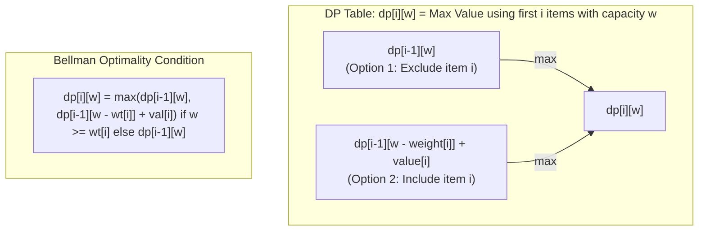

# Module 11: 2D Dynamic Programming, Knapsack & Grids (0 to 100 Mastery)

> **2D State Matrices, 0/1 Knapsack Variants, String Edit Distance & Space Compression**

2D Dynamic Programming addresses problems with two independent subproblem dimensions: grid coordinates $(r, c)$, string dual indices $(i, j)$, or item index and capacity $(i, w)$. In this module, you master **0/1 Knapsack**, **Longest Common Subsequence (LCS)**, **Levenshtein Edit Distance**, and **$O(\\min(N, M))$ space reduction**.

---


## 2D Dynamic Programming: 0/1 Knapsack Grid Transitions



## 1. 2D DP Space Optimization Principle

If a transition only depends on the previous row:
$$dp[i][j] = f(dp[i-1][j], dp[i-1][j-1], dp[i][j-1])$$
You never need an $M \\times N$ matrix. Keep only two rows (`prev` and `curr`), reducing space complexity from $O(M \\times N)$ to $O(N)$.

---

## 2. Curated LeetCode Problem Breakdowns (Brute Force vs. Optimized)

### Problem 1: Unique Paths ([LeetCode 62](https://leetcode.com/problems/unique-paths/)) — Medium

#### Optimized: Rolling 1D Array DP ($O(M \\times N)$ Time, $O(N)$ Space)
$dp[c] = dp[c] + dp[c - 1]$.
```python
def unique_paths(m: int, n: int) -> int:
    row = [1] * n
    for _ in range(m - 1):
        new_row = [1] * n
        for j in range(1, n):
            new_row[j] = new_row[j - 1] + row[j]
        row = new_row
    return row[-1]
```
- **Time Complexity**: $O(M \\times N)$, **Space Complexity**: $O(N)$.

---

### Problem 2: Longest Common Subsequence ([LeetCode 1143](https://leetcode.com/problems/longest-common-subsequence/)) — Medium

#### Optimized: 2D State Tabulation
If $text1[i] == text2[j]$, $dp[i][j] = 1 + dp[i-1][j-1]$; else $\\max(dp[i-1][j], dp[i][j-1])$.
- **Time Complexity**: $O(M \\times N)$, **Space Complexity**: $O(\\min(M, N))$ with rolling rows.

---

### Problem 3: Best Time to Buy and Sell Stock with Cooldown ([LeetCode 309](https://leetcode.com/problems/best-time-to-buy-and-sell-stock-with-cooldown/)) — Medium

#### Optimized: 3-State Machine DP ($O(N)$ Time, $O(1)$ Space)
States: `held`, `sold`, `reset`.
- `held = max(held, reset - price)`
- `reset = max(reset, sold)`
- `sold = held + price`
- **Time Complexity**: $O(N)$, **Space Complexity**: $O(1)$.

---

### Problem 4: Target Sum ([LeetCode 494](https://leetcode.com/problems/target-sum/)) — Medium

#### Optimized: 0/1 Subset Sum Reduction
Partition `nums` into positive set $P$ and negative set $N$: $\\sum(P) = \\frac{\\text{target} + \\sum(nums)}{2}$. Solved via 1D array knapsack counting.
- **Time Complexity**: $O(N \\times S)$, **Space Complexity**: $O(S)$ where $S = \\sum(nums)$.

---

### Problem 5: Edit Distance ([LeetCode 72](https://leetcode.com/problems/edit-distance/)) — Medium

#### Optimized: Wagner-Fischer 2D DP Table
Transitions:
- Match: $dp[i][j] = dp[i-1][j-1]$
- Insert, Delete, Replace: $1 + \\min(dp[i-1][j], dp[i][j-1], dp[i-1][j-1])$
```python
def min_distance(word1: str, word2: str) -> int:
    m, n = len(word1), len(word2)
    dp = [[0] * (n + 1) for _ in range(m + 1)]
    for i in range(m + 1): dp[i][0] = i
    for j in range(n + 1): dp[0][j] = j
    
    for i in range(1, m + 1):
        for j in range(1, n + 1):
            if word1[i - 1] == word2[j - 1]:
                dp[i][j] = dp[i - 1][j - 1]
            else:
                dp[i][j] = 1 + min(dp[i - 1][j], dp[i][j - 1], dp[i - 1][j - 1])
    return dp[m][n]
```
- **Time Complexity**: $O(M \\times N)$, **Space Complexity**: $O(M \\times N)$.

---

### Problem 6: Burst Balloons ([LeetCode 312](https://leetcode.com/problems/burst-balloons/)) — Hard

#### Optimized: Interval DP (Choose Last Balloon to Pop)
Instead of picking which balloon to burst first (which breaks subproblem independence), pick which balloon $k$ to burst **last** in range $[i, j]$.
$dp[i][j] = \\max_{k=i}^j(dp[i][k-1] + dp[k+1][j] + nums[i-1] \\times nums[k] \\times nums[j+1])$.
- **Time Complexity**: $O(N^3)$, **Space Complexity**: $O(N^2)$.

---

### Problem 7: Regular Expression Matching ([LeetCode 10](https://leetcode.com/problems/regular-expression-matching/)) — Hard

#### Optimized: 2D Boolean DP Grid
Handling `'*'` allows zero occurrences ($dp[i][j-2]$) or matching one or more characters if preceding character matches current string character ($dp[i-1][j]$).
- **Time Complexity**: $O(M \\times N)$, **Space Complexity**: $O(M \\times N)$.

---

## 3. Hands-On Project & Test Suite

Verify your 2D grid and knapsack engine:
- Starter Template: [`starter/grid_knapsack_dp_engine.py`](starter/grid_knapsack_dp_engine.py)
- Production Solution: [`project_solution/grid_knapsack_dp_engine.py`](project_solution/grid_knapsack_dp_engine.py)
- Pytest Suite: [`project_solution/test_grid_knapsack_dp_engine.py`](project_solution/test_grid_knapsack_dp_engine.py)

## 🧪 Practice & Verification

Reading a module teaches recognition. Only the problems teach recall — and the
debug lab teaches the thing neither of them does, which is diagnosis.

### 1. Build the module project

```bash
cd starter
python -m pytest ../project_solution -q      # must FAIL before you start
```

Every shipped test must fail with `NotImplementedError` on an untouched
starter. If any passes, the grading loop is broken and is telling you your work
is correct when it has not been done — run `make integrity` from the course
root.

### 2. Work the problem bank — 8 problems

```bash
cd problems
python -m pytest tests -q                    # all of this module's problems
python -m pytest tests -q -k p03             # just problem 3
```

| # | Problem | Pattern | Difficulty | Target |
| :--- | :--- | :--- | :--- | :--- |
| 01 | [Unique Paths In A Grid](problems/p01_unique_paths.py) | 2D grid DP | Medium | `Time O(m*n), Space O(n)` |
| 02 | [Minimum Path Sum](problems/p02_min_path_sum.py) | 2D grid DP | Medium | `Time O(rows*cols), Space O(cols)` |
| 03 | [Edit Distance](problems/p03_edit_distance.py) | 2D sequence DP | Hard | `Time O(n*m), Space O(min(n, m))` |
| 04 | [0/1 Knapsack](problems/p04_knapsack_01.py) | 0/1 knapsack DP | Hard | `Time O(n*capacity), Space O(capacity)` |
| 05 | [Partition Equal Subset Sum](problems/p05_can_partition.py) | Subset-sum DP | Medium | `Time O(n * total/2), Space O(total/2)` |
| 06 | [Longest Common Subsequence](problems/p06_lcs.py) | 2D sequence DP | Medium | `Time O(n*m), Space O(min(n, m))` |
| 07 | [Unique Paths With Obstacles](problems/p07_unique_paths_obstacles.py) | 2D grid DP with blocked cells | Medium | `Time O(rows*cols), Space O(cols)` |
| 08 | [Longest Palindromic Subsequence](problems/p08_longest_palindromic_subseq.py) | Interval DP | Hard | `Time O(n^2), Space O(n^2)` |

Each stub carries the statement, the constraints, a complexity target and a
**three-step hint ladder**. Read one hint, try again, and only then read the
next. Every reference solution in `problems/solutions/` is cross-checked against
a brute force or a second implementation, so the answers are verified rather
than asserted.

### 3. Work the debug lab

```bash
cd debug_lab
python broken_knapsack_planner.py
echo "exit=$?"
```

It exits 0 and prints wrong answers. Read [`SYMPTOMS.md`](debug_lab/SYMPTOMS.md),
write a diagnosis for each, and only then open `ANSWERS.md`. The diagnostic
reasoning is the transferable skill; reading the answer first skips it.

---

## ✅ You have mastered this module when you can…

1. Explain why the 0/1 knapsack rolling row iterates capacity downward, and what upward silently computes.
2. Reduce a 2D table to one or two rows, and state the ordering contract that makes it valid.
3. Distinguish edit distance from LCS by which neighbours each recurrence reads.
4. Fill an interval DP by increasing length, and say why that order is forced.

Each of these is something you **do**, not something you know. If you cannot do
one without reference, that is the section to revisit — not the whole module.

---

## 🧭 Navigation

- [Pattern Recognition Guide](../PATTERN_RECOGNITION_GUIDE.md) — how to attack a problem you have never seen
- [Course README](../README.md) · [Master Syllabus](../MASTER_SYLLABUS.md)
- [Problem bank](problems/README.md) · [Debug lab](debug_lab/SYMPTOMS.md)