# Module 12: Greedy Algorithms & Interval Scheduling (0 to 100 Mastery)

> **Locally Optimal Choices, Interval Sweep-Line, Earliest Deadline First & Greedy Choice Property**

Greedy algorithms build a solution piece by piece, always choosing the next piece that offers the most immediate benefit without backtracking. In this module, you master **Interval Merging**, **Sweep-Line min-meeting room scheduling**, **Gas Station forward balance scans**, and **Earliest-End-Time interval scheduling**.

---


## Greedy Interval Scheduling: Earliest Finish Time Selection

```mermaid
gantt
    title Interval Scheduling: Greedy Optimal Selection
    dateFormat X
    axisFormat %s

    section Rejected
    Task A (Ends 4) : 0, 4
    Task C (Ends 7) : 3, 7
    Task E (Ends 9) : 6, 9

    section Selected (Optimal)
    Job 1 (Ends 2) :crit, active, 0, 2
    Job 2 (Ends 5) :crit, active, 2, 5
    Job 3 (Ends 8) :crit, active, 5, 8
    Job 4 (Ends 10) :crit, active, 8, 10
```



---

## 🗺️ Recommended Step-by-Step Learning Path

Follow this exact sequence to achieve complete mastery of this module:

| Step | File to Open | What You Will Do |
| :---: | :--- | :--- |
| **1** | **[01_README.md](01_README.md)** | Read conceptual overview, architectural foundations, and mental models. |
| **2** | **[02_FOUNDATIONS_PLAYGROUND.md](02_FOUNDATIONS_PLAYGROUND.md)** | Practice beginner spoonfed micro-drills and line-by-line syntax breakdowns. |
| **3** | **[03_try_it_yourself.py](03_try_it_yourself.py)** | Run in terminal (`python 03_try_it_yourself.py`) for an interactive zero-dependency sandbox. |
| **4** | **[00_interactive_greedy_algorithms_and_interval_scheduling.ipynb](00_interactive_greedy_algorithms_and_interval_scheduling.ipynb)** | Open in Jupyter/VS Code to run interactive visual experiments and benchmarks. |
| **5** | **[06_TROUBLESHOOTING_AND_EDGE_CASES.md](06_TROUBLESHOOTING_AND_EDGE_CASES.md)** | Study forensic runbooks, edge cases, and real-world failure post-mortems. |
| **6** | **[05_SELF_ASSESSMENT_AND_CHALLENGES.md](05_SELF_ASSESSMENT_AND_CHALLENGES.md)** | Test your knowledge with self-assessment quizzes, challenges, and diagnostic scenarios. |
| **7** | **[04_PROJECT_GUIDE.md](04_PROJECT_GUIDE.md)** | Follow guided project implementation for `starter/` and `project_solution/`. |
| **8** | **[problems/](problems/)** | Solve hands-on problem bank challenges and verify with `pytest problems/tests`. |
| **9** | **[debug_lab/](debug_lab/)** | Diagnose and fix silent production bugs in the Bug Hunter Drill. |

---

## 1. When Does Greedy Work?

A problem can be solved by greedy if:
1. **Greedy Choice Property**: A globally optimal solution can be reached through a series of locally optimal choices.
2. **Optimal Substructure**: An optimal solution to the problem contains within it optimal solutions to subproblems.

---

## 2. Curated LeetCode Problem Breakdowns (Brute Force vs. Optimized)

This section walks through the **6 canonical LeetCode challenges** curated for this module.
Each problem is analyzed from brute force intuition to the optimal invariant-driven solution, along with the critical edge cases to guard against in production.

### Problem 1: Jump Game ([LeetCode #55](https://leetcode.com/problems/jump-game/)) — Medium

> **Pattern**: `Furthest Reachable Index Greedy` | **Target Time**: $O(N)$ | **Target Space**: $O(1)

#### Problem Specification
You are given an integer array `nums`. You are initially positioned at the array's first index, and each element in the array represents your maximum jump length at that position.
Return `true` if you can reach the last index, or `false` otherwise.

#### Algorithmic Invariants & Optimal Derivation
Track the maximum index reachable so far `max_reach`. If the current index `i` ever exceeds `max_reach`, we are stuck and cannot proceed.

```python
class Solution:
    def canJump(self, nums: list[int]) -> bool:
        max_reach = 0
        for i, jump in enumerate(nums):
            if i > max_reach:
                return False
            max_reach = max(max_reach, i + jump)
        return True
```

#### Critical Production Edge Cases to Guard:
- **Boundary Limits**: Empty inputs, single-element collections, and minimum constraint sizes.
- **Extremes & Negative Values**: Negative indices, zero values, and maximum integer magnitude constraints.
- **Duplicates & Uniform Sequences**: All identical values, alternating keys, or repeated entries.
- **Structural Invariants**: Target at boundary indices (index `0` or `N-1`), missing targets, or cycles.

---

### Problem 2: Jump Game II ([LeetCode #45](https://leetcode.com/problems/jump-game-ii/)) — Medium

> **Pattern**: `BFS Window Greedy Steps` | **Target Time**: $O(N)$ | **Target Space**: $O(1)

#### Problem Specification
You are given a 0-indexed array of integers `nums` of length `n`. You are initially positioned at `nums[0]`.
Each element `nums[i]` represents the maximum length of a forward jump from index `i`.
Return the minimum number of jumps to reach `nums[n - 1]`. You may assume you can always reach the last index.

#### Algorithmic Invariants & Optimal Derivation
Treat each jump as a BFS layer. When current pointer reaches `cur_end`, increment jump count and update `cur_end = cur_farthest` in $O(N)$.

```python
class Solution:
    def jump(self, nums: list[int]) -> int:
        jumps = 0
        cur_end = 0
        cur_farthest = 0
        for i in range(len(nums) - 1):
            cur_farthest = max(cur_farthest, i + nums[i])
            if i == cur_end:
                jumps += 1
                cur_end = cur_farthest
        return jumps
```

#### Critical Production Edge Cases to Guard:
- **Boundary Limits**: Empty inputs, single-element collections, and minimum constraint sizes.
- **Extremes & Negative Values**: Negative indices, zero values, and maximum integer magnitude constraints.
- **Duplicates & Uniform Sequences**: All identical values, alternating keys, or repeated entries.
- **Structural Invariants**: Target at boundary indices (index `0` or `N-1`), missing targets, or cycles.

---

### Problem 3: Gas Station ([LeetCode #134](https://leetcode.com/problems/gas-station/)) — Medium

> **Pattern**: `Deficit Accumulation and Reset` | **Target Time**: $O(N)$ | **Target Space**: $O(1)

#### Problem Specification
There are `n` gas stations along a circular route, where the amount of gas at the `i-th` station is `gas[i]`.
You have a car with an unlimited gas tank and it costs `cost[i]` of gas to travel from the `i-th` station to its next `(i + 1)-th` station.
Return the starting gas station's index if you can travel around the circuit once in the clockwise direction, otherwise return `-1`.

#### Algorithmic Invariants & Optimal Derivation
If total gas >= total cost, a valid starting index is guaranteed to exist. If `curr_tank` drops below zero starting at `start`, no station between `start` and `i` could have been the valid start, so reset `start = i + 1`.

```python
class Solution:
    def canCompleteCircuit(self, gas: list[int], cost: list[int]) -> int:
        if sum(gas) < sum(cost):
            return -1
        total_tank = 0
        curr_tank = 0
        start = 0
        for i in range(len(gas)):
            curr_tank += gas[i] - cost[i]
            if curr_tank < 0:
                start = i + 1
                curr_tank = 0
        return start
```

#### Critical Production Edge Cases to Guard:
- **Boundary Limits**: Empty inputs, single-element collections, and minimum constraint sizes.
- **Extremes & Negative Values**: Negative indices, zero values, and maximum integer magnitude constraints.
- **Duplicates & Uniform Sequences**: All identical values, alternating keys, or repeated entries.
- **Structural Invariants**: Target at boundary indices (index `0` or `N-1`), missing targets, or cycles.

---

### Problem 4: Merge Intervals ([LeetCode #56](https://leetcode.com/problems/merge-intervals/)) — Medium

> **Pattern**: `Sort by Start Time + Linear Merge` | **Target Time**: $O(N \log N)$ | **Target Space**: $O(N)

#### Problem Specification
Given an array of `intervals` where `intervals[i] = [starti, endi]`, merge all overlapping intervals, and return an array of the non-overlapping intervals that cover all the intervals in the input.

#### Algorithmic Invariants & Optimal Derivation
Sort intervals by start coordinate. If the current interval overlaps with the last interval in `merged` ($start \le end_{prev}$), extend $end_{prev} = \max(end_{prev}, end_{curr})$.

```python
class Solution:
    def merge(self, intervals: list[list[int]]) -> list[list[int]]:
        intervals.sort(key=lambda x: x[0])
        merged = []
        for interval in intervals:
            if not merged or merged[-1][1] < interval[0]:
                merged.append(interval)
            else:
                merged[-1][1] = max(merged[-1][1], interval[1])
        return merged
```

#### Critical Production Edge Cases to Guard:
- **Boundary Limits**: Empty inputs, single-element collections, and minimum constraint sizes.
- **Extremes & Negative Values**: Negative indices, zero values, and maximum integer magnitude constraints.
- **Duplicates & Uniform Sequences**: All identical values, alternating keys, or repeated entries.
- **Structural Invariants**: Target at boundary indices (index `0` or `N-1`), missing targets, or cycles.

---

### Problem 5: Non-overlapping Intervals ([LeetCode #435](https://leetcode.com/problems/non-overlapping-intervals/)) — Medium

> **Pattern**: `Earliest Deadline First Greedy` | **Target Time**: $O(N \log N)$ | **Target Space**: $O(1)

#### Problem Specification
Given an array of intervals `intervals` where `intervals[i] = [starti, endi]`, return the minimum number of intervals you need to remove to make the rest of the intervals non-overlapping.

#### Algorithmic Invariants & Optimal Derivation
Interval Scheduling Theorem: sorting by earliest end time greedily maximizes the number of mutually compatible intervals. Any interval starting before `prev_end` is removed.

```python
class Solution:
    def eraseOverlapIntervals(self, intervals: list[list[int]]) -> int:
        intervals.sort(key=lambda x: x[1])
        count = 0
        prev_end = -float('inf')
        for start, end in intervals:
            if start >= prev_end:
                prev_end = end
            else:
                count += 1
        return count
```

#### Critical Production Edge Cases to Guard:
- **Boundary Limits**: Empty inputs, single-element collections, and minimum constraint sizes.
- **Extremes & Negative Values**: Negative indices, zero values, and maximum integer magnitude constraints.
- **Duplicates & Uniform Sequences**: All identical values, alternating keys, or repeated entries.
- **Structural Invariants**: Target at boundary indices (index `0` or `N-1`), missing targets, or cycles.

---

### Problem 6: Partition Labels ([LeetCode #763](https://leetcode.com/problems/partition-labels/)) — Medium

> **Pattern**: `Last Occurrence Greedy Partition` | **Target Time**: $O(N)$ | **Target Space**: $O(1) (26 letters)

#### Problem Specification
You are given a string `s`. We want to partition the string into as many parts as possible so that each letter appears in at most one part.
Return a list of integers representing the size of these parts.

#### Algorithmic Invariants & Optimal Derivation
Precompute the last occurrence index of each character. Scan through `s` expanding the partition boundary `end = max(end, last[c])`. When `i == end`, finalize partition.

```python
class Solution:
    def partitionLabels(self, s: str) -> list[int]:
        last = {c: i for i, c in enumerate(s)}
        res = []
        anchor = 0
        end = 0
        for i, c in enumerate(s):
            end = max(end, last[c])
            if i == end:
                res.append(i - anchor + 1)
                anchor = i + 1
        return res
```

#### Critical Production Edge Cases to Guard:
- **Boundary Limits**: Empty inputs, single-element collections, and minimum constraint sizes.
- **Extremes & Negative Values**: Negative indices, zero values, and maximum integer magnitude constraints.
- **Duplicates & Uniform Sequences**: All identical values, alternating keys, or repeated entries.
- **Structural Invariants**: Target at boundary indices (index `0` or `N-1`), missing targets, or cycles.

---


## 3. Hands-On Project & Test Suite

Verify your Interval Scheduling engine:
- Starter Template: [`starter/interval_scheduling_engine.py`](starter/interval_scheduling_engine.py)
- Production Solution: [`project_solution/interval_scheduling_engine.py`](project_solution/interval_scheduling_engine.py)
- Pytest Suite: [`project_solution/test_interval_scheduling_engine.py`](project_solution/test_interval_scheduling_engine.py)

## 🧪 Practice & Verification

Reading a module teaches recognition. Only the problems teach recall — and the
debug lab teaches the thing neither of them does, which is diagnosis.

### 1. Build the module project

```bash
cd starter
python -m pytest ../project_solution -q      # must FAIL before you start
```

Every shipped test must fail with `NotImplementedError` on an untouched
starter. If any passes, the grading loop is broken and is telling you your work
is correct when it has not been done — run `make integrity` from the course
root.

### 2. Work the problem bank — 8 problems

```bash
cd problems
python -m pytest tests -q                    # all of this module's problems
python -m pytest tests -q -k p03             # just problem 3
```

| # | Problem | Pattern | Difficulty | Target |
| :--- | :--- | :--- | :--- | :--- |
| 01 | [Best Time To Buy And Sell Stock](problems/p01_max_profit_stock.py) | Greedy running minimum | Easy | `Time O(n), Space O(1)` |
| 02 | [Merge Overlapping Intervals](problems/p02_merge_intervals.py) | Sort by START, then sweep | Medium | `Time O(n log n), Space O(n)` |
| 03 | [Maximum Non-Overlapping Intervals](problems/p03_max_non_overlapping.py) | Sort by END, then greedy | Medium | `Time O(n log n), Space O(1)` |
| 04 | [Minimum Arrows To Burst Balloons](problems/p04_min_arrows.py) | Sort by END, then greedy | Medium | `Time O(n log n), Space O(1)` |
| 05 | [Jump Game](problems/p05_can_jump.py) | Greedy reachability | Medium | `Time O(n), Space O(1)` |
| 06 | [Jump Game II (Fewest Jumps)](problems/p06_min_jumps.py) | Greedy BFS by levels | Hard | `Time O(n), Space O(1)` |
| 07 | [Gas Station Circuit](problems/p07_gas_station.py) | Greedy with a restart point | Medium | `Time O(n), Space O(1)` |
| 08 | [Partition Labels](problems/p08_partition_labels.py) | Greedy with last-occurrence bounds | Medium | `Time O(n), Space O(alphabet)` |

Each stub carries the statement, the constraints, a complexity target and a
**three-step hint ladder**. Read one hint, try again, and only then read the
next. Every reference solution in `problems/solutions/` is cross-checked against
a brute force or a second implementation, so the answers are verified rather
than asserted.

### 3. Work the debug lab

```bash
cd debug_lab
python broken_scheduler.py
echo "exit=$?"
```

It exits 0 and prints wrong answers. Read [`SYMPTOMS.md`](debug_lab/SYMPTOMS.md),
write a diagnosis for each, and only then open `ANSWERS.md`. The diagnostic
reasoning is the transferable skill; reading the answer first skips it.

---

## ✅ You have mastered this module when you can…

1. State the interval rule — sort by start to merge, by end to schedule — and give an input distinguishing them.
2. Prove a greedy choice with an exchange or staying-ahead argument, and fall back to DP when you cannot.
3. Identify the precondition a greedy scan assumes, and add the check it owes the caller.
4. Explain why a max over a suffix can be maintained in one pass for reachability problems.

Each of these is something you **do**, not something you know. If you cannot do
one without reference, that is the section to revisit — not the whole module.

---

## 🧭 Navigation

- [Pattern Recognition Guide](../PATTERN_RECOGNITION_GUIDE.md) — how to attack a problem you have never seen
- [Course README](../README.md) · [Master Syllabus](../MASTER_SYLLABUS.md)
- [Problem bank](problems/README.md) · [Debug lab](debug_lab/SYMPTOMS.md)