# Module 12: Greedy Algorithms & Interval Scheduling (0 to 100 Mastery)

> **Locally Optimal Choices, Interval Sweep-Line, Earliest Deadline First & Greedy Choice Property**

Greedy algorithms build a solution piece by piece, always choosing the next piece that offers the most immediate benefit without backtracking. In this module, you master **Interval Merging**, **Sweep-Line min-meeting room scheduling**, **Gas Station forward balance scans**, and **Earliest-End-Time interval scheduling**.

---


## Greedy Interval Scheduling: Earliest Finish Time Selection

```mermaid
gantt
    title Interval Scheduling: Greedy Optimal Selection
    dateFormat X
    axisFormat %s

    section Rejected
    Task A (Ends 4) : 0, 4
    Task C (Ends 7) : 3, 7
    Task E (Ends 9) : 6, 9

    section Selected (Optimal)
    Job 1 (Ends 2) :crit, active, 0, 2
    Job 2 (Ends 5) :crit, active, 2, 5
    Job 3 (Ends 8) :crit, active, 5, 8
    Job 4 (Ends 10) :crit, active, 8, 10
```



## 1. When Does Greedy Work?

A problem can be solved by greedy if:
1. **Greedy Choice Property**: A globally optimal solution can be reached through a series of locally optimal choices.
2. **Optimal Substructure**: An optimal solution to the problem contains within it optimal solutions to subproblems.

---

## 2. Curated LeetCode Problem Breakdowns (Brute Force vs. Optimized)

### Problem 1: Jump Game ([LeetCode 55](https://leetcode.com/problems/jump-game/)) — Medium

#### Brute Force: Recursive Backtracking
- **Time Complexity**: $O(2^N)$ — TLE.

#### Optimized: Greedy Reachable Index ($O(N)$ Time, $O(1)$ Space)
Maintain `max_reach`. If current index $i > max\\_reach$, return False.
```python
def can_jump(nums: list[int]) -> bool:
    max_reach = 0
    for i, jump in enumerate(nums):
        if i > max_reach:
            return False
        max_reach = max(max_reach, i + jump)
    return True
```
- **Time Complexity**: $O(N)$, **Space Complexity**: $O(1)$.

---

### Problem 2: Jump Game II ([LeetCode 45](https://leetcode.com/problems/jump-game-ii/)) — Medium

#### Optimized: BFS-Style Greedy Window Boundaries ($O(N)$ Time)
Expand window $[left, right]$ where each window corresponds to $+1$ jump.
```python
def jump(nums: list[int]) -> int:
    jumps = 0
    l = r = 0
    while r < len(nums) - 1:
        farthest = 0
        for i in range(l, r + 1):
            farthest = max(farthest, i + nums[i])
        l = r + 1
        r = farthest
        jumps += 1
    return jumps
```
- **Time Complexity**: $O(N)$, **Space Complexity**: $O(1)$.

---

### Problem 3: Gas Station ([LeetCode 134](https://leetcode.com/problems/gas-station/)) — Medium

#### Optimized: Single-Pass Balance Invariant ($O(N)$ Time, $O(1)$ Space)
If total gas $\\ge$ total cost, a solution is guaranteed to exist. If running tank drops below 0 at station $i$, start must be $\\ge i + 1$.
```python
def can_complete_circuit(gas: list[int], cost: list[int]) -> int:
    if sum(gas) < sum(cost):
        return -1
    total_tank = 0
    start = 0
    for i in range(len(gas)):
        total_tank += gas[i] - cost[i]
        if total_tank < 0:
            total_tank = 0
            start = i + 1
    return start
```
- **Time Complexity**: $O(N)$, **Space Complexity**: $O(1)$.

---

### Problem 4: Merge Intervals ([LeetCode 56](https://leetcode.com/problems/merge-intervals/)) — Medium

#### Optimized: Sort by Start Time + Linear Merge
```python
def merge(intervals: list[list[int]]) -> list[list[int]]:
    intervals.sort(key=lambda x: x[0])
    merged = [intervals[0]]
    for start, end in intervals[1:]:
        last_end = merged[-1][1]
        if start <= last_end:
            merged[-1][1] = max(last_end, end)
        else:
            merged.append([start, end])
    return merged
```
- **Time Complexity**: $O(N \\log N)$, **Space Complexity**: $O(N)$.

---

### Problem 5: Non-overlapping Intervals ([LeetCode 435](https://leetcode.com/problems/non-overlapping-intervals/)) — Medium

#### Optimized: Sort by End Time (Earliest Deadline First)
To maximize non-overlapping intervals, always keep the interval that finishes earliest (leaving maximum room for future intervals).
- **Time Complexity**: $O(N \\log N)$, **Space Complexity**: $O(1)$.

---

### Problem 6: Meeting Rooms II ([LeetCode 253](https://leetcode.com/problems/meeting-rooms-ii/)) — Medium

#### Optimized: Min-Heap of Ongoing Meeting End Times
Sort meetings by start time. Push end times into min-heap. If earliest ending meeting ends before current starts, reuse room (`heappop`).
- **Time Complexity**: $O(N \\log N)$, **Space Complexity**: $O(N)$.

---

## 3. Hands-On Project & Test Suite

Verify your Interval Scheduling engine:
- Starter Template: [`starter/interval_scheduling_engine.py`](starter/interval_scheduling_engine.py)
- Production Solution: [`project_solution/interval_scheduling_engine.py`](project_solution/interval_scheduling_engine.py)
- Pytest Suite: [`project_solution/test_interval_scheduling_engine.py`](project_solution/test_interval_scheduling_engine.py)

## 🧪 Practice & Verification

Reading a module teaches recognition. Only the problems teach recall — and the
debug lab teaches the thing neither of them does, which is diagnosis.

### 1. Build the module project

```bash
cd starter
python -m pytest ../project_solution -q      # must FAIL before you start
```

Every shipped test must fail with `NotImplementedError` on an untouched
starter. If any passes, the grading loop is broken and is telling you your work
is correct when it has not been done — run `make integrity` from the course
root.

### 2. Work the problem bank — 8 problems

```bash
cd problems
python -m pytest tests -q                    # all of this module's problems
python -m pytest tests -q -k p03             # just problem 3
```

| # | Problem | Pattern | Difficulty | Target |
| :--- | :--- | :--- | :--- | :--- |
| 01 | [Best Time To Buy And Sell Stock](problems/p01_max_profit_stock.py) | Greedy running minimum | Easy | `Time O(n), Space O(1)` |
| 02 | [Merge Overlapping Intervals](problems/p02_merge_intervals.py) | Sort by START, then sweep | Medium | `Time O(n log n), Space O(n)` |
| 03 | [Maximum Non-Overlapping Intervals](problems/p03_max_non_overlapping.py) | Sort by END, then greedy | Medium | `Time O(n log n), Space O(1)` |
| 04 | [Minimum Arrows To Burst Balloons](problems/p04_min_arrows.py) | Sort by END, then greedy | Medium | `Time O(n log n), Space O(1)` |
| 05 | [Jump Game](problems/p05_can_jump.py) | Greedy reachability | Medium | `Time O(n), Space O(1)` |
| 06 | [Jump Game II (Fewest Jumps)](problems/p06_min_jumps.py) | Greedy BFS by levels | Hard | `Time O(n), Space O(1)` |
| 07 | [Gas Station Circuit](problems/p07_gas_station.py) | Greedy with a restart point | Medium | `Time O(n), Space O(1)` |
| 08 | [Partition Labels](problems/p08_partition_labels.py) | Greedy with last-occurrence bounds | Medium | `Time O(n), Space O(alphabet)` |

Each stub carries the statement, the constraints, a complexity target and a
**three-step hint ladder**. Read one hint, try again, and only then read the
next. Every reference solution in `problems/solutions/` is cross-checked against
a brute force or a second implementation, so the answers are verified rather
than asserted.

### 3. Work the debug lab

```bash
cd debug_lab
python broken_scheduler.py
echo "exit=$?"
```

It exits 0 and prints wrong answers. Read [`SYMPTOMS.md`](debug_lab/SYMPTOMS.md),
write a diagnosis for each, and only then open `ANSWERS.md`. The diagnostic
reasoning is the transferable skill; reading the answer first skips it.

---

## ✅ You have mastered this module when you can…

1. State the interval rule — sort by start to merge, by end to schedule — and give an input distinguishing them.
2. Prove a greedy choice with an exchange or staying-ahead argument, and fall back to DP when you cannot.
3. Identify the precondition a greedy scan assumes, and add the check it owes the caller.
4. Explain why a max over a suffix can be maintained in one pass for reachability problems.

Each of these is something you **do**, not something you know. If you cannot do
one without reference, that is the section to revisit — not the whole module.

---

## 🧭 Navigation

- [Pattern Recognition Guide](../PATTERN_RECOGNITION_GUIDE.md) — how to attack a problem you have never seen
- [Course README](../README.md) · [Master Syllabus](../MASTER_SYLLABUS.md)
- [Problem bank](problems/README.md) · [Debug lab](debug_lab/SYMPTOMS.md)