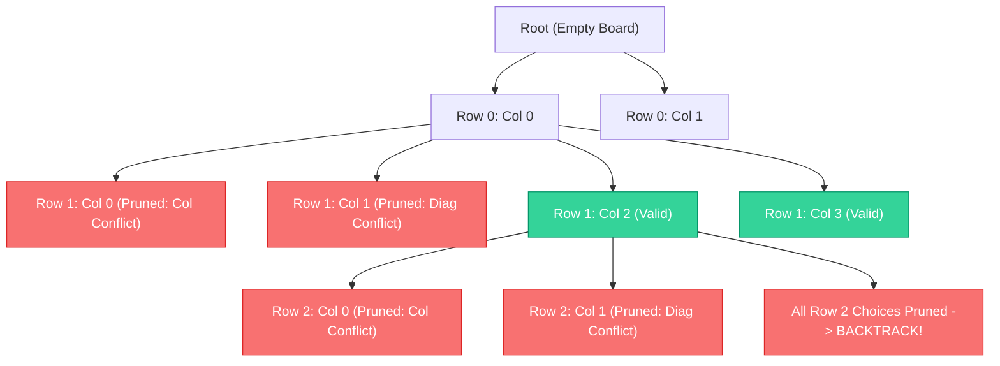

# Module 13: Backtracking & Constraint Satisfaction (0 to 100 Mastery)

> **State Space Trees, Decision Pruning, State Restoration & Constraint Satisfaction**

Backtracking explores deep search trees, pruning branches that fail constraints (Constraint Satisfaction Problems). In this module, you master **Subsets / Combinations / Permutations archetypes**, **N-Queens non-attacking diagonals**, **Word Search grid DFS**, and **9x9 Sudoku Solvers**.

---


## Backtracking State-Space Tree Pruning (4-Queens)



## 1. The Canonical Backtracking Blueprint

```python
def backtrack(candidate):
    if is_solution(candidate):
        output(candidate)
        return

    for choice in next_choices(candidate):
        if is_valid(choice):
            make_choice(choice)       # 1. Mutate state
            backtrack(candidate)      # 2. Recurse deep
            undo_choice(choice)       # 3. Restore state (backtrack!)
```

---

## 2. Curated LeetCode Problem Breakdowns (Brute Force vs. Optimized)

### Problem 1: Subsets ([LeetCode 78](https://leetcode.com/problems/subsets/)) — Medium

#### Optimized: Backtracking Choose / Don't Choose
```python
def subsets(nums: list[int]) -> list[list[int]]:
    res = []
    subset = []
    
    def dfs(i: int):
        if i >= len(nums):
            res.append(list(subset))
            return
        # Include nums[i]
        subset.append(nums[i])
        dfs(i + 1)
        # Exclude nums[i]
        subset.pop()
        dfs(i + 1)
        
    dfs(0)
    return res
```
- **Time Complexity**: $O(N \\times 2^N)$, **Space Complexity**: $O(N)$ recursion depth.

---

### Problem 2: Combination Sum ([LeetCode 39](https://leetcode.com/problems/combination-sum/)) — Medium

#### Optimized: Unbounded Candidates with Forwarding Index
Candidates can be chosen unlimited times, but avoid permutation duplicates by passing current candidate index $i$.
- **Time Complexity**: $O(2^{target/min\\_val})$, **Space Complexity**: $O(target/min\\_val)$.

---

### Problem 3: Permutations ([LeetCode 46](https://leetcode.com/problems/permutations/)) — Medium

#### Optimized: In-Place Swapping
Swap elements within the array and backtrack to avoid auxiliary `visited` sets.
- **Time Complexity**: $O(N \\times N!)$, **Space Complexity**: $O(N)$.

---

### Problem 4: Word Search ([LeetCode 79](https://leetcode.com/problems/word-search/)) — Medium

#### Optimized: In-Place Board Mutation DFS
Temporarily replace cell with `'#'` during exploration, restoring character upon return.
```python
def exist(board: list[list[str]], word: str) -> bool:
    rows, cols = len(board), len(board[0])
    
    def dfs(r: int, c: int, i: int) -> bool:
        if i == len(word):
            return True
        if r < 0 or r >= rows or c < 0 or c >= cols or board[r][c] != word[i]:
            return False
            
        temp = board[r][c]
        board[r][c] = "#"  # Mark visited in-place
        
        found = (dfs(r + 1, c, i + 1) or dfs(r - 1, c, i + 1) or
                 dfs(r, c + 1, i + 1) or dfs(r, c - 1, i + 1))
                 
        board[r][c] = temp  # Backtrack!
        return found
        
    for r in range(rows):
        for c in range(cols):
            if dfs(r, c, 0):
                return True
    return False
```
- **Time Complexity**: $O(N \\times M \\times 4^L)$ where $L$ is word length.
- **Space Complexity**: $O(L)$ recursion call stack.

---

### Problem 5: N-Queens ([LeetCode 51](https://leetcode.com/problems/n-queens/)) — Hard

#### Optimized: Column & Diagonal Hash Set Tracking ($O(N!)$ Time)
Diagonals are tracked via $(r - c)$ and $(r + c)$ mathematical invariants in $O(1)$.
- **Time Complexity**: $O(N!)$, **Space Complexity**: $O(N)$.

---

### Problem 6: Sudoku Solver ([LeetCode 37](https://leetcode.com/problems/sudoku-solver/)) — Hard

#### Optimized: Exact Constraint Backtracking
Scan 9x9 board for empty cell `'.'`. Attempt numbers `'1'` through `'9'`. Validate row, column, and 3x3 block in $O(1)$.
- **Time Complexity**: $O(9^{empty\\_cells})$, **Space Complexity**: $O(1)$ board stack.

---

## 3. Hands-On Project & Test Suite

Verify your Backtracking and CSP engine:
- Starter Template: [`starter/backtracking_solver_engine.py`](starter/backtracking_solver_engine.py)
- Production Solution: [`project_solution/backtracking_solver_engine.py`](project_solution/backtracking_solver_engine.py)
- Pytest Suite: [`project_solution/test_backtracking_solver_engine.py`](project_solution/test_backtracking_solver_engine.py)

## 🧪 Practice & Verification

Reading a module teaches recognition. Only the problems teach recall — and the
debug lab teaches the thing neither of them does, which is diagnosis.

### 1. Build the module project

```bash
cd starter
python -m pytest ../project_solution -q      # must FAIL before you start
```

Every shipped test must fail with `NotImplementedError` on an untouched
starter. If any passes, the grading loop is broken and is telling you your work
is correct when it has not been done — run `make integrity` from the course
root.

### 2. Work the problem bank — 8 problems

```bash
cd problems
python -m pytest tests -q                    # all of this module's problems
python -m pytest tests -q -k p03             # just problem 3
```

| # | Problem | Pattern | Difficulty | Target |
| :--- | :--- | :--- | :--- | :--- |
| 01 | [All Subsets](problems/p01_subsets.py) | Backtracking | Medium | `Time O(n * 2^n), Space O(n) excluding output` |
| 02 | [All Permutations](problems/p02_permutations.py) | Backtracking with a used set | Medium | `Time O(n * n!), Space O(n) excluding output` |
| 03 | [Subsets With Duplicates](problems/p03_subsets_with_dups.py) | Backtracking with duplicate skipping | Medium | `Time O(n * 2^n), Space O(n) excluding output` |
| 04 | [Combination Sum](problems/p04_combination_sum.py) | Backtracking with reuse | Medium | `Time O(n^(target/min)) worst case, Space O(target/min)` |
| 05 | [Generate Valid Parentheses](problems/p05_generate_parentheses.py) | Backtracking with validity pruning | Medium | `Time O(4^n / sqrt(n)) (Catalan), Space O(n)` |
| 06 | [Word Search In A Grid](problems/p06_word_search.py) | Backtracking on a grid | Medium | `Time O(rows*cols*4^len(word)), Space O(len(word))` |
| 07 | [N-Queens](problems/p07_n_queens.py) | Backtracking with constraint pruning | Hard | `Time O(n!) with heavy pruning, Space O(n)` |
| 08 | [Palindrome Partitioning](problems/p08_palindrome_partition.py) | Backtracking with a validity check | Hard | `Time O(n * 2^n), Space O(n) excluding output` |

Each stub carries the statement, the constraints, a complexity target and a
**three-step hint ladder**. Read one hint, try again, and only then read the
next. Every reference solution in `problems/solutions/` is cross-checked against
a brute force or a second implementation, so the answers are verified rather
than asserted.

### 3. Work the debug lab

```bash
cd debug_lab
python broken_enumerator.py
echo "exit=$?"
```

It exits 0 and prints wrong answers. Read [`SYMPTOMS.md`](debug_lab/SYMPTOMS.md),
write a diagnosis for each, and only then open `ANSWERS.md`. The diagnostic
reasoning is the transferable skill; reading the answer first skips it.

---

## ✅ You have mastered this module when you can…

1. Recognise 'generate all' as backtracking, and say why it rules out DP.
2. Name the two most common backtracking bugs and the one-line fix for each.
3. Write the duplicate-skip condition and explain why the `i > start` half is essential.
4. Explain why pruning, not the search order, is what makes N-Queens tractable.

Each of these is something you **do**, not something you know. If you cannot do
one without reference, that is the section to revisit — not the whole module.

---

## 🧭 Navigation

- [Pattern Recognition Guide](../PATTERN_RECOGNITION_GUIDE.md) — how to attack a problem you have never seen
- [Course README](../README.md) · [Master Syllabus](../MASTER_SYLLABUS.md)
- [Problem bank](problems/README.md) · [Debug lab](debug_lab/SYMPTOMS.md)