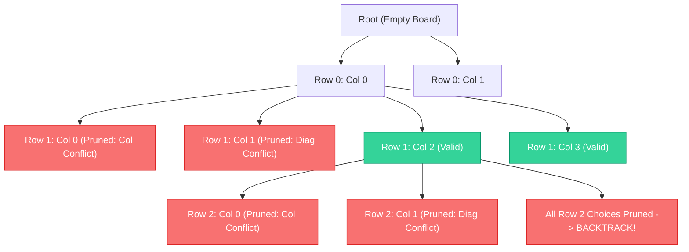

# Module 13: Backtracking & Constraint Satisfaction (0 to 100 Mastery)

> **State Space Trees, Decision Pruning, State Restoration & Constraint Satisfaction**

Backtracking explores deep search trees, pruning branches that fail constraints (Constraint Satisfaction Problems). In this module, you master **Subsets / Combinations / Permutations archetypes**, **N-Queens non-attacking diagonals**, **Word Search grid DFS**, and **9x9 Sudoku Solvers**.

---


## Backtracking State-Space Tree Pruning (4-Queens)



## 1. The Canonical Backtracking Blueprint

```python
def backtrack(candidate):
    if is_solution(candidate):
        output(candidate)
        return

    for choice in next_choices(candidate):
        if is_valid(choice):
            make_choice(choice)       # 1. Mutate state
            backtrack(candidate)      # 2. Recurse deep
            undo_choice(choice)       # 3. Restore state (backtrack!)
```

---

## 2. Curated LeetCode Problem Breakdowns (Brute Force vs. Optimized)

This section walks through the **6 canonical LeetCode challenges** curated for this module.
Each problem is analyzed from brute force intuition to the optimal invariant-driven solution, along with the critical edge cases to guard against in production.

### Problem 1: Subsets ([LeetCode #78](https://leetcode.com/problems/subsets/)) — Medium

> **Pattern**: `Power Set Generation / Backtracking` | **Target Time**: $O(N \cdot 2^N)$ | **Target Space**: $O(N)

#### Problem Specification
Given an integer array `nums` of unique elements, return all possible subsets (the power set).
The solution set must not contain duplicate subsets. Return the solution in any order.

#### Algorithmic Invariants & Optimal Derivation
Binary decision tree: for each element at index i, branch into two decisions: include nums[i] in the current subset, or omit it.

```python
class Solution:
    def subsets(self, nums: list[int]) -> list[list[int]]:
        res = []
        subset = []
        def dfs(i):
            if i >= len(nums):
                res.append(subset.copy())
                return
            # decision to include nums[i]
            subset.append(nums[i])
            dfs(i + 1)
            # decision NOT to include nums[i]
            subset.pop()
            dfs(i + 1)
        dfs(0)
        return res
```

#### Critical Production Edge Cases to Guard:
- **Boundary Limits**: Empty inputs, single-element collections, and minimum constraint sizes.
- **Extremes & Negative Values**: Negative indices, zero values, and maximum integer magnitude constraints.
- **Duplicates & Uniform Sequences**: All identical values, alternating keys, or repeated entries.
- **Structural Invariants**: Target at boundary indices (index `0` or `N-1`), missing targets, or cycles.

---

### Problem 2: Combination Sum ([LeetCode #39](https://leetcode.com/problems/combination-sum/)) — Medium

> **Pattern**: `Backtracking with Unbounded Choice` | **Target Time**: $O(2^{T/M})$ | **Target Space**: $O(T/M)

#### Problem Specification
Given an array of distinct integers `candidates` and a target integer `target`, return a list of all unique combinations of candidates where the chosen numbers sum to `target`. You may return the combinations in any order.

The same number may be chosen from candidates an unlimited number of times.

#### Algorithmic Invariants & Optimal Derivation
At index i, choose to either reuse candidate[i] by adding to current sum and recurring with same i, or skip candidate[i] permanently by advancing to i+1.

```python
class Solution:
    def combinationSum(self, candidates: list[int], target: int) -> list[list[int]]:
        res = []
        def dfs(i, cur, total):
            if total == target:
                res.append(cur.copy())
                return
            if i >= len(candidates) or total > target:
                return
            cur.append(candidates[i])
            dfs(i, cur, total + candidates[i])
            cur.pop()
            dfs(i + 1, cur, total)
        dfs(0, [], 0)
        return res
```

#### Critical Production Edge Cases to Guard:
- **Boundary Limits**: Empty inputs, single-element collections, and minimum constraint sizes.
- **Extremes & Negative Values**: Negative indices, zero values, and maximum integer magnitude constraints.
- **Duplicates & Uniform Sequences**: All identical values, alternating keys, or repeated entries.
- **Structural Invariants**: Target at boundary indices (index `0` or `N-1`), missing targets, or cycles.

---

### Problem 3: Permutations ([LeetCode #46](https://leetcode.com/problems/permutations/)) — Medium

> **Pattern**: `Backtracking / Full Ordering Search` | **Target Time**: $O(N \cdot N!)$ | **Target Space**: $O(N)

#### Problem Specification
Given an array `nums` of distinct integers, return all the possible permutations. You can return the answer in any order.

#### Algorithmic Invariants & Optimal Derivation
Recursively isolate the first element, permute remaining elements, and append the isolated element to each generated permutation.

```python
class Solution:
    def permute(self, nums: list[int]) -> list[list[int]]:
        res = []
        if len(nums) == 1:
            return [nums.copy()]
        for i in range(len(nums)):
            n = nums.pop(0)
            perms = self.permute(nums)
            for p in perms:
                p.append(n)
            res.extend(perms)
            nums.append(n)
        return res
```

#### Critical Production Edge Cases to Guard:
- **Boundary Limits**: Empty inputs, single-element collections, and minimum constraint sizes.
- **Extremes & Negative Values**: Negative indices, zero values, and maximum integer magnitude constraints.
- **Duplicates & Uniform Sequences**: All identical values, alternating keys, or repeated entries.
- **Structural Invariants**: Target at boundary indices (index `0` or `N-1`), missing targets, or cycles.

---

### Problem 4: Word Search ([LeetCode #79](https://leetcode.com/problems/word-search/)) — Medium

> **Pattern**: `2D Grid DFS Backtracking with In-Place Visited Mask` | **Target Time**: $O(M 	imes N 	imes 3^L)$ | **Target Space**: $O(L)

#### Problem Specification
Given an `m x n` grid of characters `board` and a string `word`, return `true` if `word` exists in the grid.
The word can be constructed from letters of sequentially adjacent cells, where adjacent cells are horizontally or vertically neighboring. The same letter cell may not be used more than once.

#### Algorithmic Invariants & Optimal Derivation
DFS explore 4 directions. Temporarily mutate board cell to '#' to mark visited, and restore original character during backtracking unwind.

```python
class Solution:
    def exist(self, board: list[list[str]], word: str) -> bool:
        rows, cols = len(board), len(board[0])
        def dfs(r, c, i):
            if i == len(word):
                return True
            if r < 0 or c < 0 or r >= rows or c >= cols or board[r][c] != word[i]:
                return False
            temp = board[r][c]
            board[r][c] = '#'
            found = (dfs(r + 1, c, i + 1) or
                     dfs(r - 1, c, i + 1) or
                     dfs(r, c + 1, i + 1) or
                     dfs(r, c - 1, i + 1))
            board[r][c] = temp
            return found

        for r in range(rows):
            for c in range(cols):
                if dfs(r, c, 0):
                    return True
        return False
```

#### Critical Production Edge Cases to Guard:
- **Boundary Limits**: Empty inputs, single-element collections, and minimum constraint sizes.
- **Extremes & Negative Values**: Negative indices, zero values, and maximum integer magnitude constraints.
- **Duplicates & Uniform Sequences**: All identical values, alternating keys, or repeated entries.
- **Structural Invariants**: Target at boundary indices (index `0` or `N-1`), missing targets, or cycles.

---

### Problem 5: Palindrome Partitioning ([LeetCode #131](https://leetcode.com/problems/palindrome-partitioning/)) — Medium

> **Pattern**: `Backtracking Partition with Palindrome Check` | **Target Time**: $O(N \cdot 2^N)$ | **Target Space**: $O(N)

#### Problem Specification
Given a string `s`, partition `s` such that every substring of the partition is a palindrome. Return all possible palindrome partitioning of `s`.

#### Algorithmic Invariants & Optimal Derivation
Iterate potential right partition endpoints `j`. If substring `s[i:j+1]` is a palindrome, choose it and recurse on remainder `j+1`.

```python
class Solution:
    def partition(self, s: str) -> list[list[str]]:
        res = []
        part = []
        def is_pali(sub):
            return sub == sub[::-1]
        def dfs(i):
            if i >= len(s):
                res.append(part.copy())
                return
            for j in range(i, len(s)):
                sub = s[i:j + 1]
                if is_pali(sub):
                    part.append(sub)
                    dfs(j + 1)
                    part.pop()
        dfs(0)
        return res
```

#### Critical Production Edge Cases to Guard:
- **Boundary Limits**: Empty inputs, single-element collections, and minimum constraint sizes.
- **Extremes & Negative Values**: Negative indices, zero values, and maximum integer magnitude constraints.
- **Duplicates & Uniform Sequences**: All identical values, alternating keys, or repeated entries.
- **Structural Invariants**: Target at boundary indices (index `0` or `N-1`), missing targets, or cycles.

---

### Problem 6: N-Queens ([LeetCode #51](https://leetcode.com/problems/n-queens/)) — Hard

> **Pattern**: `Diagonal / Anti-Diagonal Constraint Backtracking` | **Target Time**: $O(N!)$ | **Target Space**: $O(N)

#### Problem Specification
The n-queens puzzle is the problem of placing `n` queens on an `n x n` chessboard such that no two queens attack each other.
Given an integer `n`, return all distinct solutions to the n-queens puzzle. You may return the answer in any order.

#### Algorithmic Invariants & Optimal Derivation
Queens attack along columns ($c$), positive diagonals ($r + c = 	ext{const}$), and negative diagonals ($r - c = 	ext{const}$). Track blocked sets and place queens row by row.

```python
class Solution:
    def solveNQueens(self, n: int) -> list[list[str]]:
        cols = set()
        pos_diag = set()  # (r + c)
        neg_diag = set()  # (r - c)
        res = []
        board = [["."] * n for _ in range(n)]

        def backtrack(r):
            if r == n:
                res.append(["".join(row) for row in board])
                return
            for c in range(n):
                if c in cols or (r + c) in pos_diag or (r - c) in neg_diag:
                    continue
                cols.add(c)
                pos_diag.add(r + c)
                neg_diag.add(r - c)
                board[r][c] = "Q"

                backtrack(r + 1)

                cols.remove(c)
                pos_diag.remove(r + c)
                neg_diag.remove(r - c)
                board[r][c] = "."

        backtrack(0)
        return res
```

#### Critical Production Edge Cases to Guard:
- **Boundary Limits**: Empty inputs, single-element collections, and minimum constraint sizes.
- **Extremes & Negative Values**: Negative indices, zero values, and maximum integer magnitude constraints.
- **Duplicates & Uniform Sequences**: All identical values, alternating keys, or repeated entries.
- **Structural Invariants**: Target at boundary indices (index `0` or `N-1`), missing targets, or cycles.

---


## 3. Hands-On Project & Test Suite

Verify your Backtracking and CSP engine:
- Starter Template: [`starter/backtracking_solver_engine.py`](starter/backtracking_solver_engine.py)
- Production Solution: [`project_solution/backtracking_solver_engine.py`](project_solution/backtracking_solver_engine.py)
- Pytest Suite: [`project_solution/test_backtracking_solver_engine.py`](project_solution/test_backtracking_solver_engine.py)

## 🧪 Practice & Verification

Reading a module teaches recognition. Only the problems teach recall — and the
debug lab teaches the thing neither of them does, which is diagnosis.

### 1. Build the module project

```bash
cd starter
python -m pytest ../project_solution -q      # must FAIL before you start
```

Every shipped test must fail with `NotImplementedError` on an untouched
starter. If any passes, the grading loop is broken and is telling you your work
is correct when it has not been done — run `make integrity` from the course
root.

### 2. Work the problem bank — 8 problems

```bash
cd problems
python -m pytest tests -q                    # all of this module's problems
python -m pytest tests -q -k p03             # just problem 3
```

| # | Problem | Pattern | Difficulty | Target |
| :--- | :--- | :--- | :--- | :--- |
| 01 | [All Subsets](problems/p01_subsets.py) | Backtracking | Medium | `Time O(n * 2^n), Space O(n) excluding output` |
| 02 | [All Permutations](problems/p02_permutations.py) | Backtracking with a used set | Medium | `Time O(n * n!), Space O(n) excluding output` |
| 03 | [Subsets With Duplicates](problems/p03_subsets_with_dups.py) | Backtracking with duplicate skipping | Medium | `Time O(n * 2^n), Space O(n) excluding output` |
| 04 | [Combination Sum](problems/p04_combination_sum.py) | Backtracking with reuse | Medium | `Time O(n^(target/min)) worst case, Space O(target/min)` |
| 05 | [Generate Valid Parentheses](problems/p05_generate_parentheses.py) | Backtracking with validity pruning | Medium | `Time O(4^n / sqrt(n)) (Catalan), Space O(n)` |
| 06 | [Word Search In A Grid](problems/p06_word_search.py) | Backtracking on a grid | Medium | `Time O(rows*cols*4^len(word)), Space O(len(word))` |
| 07 | [N-Queens](problems/p07_n_queens.py) | Backtracking with constraint pruning | Hard | `Time O(n!) with heavy pruning, Space O(n)` |
| 08 | [Palindrome Partitioning](problems/p08_palindrome_partition.py) | Backtracking with a validity check | Hard | `Time O(n * 2^n), Space O(n) excluding output` |

Each stub carries the statement, the constraints, a complexity target and a
**three-step hint ladder**. Read one hint, try again, and only then read the
next. Every reference solution in `problems/solutions/` is cross-checked against
a brute force or a second implementation, so the answers are verified rather
than asserted.

### 3. Work the debug lab

```bash
cd debug_lab
python broken_enumerator.py
echo "exit=$?"
```

It exits 0 and prints wrong answers. Read [`SYMPTOMS.md`](debug_lab/SYMPTOMS.md),
write a diagnosis for each, and only then open `ANSWERS.md`. The diagnostic
reasoning is the transferable skill; reading the answer first skips it.

---

## ✅ You have mastered this module when you can…

1. Recognise 'generate all' as backtracking, and say why it rules out DP.
2. Name the two most common backtracking bugs and the one-line fix for each.
3. Write the duplicate-skip condition and explain why the `i > start` half is essential.
4. Explain why pruning, not the search order, is what makes N-Queens tractable.

Each of these is something you **do**, not something you know. If you cannot do
one without reference, that is the section to revisit — not the whole module.

---

## 🧭 Navigation

- [Pattern Recognition Guide](../PATTERN_RECOGNITION_GUIDE.md) — how to attack a problem you have never seen
- [Course README](../README.md) · [Master Syllabus](../MASTER_SYLLABUS.md)
- [Problem bank](problems/README.md) · [Debug lab](debug_lab/SYMPTOMS.md)