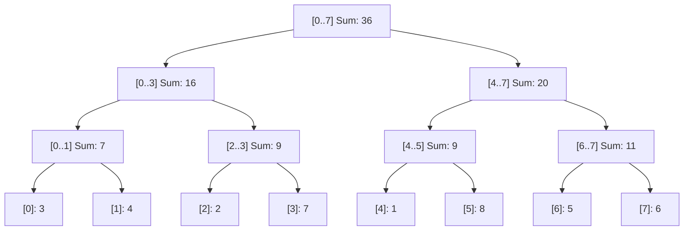

# 🐣 Interactive Foundations Playground: Tries & Union-Find

> *"A Trie is Google Search's autocomplete: as you type 'c', 'a', 't', it follows letters down a branch."*

> 💡 **Try It in the Live Runner:** You can run and modify any snippet in this playground directly in your browser! Click the **`▶ Run`** button in the header of any code block to test it instantly on the side, or toggle **`Live Runner`** in the top navigation bar to experiment with Python, PowerShell, and CLI commands while reading.

---

## Segment Tree Binary Range Decomposition

## 1. How Disjoint Sets (Union-Find) Work
Imagine islands in an ocean. Whenever someone builds a bridge between two islands, you merge their teams. If two islands are already in the same team and you build another bridge, **that bridge is redundant (creates a loop)!**