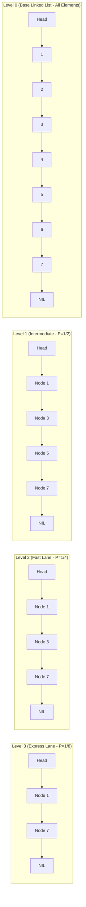

# Module 15: Systems-Level Structures: SkipLists, BloomFilters & LRU (0 to 100 Mastery)

> **Hardware Memory Caches, Probabilistic Sets, Probabilistic Trees & Storage Engines**

Modern production engines (Redis, Cassandra, RocksDB, Linux Page Cache) rely on specialized data structures optimized for disk I/O, cache hit ratios, and concurrency. In this module, you master **$O(1)$ LRU and LFU Eviction**, **Kirsch-Mitzenmacher Probabilistic Bloom Filters**, and **Skip Lists**.

---


## Skip List Multi-Level Index Towers



## 1. Storage Systems Mapping

| Data Structure | Real-World System | Why It Is Chosen |
| :--- | :--- | :--- |
| **LRU Cache** | Linux Virtual Memory / Redis | $O(1)$ eviction of cold pages |
| **Bloom Filter** | Cassandra / Bigtable / RocksDB | Prevents expensive disk reads for non-existent SSTable keys |
| **Skip List** | Redis Sorted Sets (`ZSET`) / LevelDB | Simpler concurrent lock-free implementation than Red-Black trees |

---

## 2. Curated LeetCode Problem Breakdowns (Brute Force vs. Optimized)

### Problem 1: LRU Cache ([LeetCode 146](https://leetcode.com/problems/lru-cache/)) — Medium

#### Brute Force: Array with Timestamps
Store entries in an array with `timestamp`. On eviction, scan all $N$ elements to find minimum timestamp.
- **Time Complexity**: $O(N)$ for `put`/`get` — Severe TLE.

#### Optimized: Hash Map + Sentinel Doubly Linked List ($O(1)$ All Operations)
Hash map maps `key -> DNode`. Doubly linked list maintains access order:
- Head dummy $\\to$ Most Recently Used
- Tail dummy $\\gets$ Least Recently Used
```python
class DNode:
    def __init__(self, key: int = 0, val: int = 0):
        self.key, self.val = key, val
        self.prev = self.next = None

class LRUCache:
    def __init__(self, capacity: int):
        self.capacity = capacity
        self.cache: dict[int, DNode] = {}
        self.head, self.tail = DNode(), DNode()
        self.head.next, self.tail.prev = self.tail, self.head

    def _remove(self, node: DNode) -> None:
        p, n = node.prev, node.next
        p.next, n.prev = n, p

    def _add_front(self, node: DNode) -> None:
        first = self.head.next
        node.prev, node.next = self.head, first
        self.head.next = first.prev = node

    def get(self, key: int) -> int:
        if key not in self.cache:
            return -1
        node = self.cache[key]
        self._remove(node)
        self._add_front(node)
        return node.val

    def put(self, key: int, value: int) -> None:
        if key in self.cache:
            node = self.cache[key]
            node.val = value
            self._remove(node)
            self._add_front(node)
            return
        if len(self.cache) >= self.capacity:
            lru = self.tail.prev
            self._remove(lru)
            del self.cache[lru.key]
        new_node = DNode(key, value)
        self.cache[key] = new_node
        self._add_front(new_node)
```
- **Time Complexity**: $O(1)$ strict worst-case for both `get` and `put`.
- **Space Complexity**: $O(\\text{capacity})$.

---

### Problem 2: LFU Cache ([LeetCode 460](https://leetcode.com/problems/lfu-cache/)) — Hard

#### Optimized: Dual Hash Maps + Frequency DLLs ($O(1)$ Time)
Maintain:
1. `key_to_node`: Maps `key -> (val, freq)`.
2. `freq_to_dll`: Maps `freq -> DoublyLinkedList of keys`.
3. `min_freq`: Scalar tracking lowest active frequency.
- **Time Complexity**: $O(1)$ for both `get` and `put`.
- **Space Complexity**: $O(\\text{capacity})$.

---

### Problem 3: All O`one Data Structure ([LeetCode 432](https://leetcode.com/problems/all-oone-data-structure/)) — Hard

#### Optimized: Doubly Linked List of Count Buckets
Each DLL node represents a `count` frequency and contains a set of keys with that frequency. When key count increments, move key to adjacent bucket `count + 1`.
- `getMaxKey`: Returns key from tail bucket in $O(1)$.
- `getMinKey`: Returns key from head bucket in $O(1)$.
- **Time Complexity**: $O(1)$ all operations, **Space Complexity**: $O(N)$.

---

### Problem 4: Design In-Memory File System ([LeetCode 588](https://leetcode.com/problems/design-in-memory-file-system/)) — Hard

#### Optimized: Directory Trie Node Tree
Each node represents a directory or file. Path splitting `/a/b/c` traverses Trie in $O(L)$.
- **Time Complexity**: $O(L)$ where $L$ is path depth, **Space Complexity**: $O(\\text{total paths and files})$.

---

## 3. Hands-On Project & Test Suite

Verify your LRU Cache and Bloom Filter engine:
- Starter Template: [`starter/lru_and_bloom_filter_engine.py`](starter/lru_and_bloom_filter_engine.py)
- Production Solution: [`project_solution/lru_and_bloom_filter_engine.py`](project_solution/lru_and_bloom_filter_engine.py)
- Pytest Suite: [`project_solution/test_lru_and_bloom_filter_engine.py`](project_solution/test_lru_and_bloom_filter_engine.py)

## 🧪 Practice & Verification

Reading a module teaches recognition. Only the problems teach recall — and the
debug lab teaches the thing neither of them does, which is diagnosis.

### 1. Build the module project

```bash
cd starter
python -m pytest ../project_solution -q      # must FAIL before you start
```

Every shipped test must fail with `NotImplementedError` on an untouched
starter. If any passes, the grading loop is broken and is telling you your work
is correct when it has not been done — run `make integrity` from the course
root.

### 2. Work the problem bank — 8 problems

```bash
cd problems
python -m pytest tests -q                    # all of this module's problems
python -m pytest tests -q -k p03             # just problem 3
```

| # | Problem | Pattern | Difficulty | Target |
| :--- | :--- | :--- | :--- | :--- |
| 01 | [LRU Cache With O(1) Operations](problems/p01_lru_cache.py) | Hash map + doubly linked list | Hard | `Time O(1) per operation, Space O(capacity)` |
| 02 | [Bloom Filter: No False Negatives](problems/p02_bloom_filter.py) | Bloom filter | Hard | `Time O((n + q) * hashes), Space O(bits)` |
| 03 | [Skip List: Insert, Search, Delete](problems/p03_skip_list.py) | Skip list | Hard | `Expected O(log n) per operation, Space O(n)` |
| 04 | [Fixed-Capacity Ring Buffer](problems/p04_ring_buffer.py) | Circular buffer | Medium | `Time O(1) per operation, Space O(capacity)` |
| 05 | [LFU Cache](problems/p05_lfu_cache.py) | Frequency buckets | Hard | `Time O(1) per operation, Space O(capacity)` |
| 06 | [Approximate Distinct Count](problems/p06_hyperloglog.py) | Probabilistic cardinality estimation | Hard | `Time O(n), Space O(registers)` |
| 07 | [Count-Min Sketch: Frequency Estimation](problems/p07_count_min_sketch.py) | Count-Min sketch | Hard | `Time O((n + q) * depth), Space O(width * depth)` |
| 08 | [Consistent Hashing Ring](problems/p08_consistent_hash_ring.py) | Consistent hashing | Hard | `Time O((n*v) log(n*v) + k log(n*v)), Space O(n*v)` |

Each stub carries the statement, the constraints, a complexity target and a
**three-step hint ladder**. Read one hint, try again, and only then read the
next. Every reference solution in `problems/solutions/` is cross-checked against
a brute force or a second implementation, so the answers are verified rather
than asserted.

### 3. Work the debug lab

```bash
cd debug_lab
python broken_cache_layer.py
echo "exit=$?"
```

It exits 0 and prints wrong answers. Read [`SYMPTOMS.md`](debug_lab/SYMPTOMS.md),
write a diagnosis for each, and only then open `ANSWERS.md`. The diagnostic
reasoning is the transferable skill; reading the answer first skips it.

---

## ✅ You have mastered this module when you can…

1. Explain the Bloom filter's one-sided guarantee and which direction of error it permits.
2. Build an O(1) LRU from a hash map plus a doubly linked list, and say why neither alone suffices.
3. State what HyperLogLog and Count-Min each trade away, and what they buy.
4. Explain why consistent hashing remaps ~1/N of keys where modulo hashing remaps nearly all.

Each of these is something you **do**, not something you know. If you cannot do
one without reference, that is the section to revisit — not the whole module.

---

## 🧭 Navigation

- [Pattern Recognition Guide](../PATTERN_RECOGNITION_GUIDE.md) — how to attack a problem you have never seen
- [Course README](../README.md) · [Master Syllabus](../MASTER_SYLLABUS.md)
- [Problem bank](problems/README.md) · [Debug lab](debug_lab/SYMPTOMS.md)